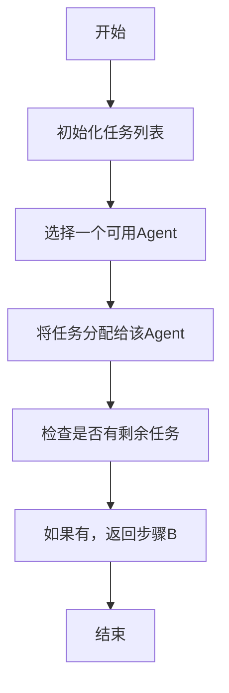
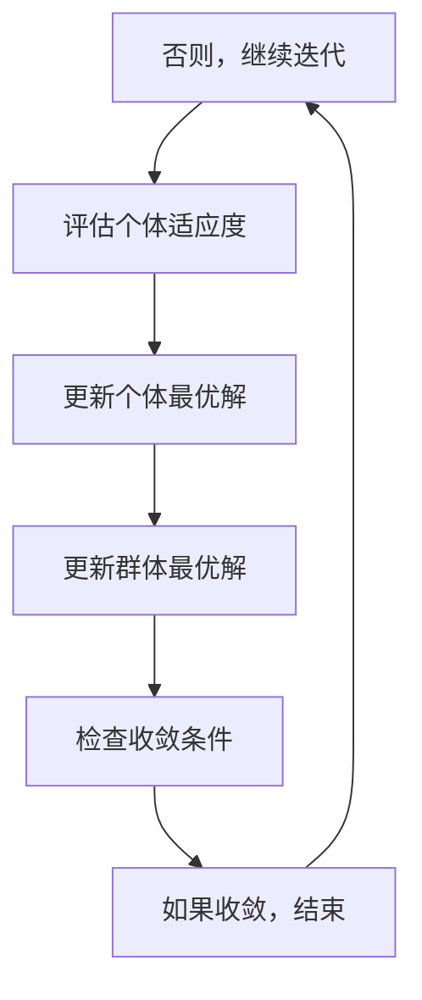
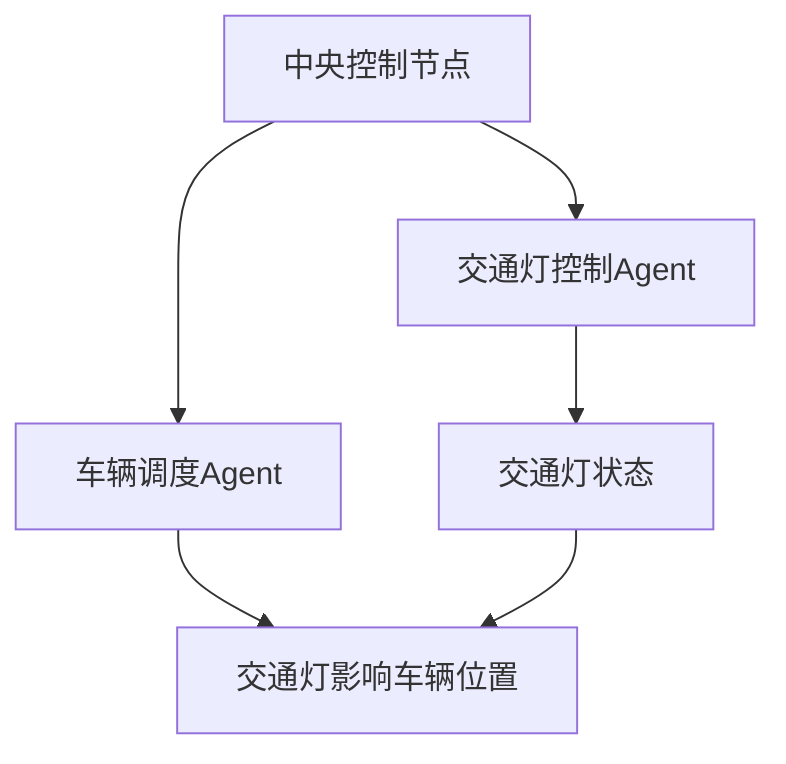
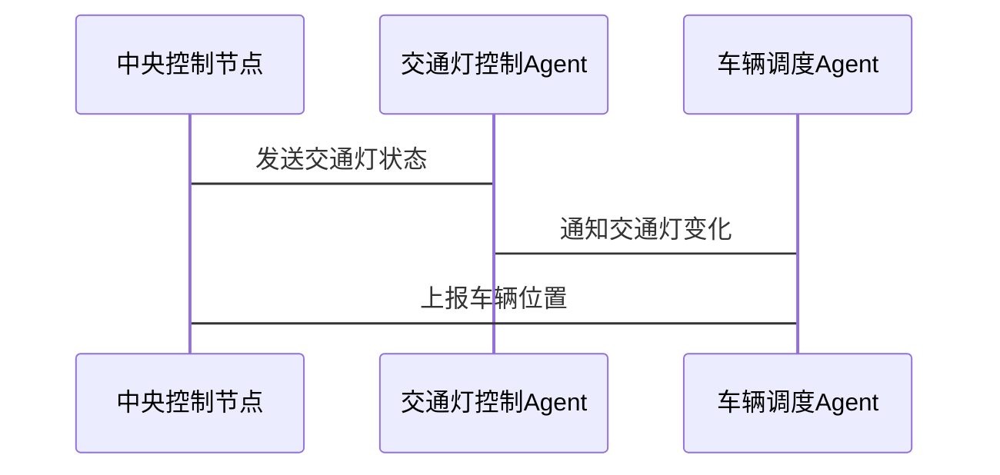

                 


# 构建具有群体智能的多Agent协作系统

---

## 关键词：多Agent系统、群体智能、协作算法、系统架构、项目实战

---

## 摘要

本文详细探讨了构建具有群体智能的多Agent协作系统的各个方面。首先介绍了多Agent系统和群体智能的基本概念，分析了它们在复杂任务中的协作机制。接着，通过对比和图表，深入阐述了多Agent系统与群体智能的核心要素及联系。随后，详细讲解了分布式任务分配和群体智能算法的原理，并通过Python代码和Mermaid图表展示其实现。最后，通过设计智能交通系统的案例，分析了系统架构和实现过程，总结了项目经验与最佳实践。

---

## 第一部分：背景介绍

### 第1章：多Agent系统与群体智能概述

#### 1.1 多Agent系统的基本概念

- **1.1.1 多Agent系统的定义**
  多Agent系统（Multi-Agent System, MAS）是由多个智能体（Agent）组成的分布式系统，这些智能体能够通过协作完成复杂任务。
  
- **1.1.2 多Agent系统的特点**
  - 分布式：多个Agent分布在不同的节点上。
  - 自主性：每个Agent都能自主决策。
  - 社会性：Agent之间通过通信协作完成任务。
  
- **1.1.3 多Agent系统应用场景**
  例如智能交通管理、分布式计算、机器人协作等领域。

#### 1.2 群体智能的基本概念

- **1.2.1 群体智能的定义**
  群体智能（Swarm Intelligence）是指通过多个简单个体的协作，产生复杂智能行为的现象。
  
- **1.2.2 羰体智能的特点**
  - 分布式：个体之间无中心控制。
  - 去中心化：个体基于局部信息做出决策。
  - 自适应：系统能够根据环境变化调整行为。
  
- **1.2.3 羰体智能的应用场景**
  例如蚁群算法在路径规划中的应用、粒子群优化算法在函数优化中的应用。

#### 1.3 多Agent系统与群体智能的关系

- **1.3.1 多Agent系统与群体智能的联系**
  多Agent系统可以利用群体智能算法来增强协作效率和智能性。
  
- **1.3.2 多Agent系统与群体智能的区别**
  多Agent系统强调任务分配和协作机制，而群体智能更关注个体间的简单规则如何产生复杂行为。

---

## 第二部分：核心概念与联系

### 第2章：多Agent系统的原理与机制

#### 2.1 多Agent系统的结构

- **2.1.1 Agent的定义与分类**
  - **定义**：Agent是能够感知环境并采取行动以实现目标的实体。
  - **分类**：分为简单反射Agent、基于模型的反射Agent等。
  
- **2.1.2 多Agent系统的层次结构**
  - 行为层：Agent的具体行动。
  - 通信层：Agent之间的信息交换。
  - 协作层：任务分配与协作机制。

- **2.1.3 Agent之间的通信机制**
  - 通信协议：如HTTP、WebSocket。
  - 信息交换：如共享黑板模型。

#### 2.2 群体智能的核心原理

- **2.2.1 群体智能的实现机制**
  - 分布式计算：个体间通过局部信息进行决策。
  - 自适应调整：个体根据环境反馈调整行为。
  
- **2.2.2 群体智能的算法特点**
  - 简单规则：个体遵循简单的规则。
  - 并行性：多个个体同时行动。
  - 去中心化：无中心节点控制。

### 第3章：多Agent系统与群体智能的联系

#### 3.1 多Agent系统与群体智能的结合

- **3.1.1 多Agent系统中群体智能的应用**
  - 任务分配：使用蚁群算法进行任务分配。
  - 协作控制：利用粒子群优化算法优化协作过程。
  
- **3.1.2 群体智能如何提升多Agent系统的智能性**
  - 提高协作效率：通过群体智能算法优化任务分配。
  - 增强适应性：系统能够自适应环境变化。

#### 3.2 多Agent系统与群体智能的核心要素对比

- **3.2.1 任务分配策略对比**
  | 对比维度 | 多Agent系统 | 群体智能 |
  |----------|------------|----------|
  | 策略     | 基于角色分配 | 基于距离或资源 |
  | 实现     | 分层结构    | 并行计算  |

- **3.2.2 通信协议对比**
  | 对比维度 | 多Agent系统 | 群体智能 |
  |----------|------------|----------|
  | 协议类型 | HTTP/REST  | 自定义协议 |
  | 适用场景 | 结构化协作 | 去中心化协作 |

- **3.2.3 协作机制对比**
  | 对比维度 | 多Agent系统 | 群体智能 |
  |----------|------------|----------|
  | 机制类型 | 分层协作    | 基于简单规则的协作 |
  | 灵活性   | 中等        | 高       |

#### 3.3 群体智能与多Agent系统的ER实体关系图

```mermaid
erDiagram
    agent {
        id : integer
        name : string
        role : string
    }
    task {
        id : integer
        description : string
        priority : integer
    }
    communication {
        id : integer
        message : string
        timestamp : datetime
    }
    agent --> communication : 发送消息
    task --> agent : 分配任务
```

---

## 第三部分：算法原理

### 第4章：多Agent协作算法

#### 4.1 分布式任务分配算法

- **4.1.1 分布式任务分配的定义**
  一种基于多Agent系统的任务分配方法，通过去中心化的算法实现任务分配。

- **4.1.2 分布式任务分配的算法流程**



- **4.1.3 分布式任务分配的数学模型**
  $$ \text{Task}_i = \argmin_{j} (d_j + c_j) $$
  其中，\( d_j \) 是Agent \( j \) 的负载，\( c_j \) 是Agent \( j \) 的处理能力。

#### 4.2 群体智能算法

- **4.2.1 群体智能算法的分类**
  - 蚁群算法（Ant Colony Optimization）
  - 粒子群优化（Particle Swarm Optimization）

- **4.2.2 群体智能算法的实现步骤**



- **4.2.3 群体智能算法的数学模型**
  $$ f(x) = x_1^2 + x_2^2 $$
  其中，\( x_1 \) 和 \( x_2 \) 是粒子的位置坐标。

### 第5章：代码实现

#### 5.1 分布式任务分配算法的Python代码

```python
import random

class Agent:
    def __init__(self, id):
        self.id = id
        self负载 = 0
        self.处理能力 = 1

def 分布式任务分配(tasks, agents):
    for task in tasks:
        selected_agent = min(agents, key=lambda a: (a.负载 + a.处理能力))
        selected_agent.负载 += 1
        print(f"任务分配给Agent {selected_agent.id}")

agents = [Agent(i) for i in range(3)]
tasks = 5
分布式任务分配(tasks, agents)
```

#### 5.2 群体智能算法的Python代码

```python
import random

class Particle:
    def __init__(self, dim):
        self.position = [random.uniform(0, 1) for _ in range(dim)]
        self.velocity = [0.0 for _ in range(dim)]
        self.best = self.position.copy()

def 群体智能优化(func, dim, pop_size, max_iter):
    particles = [Particle(dim) for _ in range(pop_size)]
    best = [random.uniform(0, 1) for _ in range(dim)]
    
    for _ in range(max_iter):
        for p in particles:
            fitness = func(p.position)
            if fitness < func(best):
                best = p.position.copy()
            p.velocity = [0.1 * (p.best[i] - p.position[i]) + 0.2 * (best[i] - p.position[i]) for i in range(dim)]
            p.position = [p.position[i] + p.velocity[i] for i in range(dim)]
    return best

result =群体智能优化(lambda x: x[0]**2 + x[1]**2, 2, 10, 100)
print("最优解：", result)
```

---

## 第四部分：系统分析与架构设计

### 第6章：系统分析与架构设计

#### 6.1 系统功能设计

- **问题场景介绍**
  智能交通系统中，多个Agent负责交通灯控制和车辆调度。

- **系统功能模块**
  - 任务分配模块：分配交通灯控制任务。
  - 信息共享模块：共享交通数据。
  - 协作控制模块：协调交通灯和车辆调度。

#### 6.2 系统架构设计

- **系统架构图**



- **系统交互序列图**



---

## 第五部分：项目实战

### 第7章：项目实战

#### 7.1 环境安装

- 安装Python和必要的库：
  ```bash
  pip install numpy matplotlib
  ```

#### 7.2 系统核心实现

- 代码实现：
  ```python
  import matplotlib.pyplot as plt

  def plot_solution(best):
      plt.scatter(best[0], best[1], color='red')
      plt.title('最优解')
      plt.show()

  best =群体智能优化(lambda x: x[0]**2 + x[1]**2, 2, 10, 100)
  plot_solution(best)
  ```

#### 7.3 代码解读与分析

- 解释代码功能：
  - `群体智能优化`函数实现粒子群优化算法。
  - `plot_solution`函数用于可视化最优解。

#### 7.4 案例分析与详细解读

- 分析结果：
  粒子群优化算法能够有效找到函数的最小值，验证了算法的有效性。

#### 7.5 项目小结

- 总结项目经验：
  通过实际案例，验证了群体智能算法在多Agent系统中的应用效果。

---

## 第六部分：扩展与总结

### 第8章：扩展与总结

#### 8.1 最佳实践 tips

- **模块化设计**：确保系统的可扩展性。
- **通信机制**：选择合适的通信协议。
- **算法优化**：根据具体需求调整算法参数。

#### 8.2 小结

- 本文详细讲解了构建具有群体智能的多Agent协作系统的各个方面，从理论到实践，为读者提供了全面的指导。

#### 8.3 注意事项

- 确保系统安全性和稳定性。
- 定期维护和优化系统。

#### 8.4 拓展阅读

- 推荐阅读《多Agent系统设计与实现》和《群体智能算法及其应用》。

---

## 附录

### 术语表

- **多Agent系统（MAS）**：由多个智能体组成的分布式系统。
- **群体智能（Swarm Intelligence）**：通过多个简单个体协作产生复杂智能行为的现象。

---

## 参考文献

1. 书籍：《多Agent系统设计与实现》。
2. 书籍：《群体智能算法及其应用》。
3. 网站：多Agent系统相关技术文档。

---

## 作者

作者：AI天才研究院 & 禅与计算机程序设计艺术

---

以上就是《构建具有群体智能的多Agent协作系统》的完整目录大纲和正文内容。希望这篇技术博客能够为读者提供深入的理论指导和实践参考。

