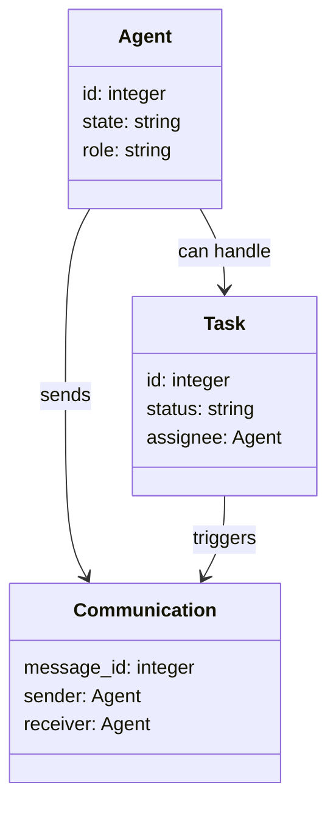
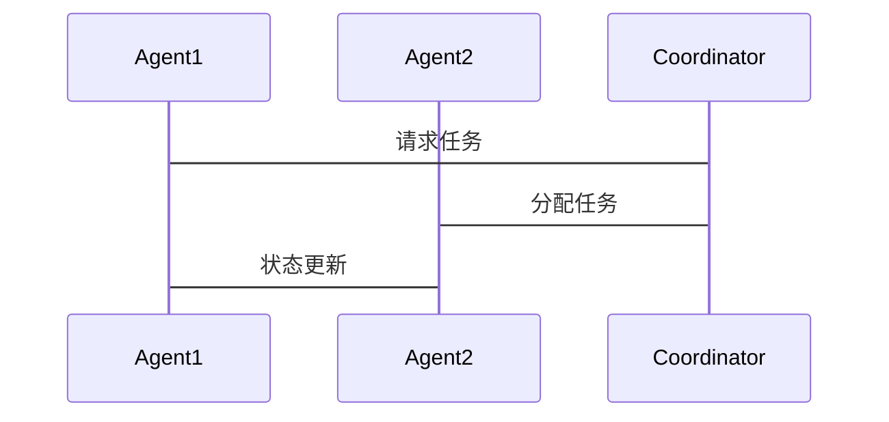

                 


# 构建具有群体智能的多Agent系统

## 关键词：多Agent系统、群体智能、分布式计算、共识算法、系统架构设计、项目实战

## 摘要：  
本文详细探讨了如何构建一个具有群体智能的多Agent系统。从基本概念到核心算法，从系统设计到项目实战，层层深入。通过理论与实践相结合的方式，帮助读者理解多Agent系统与群体智能的结合，掌握构建此类系统的关键技术和方法。文章最后还提供了扩展内容，包括最佳实践和未来研究方向。

---

# 第一部分: 多Agent系统与群体智能概述

## 第1章: 多Agent系统基础

### 1.1 多Agent系统的定义与特点

#### 1.1.1 多Agent系统的定义  
多Agent系统（Multi-Agent System, 简称MAS）是由多个智能体（Agent）组成的分布式系统，这些智能体能够自主地感知环境、做出决策并进行协作。每个Agent都有一定的智能性，能够独立解决问题，同时与其他Agent通信和协作以完成复杂任务。

#### 1.1.2 多Agent系统的核心特点  
- **自主性**：每个Agent都具有一定的自主决策能力，无需外部干预。  
- **反应性**：Agent能够实时感知环境并做出响应。  
- **协作性**：多个Agent通过通信和协作完成共同目标。  
- **分布性**：系统中的Agent分布在网络的各个节点上，不存在单点依赖。  

#### 1.1.3 多Agent系统与传统单体系统的区别  
| 特性             | 单体系统          | 多Agent系统       |  
|------------------|-------------------|-------------------|  
| 结构化           | 集中化结构         | 分布式结构         |  
| 可扩展性         | 较差              | 较好              |  
| 容错性           | 依赖单点          | 分布式容错         |  

---

## 第2章: 多Agent系统的核心概念与联系

### 2.1 多Agent系统的核心概念

#### 2.1.1 Agent的定义与分类  
- **定义**：Agent是具有感知、决策和行动能力的实体。  
- **分类**：  
  - **简单反射Agent**：基于当前状态做出反应。  
  - **基于模型的反射Agent**：使用内部模型进行推理和决策。  
  - **目标驱动Agent**：根据目标选择行动。  

#### 2.1.2 多Agent系统中的通信机制  
- **直接通信**：Agent之间通过共享数据库或消息队列直接交换信息。  
- **间接通信**：通过中间媒介（如消息代理）进行通信。  

#### 2.1.3 多Agent系统中的协作机制  
- **协商机制**：Agent之间通过协商达成一致。  
- **任务分配机制**：根据Agent的能力分配任务。  

### 2.2 多Agent系统与群体智能的关系

#### 2.2.1 多Agent系统如何支持群体智能  
- 通过分布式计算和通信机制，模拟群体智能中的个体协作。  

#### 2.2.2 群体智能对多Agent系统的影响  
- 提供了更灵活的协作方式和自适应能力。  

---

## 第3章: 多Agent系统中的算法原理

### 3.1 分布式计算与多Agent系统

#### 3.1.1 分布式计算的基本概念  
分布式计算将任务分解为多个部分，由不同的计算节点协作完成。  

#### 3.1.2 分布式计算在多Agent系统中的应用  
- 数据分片：将数据分散存储在不同的Agent中。  
- 并行计算：多个Agent同时处理不同的子任务。  

### 3.2 多Agent系统中的共识算法

#### 3.2.1 共识算法的定义与作用  
共识算法用于在分布式系统中达成一致意见。  

#### 3.2.2 常见共识算法  
- **Paxos算法**：保证在分布式系统中达成一致。  
- **Raft算法**：实现一致性复制的分布式系统。  

#### 3.2.3 共识算法的实现流程  
1. 提案者提出提案。  
2. 通过投票机制达成一致。  
3. 更新所有节点的状态。  

### 3.3 群体智能中的协调算法

#### 3.3.1 协调算法的基本原理  
通过局部交互实现全局协调。  

#### 3.3.2 协调算法的实现步骤  
1. 个体Agent感知环境。  
2. 通过通信机制进行协调。  
3. 执行一致的行动。  

---

## 第4章: 多Agent系统中的数学模型与公式

### 4.1 多Agent系统中的数学模型

#### 4.1.1 Agent行为模型  
Agent的行为可以用状态转移方程表示：  
$$ s' = f(s, a) $$  
其中，$s$ 是当前状态，$a$ 是动作，$s'$ 是新状态。  

#### 4.1.2 多Agent协作模型  
协作过程可以用博弈论中的纳什均衡来描述：  
$$ \text{所有Agent的策略组合达到均衡} $$  

### 4.2 共识算法的数学公式

#### 4.2.1 Paxos算法的数学公式  
Paxos算法中的提案编号必须递增：  
$$ n_{i+1} > n_i $$  

#### 4.2.2 Raft算法的数学公式  
Leader选举中的投票数必须超过半数：  
$$ \text{票数} \geq \frac{N}{2} + 1 $$  

---

## 第5章: 多Agent系统中的系统架构设计

### 5.1 项目背景介绍  
本文将以构建一个分布式任务分配系统为例，展示如何利用多Agent系统实现群体智能。

### 5.2 系统功能设计

#### 5.2.1 领域模型设计  


### 5.2.2 系统架构设计  
```mermaid
archi
    title 系统架构图
    架构 -> 数据层: 数据存储
    架构 -> 服务层: 服务提供
    服务层 -> 网络层: 网络通信
    网络层 -> Agent层: Agent交互
```

### 5.2.3 系统接口设计  
- **API接口**：提供RESTful API用于Agent注册、任务分配和状态查询。  

### 5.2.4 系统交互设计  


---

## 第6章: 项目实战

### 6.1 环境安装

#### 6.1.1 安装Python环境  
安装Python 3.x版本，确保环境已配置好。  

#### 6.1.2 安装依赖库  
安装所需的第三方库，例如：  
```bash
pip install requests
pip install pyyaml
```

### 6.2 系统核心实现

#### 6.2.1 Agent类实现  
```python
class Agent:
    def __init__(self, id):
        self.id = id
        self.state = "idle"
        self.role = "worker"
    
    def send_message(self, message, receiver):
        # 实现通信逻辑
        pass
    
    def receive_message(self, message):
        # 处理接收到的消息
        pass
```

#### 6.2.2 任务分配逻辑  
```python
def assign_task(agent_id):
    # 实现任务分配逻辑
    pass
```

### 6.3 案例分析与实现解读  
通过具体案例展示如何利用上述代码实现任务分配和状态更新。  

### 6.4 项目小结  
总结项目实现的关键点，强调代码的可扩展性和可维护性。

---

## 第7章: 扩展内容

### 7.1 最佳实践 Tips  
- 定期维护和更新系统。  
- 使用监控工具实时跟踪系统状态。  

### 7.2 小结  
本文从理论到实践，全面介绍了如何构建具有群体智能的多Agent系统。  

### 7.3 注意事项  
- 确保通信机制的可靠性。  
- 定期优化算法以提高性能。  

### 7.4 拓展阅读  
推荐相关书籍和论文，供读者深入研究。

---

## 作者：AI天才研究院 & 禅与计算机程序设计艺术

