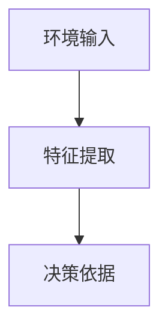
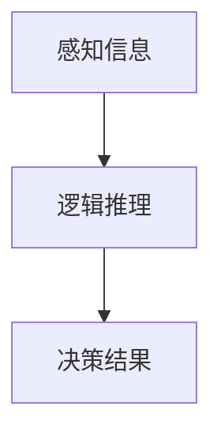
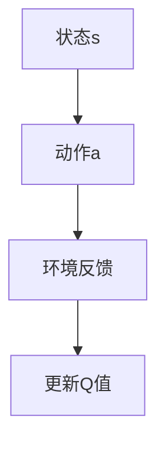
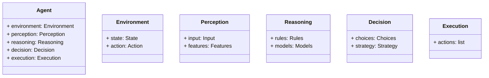
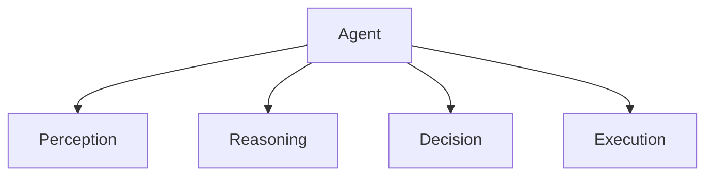

                 


# 构建具有自主决策能力的AI Agent

> 关键词：AI Agent, 自主决策, 强化学习, 系统架构, 项目实战

> 摘要：本文将详细探讨如何构建具有自主决策能力的AI Agent，从基本概念到系统架构，再到项目实战，全面解析其构建过程。通过强化学习和系统设计，帮助读者理解并掌握AI Agent的核心技术。

---

## 第1章：AI Agent概述

### 1.1 AI Agent的定义与核心概念

AI Agent（人工智能代理）是指能够感知环境、自主决策并执行任务的智能实体。它广泛应用于自动驾驶、智能助手、机器人等领域。

#### 核心概念对比表

| 特性      | 描述                              |
|-----------|-----------------------------------|
| 感知能力  | 处理环境输入，提取有用信息         |
| 推理能力  | 基于感知信息进行逻辑推理           |
| 决策能力  | 制定行动策略，做出最优选择         |
| 执行能力  | 执行决策，完成目标任务             |

### 1.2 自主决策能力的实现

自主决策能力是AI Agent的核心，通过强化学习和推理算法实现。以下是其实现的关键步骤：

1. **感知环境**：通过传感器获取环境信息。
2. **分析决策**：利用算法分析信息，生成决策。
3. **执行行动**：根据决策执行具体动作。

### 1.3 应用场景

- **自动驾驶**：实时感知环境，决策行驶路线。
- **智能助手**：根据用户需求，自主完成任务。

---

## 第2章：AI Agent的感知与推理

### 2.1 感知模块

感知模块负责处理环境输入，常用技术包括：

- **图像识别**：使用CNN处理视觉信息。
- **自然语言处理**：利用NLP技术处理文本。

#### 感知流程图



### 2.2 推理模块

推理模块基于感知信息进行逻辑推理，常用算法有规则引擎和机器学习模型。

#### 推理流程图



---

## 第3章：强化学习在AI Agent中的应用

### 3.1 强化学习原理

强化学习通过智能体与环境的交互，学习最优策略。其数学模型如下：

$$ Q(s, a) = r + \gamma \max Q(s', a') $$

其中，$s$是状态，$a$是动作，$r$是奖励，$\gamma$是折扣因子。

### 3.2 Q-learning算法实现

#### Q-learning流程图



#### Python代码示例

```python
import numpy as np

class QLearning:
    def __init__(self, state_space, action_space, gamma=0.9):
        self.gamma = gamma
        self.q_table = np.zeros((state_space, action_space))
    
    def choose_action(self, state, epsilon=0.1):
        if np.random.random() < epsilon:
            return np.random.randint(action_space)
        else:
            return np.argmax(self.q_table[state])
    
    def update_q(self, state, action, reward, next_state):
        self.q_table[state][action] = reward + self.gamma * max(self.q_table[next_state])
```

---

## 第4章：AI Agent的系统架构设计

### 4.1 系统功能模块

AI Agent系统架构包括感知、推理、决策和执行模块。

#### 类图



### 4.2 系统架构图



---

## 第5章：项目实战：构建一个简单的AI Agent

### 5.1 环境安装

安装Python和必要的库：

```bash
pip install numpy scikit-learn matplotlib
```

### 5.2 核心代码实现

```python
import numpy as np
from sklearn.tree import DecisionTreeRegressor

class SimpleAI:
    def __init__(self):
        self.model = DecisionTreeRegressor()
    
    def perceive(self, data):
        return data
    
    def decide(self, features):
        return self.model.predict(features)
    
    def learn(self, features, target):
        self.model.fit(features, target)
```

### 5.3 案例分析

假设任务是预测股票价格，训练数据如下：

```python
features = np.array([[1, 2], [3, 4]])
target = np.array([5, 6])
model = SimpleAI()
model.learn(features, target)
print(model.decide(np.array([[5,6]])))
```

---

## 第6章：总结与展望

### 6.1 总结

本文详细探讨了AI Agent的构建过程，从感知到决策，再到执行，覆盖了理论与实践。

### 6.2 展望

未来，AI Agent将更加智能化，应用场景也将更广泛。

---

## 附录

### 附录A：术语表

- **强化学习**：通过奖励机制优化决策策略。
- **Q-learning**：一种经典的强化学习算法。

### 附录B：数学公式

- **Q值更新公式**：$$ Q(s, a) = r + \gamma \max Q(s', a') $$

### 附录C：代码与数据集

提供项目代码和训练数据。

---

## 索引

本文内容按照章节顺序索引，方便查阅。

---

作者：AI天才研究院 & 禅与计算机程序设计艺术

