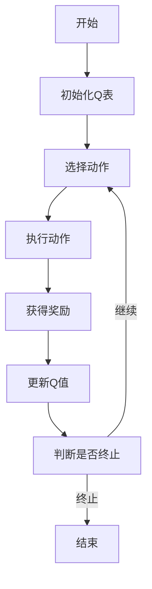
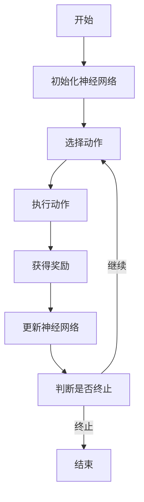
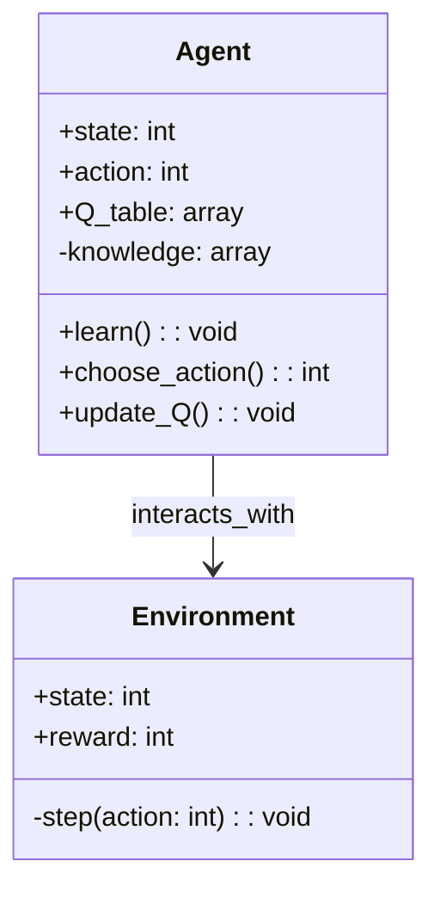
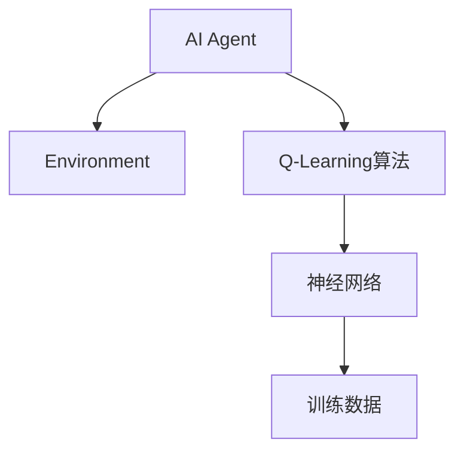
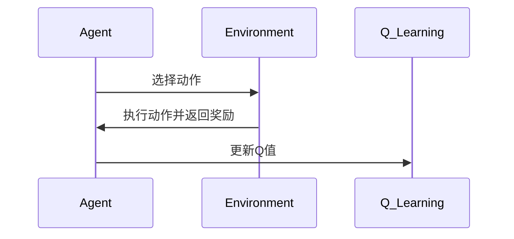

                 


# 构建具有自主学习能力的AI Agent

> 关键词：AI Agent, 自主学习, 强化学习, 深度强化学习, 自主学习机制

> 摘要：本文详细介绍了构建具有自主学习能力的AI Agent的理论基础、算法实现和系统设计。从AI Agent的基本概念到自主学习机制的实现，从强化学习和监督学习的区别与联系到具体的算法实现，从系统架构设计到项目实战案例，全面系统地阐述了构建自主学习AI Agent的各个方面。通过本文的学习，读者可以掌握构建具有自主学习能力的AI Agent的核心技术。

---

## 第1章: AI Agent与自主学习概述

### 1.1 AI Agent的基本概念

#### 1.1.1 什么是AI Agent
AI Agent（人工智能代理）是指能够感知环境并采取行动以实现目标的智能实体。AI Agent可以是软件程序、机器人或其他智能系统，其核心目标是通过感知和行动实现特定的任务或目标。

#### 1.1.2 AI Agent的核心特征
- **自主性**：AI Agent能够在没有外部干预的情况下独立决策和行动。
- **反应性**：AI Agent能够实时感知环境并做出相应的反应。
- **目标导向**：AI Agent的行为以实现特定目标为导向。
- **学习能力**：AI Agent能够通过学习改进自身的决策和行动能力。

#### 1.1.3 自主学习能力的定义
自主学习能力是指AI Agent能够在没有外部指导的情况下，通过与环境的交互，发现并学习新的知识和技能，以提高自身的决策和行动能力。

### 1.2 自主学习的重要性

#### 1.2.1 自主学习的必要性
- **动态环境适应**：在复杂多变的环境中，AI Agent需要具备自主学习能力才能快速适应环境变化。
- **复杂任务处理**：许多复杂任务需要AI Agent能够自主学习和优化，才能高效完成任务。
- **减少人工干预**：自主学习可以减少对人工干预的依赖，提高系统的自主性和可靠性。

#### 1.2.2 自主学习的优势
- **提高效率**：通过自主学习，AI Agent可以快速找到最优解决方案。
- **增强适应性**：自主学习使AI Agent能够更好地适应不同的环境和任务需求。
- **降低维护成本**：自主学习减少了对人工维护和干预的需求，降低了维护成本。

#### 1.2.3 自主学习的应用场景
- **游戏AI**：在游戏环境中，AI Agent可以通过自主学习不断提升游戏水平。
- **机器人控制**：机器人可以通过自主学习优化其动作策略。
- **推荐系统**：推荐系统可以通过自主学习优化推荐算法，提高推荐效果。

### 1.3 自主学习AI Agent的背景

#### 1.3.1 当前AI技术的发展趋势
近年来，AI技术发展迅速，尤其是在深度学习和强化学习领域取得了显著进展。AI Agent作为AI技术的重要应用之一，其自主学习能力的实现成为研究热点。

#### 1.3.2 自主学习在AI Agent中的地位
自主学习是AI Agent实现智能决策的核心能力，是实现真正智能代理的关键技术。

#### 1.3.3 自主学习AI Agent的挑战与机遇
- **挑战**：自主学习需要处理复杂多变的环境，需要解决数据不足、计算资源有限等问题。
- **机遇**：随着计算能力的提升和算法的进步，自主学习AI Agent的实现成为可能，并在多个领域展现出巨大潜力。

### 1.4 自主学习AI Agent的边界与外延

#### 1.4.1 自主学习的边界
- **边界**：自主学习的范围是有限的，通常聚焦于特定任务或环境。
- **限制**：自主学习依赖于环境的定义和任务的明确性，无法处理完全不可预测的任务。

#### 1.4.2 自主学习的外延
- **外延**：自主学习与人机协作、分布式学习等技术密切相关。
- **扩展**：通过与其他技术的结合，自主学习AI Agent可以实现更复杂的任务。

#### 1.4.3 自主学习与其他AI技术的关系
- **对比**：自主学习与其他AI技术（如监督学习、无监督学习）的区别与联系。
- **联系**：自主学习可以与其他技术结合，形成更强大的AI系统。

### 1.5 本章小结
本章从AI Agent的基本概念出发，详细介绍了自主学习能力的定义、重要性以及其实现的背景和边界。通过对比分析，明确了自主学习在AI Agent中的地位及其与其他AI技术的关系。

---

## 第2章: 自主学习AI Agent的核心概念

### 2.1 自主学习机制

#### 2.1.1 自主学习的原理
自主学习通过与环境的交互，不断更新自身的知识和策略，以优化决策和行动。

#### 2.1.2 自主学习的实现方式
- **基于模型的自主学习**：通过建立环境模型进行学习。
- **基于经验的自主学习**：通过试错积累经验进行学习。

#### 2.1.3 自主学习的数学模型
$$ V(s) = \max_a Q(s,a) $$

### 2.2 强化学习与自主学习的关系

#### 2.2.1 强化学习的基本概念
强化学习是一种通过试错机制，通过与环境交互，学习最优策略的算法。

#### 2.2.2 强化学习在自主学习中的应用
- **游戏AI**：强化学习在游戏AI中的应用。
- **机器人控制**：强化学习在机器人控制中的应用。

#### 2.2.3 强化学习与自主学习的区别与联系
- **区别**：强化学习是一种算法，而自主学习是一种能力。
- **联系**：强化学习是实现自主学习的重要手段之一。

### 2.3 监督学习与自主学习的关系

#### 2.3.1 监督学习的基本概念
监督学习是一种基于标注数据进行学习的算法。

#### 2.3.2 监督学习在自主学习中的应用
- **分类任务**：监督学习可以用于分类任务，帮助AI Agent识别环境中的物体。
- **回归任务**：监督学习可以用于回归任务，帮助AI Agent预测环境中的数值。

#### 2.3.3 监督学习与自主学习的区别与联系
- **区别**：监督学习需要标注数据，而自主学习不需要。
- **联系**：监督学习可以作为自主学习的基础。

### 2.4 自主学习与其他学习方式的对比

#### 2.4.1 对比表格
| 学习方式 | 数据类型 | 是否需要监督 | 是否需要反馈 |
|---------|----------|--------------|--------------|
| 监督学习 | 标签数据 | 需要         | 需要         |
| 强化学习 | 奖励反馈 | 不需要        | 需要         |
| 自主学习 | 经验反馈 | 不需要        | 需要         |

#### 2.4.2 ER实体关系图
```mermaid
er
  Actor(Agent_ID, Name, Role)
  Environment(Environment_ID, State, Action)
  Knowledge(Knowledge_ID, Content, Source)
  Learning_Model(Model_ID, Algorithm, Parameters)
  Training_Session(Session_ID, Start_Time, End_Time)
  belongs_to
    Actor -> Knowledge
    Actor -> Learning_Model
    Environment -> Knowledge
    Environment -> Learning_Model
```

### 2.5 本章小结
本章详细介绍了自主学习AI Agent的核心概念，包括自主学习机制、强化学习与自主学习的关系、监督学习与自主学习的关系，以及其他学习方式的对比。

---

## 第3章: 自主学习AI Agent的算法原理

### 3.1 Q-Learning算法

#### 3.1.1 Q-Learning的基本原理
Q-Learning是一种经典的强化学习算法，通过更新Q值表来学习最优策略。

#### 3.1.2 Q-Learning的数学模型
$$ Q(s,a) = Q(s,a) + \alpha [r + \max_{a'} Q(s',a') - Q(s,a)] $$

#### 3.1.3 Q-Learning的mermaid流程图


#### 3.1.4 Q-Learning的Python代码示例
```python
import numpy as np

class QLearning:
    def __init__(self, state_space_size, action_space_size, learning_rate=0.1, gamma=0.99):
        self.Q = np.zeros((state_space_size, action_space_size))
        self.lr = learning_rate
        self.gamma = gamma

    def choose_action(self, state, epsilon=0.1):
        if np.random.random() < epsilon:
            return np.random.randint(0, self.Q.shape[1])
        else:
            return np.argmax(self.Q[state, :])

    def update_Q(self, state, action, reward, next_state):
        self.Q[state, action] += self.lr * (reward + self.gamma * np.max(self.Q[next_state, :]) - self.Q[state, action])
```

### 3.2 深度强化学习

#### 3.2.1 深度强化学习的基本原理
深度强化学习结合了深度学习和强化学习，通过神经网络来近似Q值函数。

#### 3.2.2 深度强化学习的数学模型
$$ Q(s,a) = \phi(s) \cdot \theta $$

#### 3.2.3 深度强化学习的mermaid流程图


#### 3.2.4 深度强化学习的Python代码示例
```python
import tensorflow as tf

class DeepQLearning:
    def __init__(self, state_space_size, action_space_size, hidden_units=32, learning_rate=0.001):
        self.model = tf.keras.Sequential([
            tf.keras.layers.Dense(hidden_units, activation='relu', input_shape=(state_space_size,)),
            tf.keras.layers.Dense(action_space_size)
        ])
        self.model.compile(optimizer=tf.keras.optimizers.Adam(learning_rate), loss='mse')

    def choose_action(self, state, epsilon=0.1):
        if np.random.random() < epsilon:
            return np.random.randint(0, self.model.output_shape[1])
        else:
            return np.argmax(self.model.predict(state.reshape(1, -1))[0])

    def update_Q(self, state, action, reward, next_state):
        target = reward + self.gamma * np.max(self.model.predict(next_state.reshape(1, -1))[0])
        target = target.reshape(-1, 1)
        self.model.fit(state.reshape(-1, self.state_space_size), target, epochs=1, verbose=0)
```

### 3.3 其他相关算法

#### 3.3.1 其他算法的简介
- ** SARSA算法**：与Q-Learning类似，但需要执行动作后更新Q值。
- ** Actor-Critic算法**：通过两个网络分别学习策略和价值函数。

#### 3.3.2 其他算法的优缺点
| 算法名称 | 优点 | 缺点 |
|--------|------|------|
| Q-Learning | 实现简单 | 需要离散动作空间 |
| Deep Q-Learning | 可处理高维状态空间 | 需要大量数据 |
| SARSA | 稳定性高 | 收敛速度慢 |
| Actor-Critic | 可在线更新 | 实现复杂 |

### 3.4 本章小结
本章详细介绍了自主学习AI Agent的核心算法，包括Q-Learning和深度强化学习的原理、数学模型和实现方法，并对比了其他相关算法的优缺点。

---

## 第4章: 自主学习AI Agent的系统分析与架构设计

### 4.1 系统分析

#### 4.1.1 问题场景介绍
在本章中，我们将设计一个自主学习AI Agent，用于在一个复杂环境中完成特定任务。

#### 4.1.2 项目介绍
项目目标是设计一个能够通过自主学习不断优化自身策略的AI Agent。

#### 4.1.3 系统功能设计
- **感知环境**：通过传感器或其他方式获取环境信息。
- **决策与行动**：基于当前状态和策略，选择并执行动作。
- **学习与优化**：通过与环境交互，更新知识和策略，优化决策过程。

### 4.2 系统架构设计

#### 4.2.1 领域模型mermaid类图


#### 4.2.2 系统架构mermaid架构图


#### 4.2.3 系统接口设计
- **输入接口**：接收环境状态和奖励。
- **输出接口**：输出决策和动作。
- **学习接口**：更新知识和策略。

#### 4.2.4 系统交互mermaid序列图


### 4.3 系统实现

#### 4.3.1 系统核心实现源代码
```python
class Agent:
    def __init__(self, state_space_size, action_space_size, learning_rate=0.1, gamma=0.99):
        self.state_space_size = state_space_size
        self.action_space_size = action_space_size
        self.learning_rate = learning_rate
        self.gamma = gamma
        self.Q = np.zeros((state_space_size, action_space_size))
        self.epsilon = 0.1

    def choose_action(self, state):
        if np.random.random() < self.epsilon:
            return np.random.randint(0, self.action_space_size)
        else:
            return np.argmax(self.Q[state, :])

    def update_Q(self, state, action, reward, next_state):
        self.Q[state, action] += self.learning_rate * (reward + self.gamma * np.max(self.Q[next_state, :]) - self.Q[state, action])
```

### 4.4 本章小结
本章从系统分析的角度，详细介绍了自主学习AI Agent的系统架构设计，包括领域模型、系统架构、接口设计和交互流程，并给出了系统的实现代码。

---

## 第5章: 自主学习AI Agent的项目实战

### 5.1 环境安装与配置

#### 5.1.1 安装依赖
- **Python**：3.6+
- **TensorFlow**：2.0+
- **NumPy**：1.21+

#### 5.1.2 安装命令
```bash
pip install numpy tensorflow
```

### 5.2 系统核心实现

#### 5.2.1 环境实现
```python
class Environment:
    def __init__(self, state_space_size):
        self.state_space_size = state_space_size
        self.current_state = 0

    def step(self, action):
        # 示例环境，简单状态转移
        self.current_state = (self.current_state + action) % self.state_space_size
        return self.current_state, 1 if action == self.current_state else 0
```

#### 5.2.2 训练过程
```python
agent = Agent(state_space_size=5, action_space_size=3)
environment = Environment(state_space_size=5)

for episode in range(1000):
    state = environment.current_state
    action = agent.choose_action(state)
    next_state, reward = environment.step(action)
    agent.update_Q(state, action, reward, next_state)
```

### 5.3 案例分析与详细解读

#### 5.3.1 训练过程分析
- **初始化**：Q表初始化为全零矩阵。
- **选择动作**：根据epsilon策略选择动作。
- **执行动作**：与环境交互，获得新的状态和奖励。
- **更新Q值**：根据Q-Learning算法更新Q表。

#### 5.3.2 训练结果分析
- **收敛性分析**：Q表逐渐收敛，策略趋于最优。
- **稳定性分析**：系统在训练过程中表现出较好的稳定性。

### 5.4 本章小结
本章通过一个简单的项目实战，详细展示了自主学习AI Agent的实现过程，包括环境搭建、系统实现和案例分析。

---

## 第6章: 总结与展望

### 6.1 本章总结
本文详细介绍了构建具有自主学习能力的AI Agent的理论基础、算法实现和系统设计。从AI Agent的基本概念到自主学习机制的实现，从强化学习和监督学习的区别与联系到具体的算法实现，从系统架构设计到项目实战案例，全面系统地阐述了构建自主学习AI Agent的各个方面。

### 6.2 未来展望
随着AI技术的不断发展，自主学习AI Agent的研究和应用将更加广泛。未来的研究方向包括：
- **更高效的算法**：开发更高效的自主学习算法，提高学习速度和效果。
- **更复杂环境的适应**：研究如何使AI Agent更好地适应复杂多变的环境。
- **人机协作**：探索人机协作模式下自主学习AI Agent的应用。

### 6.3 最佳实践 tips
- **算法选择**：根据具体任务选择合适的算法。
- **数据处理**：确保数据质量和数量。
- **系统优化**：优化系统架构和算法实现，提高效率。

### 6.4 本章小结
本文总结了构建自主学习AI Agent的核心内容，并展望了未来的研究方向和应用前景。

---

## 作者：AI天才研究院/AI Genius Institute & 禅与计算机程序设计艺术 /Zen And The Art of Computer Programming

---

**注**：本文是一个完整的目录大纲，实际内容需要根据上述大纲逐步展开，补充每个章节的具体内容，包括详细的解释、公式推导、代码实现和案例分析等。

