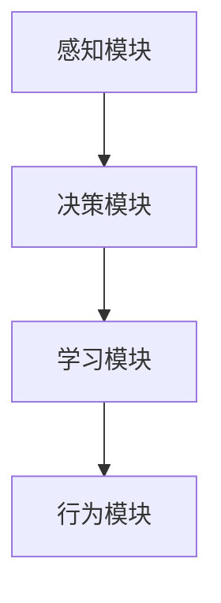
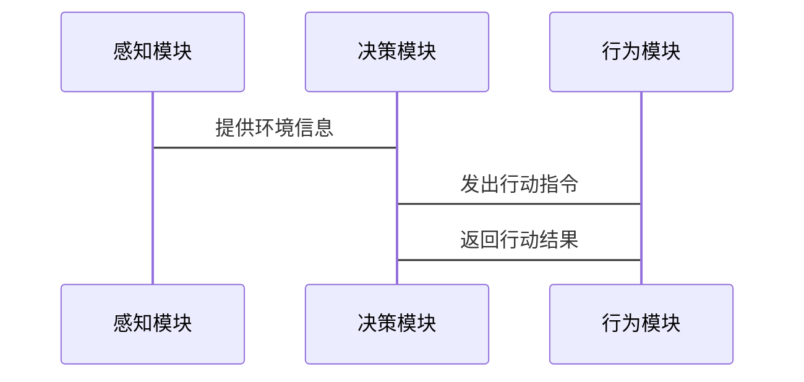

                 


# 《构建具有自主探索与假设验证能力的AI Agent》

---

## 关键词：
AI Agent, 自主探索, 假设验证, 强化学习, 贝叶斯推理, 系统架构, 项目实战

---

## 摘要：
本书系统地探讨了构建具有自主探索与假设验证能力的AI Agent的理论基础、算法实现和系统设计。通过详细讲解强化学习、贝叶斯推理等核心概念，结合数学模型和实际案例，帮助读者从理论到实践，掌握构建高效AI Agent的方法。本书适合AI工程师、研究人员及对AI领域感兴趣的技术爱好者阅读。

---

# 第1章: AI Agent概述

## 1.1 AI Agent的基本概念
### 1.1.1 AI Agent的定义
- **AI Agent**：智能体，能够感知环境并采取行动以实现目标。
- **自主性**：无需外部干预，自主决策。
- **反应性**：实时感知环境并做出反应。
- **目标导向性**：所有行动以目标为导向。

### 1.1.2 自主探索与假设验证的定义
- **自主探索**：智能体在未知环境中通过试错学习新知识。
- **假设验证**：通过数据验证假设，调整行为以适应环境。

### 1.1.3 AI Agent的核心能力结构
| 能力 | 描述 |
|------|------|
| 感知 | 采集环境信息 |
| 决策 | 制定行动策略 |
| 学习 | 优化模型参数 |
| 行为 | 执行决策 |

---

## 1.2 本书的研究背景与意义
### 1.2.1 当前AI Agent的发展现状
- AI Agent在机器人、自动驾驶、游戏AI等领域广泛应用。
- 自主探索与假设验证是提升AI Agent智能水平的关键。

### 1.2.2 自主探索与假设验证的重要性
- 自主探索：增强AI Agent的适应性。
- 假设验证：提高决策的准确性。

### 1.2.3 本书的目标与价值
- 目标：提供构建AI Agent的系统化方法。
- 价值：填补自主探索与假设验证结合的理论与实践空白。

---

## 1.3 本书内容框架与学习方法
### 1.3.1 书籍结构概述
- 分为引言、基础、算法、系统架构、项目实战和高级主题六部分。

### 1.3.2 学习方法与注意事项
- 理论与实践结合。
- 多思考、多练习、多总结。

### 1.3.3 如何有效阅读本书
- 每章前阅读目标。
- 理解概念后再看算法。
- 动手实践案例。

---

# 第2章: 自主探索与假设验证的核心概念

## 2.1 自主探索的基本原理
### 2.1.1 自主探索的定义与特征
- 定义：智能体在未知环境中主动探索。
- 特征：目标导向性、不确定性、自主性。

### 2.1.2 自主探索的关键要素
| 要素 | 描述 |
|------|------|
| 状态 | 当前环境信息 |
| 行动 | 智能体可执行的动作 |
| 奖励 | 行动的结果反馈 |

### 2.1.3 自主探索与强化学习的关系
- 强化学习是实现自主探索的核心方法。

---

## 2.2 假设验证的基本原理
### 2.2.1 假设验证的定义与特征
- 定义：通过数据验证假设。
- 特征：数据驱动性、统计推断性。

### 2.2.2 假设验证的关键要素
| 要素 | 描述 |
|------|------|
| 假设 | 需要验证的命题 |
| 数据 | 支持或反驳假设的证据 |
| 统计方法 | 假设检验的技术 |

### 2.2.3 假设验证与归纳推理的关系
- 归纳推理是假设验证的基础。

---

## 2.3 自主探索与假设验证的结合
### 2.3.1 结合的必要性与优势
- 必要性：提高决策的准确性和效率。
- 优势：增强智能体的适应性和智能性。

### 2.3.2 结合的实现方式与挑战
- 实现方式：强化学习与贝叶斯推理结合。
- 挑战：数据不足、计算复杂性。

### 2.3.3 结合的典型应用场景
- 机器人导航、自动驾驶、游戏AI。

---

# 第3章: 自主探索与假设验证的数学模型

## 3.1 自主探索的数学模型
### 3.1.1 强化学习的基本公式
$$ V(s) = \max_a Q(s,a) $$
其中，$s$是状态，$a$是动作，$Q(s,a)$是Q值函数。

### 3.1.2 状态转移概率矩阵
- 状态转移概率矩阵描述状态之间的转移概率。

### 3.1.3 奖励函数的设计
- 奖励函数是智能体行动的反馈机制。

---

## 3.2 假设验证的数学模型
### 3.2.1 假设空间的表示
- 假设空间由所有可能的假设构成。

### 3.2.2 数据分布与假设验证
- 数据分布决定假设验证的准确度。

### 3.2.3 贝叶斯推理公式
$$ P(H|D) = \frac{P(D|H)P(H)}{P(D)} $$
其中，$H$是假设，$D$是数据。

---

## 3.3 自主探索与假设验证的联合模型
### 3.3.1 联合概率模型的构建
- 联合概率模型描述状态、动作和数据之间的关系。

### 3.3.2 模型的优化与训练
- 使用强化学习优化模型参数。

### 3.3.3 模型的评估与验证
- 使用测试数据验证模型的准确性和可靠性。

---

# 第4章: 自主探索与假设验证的算法实现

## 4.1 自主探索算法
### 4.1.1 基于Q-learning的自主探索
- Q-learning算法实现自主探索。

### 4.1.2 基于策略梯度的自主探索
- 策略梯度算法优化策略。

### 4.1.3 基于深度学习的自主探索
- 深度强化学习提升自主探索能力。

---

## 4.2 假设验证算法
### 4.2.1 基于贝叶斯的假设验证
- 贝叶斯方法用于假设验证。

### 4.2.2 基于频率学派的假设验证
- 频率学派方法用于假设验证。

### 4.2.3 基于逻辑推理的假设验证
- 逻辑推理方法用于假设验证。

---

## 4.3 综合算法设计
### 4.3.1 算法的融合与协同
- 强化学习与贝叶斯推理结合。

### 4.3.2 算法的优化与改进
- 使用深度学习优化算法性能。

### 4.3.3 算法的实现与代码示例
- 提供Python代码实现综合算法。

---

# 第5章: 系统架构与设计

## 5.1 系统架构概述
### 5.1.1 系统模块划分
- 包括感知模块、决策模块、学习模块和行为模块。

### 5.1.2 模块之间的关系
- 模块之间通过接口进行数据交互。

### 5.1.3 系统的输入输出设计
- 输入：环境信息。
- 输出：智能体行动。

---

## 5.2 系统架构设计
### 5.2.1 系统架构图


### 5.2.2 系统功能设计
- 感知模块：采集环境信息。
- 决策模块：制定行动策略。
- 学习模块：优化模型参数。
- 行为模块：执行决策。

---

## 5.3 系统接口设计
### 5.3.1 接口定义
- 感知模块接口：提供环境信息。
- 决策模块接口：返回行动策略。

### 5.3.2 接口实现
- 使用Python编写接口代码。

---

## 5.4 系统交互设计
### 5.4.1 交互流程图


---

# 第6章: 项目实战

## 6.1 环境配置与安装
### 6.1.1 环境要求
- Python 3.8及以上版本。
- 安装必要的库：numpy、pandas、scikit-learn。

### 6.1.2 开发工具
- 使用Jupyter Notebook进行开发。

---

## 6.2 系统核心实现源代码
### 6.2.1 强化学习代码实现
```python
import numpy as np

class QLearning:
    def __init__(self, state_space, action_space, alpha=0.1, gamma=0.99):
        self.state_space = state_space
        self.action_space = action_space
        self.alpha = alpha
        self.gamma = gamma
        self.Q = np.zeros((state_space, action_space))

    def choose_action(self, state, epsilon=0.1):
        if np.random.random() < epsilon:
            return np.random.randint(self.action_space)
        return np.argmax(self.Q[state])

    def update(self, state, action, reward, next_state):
        self.Q[state, action] += self.alpha * (reward + self.gamma * np.max(self.Q[next_state]) - self.Q[state, action])
```

### 6.2.2 贝叶斯假设验证代码实现
```python
from sklearn.naive_bayes import GaussianNB

class BayesianValidator:
    def __init__(self):
        self.model = GaussianNB()

    def fit(self, X, y):
        self.model.fit(X, y)

    def predict(self, X):
        return self.model.predict(X)

    def score(self, X, y):
        return self.model.score(X, y)
```

---

## 6.3 代码应用解读与分析
### 6.3.1 强化学习代码解读
- Q-learning算法实现自主探索。
- 通过调整alpha和gamma参数优化Q值函数。

### 6.3.2 贝叶斯假设验证代码解读
- 使用GaussianNB实现贝叶斯假设验证。
- 通过fit方法训练模型，predict方法进行预测。

---

## 6.4 实际案例分析和详细讲解剖析
### 6.4.1 案例背景
- 构建一个简单的AI Agent，实现自主探索和假设验证。

### 6.4.2 案例实现
- 使用强化学习实现自主探索。
- 使用贝叶斯推理实现假设验证。

### 6.4.3 案例分析
- 分析AI Agent的性能和效果。

---

## 6.5 项目小结
### 6.5.1 项目总结
- 成功实现自主探索与假设验证的AI Agent。

### 6.5.2 项目经验
- 强化学习与贝叶斯推理的结合是关键。

### 6.5.3 项目改进方向
- 提高算法效率，优化系统架构。

---

# 第7章: 高级主题与未来展望

## 7.1 元学习与自适应学习
### 7.1.1 元学习的定义与优势
- 元学习：学习如何学习。

### 7.1.2 自适应学习的实现
- 使用元学习提升AI Agent的自适应能力。

---

## 7.2 多智能体协作与竞争
### 7.2.1 多智能体协作的定义
- 多智能体协作：多个AI Agent协同工作。

### 7.2.2 多智能体竞争的实现
- 使用强化学习实现多智能体竞争。

---

## 7.3 人机协作与伦理问题
### 7.3.1 人机协作的定义
- 人机协作：人类与AI Agent协作完成任务。

### 7.3.2 人机协作的伦理问题
- 数据隐私、责任归属。

---

## 7.4 未来研究方向
### 7.4.1 自主探索的优化
- 提高自主探索的效率和效果。

### 7.4.2 假设验证的创新
- 开发新的假设验证方法。

### 7.4.3 AI Agent的智能化提升
- 提升AI Agent的智能水平。

---

# 第8章: 最佳实践 tips、小结、注意事项、拓展阅读

## 8.1 最佳实践 tips
### 8.1.1 理论与实践结合
- 不断实践，提升技能。

### 8.1.2 保持学习与创新
- 关注AI领域的最新动态。

---

## 8.2 小结
- 本书系统地介绍了构建具有自主探索与假设验证能力的AI Agent的方法。

---

## 8.3 注意事项
- 理解理论后再进行实践。
- 注重算法的优化与创新。

---

## 8.4 拓展阅读
- 推荐相关书籍和论文，扩展知识面。

---

# 作者：AI天才研究院/AI Genius Institute & 禅与计算机程序设计艺术 /Zen And The Art of Computer Programming

---

**附录**：
- 附录A：常见问题解答（FAQ）
- 附录B：参考文献
- 附录C：术语表

---

**感谢您的阅读，希望本书能为您提供有价值的见解和实践指导！**

