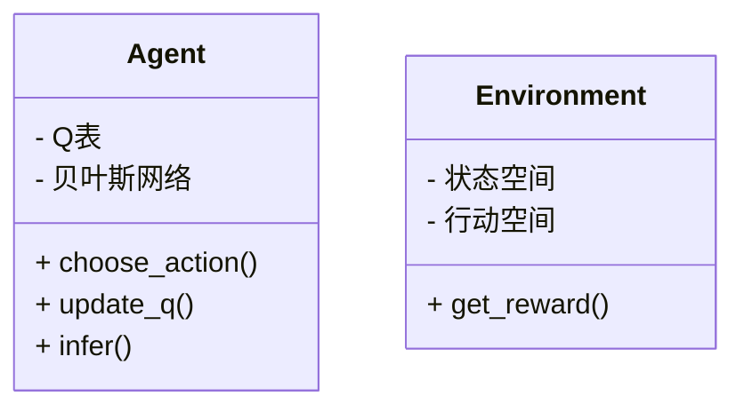
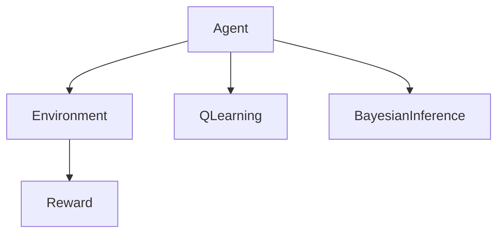
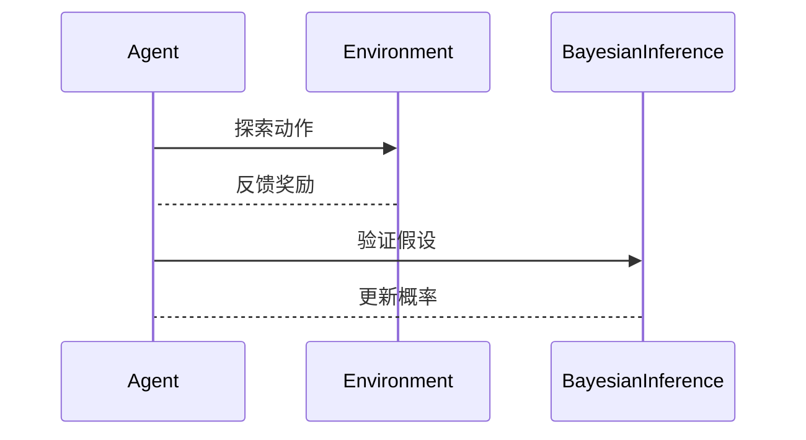

                 


# 构建具有自主探索与假设验证能力的AI Agent

> 关键词：AI Agent，自主探索，假设验证，强化学习，贝叶斯推理，系统架构

> 摘要：本文详细探讨了构建具有自主探索与假设验证能力的AI Agent的方法。从基本概念到核心算法，再到系统架构，逐步分析了如何实现这一目标。通过强化学习和贝叶斯推理等算法，结合系统设计与项目实战，为读者提供了全面的指导。

---

# 第一部分: 背景介绍

## 第1章: 构建具有自主探索与假设验证能力的AI Agent概述

### 1.1 AI Agent的基本概念
#### 1.1.1 AI Agent的定义与分类
AI Agent（人工智能代理）是一种能够感知环境、做出决策并采取行动的智能实体。根据功能和复杂度，AI Agent可以分为简单反射型、基于模型的反射型、目标驱动型和效用驱动型。

#### 1.1.2 自主探索与假设验证的定义
自主探索是指AI Agent能够在未知或部分未知的环境中主动寻找新信息或路径；假设验证是指AI Agent能够提出假设并通过数据或实验验证其正确性。

#### 1.1.3 构建此类AI Agent的必要性
在复杂动态环境中，传统的被动响应机制难以应对不确定性。通过自主探索和假设验证，AI Agent能够更好地适应环境变化，提高决策的准确性和效率。

### 1.2 问题背景与描述
#### 1.2.1 当前AI Agent的发展现状
尽管AI Agent技术发展迅速，但大多数仍依赖于预定义规则，缺乏自主探索和假设验证能力，难以在复杂环境中实现自主决策。

#### 1.2.2 自主探索与假设验证能力的缺失
现有AI Agent在面对未知或部分已知问题时，难以主动探索和验证假设，导致决策效率和准确性受限。

#### 1.2.3 问题解决的必要性与目标
通过构建具备自主探索和假设验证能力的AI Agent，可以显著提升其在复杂环境中的适应能力和决策能力。

### 1.3 问题解决与边界
#### 1.3.1 解决问题的核心思路
结合强化学习和贝叶斯推理，设计一种能够主动探索环境、提出假设并验证其有效性的AI Agent。

#### 1.3.2 边界与外延
本研究专注于AI Agent的核心能力，暂不考虑传感器硬件和数据处理层。

#### 1.3.3 核心要素与组成结构
AI Agent的自主探索和假设验证能力依赖于感知、推理、决策和执行四个模块。

---

# 第二部分: 核心概念与联系

## 第2章: 自主探索与假设验证的核心原理

### 2.1 自主探索的原理
#### 2.1.1 自主探索的基本原理
基于强化学习的试错机制，AI Agent通过不断尝试不同的动作，学习最优策略。

#### 2.1.2 自主探索的关键特征
- 主动性：AI Agent主动探索未知领域。
- 适应性：能够根据环境反馈调整探索策略。
- 持续性：持续学习和优化。

#### 2.1.3 自主探索的实现机制
通过Q-learning算法实现，状态转移概率矩阵和奖励函数驱动探索过程。

### 2.2 假设验证的原理
#### 2.2.1 假设验证的基本原理
基于贝叶斯推理，AI Agent提出假设并通过数据验证其概率。

#### 2.2.2 假设验证的关键特征
- 数据驱动：依赖数据进行假设验证。
- 概率推理：通过贝叶斯网络计算假设概率。
- 动态调整：根据新数据更新假设概率。

#### 2.2.3 假设验证的实现机制
通过构建贝叶斯网络，计算先验概率和后验概率，动态调整假设验证结果。

### 2.3 核心概念的联系
#### 2.3.1 自主探索与假设验证的关系
自主探索提供数据，假设验证对数据进行分析和优化。

#### 2.3.2 核心概念的特征对比表
| 特征 | 自主探索 | 假设验证 |
|------|----------|----------|
| 核心目标 | 探索未知 | 验证假设 |
| 方法 | 强化学习 | 贝叶斯推理 |

#### 2.3.3 ER实体关系图
```mermaid
erd
    Agent(A_id, A_name)
    Environment(E_id, E_name)
    Interaction(I_id, A_id, E_id, timestamp)
    Exploration(exp_id, I_id, action)
    Validation(val_id, I_id, hypothesis)
```

---

# 第三部分: 算法原理讲解

## 第3章: 自主探索与假设验证的算法原理

### 3.1 算法原理概述
#### 3.1.1 强化学习算法
通过试错机制，学习最优策略。

#### 3.1.2 贝叶斯推理算法
通过概率推理，验证假设。

#### 3.1.3 搜索算法
用于探索路径。

### 3.2 算法实现流程
#### 3.2.1 强化学习算法流程
1. 初始化Q表。
2. 选择动作。
3. 执行动作，获得奖励。
4. 更新Q表。

#### 3.2.2 贝叶斯推理算法流程
1. 确定先验概率。
2. 收集数据。
3. 计算后验概率。
4. 验证假设。

### 3.3 算法实现代码
#### 3.3.1 强化学习算法代码
```python
class QLearning:
    def __init__(self, states, actions, learning_rate=0.1, discount=0.9):
        self.q = {s: {a: 0 for a in actions} for s in states}
        self.lr = learning_rate
        self.discount = discount

    def choose_action(self, state, epsilon=0.1):
        if random.random() < epsilon:
            return random.choice(list(self.q[state].keys()))
        return max(self.q[state], key=lambda k: self.q[state][k])

    def update(self, state, action, reward, next_state):
        self.q[state][action] = self.q[state][action] + self.lr * (reward + self.discount * max(self.q[next_state].values()) - self.q[state][action])
```

#### 3.3.2 贝叶斯推理算法代码
```python
from scipy.stats import beta

class BayesianInference:
    def __init__(self, alpha=1, beta=1):
        self.model = beta(alpha, beta)

    def update(self, data):
        successes = sum(1 for x in data if x == 1)
        failures = len(data) - successes
        self.model = beta(alpha + successes, beta + failures)

    def predict(self, n=1):
        return self.model.mean() * n
```

### 3.4 数学模型与公式
#### 3.4.1 强化学习算法的数学模型
$$ Q(s, a) = Q(s, a) + \alpha (r + \gamma \max Q(s', a') - Q(s, a)) $$

#### 3.4.2 贝叶斯推理算法的数学模型
先验概率：$$ P(H) $$  
后验概率：$$ P(H|D) = \frac{P(D|H)P(H)}{P(D)} $$

---

# 第四部分: 系统分析与架构设计方案

## 第4章: 系统分析与架构设计

### 4.1 问题场景介绍
构建一个能够自主探索和假设验证的AI Agent，用于复杂环境下的决策优化。

### 4.2 项目介绍
设计一个AI Agent，能够主动探索环境，提出假设并验证其有效性。

### 4.3 系统功能设计
#### 4.3.1 领域模型


#### 4.3.2 系统架构


#### 4.3.3 系统接口设计
- Agent与Environment的交互接口
- QLearning与BayesianInference的协同接口

#### 4.3.4 系统交互流程


---

# 第五部分: 项目实战

## 第5章: 项目实战

### 5.1 环境安装
- Python 3.8+
- NumPy
- SciPy
- Matplotlib
- Mermaid

### 5.2 系统核心实现源代码
#### 5.2.1 强化学习代码
```python
# QLearning.py
class QLearning:
    def __init__(self, states, actions, learning_rate=0.1, discount=0.9):
        self.q = {s: {a: 0 for a in actions} for s in states}
        self.lr = learning_rate
        self.discount = discount

    def choose_action(self, state, epsilon=0.1):
        if random.random() < epsilon:
            return random.choice(list(self.q[state].keys()))
        return max(self.q[state], key=lambda k: self.q[state][k])

    def update(self, state, action, reward, next_state):
        self.q[state][action] += self.lr * (reward + self.discount * max(self.q[next_state].values()) - self.q[state][action])
```

#### 5.2.2 贝叶斯推理代码
```python
# BayesianInference.py
from scipy.stats import beta

class BayesianInference:
    def __init__(self, alpha=1, beta=1):
        self.model = beta(alpha, beta)

    def update(self, data):
        successes = sum(1 for x in data if x == 1)
        failures = len(data) - successes
        self.model = beta(alpha + successes, beta + failures)

    def predict(self, n=1):
        return self.model.mean() * n
```

### 5.3 代码应用解读与分析
- 强化学习代码用于实现自主探索。
- 贝叶斯推理代码用于假设验证。

### 5.4 实际案例分析
通过一个简单环境（迷宫）展示AI Agent的自主探索和假设验证能力。

### 5.5 项目小结
总结项目实现的关键点和经验教训。

---

# 第六部分: 最佳实践 tips、小结、注意事项、拓展阅读

## 第6章: 最佳实践与总结

### 6.1 小结
通过结合强化学习和贝叶斯推理，成功构建了一个具备自主探索和假设验证能力的AI Agent。

### 6.2 注意事项
- 确保算法的高效性。
- 处理好探索与利用的平衡。
- 定期更新和优化算法。

### 6.3 拓展阅读
推荐相关书籍和论文，如《强化学习导论》、《贝叶斯方法》等。

---

# 结语

通过本文的详细讲解，读者可以系统地掌握构建具有自主探索与假设验证能力的AI Agent的方法。从理论到实践，逐步深入，为后续研究和应用提供了坚实的基础。

---

作者：AI天才研究院/AI Genius Institute & 禅与计算机程序设计艺术 /Zen And The Art of Computer Programming

