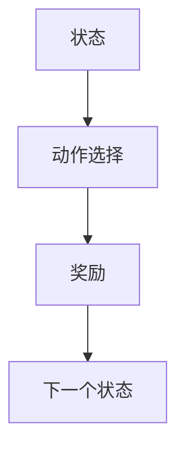
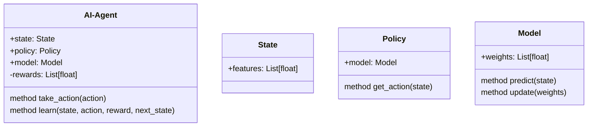
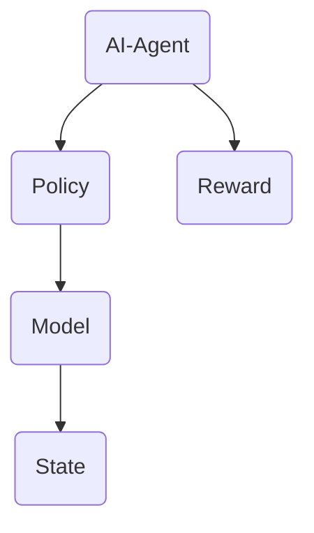

                 


# 构建具有自动机器学习能力的AI Agent

> **关键词**：AI Agent、自动机器学习、智能代理、强化学习、机器学习算法、系统架构设计  
>
> **摘要**：  
> 本文详细探讨了如何构建具有自动机器学习能力的AI Agent。从AI Agent的基本概念和自动机器学习的核心原理入手，逐步分析了强化学习、遗传算法和迁移学习等算法在AI Agent中的应用。通过系统架构设计、项目实战和案例分析，深入揭示了构建此类AI Agent的关键技术与实现细节。本文还提供了丰富的数学模型、算法流程图和Python代码示例，帮助读者全面理解并掌握构建具有自动机器学习能力的AI Agent的方法。

---

# 第一部分: 构建具有自动机器学习能力的AI Agent背景与核心概念

## 第1章: AI Agent与自动机器学习概述

### 1.1 AI Agent的基本概念

#### 1.1.1 AI Agent的定义与特点
AI Agent（人工智能代理）是指能够感知环境、自主决策并执行任务的智能实体。它具有以下特点：
- **自主性**：能够在没有外部干预的情况下独立运行。
- **反应性**：能够实时感知环境变化并做出相应的反应。
- **目标导向**：以实现特定目标为导向进行决策和行动。
- **学习能力**：能够通过经验或数据优化自身的性能。

#### 1.1.2 自动机器学习的必要性
自动机器学习（AutoML）是一种能够自动完成数据预处理、模型选择和调优的技术。在AI Agent中引入自动机器学习，可以显著提高其适应性和智能性，尤其是在复杂和动态变化的环境中。

#### 1.1.3 AI Agent与人类交互的核心要素
AI Agent与人类交互的核心要素包括：
- **自然语言处理**：实现人与AI Agent之间的语言交互。
- **情感计算**：理解并模拟人类情感，提升交互体验。
- **实时反馈机制**：根据用户的反馈动态调整行为。

### 1.2 自动机器学习的基本原理

#### 1.2.1 自动机器学习的定义与优势
自动机器学习是指通过自动化工具和算法，简化机器学习模型的构建和优化过程。其优势在于：
- **降低门槛**：无需深厚的机器学习背景即可快速构建模型。
- **提高效率**：通过自动化流程显著缩短模型开发周期。
- **增强适应性**：能够自动适应数据和环境的变化。

#### 1.2.2 自动机器学习与传统机器学习的区别
| 特性           | 自动机器学习                     | 传统机器学习                   |
|----------------|---------------------------------|-------------------------------|
| 数据预处理     | 自动完成数据清洗与特征工程       | 需要手动完成                   |
| 模型选择       | 自动选择最优模型架构             | 手动选择或调整                 |
| 参数调优       | 自动进行超参数优化               | 手动进行或基于经验              |
| 部署与监控     | 自动部署并实时监控性能           | 需要手动部署与监控              |

#### 1.2.3 AI Agent与自动机器学习的结合
AI Agent通过自动机器学习技术，能够实现以下功能：
- **自适应决策**：根据环境变化动态调整决策策略。
- **自我优化**：通过机器学习模型不断优化自身的性能。
- **智能交互**：结合自然语言处理技术实现更智能的用户交互。

### 1.3 本章小结
本章从AI Agent和自动机器学习的基本概念出发，探讨了两者结合的必要性和优势，为后续章节的深入分析奠定了基础。

---

## 第2章: AI Agent的核心概念与联系

### 2.1 AI Agent的核心概念原理

#### 2.1.1 AI Agent的感知与决策机制
AI Agent的感知机制包括以下步骤：
1. **数据采集**：通过传感器、摄像头或其他数据源获取环境信息。
2. **数据处理**：对采集到的数据进行清洗、特征提取和转换。
3. **知识表示**：将数据转换为可被机器学习模型理解的形式。

决策机制则包括：
1. **模型选择**：根据任务需求选择合适的机器学习模型。
2. **预测与推理**：基于模型预测结果进行推理和判断。
3. **决策优化**：通过反馈机制不断优化决策策略。

#### 2.1.2 自动机器学习在决策过程中的作用
自动机器学习在AI Agent的决策过程中主要体现在以下几个方面：
- **自动特征工程**：通过自动化手段提取和选择最优特征。
- **自动模型优化**：利用自动调优技术优化模型参数。
- **动态适应**：根据实时数据动态调整模型和策略。

#### 2.1.3 知识表示与推理的数学模型
知识表示与推理的数学模型可以通过图论和概率论来描述。例如，可以使用马尔可夫链模型来表示状态转移过程，具体如下：

$$ P(s_{t+1} | s_t, a) $$

其中，$s_t$ 表示当前状态，$a$ 表示动作，$s_{t+1}$ 表示下一个状态，$P$ 表示状态转移概率。

---

## 第3章: 自动机器学习算法原理

### 3.1 强化学习算法

#### 3.1.1 强化学习的基本原理（Mermaid流程图）



#### 3.1.2 基于强化学习的AI Agent实现（Python代码示例）

```python
class AI-Agent:
    def __init__(self):
        self.state = None
        self.reward = 0

    def take_action(self, action):
        # 执行动作并返回新的状态和奖励
        pass

    def learn(self, state, action, reward, next_state):
        # 强化学习算法的核心部分，用于更新策略
        pass
```

#### 3.1.3 强化学习的核心公式
强化学习的核心公式包括：
- **Q-learning算法**：
  $$ Q(s, a) = Q(s, a) + \alpha (r + \gamma \max Q(s', a') - Q(s, a)) $$
  
- **策略梯度方法**：
  $$ \nabla \theta J(\theta) = \mathbb{E}[\nabla \log \pi(a|s) Q(s,a)] $$

---

## 第4章: 系统分析与架构设计

### 4.1 系统功能设计

#### 4.1.1 领域模型（Mermaid类图）



#### 4.1.2 系统架构设计（Mermaid架构图）



---

## 第5章: 项目实战

### 5.1 环境安装与配置

```bash
pip install gym numpy tensorflow pandas scikit-learn
```

### 5.2 系统核心实现（Python代码示例）

```python
import numpy as np
import gym
from gym import spaces

class AI-Agent:
    def __init__(self, env):
        self.env = env
        self.observation_space = env.observation_space
        self.action_space = env.action_space
        self.model = self._build_model()

    def _build_model(self):
        # 构建简单的DNN模型
        pass

    def take_action(self, state):
        # 根据模型预测动作
        pass

    def learn(self, state, action, reward, next_state):
        # 更新模型参数
        pass

if __name__ == "__main__":
    env = gym.make("CartPole-v1")
    agent = AI-Agent(env)
    # 开始训练
    pass
```

---

## 第6章: 最佳实践与总结

### 6.1 小结
本文详细探讨了如何构建具有自动机器学习能力的AI Agent，涵盖了从理论到实践的各个环节。

### 6.2 注意事项
- **数据质量**：确保数据的完整性和准确性。
- **模型选择**：根据任务需求选择合适的模型和算法。
- **性能优化**：通过调参和优化算法提升性能。

### 6.3 拓展阅读
- 建议读者深入研究强化学习、遗传算法和迁移学习等算法，并尝试将其应用于更复杂的场景中。

---

# 作者

**作者：AI天才研究院/AI Genius Institute & 禅与计算机程序设计艺术 /Zen And The Art of Computer Programming**

---

# 参考文献

1. Russell, S., & Norvig, P. (2010). * Artificial Intelligence: A Modern Approach.
2. LeCun, Y., Bengio, Y., & Hinton, G. (2015). Deep Learning.

