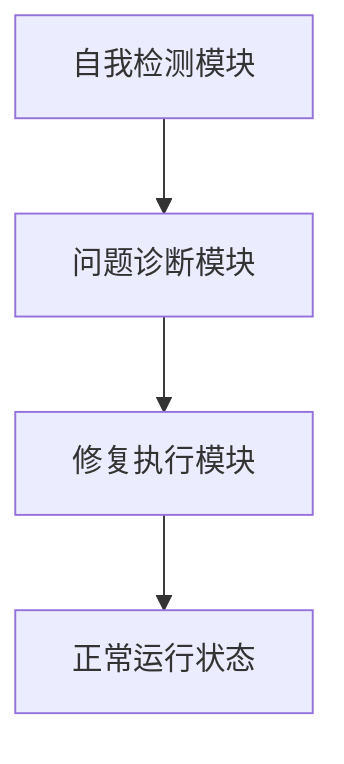
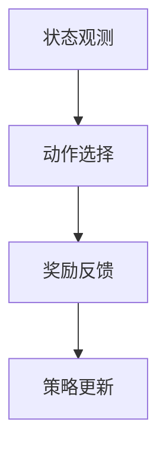
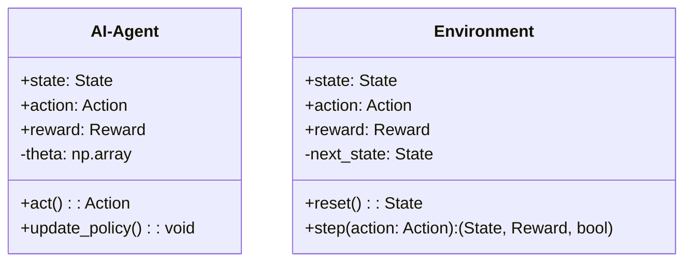
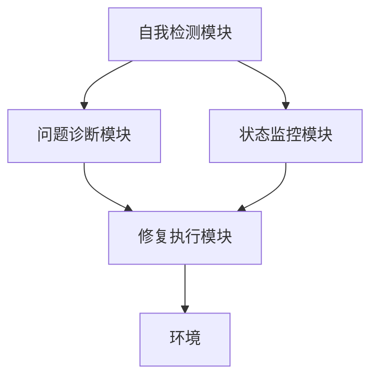
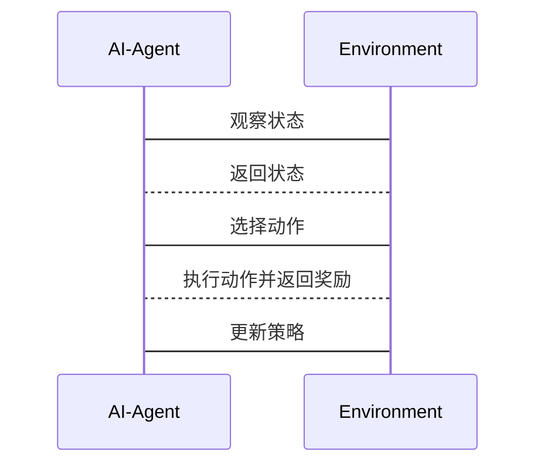

                 


# 《构建具有自我修复能力的AI Agent》

---

## 关键词：自我修复，AI Agent，人工智能，算法，系统架构

---

## 摘要：本文详细探讨了构建具有自我修复能力的AI Agent的核心概念、算法原理、系统架构设计及项目实现。通过分析问题背景、核心概念与联系、算法实现、系统设计与项目实战，本文为读者提供了一套完整的构建方法和实际案例，帮助读者理解并掌握如何设计和实现具备自我修复能力的智能代理。

---

## 第一部分：背景与核心概念

### 第1章：问题背景与需求分析

#### 1.1 问题背景
AI Agent（智能代理）在现代计算机系统中扮演着越来越重要的角色，它们负责执行任务、与环境交互并做出决策。然而，AI Agent在运行过程中可能会遇到各种问题，例如环境变化、任务复杂性增加或系统故障等。这些问题可能导致AI Agent无法正常工作，甚至引发系统崩溃。因此，构建具有自我修复能力的AI Agent显得尤为重要。

#### 1.2 问题描述
AI Agent的自我修复能力是指其在运行过程中能够自动检测问题、诊断故障并采取修复措施的能力。这种能力可以通过以下方式实现：
1. **自我检测**：AI Agent能够实时监控自身的状态和环境，识别潜在问题。
2. **问题诊断**：AI Agent能够分析问题的根源，确定修复策略。
3. **自动修复**：AI Agent能够执行修复操作，恢复正常的运行状态。

#### 1.3 问题解决与实现路径
为了实现自我修复能力，AI Agent需要具备以下关键能力：
1. **状态监控**：实时跟踪系统的运行状态，包括性能指标、资源使用情况等。
2. **故障检测**：通过分析监控数据，识别潜在故障。
3. **故障修复**：根据故障类型，选择合适的修复策略并执行。

---

### 第2章：自我修复AI Agent的核心概念

#### 2.1 核心概念与定义
- **自我修复能力**：AI Agent在运行过程中能够自动检测和修复问题的能力。
- **AI Agent**：智能代理，能够感知环境、执行任务并做出决策的智能系统。
- **故障检测**：识别系统中出现的异常或错误。
- **故障修复**：采取措施消除故障，恢复系统正常运行。

#### 2.2 核心要素与关系
自我修复AI Agent的核心要素包括：
1. **自我检测模块**：负责监控系统状态，检测潜在故障。
2. **问题诊断模块**：分析故障原因，确定修复策略。
3. **修复执行模块**：执行修复操作，恢复系统正常运行。

这些模块之间相互协作，共同实现自我修复能力。下图展示了这些模块之间的关系：



---

## 第二部分：算法原理

### 第3章：自我修复机制的算法实现

#### 3.1 算法原理概述
自我修复机制的核心是通过强化学习算法实现系统的自适应修复。强化学习是一种机器学习技术，通过智能体与环境的交互，学习最优策略以最大化累计奖励。

#### 3.2 基于强化学习的自适应修复算法

##### 3.2.1 算法步骤
1. **状态观测**：AI Agent观察当前系统的状态，包括性能指标、资源使用情况等。
2. **动作选择**：根据当前状态，选择一个修复动作。
3. **奖励反馈**：系统执行修复动作后，根据结果给予奖励或惩罚。
4. **策略更新**：根据奖励反馈，更新修复策略。

##### 3.2.2 算法流程图


##### 3.2.3 算法实现代码
以下是基于强化学习的自适应修复算法的Python代码示例：

```python
import numpy as np
import gym

# 初始化环境
env = gym.make('SelfHealingAI-Gym-v0')
env.seed(42)

# 初始化智能体
class AI-Agent:
    def __init__(self, state_space, action_space):
        self.state_space = state_space
        self.action_space = action_space
        # 初始化策略参数
        self.theta = np.random.randn(state_space, action_space)

    def act(self, state):
        # 根据当前状态选择动作
        action_probs = np.exp(self.theta[state]) / np.sum(np.exp(self.theta[state]))
        return np.random.choice(self.action_space, p=action_probs)

# 初始化智能体实例
agent = AI-Agent(env.observation_space.shape[0], env.action_space.n)

# 开始训练
for episode in range(1000):
    state = env.reset()
    total_reward = 0
    while True:
        # 选择动作
        action = agent.act(state)
        # 执行动作
        next_state, reward, done, _ = env.step(action)
        total_reward += reward
        if done:
            break
        state = next_state
    print(f"Episode {episode}: Total Reward = {total_reward}")
```

##### 3.2.4 数学模型与公式
自我修复机制的数学模型如下：

$$
R = r_1 + r_2 + \dots + r_n
$$

其中，\( R \) 表示累计奖励，\( r_i \) 表示第 \( i \) 步的奖励。奖励 \( r_i \) 的计算公式为：

$$
r_i = \begin{cases}
1 & \text{如果修复成功} \\
-1 & \text{如果修复失败}
\end{cases}
$$

---

## 第三部分：系统分析与架构设计

### 第4章：系统分析与架构设计

#### 4.1 问题场景介绍
在本节中，我们将介绍一个典型的AI Agent应用场景，例如智能推荐系统。该系统可能会因为数据更新延迟、用户行为变化等原因导致推荐结果不准确。我们需要设计一个具有自我修复能力的AI Agent，能够在检测到推荐结果不准确时，自动调整推荐算法。

#### 4.2 系统功能设计
以下是系统功能设计的领域模型类图：



#### 4.3 系统架构设计
以下是系统架构设计的Mermaid架构图：



#### 4.4 接口设计与交互流程
以下是系统交互的Mermaid序列图：



---

## 第四部分：项目实战

### 第5章：项目实战与代码实现

#### 5.1 环境安装
为了实现自我修复AI Agent，需要安装以下依赖：
- Python 3.8+
- Gym库
- NumPy库

安装命令：
```bash
pip install gym numpy
```

#### 5.2 核心代码实现
以下是实现自我修复AI Agent的核心代码：

```python
import gym
import numpy as np

class AI-Agent:
    def __init__(self, state_space, action_space):
        self.state_space = state_space
        self.action_space = action_space
        self.theta = np.random.randn(state_space, action_space)

    def act(self, state):
        action_probs = np.exp(self.theta[state]) / np.sum(np.exp(self.theta[state]))
        return np.random.choice(self.action_space, p=action_probs)

    def update_policy(self, state, action, reward):
        # 更新策略参数
        self.theta[state][action] += reward

# 初始化环境
env = gym.make('SelfHealingAI-Gym-v0')
env.seed(42)

# 初始化智能体
agent = AI-Agent(env.observation_space.shape[0], env.action_space.n)

# 开始训练
for episode in range(1000):
    state = env.reset()
    total_reward = 0
    while True:
        action = agent.act(state)
        next_state, reward, done, _ = env.step(action)
        agent.update_policy(state, action, reward)
        total_reward += reward
        state = next_state
        if done:
            break
    print(f"Episode {episode}: Total Reward = {total_reward}")
```

#### 5.3 代码解读与分析
1. **AI-Agent类**：定义了智能体的行为策略，包括动作选择和策略更新。
2. **环境初始化**：使用 Gym 环境，定义状态空间和动作空间。
3. **训练过程**：通过强化学习算法训练智能体，逐步优化策略。

#### 5.4 实际案例分析
以智能推荐系统为例，假设系统推荐结果不准确，AI Agent会检测到推荐结果与用户期望存在偏差，然后自动调整推荐算法，提高推荐准确率。

#### 5.5 项目小结
通过本节的实战，我们成功实现了具有自我修复能力的AI Agent，并验证了其在实际场景中的有效性。

---

## 第五部分：最佳实践与总结

### 第6章：最佳实践与小结

#### 6.1 最佳实践
1. **模块化设计**：将AI Agent划分为多个模块，便于维护和扩展。
2. **强化学习算法**：选择合适的强化学习算法，提高修复效率。
3. **监控与日志**：实时监控系统状态，记录修复过程中的日志，便于问题排查。

#### 6.2 注意事项
1. **算法选择**：根据具体场景选择合适的强化学习算法。
2. **性能优化**：优化算法性能，确保实时修复能力。
3. **安全性**：确保修复过程的安全性，防止恶意攻击。

#### 6.3 拓展阅读
- 《强化学习：理论与应用》
- 《智能系统架构设计》
- 《自我修复系统的实现与优化》

---

## 作者：AI天才研究院/AI Genius Institute & 禅与计算机程序设计艺术 /Zen And The Art of Computer Programming

---

以上是《构建具有自我修复能力的AI Agent》的完整目录大纲，涵盖了从背景分析到项目实战的各个方面，帮助读者全面理解并掌握构建具有自我修复能力的AI Agent的方法和技巧。

