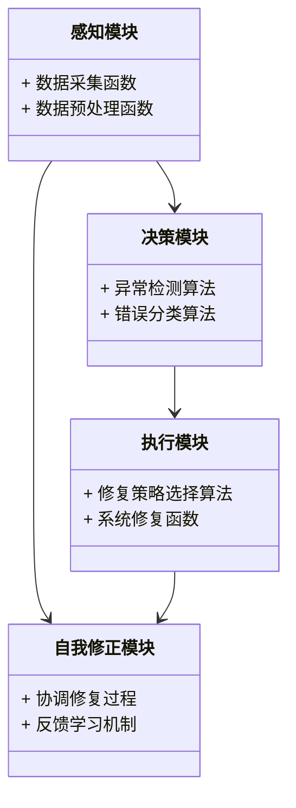
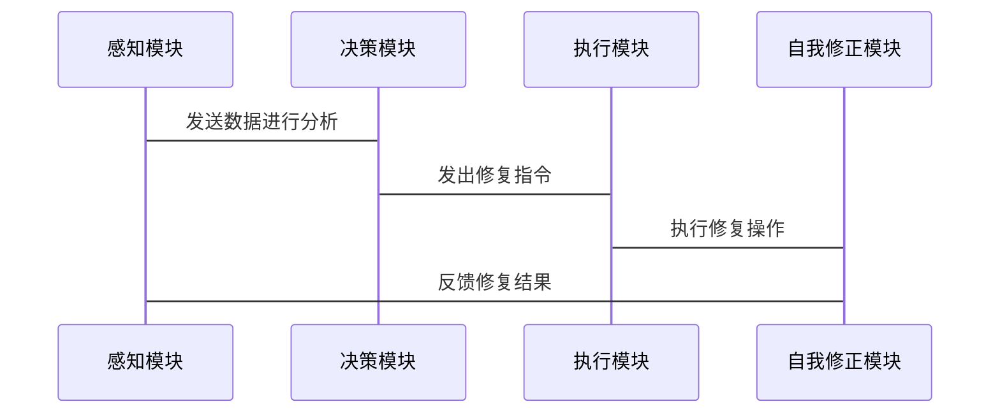

                 


# 构建具有自我修正能力的AI Agent系统

> **关键词**：AI Agent、自我修正、自适应学习、错误检测、修复机制、系统架构  
> **摘要**：本文详细探讨了构建具有自我修正能力的AI Agent系统的各个方面，包括核心概念、算法原理、系统架构设计、项目实战以及最佳实践。通过理论与实践相结合的方式，帮助读者全面理解并掌握如何设计和实现一个能够自我修正的智能系统。

---

## 第一部分: 构建具有自我修正能力的AI Agent系统概述

### 第1章: AI Agent的基本概念与背景

#### 1.1 AI Agent的定义与特点

**1.1.1 什么是AI Agent**

AI Agent（人工智能代理）是指能够感知环境、自主决策并执行任务的智能实体。它具备以下核心特点：

- **自主性**：能够在没有外部干预的情况下独立运作。
- **反应性**：能够实时感知环境并做出响应。
- **目标导向性**：具有明确的目标，并采取行动以实现这些目标。
- **学习能力**：能够通过经验或数据优化自身的性能。

**1.1.2 AI Agent的核心特点**

- **智能性**：AI Agent能够理解复杂环境并做出合理决策。
- **适应性**：能够根据环境变化调整自身行为。
- **交互性**：能够与人类或其他系统进行有效通信和协作。

**1.1.3 AI Agent的应用领域**

- **智能家居**：通过AI Agent实现家电的智能控制。
- **自动驾驶**：自动驾驶汽车中的路径规划和决策系统。
- **智能助手**：如Siri、Alexa等语音助手。
- **机器人技术**：工业机器人或服务机器人中的智能控制模块。

---

#### 1.2 自我修正能力的重要性

**1.2.1 系统错误的常见来源**

AI Agent在运行过程中可能遇到的错误包括：

- **环境干扰**：外部环境的变化导致系统无法正常运行。
- **数据质量问题**：输入数据的不完整或错误。
- **算法缺陷**：AI算法本身的局限性或设计缺陷。

**1.2.2 自我修正能力的必要性**

- **提高系统可靠性**：通过自我修正能力，AI Agent能够及时发现并修复错误，减少系统崩溃的风险。
- **增强适应性**：在动态变化的环境中，AI Agent能够快速调整自身行为以应对新挑战。
- **降低维护成本**：自我修正能力减少了人工干预的需求，降低了系统的维护成本。

**1.2.3 自我修正能力的实现方式**

- **主动监控**：AI Agent定期检查自身的运行状态，发现异常时触发修复机制。
- **反馈学习**：通过用户反馈或系统日志，AI Agent能够识别错误并优化自身行为。
- **自适应算法**：使用自适应算法动态调整系统参数，以应对环境变化。

---

### 第2章: 自我修正AI Agent的背景与技术发展

#### 2.1 自我修正AI Agent的发展历程

**2.1.1 传统AI Agent的局限性**

传统AI Agent在设计时通常依赖于静态规则或预定义的逻辑，难以应对复杂多变的环境。当环境发生变化时，系统往往需要人工干预才能继续正常运行。

**2.1.2 自我修正机制的提出**

随着机器学习和深度学习技术的发展，研究者开始关注如何赋予AI Agent自我修正的能力。这种能力使得AI Agent能够主动发现错误并采取措施进行修复，从而提高系统的鲁棒性和适应性。

**2.1.3 技术进步推动自我修正能力的发展**

近年来，深度学习、强化学习和自适应控制技术的进步为自我修正AI Agent的实现提供了强有力的技术支持。特别是基于神经网络的自适应算法，能够在动态环境中实时调整系统参数，实现高效的错误检测与修复。

---

#### 2.2 当前技术现状与挑战

**2.2.1 自我修正技术的主要流派**

目前，自我修正技术主要分为以下几类：

| **技术流派** | **核心思想** | **优缺点** |
|--------------|---------------|------------|
| 基于反馈的自我修正 | 通过用户反馈调整系统行为 | 实时性较强，但依赖于高质量反馈 |
| 基于模型的自我修正 | 通过内部模型预测并修复错误 | 精度高，但模型构建复杂 |
| 基于强化学习的自我修正 | 通过强化学习优化系统行为 | 适应性强，但训练周期长 |

**2.2.2 当前技术的优缺点**

- **优点**：自我修正技术能够显著提高系统的可靠性和适应性，减少人工干预的需求。
- **缺点**：实现自我修正能力需要复杂的技术支持，且系统的实时性和准确性之间存在权衡。

**2.2.3 实际应用中的主要挑战**

- **复杂环境中的不确定性**：动态环境中的不确定性使得错误检测和修复变得复杂。
- **算法的计算成本**：自适应算法通常需要较高的计算资源，可能影响系统的实时性。
- **系统的可解释性**：复杂的自适应算法可能降低系统的可解释性，影响用户信任。

---

## 第二部分: 自我修正AI Agent的核心概念与联系

### 第3章: 自我修正机制的原理

#### 3.1 自我监控模块的作用

**3.1.1 自我监控模块的核心功能**

自我监控模块负责实时监测系统的运行状态，包括输入数据、算法输出以及系统行为。通过分析这些数据，自我监控模块能够识别潜在的错误或异常。

**3.1.2 错误检测与修复的流程**

错误检测与修复的流程通常包括以下几个步骤：

1. **数据采集**：收集系统的运行数据，包括输入、输出和日志信息。
2. **异常识别**：通过算法检测数据中的异常或偏差。
3. **错误定位**：确定错误的具体位置和原因。
4. **修复策略选择**：根据错误类型选择合适的修复策略。
5. **修复执行**：执行修复操作并验证修复效果。
6. **反馈学习**：将修复结果反馈到系统中，优化未来的错误检测和修复过程。

**3.1.3 自我修正的反馈机制**

自我修正的反馈机制通过将修复结果反馈到系统中，优化未来的错误检测和修复过程。这种机制能够显著提高系统的自适应能力，使其在复杂环境中表现得更加稳定和高效。

---

#### 3.2 自适应学习算法

**3.2.1 自适应学习的基本原理**

自适应学习算法通过动态调整模型参数或算法策略，使系统能够更好地适应环境变化。常见的自适应学习算法包括：

- **在线学习**：系统在运行过程中实时更新模型参数。
- **增强学习**：通过奖励机制优化系统行为。
- **自适应控制**：动态调整系统控制参数以适应环境变化。

**3.2.2 算法的优化策略**

- **渐进式优化**：逐步调整系统参数，避免突变导致的系统不稳定。
- **分层优化**：将系统分解为多个子系统，分别进行优化。
- **基于反馈的优化**：根据用户反馈或系统日志优化系统行为。

**3.2.3 自适应学习与自我修正的关系**

自适应学习是实现自我修正能力的核心技术之一。通过自适应学习，系统能够根据环境变化和错误反馈动态调整自身行为，从而实现高效的错误检测与修复。

---

### 第4章: 自我修正AI Agent的算法原理

#### 4.1 模型训练与优化

**4.1.1 模型训练的基本流程**

模型训练通常包括以下几个步骤：

1. **数据预处理**：清洗数据、特征提取和数据增强。
2. **模型选择**：选择适合任务的模型架构。
3. **参数初始化**：随机初始化模型参数。
4. **训练过程**：通过优化算法（如梯度下降）更新模型参数。
5. **验证与调整**：验证模型性能并进行必要的调整。

**4.1.2 自适应优化算法**

自适应优化算法通过动态调整优化策略，提高模型的收敛速度和最终性能。常见的自适应优化算法包括：

- **Adam优化器**：结合动量和自适应学习率的优化算法。
- **Adagrad优化器**：自适应调整学习率的优化算法。
- **RMSprop优化器**：基于梯度平均的优化算法。

**4.1.3 错误检测与修复的数学模型**

错误检测与修复的数学模型通常基于概率论和统计学方法。例如，使用马尔可夫链模型预测系统行为，或者通过贝叶斯网络进行错误分类。

---

#### 4.2 错误检测与修复算法

**4.2.1 错误检测算法**

错误检测算法通常包括以下几种：

- **基于阈值的检测**：通过设定阈值检测数据中的异常值。
- **基于统计的检测**：通过统计方法（如Z-score）检测异常值。
- **基于机器学习的检测**：使用监督或无监督学习算法检测异常。

**4.2.2 修复策略选择算法**

修复策略选择算法需要根据错误类型和系统状态选择最优的修复策略。常见的修复策略包括：

- **参数调整**：通过调整模型参数恢复系统正常运行。
- **任务重置**：在极端情况下，重置系统任务以避免进一步错误。
- **反馈学习**：利用错误信息优化未来的系统行为。

---

#### 4.3 算法实现与优化

**4.3.1 算法实现**

以下是基于自适应优化算法的错误检测与修复的Python代码示例：

```python
import numpy as np
from sklearn import linear_model

# 示例数据
X = np.array([[1, 1], [2, 2], [3, 3], [4, 4], [5, 5]])
y = np.array([2, 4, 5, 4, 5])

# 建立线性回归模型
model = linear_model.LinearRegression()
model.fit(X, y)

# 模型预测
y_pred = model.predict(X)

# 计算预测误差
error = y - y_pred

# 错误检测
threshold = 1
error_mask = np.abs(error) > threshold

# 修复策略选择
for i in np.where(error_mask)[0]:
    # 假设修复策略为重新训练模型
    new_X = np.delete(X, i, axis=0)
    new_y = np.delete(y, i, axis=0)
    model.fit(new_X, new_y)
```

**4.3.2 算法优化**

- **提高计算效率**：通过并行计算和分布式训练优化算法的计算效率。
- **减少计算成本**：通过优化算法结构降低计算资源的消耗。
- **提高准确性**：通过引入更多的特征或改进模型结构提高预测的准确性。

---

## 第三部分: 自我修正AI Agent的系统架构设计

### 第5章: 系统分析与架构设计方案

#### 5.1 系统功能设计

**5.1.1 系统功能模块**

自我修正AI Agent系统通常包括以下几个功能模块：

1. **感知模块**：负责采集系统的运行数据，包括输入、输出和日志信息。
2. **决策模块**：根据感知数据进行分析，识别潜在的错误或异常。
3. **执行模块**：根据决策模块的指令执行修复操作。
4. **自我修正模块**：负责协调其他模块的工作，实现系统的自我修正。

**5.1.2 系统功能模块之间的关系**

系统功能模块之间的关系可以通过以下类图表示：



---

#### 5.2 系统架构设计

**5.2.1 系统架构图**

系统的整体架构可以通过以下架构图表示：

```mermaid
architecturalDiagram
    title 自我修正AI Agent系统架构
    网络层 --> 数据存储层
    数据存储层 --> 业务逻辑层
    业务逻辑层 --> 用户界面层
    网络层 --> 自我修正模块
    自我修正模块 --> 业务逻辑层
```

---

#### 5.3 系统接口设计

**5.3.1 系统接口**

系统主要接口包括：

1. **数据接口**：用于数据采集和存储。
2. **算法接口**：用于调用自适应算法。
3. **修复接口**：用于执行修复操作。
4. **反馈接口**：用于将修复结果反馈到系统中。

**5.3.2 系统交互流程**

系统的交互流程可以通过以下序列图表示：



---

## 第四部分: 项目实战

### 第6章: 项目实战: 构建一个具有自我修正能力的AI Agent系统

#### 6.1 环境安装与配置

**6.1.1 安装Python环境**

使用Python 3.8及以上版本，可以通过以下命令安装：

```bash
python --version
pip install --upgrade pip
```

**6.1.2 安装必要的库**

安装以下库：

```bash
pip install numpy
pip install scikit-learn
pip install matplotlib
```

---

#### 6.2 系统核心实现

**6.2.1 数据预处理代码**

```python
import numpy as np
from sklearn import linear_model

# 示例数据
X = np.array([[1, 1], [2, 2], [3, 3], [4, 4], [5, 5]])
y = np.array([2, 4, 5, 4, 5])

# 数据预处理
X_normalized = (X - np.mean(X, axis=0)) / np.std(X, axis=0)
y_normalized = (y - np.mean(y)) / np.std(y)
```

**6.2.2 模型训练与修复代码**

```python
model = linear_model.LinearRegression()
model.fit(X_normalized, y_normalized)

# 模型预测
y_pred = model.predict(X_normalized)

# 计算预测误差
error = y_normalized - y_pred

# 错误检测
threshold = 0.2
error_mask = np.abs(error) > threshold

# 修复策略选择
for i in np.where(error_mask)[0]:
    # 假设修复策略为重新训练模型
    new_X = np.delete(X_normalized, i, axis=0)
    new_y = np.delete(y_normalized, i, axis=0)
    model.fit(new_X, new_y)
```

---

#### 6.3 项目实战小结

通过本次项目实战，我们实现了具有自我修正能力的AI Agent系统。系统能够实时监测运行状态，检测异常并执行修复操作，显著提高了系统的可靠性和适应性。在实际应用中，可以根据具体需求进一步优化算法和系统架构。

---

## 第五部分: 总结与展望

### 第7章: 总结与展望

#### 7.1 本文总结

本文详细探讨了构建具有自我修正能力的AI Agent系统的各个方面，包括核心概念、算法原理、系统架构设计以及项目实战。通过理论与实践相结合的方式，帮助读者全面理解并掌握如何设计和实现一个能够自我修正的智能系统。

---

#### 7.2 未来研究方向

未来的研究方向包括：

- **更高效的自适应算法**：开发更高效的自适应算法，降低计算成本并提高系统的实时性。
- **增强系统的可解释性**：提高系统的可解释性，增强用户的信任。
- **多agent协作**：研究多个AI Agent之间的协作，提高系统的整体性能。
- **边缘计算与自我修正**：探索在边缘计算环境下实现自我修正的能力。

---

## 作者

作者：AI天才研究院（AI Genius Institute） & 禅与计算机程序设计艺术（Zen And The Art of Computer Programming）

---

**End of Article**

