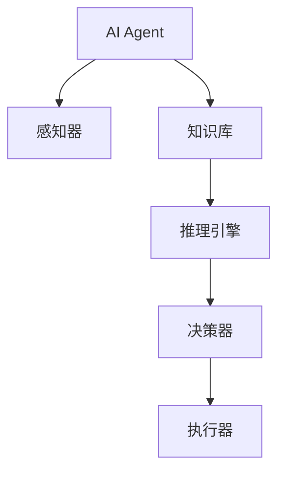
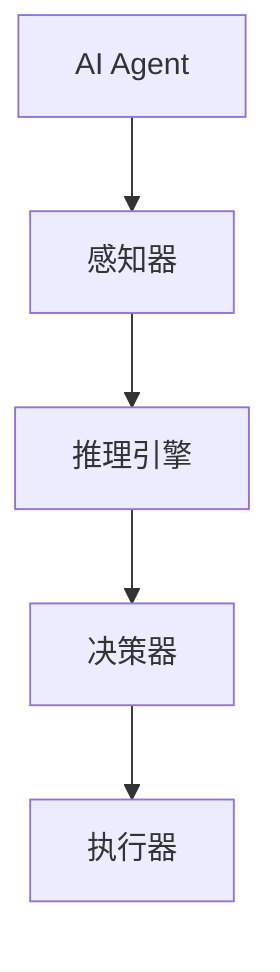
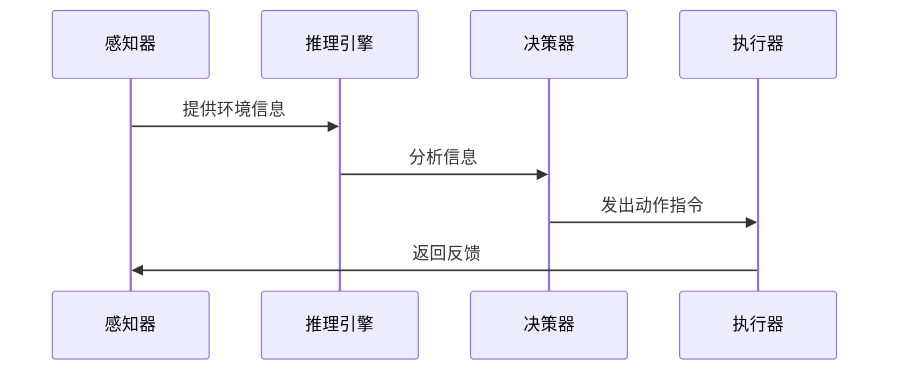

                 


# 构建具有自我学习能力的AI Agent

> 关键词：AI Agent, 自我学习, 机器学习, 强化学习, 深度学习, 系统架构

> 摘要：本文详细探讨了构建具有自我学习能力的AI Agent的理论基础、算法原理、系统架构及实现方法。通过分析AI Agent的核心概念、强化学习与深度学习的结合、系统设计与优化，以及实际项目的实施，本文为读者提供了从理论到实践的全面指导。

---

# 第一部分: 背景介绍与核心概念

## 第1章: AI Agent 的背景与重要性

### 1.1 问题背景与描述
#### 1.1.1 当前AI Agent的发展现状
AI Agent（智能体）是人工智能领域的核心概念，广泛应用于自动驾驶、智能助手、机器人等领域。传统的AI Agent依赖于预设的规则或大量标注数据，难以在动态环境中自适应地学习和优化。随着机器学习和深度学习技术的进步，构建具有自我学习能力的AI Agent成为可能。

#### 1.1.2 自我学习能力的必要性
在复杂多变的环境中，AI Agent需要能够根据实时反馈和经验不断优化自身行为。自我学习能力使得AI Agent能够从环境中主动探索、发现规律，并通过经验改进决策策略。

#### 1.1.3 问题解决的核心思路
自我学习AI Agent的核心思路是结合强化学习（Reinforcement Learning）和深度学习（Deep Learning），通过与环境的交互，逐步构建知识表示，并优化决策策略。这种方法使得AI Agent能够在无监督或少监督的环境中自适应地学习和成长。

### 1.2 核心概念与定义
#### 1.2.1 AI Agent的定义
AI Agent是指能够感知环境、做出决策并执行动作的智能实体。它可以是一个软件程序、机器人或其他形式的智能系统。

#### 1.2.2 自我学习能力的定义
自我学习能力是指AI Agent能够在没有明确指导的情况下，通过与环境的交互，自主发现规律、优化行为并提高任务完成能力的特性。

#### 1.2.3 相关技术的对比
| 技术 | 描述 | 优缺点 |
|------|------|--------|
| 有监督学习 | 需要标注数据 | 数据获取成本高 |
| 无监督学习 | 无标注数据 | 学习效果不稳定 |
| 强化学习 | 基于奖励机制 | 适合动态环境 |

### 1.3 问题场景与边界
#### 1.3.1 问题场景介绍
本文将重点讨论AI Agent在动态环境中的自我学习问题，例如游戏AI、机器人控制等领域。

#### 1.3.2 边界与外延
本文不讨论AI Agent的硬件实现，主要关注算法和系统架构的设计。

---

## 第2章: 自我学习AI Agent的核心要素

### 2.1 核心概念与联系
#### 2.1.1 自我学习机制
自我学习机制包括感知、推理、决策和执行四个环节。AI Agent通过感知环境获取信息，利用推理引擎分析信息，做出决策，并通过执行器与环境互动。

#### 2.1.2 知识表示与推理
知识表示是AI Agent理解世界的基础。常见的知识表示方法包括符号逻辑、知识图谱和神经网络。推理引擎负责根据知识库中的信息进行逻辑推理。

#### 2.1.3 行为决策与优化
决策模块基于当前状态和知识库，选择最优动作，并通过强化学习优化决策策略。

### 2.2 核心概念对比表
| 概念 | 强化学习 | 无监督学习 | 有监督学习 |
|------|----------|------------|------------|
| 数据 | 环境反馈 | 无标注 | 有标注 |
| 目标 | 最大化奖励 | 发现数据结构 | 分类/回归 |

### 2.3 实体关系架构图


---

# 第三部分: 算法原理与数学模型

## 第3章: 强化学习算法

### 3.1 算法原理
#### 3.1.1 Q-learning算法
Q-learning是一种经典的强化学习算法，通过更新Q值表来学习最优策略。公式如下：
$$ Q(s, a) = Q(s, a) + \alpha (r + \max Q(s', a') - Q(s, a)) $$

#### 3.1.2 策略梯度方法
策略梯度方法通过优化策略参数直接优化目标函数。常用的算法包括REINFORCE和Actor-Critic。

### 3.2 算法实现
#### 3.2.1 Q-learning代码实现
```python
import numpy as np

class QLearning:
    def __init__(self, state_space, action_space, alpha=0.1, gamma=0.9):
        self.Q = np.zeros((state_space, action_space))
        self.alpha = alpha
        self.gamma = gamma

    def choose_action(self, state):
        return np.argmax(self.Q[state])

    def update(self, state, action, reward, next_state):
        target = reward + self.gamma * np.max(self.Q[next_state])
        self.Q[state][action] += self.alpha * (target - self.Q[state][action])
```

---

## 第4章: 深度学习与自适应学习

### 4.1 深度强化学习
深度强化学习结合了深度学习和强化学习的优势，通过神经网络近似价值函数或策略。

### 4.2 神经网络结构
常用的神经网络结构包括卷积神经网络（CNN）和递归神经网络（RNN）。

---

## 第5章: 自我学习机制的数学模型

### 5.1 Q-learning的数学推导
Q-learning的目标是找到最优Q值表，使得：
$$ Q_{\text{opt}}(s, a) = \max_{a'} Q(s, a') $$

### 5.2 策略梯度的优化方法
策略梯度方法通过优化参数θ，使得：
$$ \nabla_\theta J(\theta) = \mathbb{E}[ \nabla_\theta \log \pi_\theta(a|s) Q(s, a) ] $$

---

# 第四部分: 系统分析与架构设计

## 第6章: 系统架构设计

### 6.1 问题场景分析
以游戏AI为例，设计一个能够通过自我学习掌握游戏规则的AI Agent。

### 6.2 系统功能设计
系统功能包括感知、推理、决策和执行四个模块。

### 6.3 系统架构图


---

## 第7章: 接口与交互设计

### 7.1 系统接口设计
定义感知器和执行器的接口，确保模块之间的通信。

### 7.2 交互流程图


---

# 第五部分: 项目实战与实现

## 第8章: 项目实战

### 8.1 环境安装
安装必要的库，例如TensorFlow、Keras等。

### 8.2 核心代码实现
实现Q-learning算法的AI Agent。

### 8.3 代码解读与分析
详细解读代码实现，说明每部分的功能。

### 8.4 案例分析
分析AI Agent在游戏中的表现，优化算法参数。

### 8.5 项目总结
总结项目经验，提出改进建议。

---

## 第9章: 总结与展望

### 9.1 最佳实践
总结构建自我学习AI Agent的关键点和注意事项。

### 9.2 小结
通过本文的学习，读者可以掌握自我学习AI Agent的核心原理和实现方法。

### 9.3 注意事项
在实际应用中，需注意算法的收敛性和计算效率。

### 9.4 拓展阅读
推荐相关书籍和论文，供读者深入学习。

---

# 作者：AI天才研究院 & 禅与计算机程序设计艺术

---

本文详细探讨了构建具有自我学习能力的AI Agent的理论基础、算法原理、系统架构及实现方法。通过分析AI Agent的核心概念、强化学习与深度学习的结合、系统设计与优化，以及实际项目的实施，本文为读者提供了从理论到实践的全面指导。

