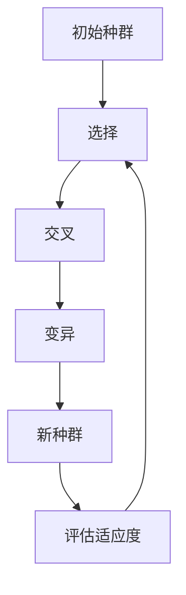
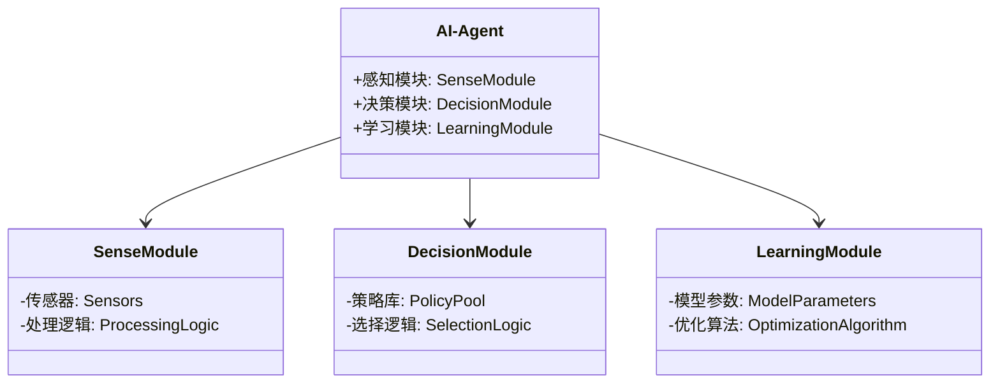

                 


# 构建具有自我演化能力的AI Agent

> 关键词：AI Agent，自我演化，强化学习，进化算法，系统架构，机器学习

> 摘要：本文将详细探讨如何构建一个具有自我演化能力的AI Agent。通过分析自我演化机制的核心原理、系统架构设计、算法实现以及实际应用案例，我们将一步步揭示如何使AI Agent具备持续学习和适应环境的能力。文章内容涵盖背景介绍、核心概念、算法原理、系统架构、项目实战以及最佳实践等方面，旨在为读者提供全面而深入的技术指导。

---

## 第1章：AI Agent的基本概念与背景

### 1.1 AI Agent的定义与分类

#### 1.1.1 什么是AI Agent
AI Agent（人工智能代理）是指能够感知环境、做出决策并采取行动的智能实体。它可以是一个软件程序，也可以是一个物理设备，其目标是通过与环境的交互实现特定任务。

#### 1.1.2 AI Agent的分类
AI Agent可以根据智能水平分为以下几类：
1. **反应式AI Agent**：基于当前感知做出反应，没有内部状态。
2. **认知式AI Agent**：具备复杂推理和规划能力，能够根据目标进行决策。
3. **学习型AI Agent**：能够通过经验改进性能，具备自我学习能力。

#### 1.1.3 自我演化能力的定义
自我演化能力是指AI Agent能够在没有外部干预的情况下，通过与环境的交互不断优化自身算法和行为策略的能力。

---

### 1.2 自我演化AI Agent的背景与意义

#### 1.2.1 当前AI技术的局限性
尽管当前AI技术取得了巨大进步，但大多数AI系统仍然依赖于人工设计的规则或预训练的数据，缺乏真正的自主学习和适应能力。

#### 1.2.2 自我演化能力的重要性
自我演化能力使AI Agent能够在动态变化的环境中生存和进化，能够应对未知挑战并不断优化性能。

#### 1.2.3 自我演化AI Agent的应用场景
1. **智能助手**：能够根据用户行为不断优化服务。
2. **自动驾驶**：在复杂交通环境中不断优化驾驶策略。
3. **游戏AI**：在比赛中不断进化策略，提高胜率。

---

## 第2章：自我演化机制的核心原理

### 2.1 强化学习与自适应机制

#### 2.1.1 强化学习的基本原理
强化学习是一种通过试错机制学习策略的方法。AI Agent通过与环境交互，根据接收到的奖励信号调整行为，以最大化累计奖励。

**数学模型：**
- 状态空间：$S$
- 行动空间：$A$
- 奖励函数：$R$
- 策略：$\pi(a|s)$，表示在状态$s$下选择行动$a$的概率。

**Q-learning算法：**
$$ Q(s, a) \leftarrow Q(s, a) + \alpha [r + \max_{a'} Q(s', a') - Q(s, a)] $$

#### 2.1.2 自适应机制的实现方式
自适应机制通过动态调整参数或结构来优化性能。例如，神经网络的权重更新或算法参数的自适应调整。

#### 2.1.3 强化学习与自我演化的关系
强化学习是自我演化的重要组成部分，通过不断试错和优化策略，使AI Agent具备自我进化能力。

---

### 2.2 进化算法与基因表达

#### 2.2.1 进化算法的基本原理
进化算法是一种基于自然选择和遗传机制的优化方法。通过选择、交叉和变异操作，逐步优化个体的适应性。

**流程图：**


#### 2.2.2 基因表达的数学模型
基因表达可以看作是一个编码和解码的过程。例如，使用神经网络的权重作为基因，通过进化算法优化权重。

#### 2.2.3 进化算法在自我演化中的应用
进化算法可以用于优化AI Agent的行为策略，例如在游戏AI中通过进化算法不断优化策略树。

---

## 第3章：自我演化AI Agent的体系结构

### 3.1 模块化设计

#### 3.1.1 感知模块的设计
感知模块负责接收环境输入并进行初步处理。例如，使用CNN提取图像特征。

#### 3.1.2 决策模块的实现
决策模块基于感知结果选择最优行动。例如，使用DQN算法进行决策。

#### 3.1.3 学习模块的优化
学习模块负责更新模型参数。例如，使用强化学习算法优化策略。

**类图：**


---

### 3.2 自我演化系统的通信机制

#### 3.2.1 系统内部的通信协议
系统内部通过消息队列进行通信，例如使用RabbitMQ或Kafka。

#### 3.2.2 通信机制的实现方式
通信机制需要考虑实时性和可靠性，确保各模块之间的高效协同。

#### 3.2.3 通信机制对自我演化的影响
良好的通信机制能够提高系统的响应速度和协调性，从而提升自我演化效率。

---

## 第4章：自我演化AI Agent的系统实现

### 4.1 环境搭建与配置

#### 4.1.1 开发环境的选择
推荐使用Python和深度学习框架（如TensorFlow或PyTorch）进行开发。

#### 4.1.2 系统配置的优化
配置GPU加速、多线程处理等优化措施。

#### 4.1.3 环境搭建的注意事项
确保硬件资源充足，软件依赖版本匹配。

---

### 4.2 算法实现与代码解读

#### 4.2.1 强化学习算法的实现
以下是一个简单的Q-learning实现示例：
```python
import numpy as np

class QLearning:
    def __init__(self, state_space, action_space, alpha=0.1, gamma=0.9):
        self.q_table = np.zeros(state_space)
        self.alpha = alpha
        self.gamma = gamma
        self.action_space = action_space

    def choose_action(self, state):
        return np.argmax(self.q_table[state])

    def update(self, state, action, reward, next_state):
        self.q_table[state][action] += self.alpha * (reward + self.gamma * np.max(self.q_table[next_state]) - self.q_table[state][action])
```

#### 4.2.2 进化算法的代码实现
以下是一个简单的遗传算法实现示例：
```python
def fitness(individual):
    return sum(individual)

def mutate(individual, mutation_rate=0.1):
    for i in range(len(individual)):
        if random.random() < mutation_rate:
            individual[i] = 1 - individual[i]
    return individual

def crossover(parent1, parent2):
    mid = len(parent1) // 2
    return parent1[:mid] + parent2[mid:], parent2[:mid] + parent1[mid:]

# 初始化种群
population = [[0,1,0,1] for _ in range(10)]
# 评估适应度
fitness_values = [fitness(individual) for individual in population]
# 选择
selected = [population[i] for i in np.argsort(fitness_values)[-5:]]
# 交叉
new_population = []
for i in range(0, len(selected), 2):
    p1, p2 = selected[i], selected[i+1]
    child1, child2 = crossover(p1, p2)
    new_population.extend([mutate(child1), mutate(child2)])
```

---

### 4.3 系统接口设计

#### 4.3.1 接口设计原则
接口设计应遵循模块化、可扩展性和易用性原则。

#### 4.3.2 接口实现
使用RESTful API设计接口，例如：
- `/api/sense`：接收感知数据。
- `/api/decision`：请求决策建议。
- `/api/learning`：上传学习数据。

---

## 第5章：自我演化AI Agent的实际应用案例

### 5.1 智能助手的构建

#### 5.1.1 案例背景介绍
构建一个能够自我学习的智能助手，例如智能音箱。

#### 5.1.2 系统功能设计
- 用户交互模块：接收语音指令。
- 自我学习模块：根据用户反馈优化响应策略。

#### 5.1.3 实际应用中的问题与解决方案
- 问题：用户反馈延迟。
- 解决：采用分布式计算和异步处理。

---

### 5.2 游戏AI的实现

#### 5.2.1 游戏AI的基本需求
在MOBA游戏中，AI需要具备路径规划、目标识别和策略调整能力。

#### 5.2.2 自我演化机制在游戏AI中的应用
通过强化学习优化策略树，动态调整战斗策略。

#### 5.2.3 游戏AI的实际效果分析
通过A/B测试验证不同策略的效果，优化AI的表现。

---

## 第6章：自我演化AI Agent的挑战与未来方向

### 6.1 当前技术的局限性

#### 6.1.1 算法的计算复杂度
自我演化需要大量计算资源，可能面临性能瓶颈。

#### 6.1.2 系统的可解释性
复杂的演化过程可能导致系统行为难以解释，增加调试难度。

---

### 6.2 未来研究方向

#### 6.2.1 更高效的算法设计
研究更高效的强化学习和进化算法，降低计算成本。

#### 6.2.2 多智能体协同演化
研究多AI Agent协同工作时的演化机制。

#### 6.2.3 跨领域应用
将自我演化AI Agent技术应用于更多领域，如医疗、金融等。

---

## 第7章：总结与展望

### 7.1 总结
本文详细探讨了构建具有自我演化能力的AI Agent的关键技术，包括强化学习、进化算法、系统架构和实际应用案例。

### 7.2 展望
未来，随着AI技术的进步，自我演化AI Agent将在更多领域展现出强大的潜力。

---

## 作者：AI天才研究院/AI Genius Institute & 禅与计算机程序设计艺术 /Zen And The Art of Computer Programming

