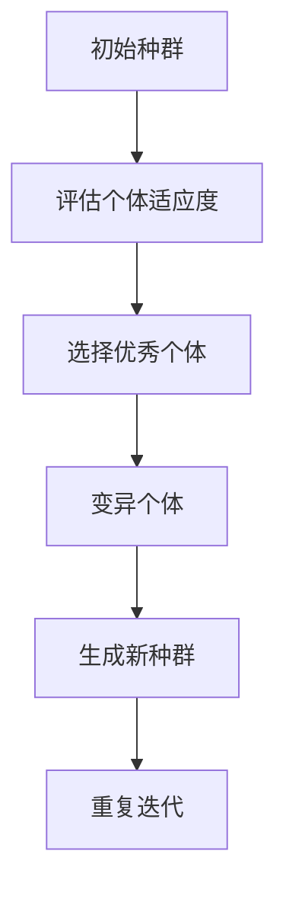
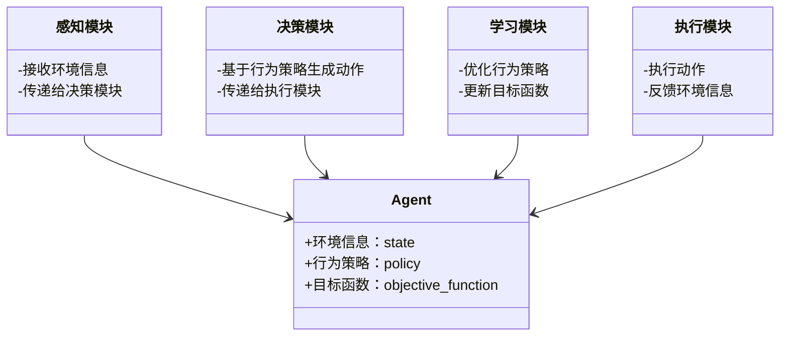

                 


# 构建具有自我演化能力的AI Agent系统

## 关键词：
- AI Agent
- 自我演化
- 强化学习
- 进化策略
- 系统架构设计

## 摘要：
构建具有自我演化能力的AI Agent系统是人工智能领域的前沿研究方向。本文从背景、核心概念、算法原理、系统架构设计、项目实战等多方面展开，详细讲解了如何设计和实现一个能够自我演化、适应复杂环境的AI Agent系统。通过本文的学习，读者可以掌握自我演化AI Agent的核心原理，理解其在实际应用中的优势，并通过具体案例掌握其实现方法。

---

# 第1章：自我演化AI Agent的背景与核心概念

## 1.1 自我演化AI Agent的定义与背景

### 1.1.1 自我演化AI Agent的定义
自我演化AI Agent（Self-Evolving AI Agent）是一种能够根据环境变化和任务需求，自主调整自身行为、参数和结构的智能体。其核心在于通过自我学习和优化，实现对复杂问题的动态适应和高效解决。

**关键点对比**：

| 比较维度 | 传统AI Agent | 自我演化AI Agent |
|----------|--------------|------------------|
| 行为决策 | 预先编程规则 | 动态学习与优化   |
| 参数调整 | 静态或少量调整 | 自主优化与进化   |
| 适应性 | 有限的环境适应性 | 强大的环境适应性   |

### 1.1.2 自我演化的核心机制
自我演化的核心机制包括：
1. **进化策略**：通过模拟生物进化，逐步优化AI Agent的行为策略。
2. **强化学习**：通过与环境交互，学习最优行为策略。
3. **自适应算法**：根据实时反馈动态调整系统参数。

### 1.1.3 自我演化与传统AI Agent的区别
以下是自我演化AI Agent与传统AI Agent的对比分析：

**对比表格**：

| 特性                | 传统AI Agent         | 自我演化AI Agent       |
|---------------------|----------------------|-------------------------|
| 行为决策机制         | 基于预设规则         | 基于动态学习与优化     |
| 环境适应能力         | 较弱                 | 强大                   |
| 系统更新方式         | 手动或周期性更新     | 自动优化与进化         |
| 任务复杂度支持       | 较低                 | 高                     |

---

# 第2章：自我演化AI Agent的核心概念与原理

## 2.1 自我演化机制的核心原理

### 2.1.1 基于进化策略的自我优化
进化策略（Evolution Strategies）是一种通过模拟生物进化过程来优化目标函数的方法。其核心思想是通过选择、变异和保留优秀个体，逐步优化种群的整体性能。

**进化策略的流程图**：



### 2.1.2 基于强化学习的自我改进
强化学习（Reinforcement Learning）是一种通过智能体与环境交互，逐步学习最优行为策略的方法。其核心在于通过最大化累积奖励来优化行为策略。

**强化学习的数学模型**：

$$
Q(s, a) = Q(s, a) + \alpha (r + \gamma \max Q(s', a') - Q(s, a))
$$

其中：
- \( Q(s, a) \)：状态-动作对的价值
- \( \alpha \)：学习率
- \( r \)：奖励
- \( \gamma \)：折扣因子
- \( s' \)：下一个状态

### 2.1.3 自我演化与强化学习的结合
自我演化AI Agent可以通过结合进化策略和强化学习，实现行为策略的动态优化。例如，利用进化策略选择优秀的行为策略，再通过强化学习进一步优化策略参数。

---

# 第3章：自我演化AI Agent的算法原理

## 3.1 自我演化机制的数学模型与算法

### 3.1.1 进化策略的数学模型
进化策略的核心在于通过优化目标函数，逐步逼近最优解。其数学模型如下：

$$
\theta_{t+1} = \theta_t + \sigma \cdot \text{Norm}(0, I)
$$

其中：
- \( \theta_t \)：当前参数
- \( \sigma \)：步长
- \( \text{Norm}(0, I) \)：零均值单位矩阵的正态分布

### 3.1.2 强化学习的数学模型
强化学习的目标是通过最大化累积奖励来优化行为策略。其数学模型如下：

$$
J(\theta) = \mathbb{E}_{\tau \sim \pi_\theta} \left[ R(\tau) \right]
$$

其中：
- \( \tau \)：轨迹
- \( R(\tau) \)：轨迹的奖励

### 3.1.3 自我演化算法的综合分析
自我演化算法结合了进化策略和强化学习的优点，能够在复杂环境中实现高效的动态优化。

---

# 第4章：自我演化AI Agent的系统架构设计

## 4.1 系统架构与模块划分

### 4.1.1 系统模块划分
自我演化AI Agent的系统架构通常包括以下几个模块：
1. **感知模块**：负责感知环境信息。
2. **决策模块**：负责基于感知信息做出决策。
3. **学习模块**：负责通过强化学习或进化策略优化行为策略。
4. **执行模块**：负责执行决策模块的指令。

**系统架构类图**：



### 4.1.2 系统功能设计
系统功能设计包括以下几个方面：
1. **环境感知**：通过传感器或其他数据源获取环境信息。
2. **行为决策**：基于当前状态，生成最优动作。
3. **策略优化**：通过强化学习或进化策略优化行为策略。
4. **反馈机制**：根据环境反馈调整行为策略。

---

# 第5章：自我演化AI Agent的项目实战

## 5.1 项目介绍
本项目旨在实现一个能够自我演化、适应复杂环境的AI Agent系统。通过本项目的实践，读者可以掌握自我演化AI Agent的核心实现技术。

## 5.2 核心代码实现

### 5.2.1 环境搭建
首先，需要安装以下依赖：
- Python 3.8+
- TensorFlow或PyTorch
- gym库

### 5.2.2 核心代码实现

#### 1. 环境初始化
```python
import gym
env = gym.make('CartPole-v1')
env.seed(42)
```

#### 2. 网络结构定义
```python
import torch
import torch.nn as nn

class PolicyNetwork(nn.Module):
    def __init__(self, state_dim, action_dim):
        super(PolicyNetwork, self).__init__()
        self.fc1 = nn.Linear(state_dim, 128)
        self.fc2 = nn.Linear(128, action_dim)
        self.relu = nn.ReLU()
        self.softmax = nn.Softmax(dim=1)
        
    def forward(self, x):
        x = self.relu(self.fc1(x))
        x = self.softmax(self.fc2(x))
        return x
```

#### 3. 强化学习算法实现
```python
import torch.optim as optim

def reinforce_update(policy, optimizer, rewards, log_probs):
    loss = -torch.mean(torch.stack(log_probs) * torch.tensor(rewards, dtype=torch.float32))
    optimizer.zero_grad()
    loss.backward()
    optimizer.step()
    return loss.item()
```

#### 4. 自我演化机制实现
```python
def evolve_policy(policy, num_offspring=10):
    # 生成子代策略
    offspring_policies = [policy.evolve() for _ in range(num_offspring)]
    # 评估子代策略
    offspring_rewards = [evaluate_policy(p) for p in offspring_policies]
    # 选择优秀子代
    selected_policy = offspring_policies[offspring_rewards.index(max(offspring_rewards))]
    return selected_policy
```

## 5.3 案例分析与详细讲解
通过在CartPole-v1环境中实现自我演化AI Agent，我们可以观察到AI Agent如何通过强化学习和进化策略实现动态优化。

---

# 第6章：总结与展望

## 6.1 总结
本文详细讲解了如何构建具有自我演化能力的AI Agent系统，包括其核心概念、算法原理、系统架构设计和项目实战。通过本文的学习，读者可以掌握自我演化AI Agent的核心技术，并能够将其应用于实际项目中。

## 6.2 未来展望
未来，随着人工智能技术的不断发展，自我演化AI Agent将在更多领域得到广泛应用。例如，在自动驾驶、智能机器人、游戏AI等领域，自我演化技术将发挥重要作用。

---

# 作者：AI天才研究院 & 禅与计算机程序设计艺术

