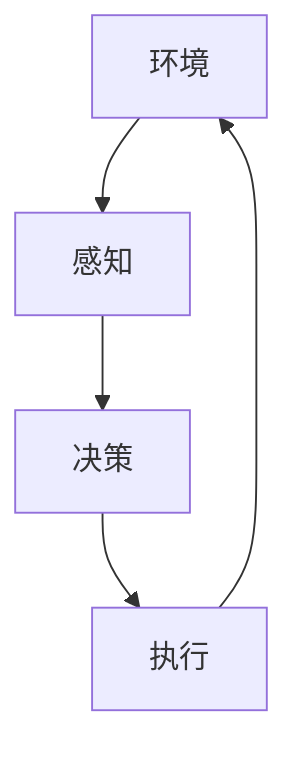
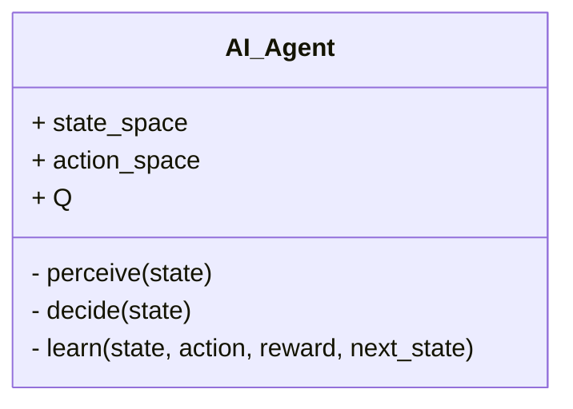
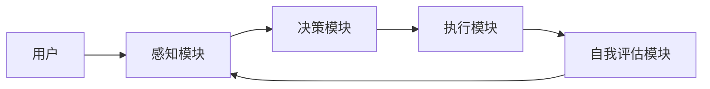
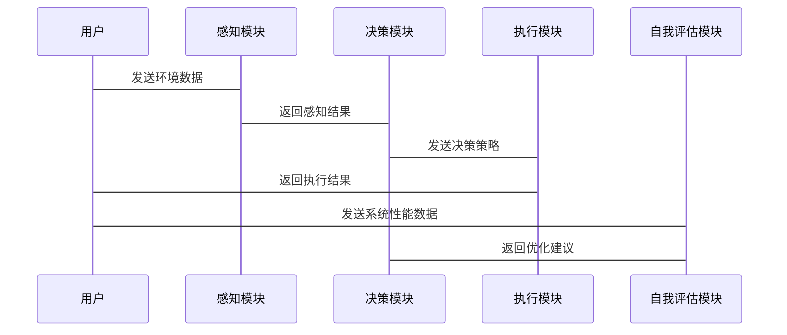

                 


# 构建具有自我评估与优化能力的AI Agent系统

> 关键词：AI Agent，自我评估，优化能力，系统设计，算法原理

> 摘要：本文详细探讨了构建具有自我评估与优化能力的AI Agent系统的各个方面，从核心概念到算法原理，从系统设计到项目实战，全面解析如何设计和实现一个能够自我改进的智能系统。

---

## 第1章 AI Agent系统背景与概念

### 1.1 AI Agent的基本概念

AI Agent（智能体）是指能够感知环境、做出决策并采取行动以实现目标的实体。它可以是一个软件程序、机器人或其他智能系统。AI Agent的核心功能包括感知、决策、执行和学习。

#### 1.1.1 AI Agent的分类

AI Agent可以分为以下几类：
- **简单反射型Agent**：基于当前感知做出反应，不依赖历史信息。
- **基于模型的反射型Agent**：利用内部模型来推理和决策。
- **目标驱动型Agent**：基于明确的目标采取行动。
- **效用驱动型Agent**：通过最大化效用函数来优化决策。

#### 1.1.2 AI Agent的核心功能

AI Agent的核心功能包括：
- **感知**：通过传感器或其他输入方式获取环境信息。
- **决策**：基于感知信息进行推理和决策。
- **执行**：根据决策结果执行动作。
- **学习**：通过经验改进性能。

### 1.2 自我评估与优化能力的重要性

#### 1.2.1 自我评估的定义

自我评估是指AI Agent能够对自身的性能进行分析，并识别改进的空间。这种能力使得AI Agent能够不断优化自身的决策和执行过程。

#### 1.2.2 优化能力的必要性

优化能力是AI Agent自我改进的核心。通过优化，AI Agent可以在复杂环境中更好地适应变化，提高效率和准确性。

#### 1.2.3 自我评估与优化的结合

将自我评估与优化结合，可以使AI Agent具备闭环改进的能力。它能够主动识别问题、分析原因，并采取优化措施。

### 1.3 当前AI Agent系统的现状

#### 1.3.1 现有系统的优缺点

现有AI Agent系统的优势包括高效性和准确性，但其局限性在于缺乏自我改进能力，难以应对动态变化的环境。

#### 1.3.2 AI Agent的应用场景

AI Agent广泛应用于智能助手、推荐系统、自动驾驶等领域。

#### 1.3.3 当前技术的瓶颈

当前AI Agent系统的瓶颈主要在于如何实现真正的自我评估与优化能力。

### 1.4 本书的目标与结构

#### 1.4.1 本书的目标

本书旨在帮助读者掌握构建具有自我评估与优化能力的AI Agent系统的方法。

#### 1.4.2 本书的结构安排

本书分为七章，内容涵盖背景、核心概念、算法原理、系统设计、项目实战等。

#### 1.4.3 学习本书的建议

读者应具备一定的编程和AI基础，并熟悉Python和相关框架。

---

## 第2章 AI Agent系统的组成与核心概念

### 2.1 AI Agent的组成模块

AI Agent系统由以下模块组成：
- **感知模块**：负责获取环境信息。
- **决策模块**：基于感知信息进行推理和决策。
- **执行模块**：根据决策结果执行动作。
- **自我评估模块**：对系统性能进行评估和优化。

#### 2.1.1 感知模块

感知模块通过传感器或API获取环境数据，并将其传递给决策模块。

#### 2.1.2 决策模块

决策模块利用感知数据和内部模型进行推理，生成决策策略。

#### 2.1.3 执行模块

执行模块根据决策结果采取行动，可能是调用API或控制物理设备。

#### 2.1.4 自我评估模块

自我评估模块对系统性能进行分析，并提出优化建议。

### 2.2 核心概念的属性对比

以下是各模块的核心属性对比：

| 模块         | 输入          | 输出          | 功能描述                                   |
|--------------|---------------|---------------|--------------------------------------------|
| 感知模块     | 环境数据       | 感知结果       | 获取并处理环境信息                         |
| 决策模块     | 感知结果       | 决策策略       | 基于感知结果进行推理和决策                 |
| 执行模块     | 决策策略       | 系统状态变化    | 根据决策结果执行动作                       |
| 自我评估模块 | 系统性能数据   | 优化建议       | 分析系统性能并提出优化方案                 |

### 2.3 实体关系图（ER图）

以下是AI Agent系统的实体关系图：

```mermaid
er
actor(AI Agent) {
  id
  name
}
```

---

## 第3章 AI Agent系统的算法原理

### 3.1 算法原理概述

AI Agent的自我评估与优化能力依赖于多种算法，包括强化学习和监督学习。

#### 3.1.1 强化学习

强化学习是一种通过试错机制优化决策的算法。AI Agent通过与环境交互，学习最优策略。

#### 3.1.2 监督学习

监督学习通过标注数据训练模型，使其能够预测新数据的标签。

### 3.2 强化学习的实现步骤

以下是强化学习的实现步骤：



### 3.3 强化学习的数学模型

强化学习的核心是Q-learning算法，其数学模型如下：

$$ Q(s, a) = r + \gamma \max Q(s', a') $$

其中：
- \( Q(s, a) \) 表示在状态 \( s \) 下采取行动 \( a \) 的价值。
- \( r \) 表示奖励。
- \( \gamma \) 表示折扣因子。
- \( s' \) 表示下一个状态。

### 3.4 Python代码实现

以下是强化学习的Python代码示例：

```python
import numpy as np

class AI_Agent:
    def __init__(self, state_space, action_space):
        self.state_space = state_space
        self.action_space = action_space
        self.Q = np.zeros((state_space, action_space))

    def perceive(self, state):
        return state

    def decide(self, state):
        return np.argmax(self.Q[state])

    def learn(self, state, action, reward, next_state):
        self.Q[state, action] += reward + 0.9 * np.max(self.Q[next_state])
```

---

## 第4章 AI Agent系统的系统设计

### 4.1 系统分析与设计

AI Agent系统的设计需要考虑以下几个方面：
- **功能需求**：系统的功能模块设计。
- **性能需求**：系统的响应速度和准确性。
- **安全性需求**：系统的数据安全和隐私保护。

#### 4.1.1 系统功能设计

以下是系统功能模块的类图：



#### 4.1.2 系统架构设计

以下是系统架构设计的架构图：



### 4.2 接口设计与交互流程

#### 4.2.1 接口设计

AI Agent系统需要与外部环境进行交互，接口设计需要考虑数据的输入和输出格式。

#### 4.2.2 交互流程

以下是交互流程的序列图：



---

## 第5章 项目实战：构建具有自我评估与优化能力的AI Agent系统

### 5.1 环境安装

#### 5.1.1 安装Python

安装Python 3.8及以上版本。

#### 5.1.2 安装TensorFlow

使用以下命令安装TensorFlow：

```bash
pip install tensorflow
```

### 5.2 核心代码实现

以下是AI Agent系统的核心代码实现：

```python
import numpy as np

class AI_Agent:
    def __init__(self, state_space, action_space):
        self.state_space = state_space
        self.action_space = action_space
        self.Q = np.zeros((state_space, action_space))

    def perceive(self, state):
        return state

    def decide(self, state):
        return np.argmax(self.Q[state])

    def learn(self, state, action, reward, next_state):
        self.Q[state, action] += reward + 0.9 * np.max(self.Q[next_state])
```

### 5.3 代码解读与分析

#### 5.3.1 类初始化

在类初始化时，创建Q值数组，用于存储状态-动作对的价值。

#### 5.3.2 感知模块

`perceive`方法接收当前状态，并返回感知结果。

#### 5.3.3 决策模块

`decide`方法根据当前状态，选择最优动作。

#### 5.3.4 学习模块

`learn`方法更新Q值数组，实现强化学习。

### 5.4 实际案例分析

假设我们构建一个简单的AI Agent，用于优化交通灯控制。

#### 5.4.1 环境描述

交通灯系统由多个路口组成，AI Agent需要根据交通流量调整绿灯和红灯的时间。

#### 5.4.2 代码实现

以下是优化后的代码：

```python
class Traffic_Light_Controller(AI_Agent):
    def __init__(self, num_intersections):
        super().__init__(num_intersections, 2)
        self.num_intersections = num_intersections

    def perceive(self, state):
        return state

    def decide(self, state):
        return super().decide(state)

    def learn(self, state, action, reward, next_state):
        super().learn(state, action, reward, next_state)
```

#### 5.4.3 案例分析

通过训练，AI Agent能够根据交通流量自动调整绿灯和红灯的时间，减少拥堵。

### 5.5 项目小结

通过本项目，我们掌握了AI Agent系统的核心模块设计和实现方法。

---

## 第6章 总结与展望

### 6.1 总结

本文详细讲解了构建具有自我评估与优化能力的AI Agent系统的方法。

### 6.2 展望

未来的研究方向包括更复杂的优化算法和多智能体协作。

---

## 作者信息

作者：AI天才研究院/AI Genius Institute & 禅与计算机程序设计艺术 /Zen And The Art of Computer Programming

---

以上是《构建具有自我评估与优化能力的AI Agent系统》的技术博客文章的完整内容。

