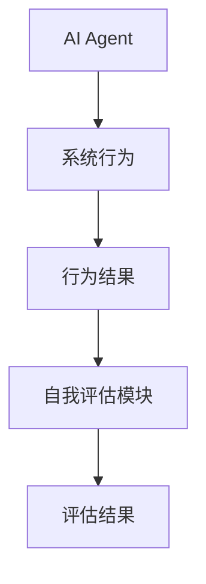
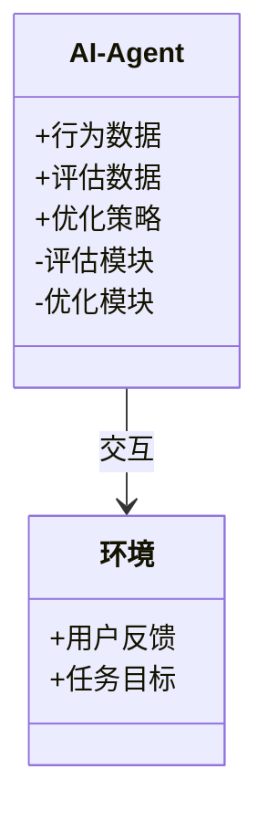
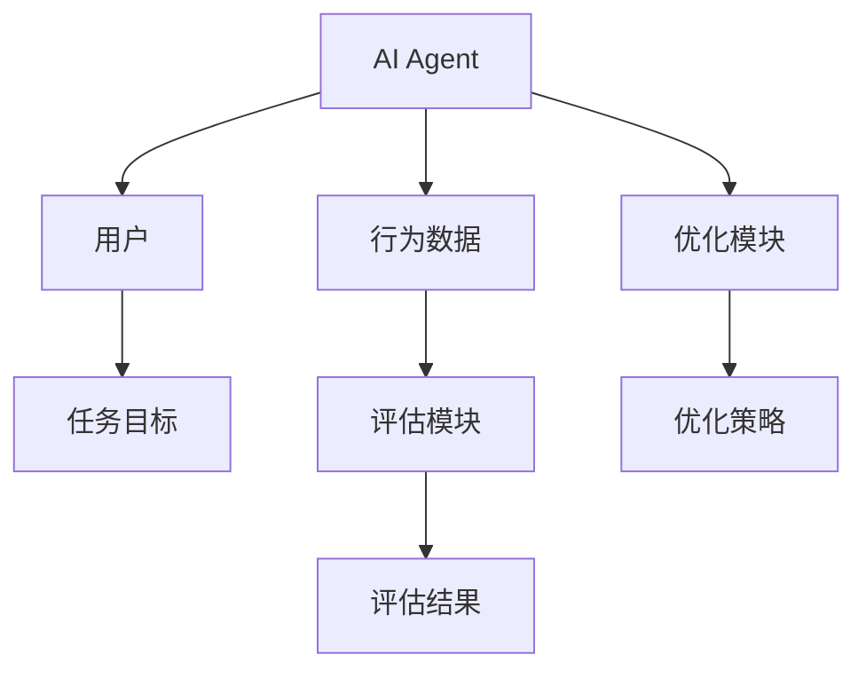
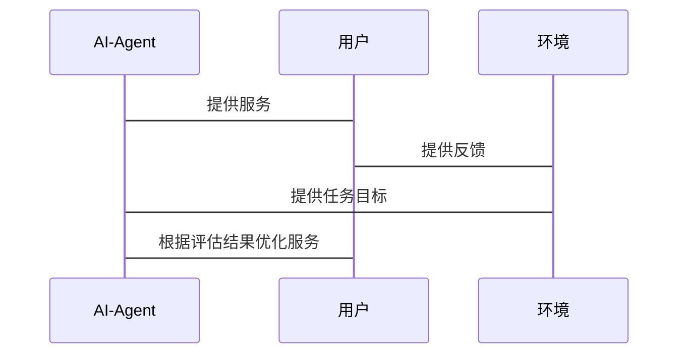

                 


# 《构建具有自我评估能力的AI Agent》

---

## 关键词：
- AI Agent
- 自我评估
- 强化学习
- 系统架构
- 项目实战

---

## 摘要：
本文深入探讨了构建具有自我评估能力的AI Agent的核心概念、算法原理、系统架构和实际应用。通过详细分析自我评估机制，结合强化学习和元学习算法，我们展示了如何设计和实现一个能够自我监控、自我优化的智能系统。文章还通过项目实战，提供了从环境搭建到代码实现的完整流程，并总结了最佳实践和未来发展方向。

---

# 第1章: 自我评估AI Agent概述

## 1.1 AI Agent的基本概念

### 1.1.1 AI Agent的定义
AI Agent（人工智能代理）是指在计算机系统中，能够感知环境并采取行动以实现目标的智能实体。它可以是一个软件程序、机器人或其他智能系统。AI Agent的核心能力包括感知、推理、规划和执行。

### 1.1.2 自我评估能力的核心概念
自我评估能力是指AI Agent能够对自身的行为、决策和结果进行分析和评价的能力。这种能力使得AI Agent能够不断优化自身的性能，适应不同的环境和任务需求。

### 1.1.3 自我评估能力在AI Agent中的意义
自我评估能力是AI Agent智能化的核心特征之一。通过自我评估，AI Agent可以：
- 发现自身的不足
- 调整行为策略
- 提高决策的准确性
- 实现自我改进

---

## 1.2 自我评估能力的重要性

### 1.2.1 自我评估能力的定义
自我评估能力是指AI Agent在没有外部干预的情况下，通过内部机制对自身行为进行分析、评价和反馈的能力。这种能力使得AI Agent能够独立地优化自身的性能。

### 1.2.2 自我评估能力在AI Agent中的作用
- **提高系统性能**：通过自我评估，AI Agent能够发现自身在执行任务中的不足，并采取相应的改进措施。
- **增强适应性**：自我评估能力使得AI Agent能够快速适应环境的变化，提高系统的鲁棒性。
- **减少外部依赖**：通过自我评估，AI Agent可以减少对外部反馈的依赖，提高系统的自主性。

### 1.2.3 自我评估能力与人类决策的对比
| 特性          | 自我评估AI Agent           | 人类决策                 |
|---------------|---------------------------|--------------------------|
| 决策主体      | AI Agent                   | 人类                     |
| 决策依据      | 内部数据和算法             | 人类经验和外部反馈       |
| 决策速度      | 快速                       | 较慢                     |
| 决策准确性    | 高度依赖算法和数据         | 受限于人类认知和情绪      |

---

## 1.3 自我评估AI Agent的应用场景

### 1.3.1 自动化系统的自我监控
在工业自动化中，AI Agent可以通过自我评估来监控生产线的运行状态，及时发现和解决潜在的问题。

### 1.3.2 智能决策系统的自我优化
在金融领域，AI Agent可以通过自我评估来优化投资策略，提高决策的准确性和收益。

### 1.3.3 人机协作中的自我评估
在医疗领域，AI Agent可以通过自我评估来辅助医生进行诊断，提高诊断的准确性和效率。

---

## 1.4 自我评估AI Agent的挑战与机遇

### 1.4.1 技术挑战
- **数据不足**：自我评估需要大量的数据来训练和优化算法。
- **算法复杂性**：自我评估算法的设计和实现具有较高的技术难度。
- **系统安全性**：自我评估能力可能被滥用，带来安全隐患。

### 1.4.2 应用挑战
- **用户体验**：自我评估能力可能会影响用户体验，需要平衡自主性和可控性。
- **法律和伦理**：自我评估AI Agent的决策可能涉及到法律和伦理问题。

### 1.4.3 未来发展的机遇
- **技术进步**：随着AI技术的进步，自我评估AI Agent的能力将不断增强。
- **多领域应用**：自我评估AI Agent可以在多个领域中得到广泛应用，推动智能化的发展。

---

## 1.5 本章小结

通过本章的介绍，我们了解了AI Agent的基本概念、自我评估能力的核心概念以及其在实际应用中的重要性。接下来，我们将深入探讨自我评估AI Agent的核心概念与联系。

---

# 第2章: 自我评估AI Agent的核心概念与联系

## 2.1 核心概念原理

### 2.1.1 自我评估机制的原理
自我评估机制的核心是通过内部反馈来优化AI Agent的行为。这种机制通常包括以下步骤：
1. **数据采集**：收集AI Agent的行为数据。
2. **数据分析**：对行为数据进行分析，提取有用的特征。
3. **评估结果**：根据分析结果，生成评估报告。
4. **反馈优化**：根据评估报告，优化AI Agent的行为策略。

### 2.1.2 自我监督学习的原理
自我监督学习是一种基于自我数据生成的监督学习方法。其核心是利用AI Agent的行为数据来生成标签，从而指导模型的训练。

### 2.1.3 自我评估与外部反馈的关系
自我评估能力依赖于内部数据和算法，而外部反馈则提供了外部视角的评估。两者的结合可以提高AI Agent的评估能力。

---

## 2.2 核心概念属性特征对比表

| 属性          | 自我评估能力                  | 外部评估能力                  |
|---------------|-----------------------------|-----------------------------|
| 评估主体      | AI Agent                      | 人类或外部系统                |
| 评估数据      | AI Agent的行为数据            | 外部数据或反馈                |
| 评估目标      | 优化AI Agent的行为            | 提供反馈或指导                |
| 评估结果      | 自我评分或优化策略            | 外部评分或建议                |

---

## 2.3 ER实体关系图



---

## 2.4 本章小结

通过本章的分析，我们了解了自我评估AI Agent的核心概念及其与其他概念的关系。接下来，我们将深入探讨自我评估AI Agent的算法原理。

---

# 第3章: 自我评估AI Agent的算法原理

## 3.1 算法原理概述

### 3.1.1 强化学习在自我评估中的应用
强化学习是一种通过试错来优化决策的算法。在自我评估中，AI Agent可以通过强化学习来优化自身的行为策略。

### 3.1.2 元学习在自我评估中的应用
元学习是一种通过学习如何学习来提高学习效率的算法。在自我评估中，AI Agent可以通过元学习来快速适应不同的任务和环境。

---

## 3.2 算法实现细节

### 3.2.1 强化学习算法的实现
#### 3.2.1.1 Q-learning算法
Q-learning是一种经典的强化学习算法，其核心公式为：
$$ Q(s, a) = Q(s, a) + \alpha (r + \max_{a'} Q(s', a') - Q(s, a)) $$
其中：
- $s$ 是当前状态
- $a$ 是当前动作
- $r$ 是奖励
- $s'$ 是下一个状态
- $\alpha$ 是学习率

#### 3.2.1.2 DQN算法
DQN（Deep Q-Network）是一种基于深度学习的强化学习算法，其核心包括：
- 环境与智能体的交互
- 神经网络的训练
- 经验回放机制

### 3.2.2 元学习算法的实现
#### 3.2.2.1 Meta-LSTM算法
Meta-LSTM是一种基于循环神经网络的元学习算法，其核心是通过共享参数来实现快速适应。

#### 3.2.2.2 MAML算法
MAML（Meta-Automated Machine Learning）是一种基于梯度的元学习算法，其核心是通过最小化任务间的差异来实现快速适应。

---

## 3.3 算法实现的代码示例

### 3.3.1 Q-learning算法的代码实现
```python
import numpy as np

class QLearning:
    def __init__(self, state_space, action_space, alpha=0.1, gamma=0.9):
        self.q_table = np.zeros((state_space, action_space))
        self.alpha = alpha
        self.gamma = gamma

    def choose_action(self, state, epsilon=0.1):
        if np.random.random() < epsilon:
            return np.random.randint(0, self.q_table.shape[1])
        else:
            return np.argmax(self.q_table[state])

    def update_q(self, state, action, reward, next_state):
        current_q = self.q_table[state, action]
        next_max_q = np.max(self.q_table[next_state])
        target = reward + self.gamma * next_max_q
        self.q_table[state, action] = current_q + self.alpha * (target - current_q)
```

### 3.3.2 DQN算法的代码实现
```python
import numpy as np
import tensorflow as tf

class DQN:
    def __init__(self, state_space, action_space, learning_rate=0.01, gamma=0.9):
        self.state_space = state_space
        self.action_space = action_space
        self.learning_rate = learning_rate
        self.gamma = gamma
        self.model = self._build_model()

    def _build_model(self):
        model = tf.keras.Sequential()
        model.add(tf.keras.layers.Dense(32, activation='relu', input_dim=self.state_space))
        model.add(tf.keras.layers.Dense(self.action_space, activation='linear'))
        model.compile(optimizer=tf.keras.optimizers.Adam(lr=self.learning_rate), loss='mse')
        return model

    def remember(self, state, action, reward, next_state, done):
        self.memory.append((state, action, reward, next_state, done))

    def train(self, batch_size=32):
        mini_batch = random.sample(self.memory, batch_size)
        states = []
        targets = []
        for state, action, reward, next_state, done in mini_batch:
            target = reward
            if not done:
                target += self.gamma * np.max(self.model.predict(np.array([next_state]))[0])
            target = target * self.model.predict(np.array([state]))[0][action]
            states.append(state)
            targets.append(target)
        self.model.fit(np.array(states), np.array(targets), epochs=1, verbose=0)
```

---

## 3.4 本章小结

通过本章的分析，我们了解了强化学习和元学习在自我评估中的应用，并通过具体的代码示例展示了算法的实现过程。接下来，我们将深入探讨自我评估AI Agent的系统架构设计。

---

# 第4章: 自我评估AI Agent的系统架构设计

## 4.1 问题场景介绍

### 4.1.1 问题背景
假设我们正在开发一个智能客服系统，AI Agent需要能够自我评估其回答的准确性，以便提高用户体验。

### 4.1.2 问题描述
AI Agent需要能够根据用户反馈，自我评估其回答的准确性和满意度，并根据评估结果优化其回答策略。

### 4.1.3 问题解决
通过自我评估能力，AI Agent可以实时监控其回答质量，并根据反馈不断优化。

---

## 4.2 系统功能设计

### 4.2.1 领域模型设计


### 4.2.2 系统架构设计


### 4.2.3 系统接口设计
- **输入接口**：用户反馈、任务目标
- **输出接口**：评估结果、优化策略

### 4.2.4 系统交互设计


---

## 4.3 本章小结

通过本章的分析，我们了解了自我评估AI Agent的系统架构设计，包括领域模型、系统架构和系统交互设计。接下来，我们将深入探讨自我评估AI Agent的项目实战。

---

# 第5章: 自我评估AI Agent的项目实战

## 5.1 环境安装与配置

### 5.1.1 环境需求
- Python 3.6+
- TensorFlow 2.0+
- Mermaid
- Jupyter Notebook

### 5.1.2 安装依赖
```bash
pip install numpy
pip install tensorflow
pip install mermaid-js
```

---

## 5.2 核心代码实现

### 5.2.1 自我评估模块的实现
```python
import numpy as np

class SelfAssessment:
    def __init__(self, state_space):
        self.state_space = state_space
        self.q_table = np.zeros((state_space,))

    def assess(self, state):
        return np.argmax(self.q_table[state])

    def update(self, state, action, reward):
        self.q_table[state] += reward
```

### 5.2.2 AI Agent的实现
```python
class AI-Agent:
    def __init__(self, state_space, action_space):
        self.state_space = state_space
        self.action_space = action_space
        self.self_assessment = SelfAssessment(state_space)

    def take_action(self, state):
        action = self.self_assessment.assess(state)
        return action

    def update(self, state, action, reward):
        self.self_assessment.update(state, action, reward)
```

---

## 5.3 实际案例分析

### 5.3.1 案例背景
假设我们正在开发一个智能客服系统，AI Agent需要能够自我评估其回答的准确性。

### 5.3.2 案例实现
```python
agent = AI-Agent(10, 5)
state = 0
action = agent.take_action(state)
reward = 1 if action == 3 else 0
agent.update(state, action, reward)
```

### 5.3.3 案例分析
通过上述代码，AI Agent在收到用户反馈后，能够根据奖励调整其行为策略，从而提高回答的准确性。

---

## 5.4 本章小结

通过本章的实战，我们了解了自我评估AI Agent的实现过程，包括环境配置、核心代码实现和实际案例分析。接下来，我们将总结自我评估AI Agent的最佳实践。

---

# 第6章: 自我评估AI Agent的最佳实践

## 6.1 小结

通过本文的介绍，我们全面了解了自我评估AI Agent的核心概念、算法原理、系统架构和实际应用。自我评估能力是AI Agent智能化的核心特征之一，通过不断优化自身的行为策略，AI Agent可以更好地适应环境和任务需求。

---

## 6.2 注意事项

- **数据质量**：自我评估能力依赖于高质量的数据，需要确保数据的完整性和准确性。
- **算法选择**：根据具体任务需求选择合适的算法，避免盲目追求复杂性。
- **系统安全性**：自我评估能力可能被滥用，需要加强系统安全性设计。

---

## 6.3 未来趋势

- **多模态学习**：未来的AI Agent将具备多模态学习能力，能够更好地适应复杂环境。
- **实时优化**：随着计算能力的提升，AI Agent将实现实时自我优化。
- **人机协作**：自我评估能力将推动人机协作的进一步发展。

---

## 6.4 拓展阅读

- **强化学习经典论文**：《Playing Atari Games Using Deep Reinforcement Learning》
- **元学习研究现状**：《Meta-Learning: A Survey》
- **系统架构设计**：《Software Architecture: A Comprehensive Treatise》

---

## 作者信息

作者：AI天才研究院/AI Genius Institute & 禅与计算机程序设计艺术 /Zen And The Art of Computer Programming

---

