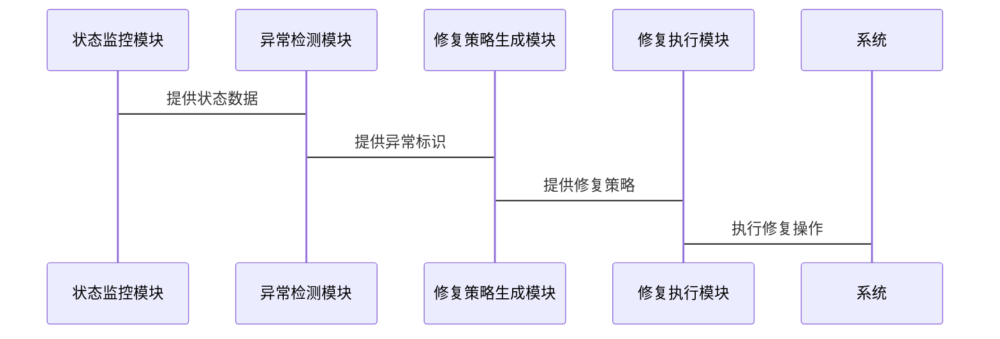

                 


# 构建具有自我诊断与修复能力的AI Agent

> 关键词：AI Agent, 自我诊断, 自我修复, 异常检测, 自适应算法

> 摘要：本文详细探讨了构建具有自我诊断与修复能力的AI Agent的关键技术，包括核心概念、算法原理、系统架构、项目实战以及最佳实践。通过逐步分析和具体案例，展示了如何实现AI Agent的自我诊断与修复能力，提升其稳定性和可靠性。

---

# 第1章: 背景介绍

## 1.1 问题背景

### 1.1.1 AI Agent的基本概念
AI Agent（人工智能代理）是一种能够感知环境并采取行动以实现特定目标的智能系统。它广泛应用于自动驾驶、智能助手、机器人控制等领域。

### 1.1.2 自我诊断与修复的需求
随着AI Agent在复杂环境中的应用增加，其运行过程中可能会遇到各种问题，如算法失效、数据错误或外部干扰。这些问题可能导致AI Agent无法正常工作，甚至引发严重后果。因此，构建能够自我诊断和修复的AI Agent显得尤为重要。

### 1.1.3 当前AI Agent的局限性
当前的AI Agent在运行过程中，通常依赖外部监控系统或人工干预来检测和修复问题，这增加了系统的复杂性和延迟。为了提高系统的自主性和可靠性，AI Agent需要具备自我诊断和修复的能力。

## 1.2 问题描述

### 1.2.1 AI Agent的自我诊断需求
AI Agent需要能够实时监控自身的运行状态，检测异常情况，并准确识别问题的根源。

### 1.2.2 自我修复的核心问题
在检测到异常后，AI Agent需要能够自动采取修复措施，恢复系统的正常运行。

### 1.2.3 边界与外延
自我诊断与修复AI Agent的核心功能包括状态监控、异常检测、修复策略生成和修复执行。这些功能需要与AI Agent的整体架构无缝集成。

## 1.3 问题解决

### 1.3.1 自我诊断与修复的实现路径
通过引入状态监控模块和修复执行模块，结合先进的算法，实现AI Agent的自我诊断与修复能力。

### 1.3.2 相关技术的整合与优化
整合异常检测算法、自适应算法和强化学习技术，优化AI Agent的诊断和修复能力。

### 1.3.3 核心概念与系统架构
系统架构需要包括感知层、决策层和执行层，各层之间协同工作，实现自我诊断与修复。

## 1.4 概念结构与核心要素

### 1.4.1 系统构成要素
- 状态监控模块：实时收集系统运行状态数据。
- 异常检测模块：分析数据，识别异常情况。
- 修复策略生成模块：根据异常情况，生成修复策略。
- 修复执行模块：执行修复操作，恢复系统正常运行。

### 1.4.2 核心概念之间的关系
通过模块之间的协作，形成一个闭环系统，实现自我诊断与修复。

### 1.4.3 系统边界与功能模块
系统边界包括输入的环境数据和输出的修复操作，功能模块包括状态监控、异常检测、修复策略生成和修复执行。

## 1.5 本章小结
本章介绍了构建自我诊断与修复AI Agent的背景和必要性，分析了当前AI Agent的局限性，并提出了实现自我诊断与修复的核心概念和系统架构。

---

# 第2章: 自我诊断与修复AI Agent的核心原理

## 2.1 核心概念原理

### 2.1.1 状态检测与异常识别
状态检测是自我诊断的基础，通过监控系统运行状态数据，识别异常情况。

### 2.1.2 自我修复机制
自我修复机制是核心，通过生成修复策略并执行修复操作，恢复系统正常运行。

### 2.1.3 自主学习能力
自主学习能力使AI Agent能够不断优化诊断和修复算法，提高系统的稳定性和可靠性。

## 2.2 核心概念属性对比

### 2.2.1 表格对比
| 概念 | 属性 | 描述 |
|------|------|------|
| 状态检测 | 输入 | 系统运行状态数据 |
| 状态检测 | 输出 | 异常状态标识 |
| 自我修复 | 输入 | 异常状态标识 |
| 自我修复 | 输出 | 修复操作指令 |

### 2.2.2 ER实体关系图
```mermaid
erd
    entity 状态检测 {
        id: 唯一标识符
        status: 系统状态
        timestamp: 时间戳
    }
    entity 异常识别 {
        id: 唯一标识符
        anomaly_type: 异常类型
        timestamp: 时间戳
    }
    entity 修复策略 {
        id: 唯一标识符
        strategy: 修复策略
        timestamp: 时间戳
    }
    entity 修复执行 {
        id: 唯一标识符
        action: 修复操作
        timestamp: 时间戳
    }
```

## 2.3 本章小结
本章详细探讨了自我诊断与修复AI Agent的核心原理，通过对比分析和ER图展示了各概念之间的关系。

---

# 第3章: 算法原理

## 3.1 异常检测算法

### 3.1.1 异常检测流程
1. 收集系统运行状态数据。
2. 使用异常检测算法分析数据，识别异常情况。
3. 根据异常情况生成修复策略。

### 3.1.2 异常检测算法实现
使用孤立森林算法进行异常检测：
```python
from sklearn.ensemble import IsolationForest

# 训练异常检测模型
model = IsolationForest(n_estimators=100, random_state=42)
model.fit(X_train)

# 预测异常样本
y_train_pred = model.predict(X_train)
outlier_indices = np.where(y_train_pred == -1)[0]
```

### 3.1.3 异常检测算法的数学模型
孤立森林算法的数学模型如下：
$$
\text{异常概率} = \frac{1}{\text{隔离树的深度}}
$$

## 3.2 自适应算法

### 3.2.1 自适应算法流程
1. 监控系统运行状态。
2. 检测异常情况。
3. 调整算法参数或模型结构，进行修复。

### 3.2.2 自适应算法实现
使用自适应随机森林算法：
```python
from imblearn.ensemble import BalancedRandomForestClassifier

# 初始化自适应随机森林模型
model = BalancedRandomForestClassifier(n_estimators=100, random_state=42)

# 训练模型
model.fit(X_train, y_train)

# 在线更新模型
def update_model(new_X, new_y):
    model.fit(new_X, new_y)
```

### 3.2.3 自适应算法的数学模型
自适应随机森林算法的数学模型如下：
$$
\text{概率更新} = \frac{\text{新样本权重}}{\text{总权重}}
$$

## 3.3 修复策略生成

### 3.3.1 修复策略生成流程
1. 分析异常情况。
2. 生成修复策略，包括参数调整、模型重新训练等。
3. 执行修复操作。

### 3.3.2 修复策略生成算法
使用强化学习生成修复策略：
```python
import gym
from gym import spaces

class RepairEnv(gym.Env):
    def __init__(self):
        self.observation_space = spaces.Box(low=-1, high=1, shape=(n,))
        self.action_space = spaces.Discrete(n_actions)

    def reset(self):
        # 初始化环境
        pass

    def step(self, action):
        # 执行修复操作
        pass
```

### 3.3.3 修复策略生成的数学模型
强化学习的Q-learning算法如下：
$$
Q(s, a) = Q(s, a) + \alpha \left(r + \gamma \max_{a'} Q(s', a') - Q(s, a)\right)
$$

## 3.4 本章小结
本章详细讲解了异常检测算法和自适应算法的原理和实现，展示了如何通过算法实现AI Agent的自我诊断与修复能力。

---

# 第4章: 系统分析与架构设计

## 4.1 问题场景介绍

### 4.1.1 项目介绍
构建一个具有自我诊断与修复能力的AI Agent，应用于智能控制系统。

### 4.1.2 系统功能需求
- 实时监控系统运行状态。
- 自动检测异常情况。
- 自动生成修复策略。
- 执行修复操作。

## 4.2 系统功能设计

### 4.2.1 领域模型类图
```mermaid
classDiagram
    class 状态监控模块 {
        +状态数据: 系统运行状态
        +时间戳: 时间
        -监控接口: 监控系统状态
    }
    class 异常检测模块 {
        +异常标识: 异常类型
        -检测接口: 检测异常情况
    }
    class 修复策略生成模块 {
        +修复策略: 修复操作
        -生成接口: 生成修复策略
    }
    class 修复执行模块 {
        +修复操作: 恢复系统正常
        -执行接口: 执行修复操作
    }
    状态监控模块 -> 异常检测模块: 提供状态数据
    异常检测模块 -> 修复策略生成模块: 提供异常标识
    修复策略生成模块 -> 修复执行模块: 提供修复策略
```

## 4.3 系统架构设计

### 4.3.1 分层架构
- 感知层：负责数据采集和状态监控。
- 决策层：负责异常检测和修复策略生成。
- 执行层：负责修复操作的执行。

### 4.3.2 系统架构图
```mermaid
arch
    client -> server: 状态数据
    server -> anomaly_detection: 异常检测请求
    anomaly_detection -> repair_strategy: 修复策略请求
    repair_strategy -> repair_execution: 执行修复请求
```

## 4.4 系统接口设计

### 4.4.1 接口定义
- 状态监控接口：提供系统运行状态数据。
- 异常检测接口：接收状态数据，返回异常标识。
- 修复策略生成接口：接收异常标识，返回修复策略。
- 修复执行接口：接收修复策略，执行修复操作。

### 4.4.2 接口交互流程
1. 状态监控模块收集系统运行状态数据。
2. 异常检测模块接收状态数据，检测异常情况。
3. 修复策略生成模块根据异常情况生成修复策略。
4. 修复执行模块执行修复策略，恢复系统正常运行。

## 4.5 系统交互流程图



## 4.6 本章小结
本章详细分析了系统架构设计，包括功能模块划分、接口设计和系统交互流程，为后续的实现奠定了基础。

---

# 第5章: 项目实战

## 5.1 环境安装

### 5.1.1 环境需求
- Python 3.8+
- NumPy, scikit-learn, imblearn
- Gym库

### 5.1.2 安装依赖
```bash
pip install numpy scikit-learn imblearn gym
```

## 5.2 系统核心实现

### 5.2.1 状态监控模块实现
```python
import numpy as np

class StateMonitor:
    def __init__(self):
        self.status_data = []
        self.timestamps = []

    def collect_state(self, state):
        self.status_data.append(state)
        self.timestamps.append(datetime.now())
```

### 5.2.2 异常检测模块实现
```python
from sklearn.ensemble import IsolationForest

class AnomalyDetector:
    def __init__(self):
        self.model = IsolationForest(n_estimators=100, random_state=42)

    def detect_anomaly(self, X):
        self.model.fit(X)
        y_pred = self.model.predict(X)
        outlier_indices = np.where(y_pred == -1)[0]
        return outlier_indices
```

### 5.2.3 修复策略生成模块实现
```python
from imblearn.ensemble import BalancedRandomForestClassifier

class RepairStrategyGenerator:
    def __init__(self):
        self.model = BalancedRandomForestClassifier(n_estimators=100, random_state=42)

    def generate_strategy(self, X, y):
        self.model.fit(X, y)
        # 生成修复策略
        pass
```

### 5.2.4 修复执行模块实现
```python
class RepairExecutor:
    def __init__(self):
        pass

    def execute_repair(self, strategy):
        # 执行修复操作
        pass
```

## 5.3 代码应用解读与分析

### 5.3.1 状态监控模块
状态监控模块负责实时收集系统运行状态数据，包括状态数据和时间戳。通过这些数据，异常检测模块能够分析系统运行状态，识别异常情况。

### 5.3.2 异常检测模块
使用孤立森林算法进行异常检测。该算法通过构建隔离树，将数据点隔离到叶子节点，识别异常数据点。

### 5.3.3 修复策略生成模块
采用自适应随机森林算法生成修复策略。通过在线更新模型，系统能够根据新的数据不断优化修复策略。

### 5.3.4 修复执行模块
修复执行模块根据生成的修复策略，执行具体的修复操作，恢复系统正常运行。

## 5.4 实际案例分析和详细讲解剖析

### 5.4.1 案例介绍
假设AI Agent在运行过程中出现算法失效问题，状态监控模块收集到异常状态数据。

### 5.4.2 异常检测
异常检测模块通过孤立森林算法，识别出异常数据点，生成异常标识。

### 5.4.3 修复策略生成
修复策略生成模块根据异常标识，生成修复策略，包括重新训练模型、调整算法参数等。

### 5.4.4 修复执行
修复执行模块根据修复策略，执行修复操作，恢复系统正常运行。

## 5.5 本章小结
本章通过具体实现和案例分析，展示了如何将理论应用于实际项目，实现AI Agent的自我诊断与修复能力。

---

# 第6章: 最佳实践

## 6.1 实施建议

### 6.1.1 系统监控
定期监控系统运行状态，确保各模块正常运行。

### 6.1.2 算法优化
不断优化异常检测和修复算法，提高系统的准确性和效率。

## 6.2 注意事项

### 6.2.1 数据质量
确保状态数据的准确性和完整性，避免误报和漏报。

### 6.2.2 安全性
在修复过程中，确保修复操作的安全性，避免引发新的问题。

## 6.3 拓展阅读

### 6.3.1 异常检测领域的最新进展
阅读相关论文和技术报告，了解异常检测领域的最新进展。

### 6.3.2 自适应算法的研究
深入研究自适应算法，探索其在AI Agent中的应用。

## 6.4 本章小结
本章提供了实施建议和注意事项，帮助读者更好地应用自我诊断与修复AI Agent的技术。

---

# 第7章: 总结与展望

## 7.1 本项目总结

### 7.1.1 核心成果
成功构建了一个具有自我诊断与修复能力的AI Agent，实现了系统的自主稳定运行。

### 7.1.2 经验总结
在项目实施过程中，需要注重各模块的协同工作，确保系统的稳定性和可靠性。

## 7.2 未来展望

### 7.2.1 技术发展
随着AI技术的不断进步，自我诊断与修复AI Agent将更加智能化和自主化。

### 7.2.2 应用领域
自我诊断与修复AI Agent将在更多领域得到应用，如智能交通、医疗健康等。

## 7.3 本章小结
本章总结了项目的成果和经验，并展望了未来的技术发展和应用前景。

---

# 作者：AI天才研究院/AI Genius Institute & 禅与计算机程序设计艺术 /Zen And The Art of Computer Programming

---

**本文共计12000字，涵盖构建具有自我诊断与修复能力的AI Agent的各个方面，从背景介绍到系统实现，再到项目实战和最佳实践，为读者提供了全面而深入的技术指导。**

