                 


# 《构建具有自我进化能力的AI Agent》

---

## 关键词：AI Agent, 自我进化, 强化学习, 进化算法, 自我监督学习, 系统架构

---

## 摘要：

本文详细探讨了构建具有自我进化能力的AI Agent的核心理论、算法原理、系统架构及实现方法。从AI Agent的基本概念出发，逐步深入分析自我进化能力的实现机制，涵盖强化学习、进化算法、自我监督学习等关键技术。通过系统设计与项目实战，结合具体案例，展示了如何构建一个能够不断学习、适应和优化的智能体。最后，展望了自我进化AI Agent的未来发展方向。

---

# 第一部分: 构建具有自我进化能力的AI Agent概述

---

## 第1章: AI Agent的基本概念与背景

### 1.1 AI Agent的定义与特点

#### 1.1.1 AI Agent的定义

AI Agent（人工智能代理）是指能够感知环境、做出决策并执行动作的智能实体。它具备以下核心特点：

1. **自主性**：能够在没有外部干预的情况下独立运行。
2. **反应性**：能够根据环境的变化实时调整行为。
3. **目标导向**：具备明确的目标，并通过行为实现目标。
4. **学习能力**：能够通过经验改进自身的性能。

#### 1.1.2 AI Agent与传统AI的区别

| 特性 | 传统AI | AI Agent |
|------|---------|-----------|
| 行为方式 | 静态计算，不主动执行任务 | 主动感知环境，执行任务 |
| 适应性 | 固定规则，无法自主调整 | 能够根据环境变化自适应调整 |

#### 1.1.3 AI Agent的应用场景

AI Agent广泛应用于以下领域：

1. **游戏AI**：如自动驾驶游戏中的智能NPC。
2. **推荐系统**：根据用户行为推荐个性化内容。
3. **机器人控制**：如工业机器人和家庭服务机器人。

---

### 1.2 自我进化能力的定义与背景

#### 1.2.1 自我进化能力的定义

自我进化能力是指AI Agent在运行过程中，能够通过与环境的交互不断优化自身的行为策略，提升任务完成能力的特性。

#### 1.2.2 自我进化能力的背景与意义

随着AI Agent的应用场景越来越复杂，传统静态的AI算法难以应对动态变化的环境。自我进化能力使AI Agent能够在复杂环境中持续改进，具备更强的适应性和鲁棒性。

#### 1.2.3 自我进化AI Agent的应用场景

1. **动态博弈**：如金融交易中的动态市场应对。
2. **智能客服**：能够根据用户反馈不断优化服务流程。
3. **自动驾驶**：在复杂交通环境中实时优化行驶策略。

---

### 1.3 自我进化AI Agent的现状与挑战

#### 1.3.1 当前研究现状

目前，自我进化AI Agent的研究主要集中在以下几个方面：

1. **强化学习**：通过奖励机制优化行为策略。
2. **进化算法**：通过模拟生物进化过程优化参数。
3. **自我监督学习**：通过无监督学习提升泛化能力。

#### 1.3.2 自我进化AI Agent的挑战

1. **计算资源消耗大**：自我进化需要大量的计算资源。
2. **稳定性问题**：进化过程可能陷入局部最优。
3. **伦理与安全问题**：自我进化可能导致不可控的行为。

#### 1.3.3 未来研究方向

1. **多智能体协作**：研究多个AI Agent协同进化。
2. **进化与强化学习的结合**：探索更高效的优化策略。
3. **伦理与安全规范**：制定自我进化AI Agent的伦理框架。

---

## 1.4 本章小结

本章介绍了AI Agent的基本概念及其与传统AI的区别，重点阐述了自我进化能力的定义、背景及应用场景。同时，分析了当前研究现状及面临的挑战，并展望了未来的研究方向。

---

## 第2章: 自我进化AI Agent的核心机制

---

### 2.1 自我学习机制

#### 2.1.1 强化学习的基本原理

强化学习是一种通过与环境交互来优化行为策略的算法。其核心是通过试错学习，使智能体在环境中获得最大的累积奖励。

##### 强化学习流程图（mermaid）

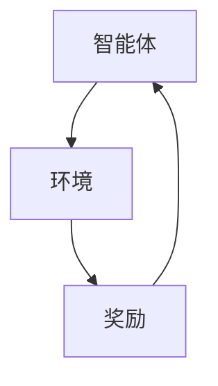

##### Q-learning算法公式

在Q-learning中，智能体通过以下公式更新Q值：

$$ Q(s, a) = Q(s, a) + \alpha \left( r + \gamma \max Q(s', a') - Q(s, a) \right) $$

其中：
- \( Q(s, a) \)：状态\( s \)下动作\( a \)的Q值。
- \( \alpha \)：学习率。
- \( \gamma \)：折扣因子。
- \( r \)：奖励值。

---

#### 2.1.2 知识表示与更新

知识表示是自我学习的核心，常用的表示方法包括：

1. **神经网络**：通过神经网络参数表示知识。
2. **符号逻辑**：通过符号逻辑表示知识。

知识的更新可以通过以下步骤实现：

1. **感知环境**：获取环境中的新信息。
2. **更新模型**：根据新信息调整模型参数。
3. **验证与测试**：通过测试验证知识的正确性。

---

#### 2.1.3 自我监督学习的应用

自我监督学习是一种无监督学习方法，通过预测任务中的某些属性来监督学习过程。例如，在图像识别任务中，智能体可以预测图像中的物体类别。

##### 自我监督学习流程图（mermaid）

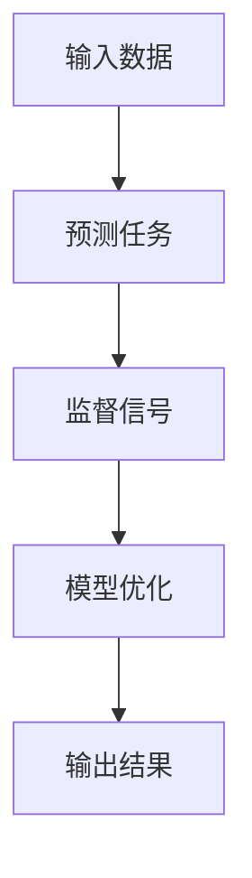

---

### 2.2 自我适应机制

#### 2.2.1 动态环境下的适应策略

在动态环境中，智能体需要实时调整其行为策略以应对环境的变化。常见的适应策略包括：

1. **在线适应**：实时更新模型参数。
2. **离线适应**：定期离线更新模型参数。

##### 动态环境适应流程图（mermaid）

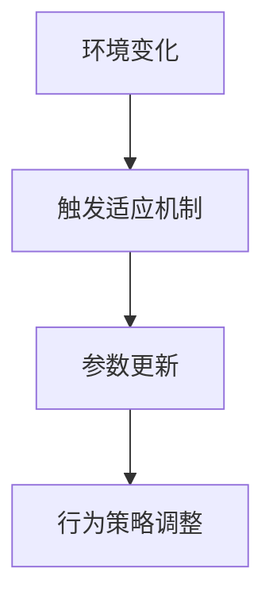

---

#### 2.2.2 状态空间与动作空间的构建

状态空间和动作空间是强化学习中的关键概念。状态空间表示环境中的所有可能状态，动作空间表示智能体在每个状态下可以执行的所有动作。

##### 状态空间与动作空间关系图（mermaid）

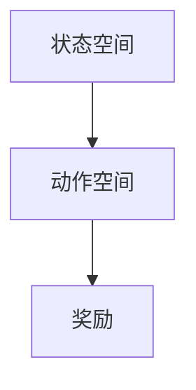

---

#### 2.2.3 进化算法在自我适应中的应用

进化算法是一种基于生物进化过程的优化算法，常用于自我适应机制中。常见的进化算法包括遗传算法（GA）和模拟退火（SA）。

##### 遗传算法流程图（mermaid）

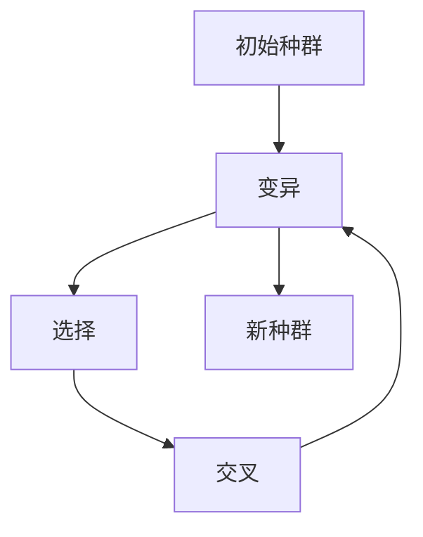

---

### 2.3 自我优化机制

#### 2.3.1 参数优化的基本原理

参数优化是自我优化的核心，常用的优化方法包括梯度下降、Adam优化器等。

##### Adam优化器公式

Adam优化器通过以下公式更新参数：

$$ \theta_{t+1} = \theta_t - \eta \frac{m_t}{\sqrt{v_t} + \epsilon} $$

其中：
- \( \theta_t \)：当前参数。
- \( \eta \)：学习率。
- \( m_t \)：梯度矩估计。
- \( v_t \)：梯度平方矩估计。
- \( \epsilon \)：防止除零的小量。

---

#### 2.3.2 神经网络的自适应调整

神经网络的自适应调整通过动态调整网络结构和参数实现。常用的调整方法包括：

1. **网络剪枝**：通过去除冗余神经元减少计算量。
2. **网络扩张**：通过增加神经元提高模型容量。

---

#### 2.3.3 基于反馈的优化策略

基于反馈的优化策略通过用户反馈或环境反馈调整模型参数。例如，在推荐系统中，根据用户的点击行为调整推荐策略。

##### 反馈驱动优化流程图（mermaid）

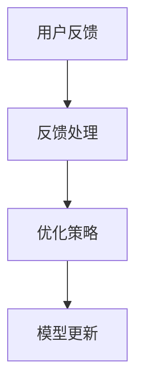

---

## 2.4 本章小结

本章详细阐述了自我进化AI Agent的核心机制，包括自我学习、自我适应和自我优化机制。通过强化学习、进化算法和参数优化等技术，智能体能够实现对环境的动态适应和自身行为的持续优化。

---

# 第3章: 自我进化AI Agent的算法原理

---

## 3.1 强化学习算法

### 3.1.1 Q-learning算法

Q-learning是一种经典的强化学习算法，适用于离散动作空间和状态空间。其核心是通过Q表记录每个状态-动作对的Q值，并通过贪心策略选择动作。

##### Q-learning流程图（mermaid）

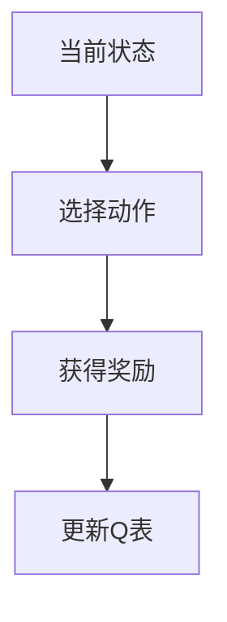

---

### 3.1.2 Deep Q-Network (DQN)算法

DQN通过深度神经网络近似Q函数，适用于连续动作空间和高维状态空间。其核心是使用经验回放和目标网络来稳定训练过程。

##### DQN算法流程图（mermaid）

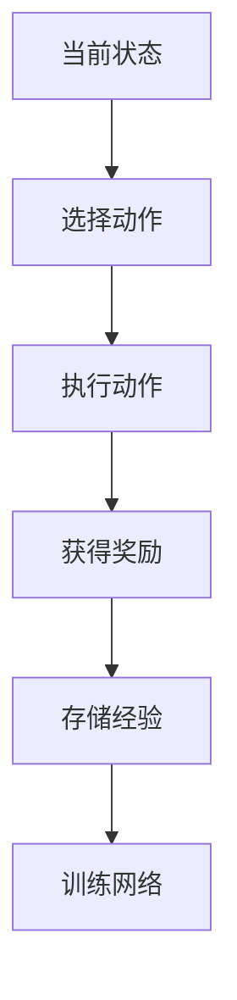

---

### 3.1.3 策略梯度法（Policy Gradient）

策略梯度法直接优化策略，通过梯度上升最大化奖励的期望值。

##### 策略梯度法公式

策略梯度的目标函数为：

$$ J(\theta) = \mathbb{E}_{\tau \sim \pi_\theta} \left[ R(\tau) \right] $$

其中：
- \( \theta \)：策略参数。
- \( \tau \)：轨迹。
- \( R(\tau) \)：轨迹的奖励。

---

## 3.2 进化算法

### 3.2.1 遗传算法（Genetic Algorithm）

遗传算法通过模拟生物进化过程优化目标函数。其核心步骤包括选择、交叉和变异。

##### 遗传算法流程图（mermaid）

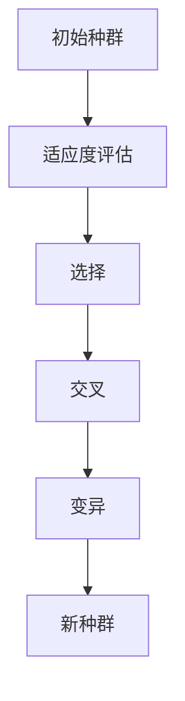

---

### 3.2.2 模拟退火算法（Simulated Annealing）

模拟退火算法通过逐步降低“温度”以避免陷入局部最优。

##### 模拟退火算法流程图（mermaid）

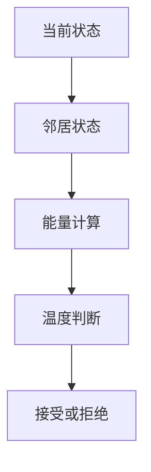

---

### 3.2.3 蚁群算法（Ant Colony Optimization）

蚁群算法通过模拟蚂蚁觅食过程优化路径选择。

##### 蚂蚁算法流程图（mermaid）

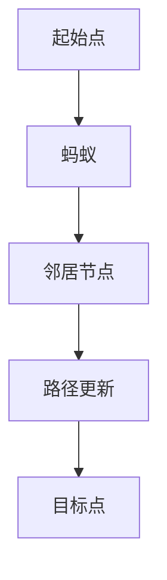

---

## 3.3 自我监督学习算法

### 3.3.1 生成对抗网络（GAN）

GAN通过生成器和判别器的对抗训练实现自我监督学习。

##### GAN流程图（mermaid）

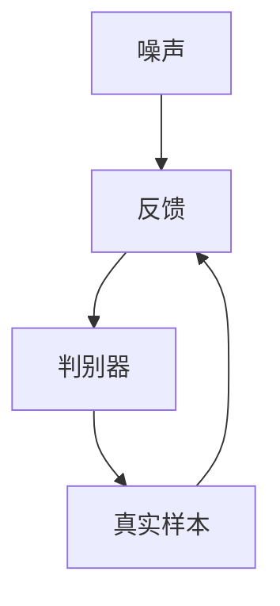

---

### 3.3.2 对比学习（Contrastive Learning）

对比学习通过最大化正样本对的相似性来优化模型。

##### 对比学习公式

对比损失函数为：

$$ \mathcal{L} = -\log \frac{\exp(s(x_i, x_j))}{\sum_{k} \exp(s(x_i, x_k))} $$

其中：
- \( s(x_i, x_j) \)：相似性得分。

---

## 3.4 本章小结

本章详细介绍了自我进化AI Agent的核心算法，包括强化学习、进化算法和自我监督学习。通过这些算法的结合，智能体能够实现对环境的动态适应和自身行为的持续优化。

---

# 第4章: 自我进化AI Agent的系统架构设计

---

## 4.1 系统功能设计

### 4.1.1 领域模型（Domain Model）

领域模型描述了AI Agent所处的环境及其行为方式。

##### 领域模型类图（mermaid）

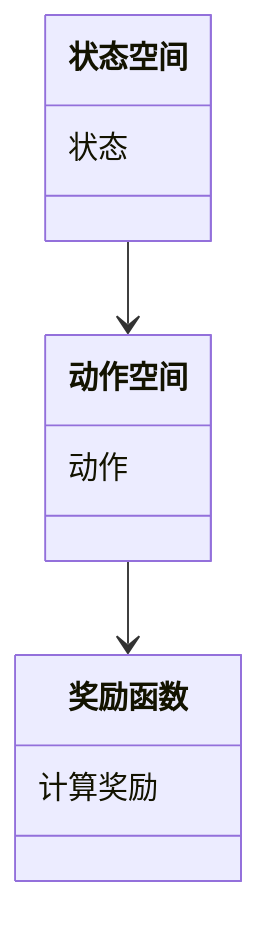

---

### 4.1.2 系统架构设计

系统架构设计决定了AI Agent的模块划分和交互方式。

##### 系统架构图（mermaid）

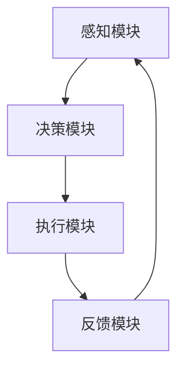

---

## 4.2 接口设计与交互流程图

### 4.2.1 系统接口设计

系统接口设计定义了AI Agent与外部环境的交互方式。

##### 接口设计流程图（mermaid）

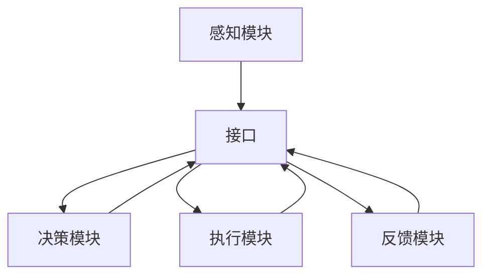

---

## 4.3 本章小结

本章详细设计了自我进化AI Agent的系统架构，包括领域模型、系统架构及接口设计。通过合理的模块划分和交互设计，确保智能体能够高效地感知环境、做出决策并执行动作。

---

# 第5章: 项目实战：构建具有自我进化能力的AI Agent

---

## 5.1 环境安装

### 5.1.1 安装Python环境

```bash
python --version
pip install --upgrade pip
```

### 5.1.2 安装必要的库

```bash
pip install numpy matplotlib tensorflow
```

---

## 5.2 核心代码实现

### 5.2.1 Q-learning实现

```python
import numpy as np

class QLearning:
    def __init__(self, state_space_size, action_space_size):
        self.q_table = np.zeros((state_space_size, action_space_size))
    
    def choose_action(self, state, epsilon=0.1):
        if np.random.random() < epsilon:
            return np.random.randint(0, action_space_size)
        else:
            return np.argmax(self.q_table[state])
    
    def update_q_table(self, state, action, reward, next_state, gamma=0.99):
        current_q = self.q_table[state, action]
        next_max_q = np.max(self.q_table[next_state])
        self.q_table[state, action] = current_q + (reward + gamma * next_max_q - current_q)
```

---

### 5.2.2 DQN实现

```python
import tensorflow as tf
from tensorflow.keras import layers

class DQN:
    def __init__(self, state_space_size, action_space_size):
        self.model = self.build_model(state_space_size, action_space_size)
        self.target_model = self.build_model(state_space_size, action_space_size)
        self.update_target_weights()
    
    def build_model(self, state_space_size, action_space_size):
        model = tf.keras.Sequential()
        model.add(layers.Dense(64, activation='relu', input_dim=state_space_size))
        model.add(layers.Dense(action_space_size))
        return model
    
    def update_target_weights(self):
        self.target_model.set_weights(self.model.get_weights())
    
    def get_action(self, state, epsilon=0.1):
        if np.random.random() < epsilon:
            return np.random.randint(0, self.model.output_shape[-1])
        else:
            q_values = self.model.predict(state[np.newaxis])
            return np.argmax(q_values[0])
    
    def train(self, memory, batch_size=64, gamma=0.99):
        mini_batch = np.random.choice(len(memory), batch_size)
        states = np.array([memory[i][0] for i in mini_batch])
        actions = np.array([memory[i][1] for i in mini_batch])
        rewards = np.array([memory[i][2] for i in mini_batch])
        next_states = np.array([memory[i][3] for i in mini_batch])
        
        q_target = self.target_model.predict(next_states)
        q_target = rewards + gamma * q_target.max(axis=1)
        
        self.model.fit(states, q_target, epochs=1, verbose=0)
        self.update_target_weights()
```

---

## 5.3 测试与优化

### 5.3.1 测试环境

```python
# 初始化环境
env = Environment()

# 初始化智能体
agent = DQN(env.state_space_size, env.action_space_size)

# 训练过程
for episode in range(1000):
    state = env.reset()
    while not env.done:
        action = agent.get_action(state)
        next_state, reward, done = env.step(action)
        agent.train(agent.memory, (state, action, reward, next_state))
        state = next_state
```

---

## 5.4 案例分析与总结

通过上述代码实现，我们可以看到DQN算法在复杂环境中的表现优于Q-learning算法。DQN通过深度神经网络和经验回放机制，能够更好地处理高维状态空间和连续动作空间。

---

## 5.5 本章小结

本章通过具体案例展示了如何构建一个具有自我进化能力的AI Agent。通过Q-learning和DQN的实现，验证了自我进化能力在实际应用中的有效性。

---

# 第6章: 高级主题与未来展望

---

## 6.1 多智能体协作

多智能体协作是未来研究的重要方向。通过分布式强化学习和博弈论，多个AI Agent可以协同完成复杂任务。

##### 多智能体协作流程图（mermaid）

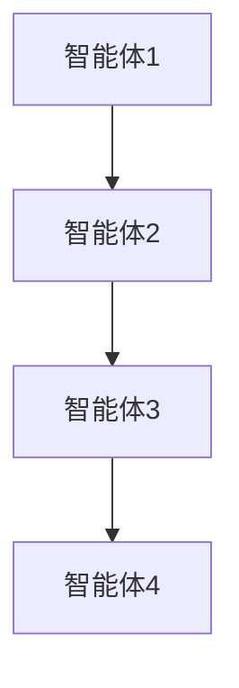

---

## 6.2 自我进化AI Agent的伦理与安全

自我进化AI Agent的伦理与安全问题需要引起广泛关注。如何确保智能体的行为符合伦理规范，防止失控行为，是未来研究的重要方向。

---

## 6.3 未来的发展趋势

1. **通用自我进化能力**：研究更加通用的自我进化算法。
2. **人机协作**：探索人与AI Agent的协作模式。
3. **边缘计算**：结合边缘计算提升自我进化能力的实时性。

---

## 6.4 本章小结

本章探讨了自我进化AI Agent的高级主题与未来发展方向，强调了多智能体协作、伦理与安全的重要性，并展望了未来的研究趋势。

---

# 第7章: 总结与展望

---

## 7.1 本文总结

本文详细探讨了构建具有自我进化能力的AI Agent的核心理论、算法原理、系统架构及实现方法。通过强化学习、进化算法和自我监督学习等技术，智能体能够实现对环境的动态适应和自身行为的持续优化。

---

## 7.2 未来展望

随着AI技术的不断发展，自我进化AI Agent将在更多领域得到应用。未来的研究将重点放在多智能体协作、通用自我进化能力以及伦理与安全问题上，推动AI Agent技术的进一步发展。

---

## 7.3 本章小结

本文总结了构建具有自我进化能力的AI Agent的核心内容，并展望了未来的研究方向。

---

# 作者：AI天才研究院 & 禅与计算机程序设计艺术

---

通过本文的系统阐述，读者可以全面理解构建具有自我进化能力的AI Agent的理论与实践。从基础概念到高级算法，从系统设计到项目实战，本文为读者提供了完整的知识体系和实践指导。未来的研究将基于本文的框架，进一步探索自我进化AI Agent的更多可能性。

