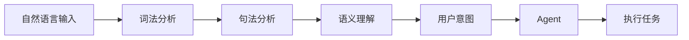
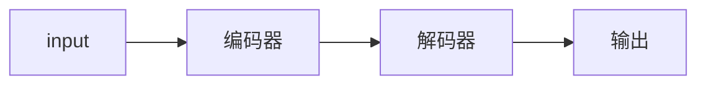
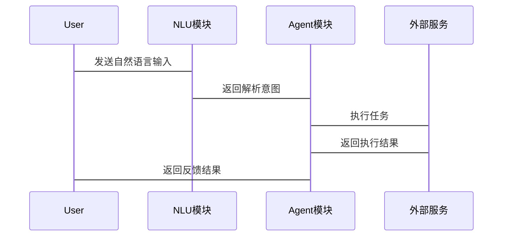

                 


# 构建具有自然语言理解能力的AI Agent

---

## 关键词

- 自然语言理解 (NLU)
- AI Agent
- 人机交互
- 智能系统
- 机器学习

---

## 摘要

本文详细探讨了构建具有自然语言理解能力的AI Agent的核心概念、算法原理、系统架构及实战项目。从NLU和AI Agent的基本原理出发，分析了它们在智能交互中的作用，详细讲解了基于预训练语言模型的NLU算法和对话生成算法，通过Mermaid图表展示了系统架构设计和接口设计，并通过实际案例展示了如何实现一个功能完善的AI Agent。本文适合AI开发者、软件架构师及技术爱好者阅读。

---

## 第一部分: 自然语言理解与AI Agent基础

### 第1章: 自然语言理解与AI Agent的背景介绍

#### 1.1 自然语言理解的核心概念

##### 1.1.1 问题背景与问题描述

自然语言理解（NLU）是人工智能领域的重要分支，旨在使计算机能够理解人类的自然语言输入。随着技术的发展，NLU的应用场景越来越广泛，如智能音箱、客服机器人、虚拟助手等。然而，NLU的实现并非一蹴而就，需要解决诸多挑战，例如歧义性、上下文理解、多语言支持等。

##### 1.1.2 问题解决方法与边界

为了实现NLU，常见的方法包括基于规则的系统和基于机器学习的系统。基于规则的系统依赖于预定义的语法规则，适用于特定场景，但灵活性较低。基于机器学习的系统通过训练数据学习语言模式，能够处理更复杂的任务，但需要大量数据和计算资源。

NLU的边界通常包括词法分析、句法分析和语义理解三个阶段。词法分析将文本分割成词语，句法分析确定词语之间的关系，语义理解则提取文本的含义。

##### 1.1.3 核心要素与概念结构

NLU的核心要素包括语言数据、语义解析模型和上下文管理。语言数据是NLU的基础，语义解析模型负责将语言数据转化为可操作的语义表示，上下文管理则用于处理多轮对话中的上下文信息。

#### 1.2 AI Agent的基本概念

##### 1.2.1 AI Agent的定义与特点

AI Agent（智能代理）是一种能够感知环境、自主决策并执行任务的实体。AI Agent可以是软件程序，也可以是物理设备，其特点是能够理解用户意图、主动执行任务并适应动态变化的环境。

##### 1.2.2 自然语言理解在AI Agent中的作用

NLU在AI Agent中的作用至关重要。它负责将用户的自然语言输入转化为可执行的指令，使AI Agent能够理解用户的意图并采取相应行动。

##### 1.2.3 AI Agent的应用场景与外延

AI Agent广泛应用于智能音箱、智能家居、客服机器人、自动驾驶等领域。随着技术进步，AI Agent的应用场景将更加多样化，例如教育辅助、医疗咨询、金融投资等。

#### 1.3 本章小结

本章介绍了NLU和AI Agent的基本概念，分析了NLU的核心要素和AI Agent的特点，为后续章节奠定了基础。

---

## 第二部分: 自然语言理解与AI Agent的核心概念

### 第2章: 自然语言理解与AI Agent的核心原理

#### 2.1 自然语言理解的原理

##### 2.1.1 NLU的基本原理

NLU的基本原理包括词法分析、句法分析和语义理解。词法分析将文本分割为词语，句法分析分析词语之间的关系，语义理解则提取文本的含义。

##### 2.1.2 NLU的关键技术与方法

NLU的关键技术包括词嵌入、句法分析、语义角色标注和意图识别。词嵌入技术如Word2Vec用于表示词语的语义信息，句法分析技术如依存句法分析用于理解句子结构，语义角色标注技术如角色标注用于分析句子成分，意图识别技术如基于规则的方法或机器学习方法用于识别用户意图。

##### 2.1.3 NLU的核心算法与实现

NLU的核心算法包括基于规则的方法和基于机器学习的方法。基于规则的方法通过预定义的规则进行文本分析，适用于特定场景；基于机器学习的方法通过训练数据学习语言模式，适用于复杂任务。

#### 2.2 AI Agent的执行机制

##### 2.2.1 Agent的感知与决策过程

AI Agent通过感知环境获取信息，基于感知信息进行决策并执行任务。感知过程包括接收用户输入、分析环境状态，决策过程包括理解用户意图、制定行动计划，执行过程包括调用服务、反馈结果。

##### 2.2.2 Agent与用户的交互方式

AI Agent与用户的交互方式包括文本交互和语音交互。文本交互通过输入框或命令行进行，语音交互通过麦克风或语音助手进行。交互过程通常包括用户输入、系统解析、系统反馈等步骤。

#### 2.3 自然语言理解与AI Agent的联系

##### 2.3.1 NLU在Agent中的角色

NLU在AI Agent中负责将用户的自然语言输入转化为可执行的指令，是AI Agent实现智能交互的核心模块。

##### 2.3.2 Agent如何利用NLU实现智能交互

AI Agent利用NLU进行意图识别、实体抽取和上下文管理，从而实现与用户的智能交互。例如，当用户说“我要订一张去北京的机票”，NLU模块将识别出用户的意图是“订票”，并将实体信息“北京”提取出来，供AI Agent执行订票任务。

#### 2.4 核心概念对比表

| 概念 | NLU | AI Agent |
|------|-----|----------|
| 输入 | 文本/语音 | 用户意图 |
| 输出 | 语义表示 | 行动指令 |
| 核心技术 | 词法分析、句法分析、语义理解 | 状态管理、决策逻辑 |
| 应用场景 | 智能音箱、客服机器人 | 自动化任务执行、智能交互 |

#### 2.5 实体关系图



---

## 第三部分: 自然语言理解与AI Agent的算法原理

### 第3章: 自然语言理解与对话生成算法原理

#### 3.1 自然语言理解算法

##### 3.1.1 基于预训练语言模型的NLU算法

预训练语言模型如BERT、GPT等通过大规模数据预训练，能够捕获语言的上下文信息，从而提高NLU的准确率。例如，使用BERT模型进行意图识别，可以通过输入特定的标签进行分类。

##### 3.1.2 NLU的数学模型与公式

意图分类可以使用逻辑回归、支持向量机（SVM）或深度学习模型。假设我们使用逻辑回归进行分类，其损失函数可以表示为：

$$ L = -\sum_{i=1}^{n} y_i \log p(y_i) + (1 - y_i) \log (1 - p(y_i)) $$

其中，$y_i$ 是真实标签，$p(y_i)$ 是模型预测的概率。

##### 3.1.3 算法实现与代码示例

以下是一个简单的NLU算法实现示例：

```python
def nlu_process(input_text):
    # 词法分析
    tokens = word_tokenize(input_text)
    # 句法分析
    pos_tags = pos_tag(tokens)
    # 语义理解
    intent = classify(pos_tags)
    return intent
```

#### 3.2 对话生成算法

##### 3.2.1 基于Seq2Seq模型的对话生成

Seq2Seq模型通过编码器和解码器结构生成对话回复。编码器将输入句子编码为向量，解码器根据编码向量生成输出句子。例如：



##### 3.2.2 对话生成的数学模型与公式

Seq2Seq模型的损失函数可以表示为交叉熵损失：

$$ L = -\sum_{i=1}^{n} y_i \log p(y_i) $$

其中，$y_i$ 是真实标签，$p(y_i)$ 是模型预测的概率。

##### 3.2.3 对话生成算法的代码实现

```python
def dialog_generate(input_text):
    # 编码器输入
    encoder_input = input_text
    # 解码器输出
    decoder_output = decode(encoder_input)
    return decoder_output
```

---

## 第四部分: 系统分析与架构设计

### 第4章: AI Agent的系统分析与架构设计

#### 4.1 问题场景介绍

AI Agent需要能够理解用户意图并执行相应任务。例如，用户说“我要订一张去北京的机票”，AI Agent需要理解用户的意图并调用订票服务。

#### 4.2 系统功能设计

系统功能包括用户输入处理、意图识别、任务执行和反馈输出。意图识别是关键模块，需要准确识别用户的意图并提取相关实体。

#### 4.3 系统架构设计

系统架构包括前端交互模块、后端业务逻辑模块和外部服务调用模块。前端交互模块负责接收用户输入并传递给NLU模块，后端业务逻辑模块负责解析意图并调用外部服务，外部服务调用模块负责执行具体任务并返回结果。

#### 4.4 系统接口设计

系统接口包括用户输入接口、意图识别接口和任务执行接口。意图识别接口需要与NLU模块对接，任务执行接口需要与外部服务对接。

#### 4.5 系统交互设计

系统交互包括用户输入、NLU解析、Agent执行和结果反馈。例如：



---

## 第五部分: 项目实战

### 第5章: 实战项目：构建一个简单的AI Agent

#### 5.1 环境安装与配置

安装必要的库，如Python的自然语言处理库（例如spaCy、NLTK）、深度学习框架（如TensorFlow、PyTorch）以及对话生成库（如Hugging Face的Transformers）。

#### 5.2 系统核心实现

##### 5.2.1 NLU模块实现

实现NLU模块，包括词法分析、句法分析和意图识别。例如：

```python
import spacy

nlp = spacy.load("en_core_web_sm")

def process_input(input_text):
    doc = nlp(input_text)
    # 词法分析
    tokens = [token.text for token in doc]
    # 句法分析
    pos_tags = [(token.text, token.pos_) for token in doc]
    # 意图识别
    intent = classify_intent(pos_tags)
    return intent, tokens, pos_tags
```

##### 5.2.2 Agent模块实现

实现AI Agent模块，包括意图解析、任务执行和反馈输出。例如：

```python
def agent_main():
    while True:
        input_text = input("请输入您的指令：")
        intent, tokens, pos_tags = process_input(input_text)
        if intent == "订票":
            book_ticket(tokens)
        elif intent == "查询天气":
            query_weather(pos_tags)
        # 其他intent处理
```

##### 5.2.3 对话生成实现

实现对话生成模块，例如使用预训练的Seq2Seq模型生成回复。例如：

```python
from transformers import AutoTokenizer, AutoModelForSeq2Seq

tokenizer = AutoTokenizer.from_pretrained("t5-base")
model = AutoModelForSeq2Seq.from_pretrained("t5-base")

def generate_response(input_text):
    inputs = tokenizer(input_text, return_tensors="pt")
    outputs = model.generate(inputs.input_ids)
    response = tokenizer.decode(outputs[0], skip_special_tokens=True)
    return response
```

#### 5.3 项目实战案例分析

##### 5.3.1 案例一：订票系统

用户输入：“我要订一张去北京的机票。”

NLU模块解析出意图是“订票”，并提取出实体“北京”。

Agent模块调用订票服务，执行订票操作。

##### 5.3.2 案例二：天气查询

用户输入：“北京天气怎么样？”

NLU模块解析出意图是“查询天气”，并提取出实体“北京”。

Agent模块调用天气查询服务，返回天气情况。

#### 5.4 项目小结

通过实战项目，我们可以看到NLU和AI Agent的结合能够实现智能交互，提升用户体验。然而，实际应用中还需要考虑更多复杂情况，例如多轮对话、上下文管理、错误处理等。

---

## 第六部分: 最佳实践与总结

### 第6章: 最佳实践与总结

#### 6.1 开发中的注意事项

在开发AI Agent时，需要注意数据质量、模型选择、性能优化和用户体验。数据质量直接影响NLU的准确性，模型选择需要根据任务需求进行调整，性能优化需要考虑计算资源，用户体验需要注重交互设计。

#### 6.2 测试与调试

测试是确保AI Agent正常运行的关键步骤。需要进行单元测试、集成测试和用户测试，确保每个模块都能协同工作。

#### 6.3 部署与维护

部署AI Agent需要选择合适的平台，例如云平台或本地服务器，并进行持续维护和更新，确保系统的稳定性和安全性。

#### 6.4 未来趋势

随着技术的发展，AI Agent将更加智能化和个性化。例如，结合情感计算、增强学习等技术，能够提供更人性化的服务。

#### 6.5 小结

本文详细探讨了构建具有自然语言理解能力的AI Agent的关键步骤，从理论到实践，为读者提供了全面的指导。通过不断学习和实践，我们可以开发出更智能、更高效的AI Agent。

---

## 作者

作者：AI天才研究院/AI Genius Institute  
& 禅与计算机程序设计艺术 /Zen And The Art of Computer Programming

