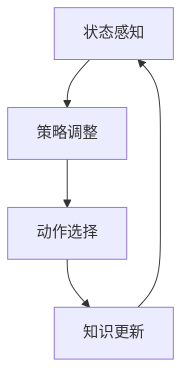

                 


# 《构建具有自适应学习策略的AI Agent》

## 关键词：
AI Agent, 自适应学习, 强化学习, 机器学习, 知识表示

## 摘要：
在快速变化的环境中，传统的AI Agent难以应对多样化的用户需求和动态环境的挑战。本文旨在探讨如何构建具有自适应学习策略的AI Agent，通过分析其核心概念、算法原理、系统架构设计，结合实际案例，详细阐述实现方法。文章从背景介绍、核心概念与联系、算法原理、系统分析与架构设计、项目实战等方面展开，为读者提供全面的技术指导。

---

## 第1章：自适应学习策略的背景与问题背景

### 1.1 问题背景

#### 1.1.1 人工智能与自适应学习的结合
AI Agent需要在动态环境中实时调整行为，以满足用户的多样化需求。自适应学习通过动态更新知识和策略，使AI Agent能够灵活应对变化。

#### 1.1.2 当前AI Agent的局限性
传统AI Agent通常基于静态知识库，难以处理环境和用户需求的变化，导致响应不够智能和灵活。

#### 1.1.3 自适应学习策略的必要性
自适应学习策略使AI Agent能够根据反馈和环境变化，实时调整学习策略，提升智能性和适应性。

### 1.2 问题描述

#### 1.2.1 AI Agent面临的动态环境挑战
动态环境中信息不完整、反馈延迟等问题，要求AI Agent具备动态调整策略的能力。

#### 1.2.2 用户需求的多样性与变化性
用户需求随时间变化，AI Agent需要实时调整策略以满足不同场景的需求。

#### 1.2.3 现有AI Agent的不足与改进方向
现有AI Agent难以应对复杂场景，改进方向包括动态知识更新和自适应策略调整。

### 1.3 问题解决

#### 1.3.1 自适应学习策略的核心思想
通过动态调整学习策略，实时优化AI Agent的行为，使其在复杂环境中表现更佳。

#### 1.3.2 策略调整的实现方式
基于反馈机制和强化学习，动态更新策略参数，实现自适应调整。

#### 1.3.3 自适应学习的实现路径
结合机器学习和强化学习，构建动态知识表示和自适应策略调整机制。

### 1.4 边界与外延

#### 1.4.1 自适应学习的边界条件
明确自适应学习的适用范围和限制，如实时性要求、资源限制等。

#### 1.4.2 自适应学习的外延应用
扩展至教育、医疗等领域，展示其广泛的应用潜力。

#### 1.4.3 自适应学习与其他AI技术的关系
与其他技术如知识图谱、自然语言处理等结合，形成更强大的AI系统。

### 1.5 概念结构与核心要素

#### 1.5.1 自适应学习的系统架构
展示系统架构图，说明感知模块、决策模块、学习模块和执行模块的关系。

#### 1.5.2 核心要素的对比分析
通过对比表格，展示传统学习与自适应学习在知识更新、策略调整等方面的差异。

#### 1.5.3 系统模块之间的关系
通过Mermaid图展示模块间的交互流程，说明知识表示、策略调整和执行反馈的过程。

---

## 第2章：自适应学习策略的核心概念与联系

### 2.1 自适应学习策略的定义与特点

#### 2.1.1 自适应学习的定义
自适应学习是指AI Agent根据环境和用户反馈，动态调整学习策略，优化知识表示和行为决策。

#### 2.1.2 自适应学习的核心特点
- 动态性：实时更新知识和策略。
- 智能性：基于反馈优化决策。
- 个性化：适应不同用户需求。

### 2.2 自适应学习策略的原理

#### 2.2.1 知识表示与更新机制
使用知识图谱表示知识，通过反馈更新节点权重和关系强度。

#### 2.2.2 策略调整的算法基础
基于强化学习，通过Q-learning算法更新策略参数，最大化累积奖励。

#### 2.2.3 策略优化的实现方式
结合遗传算法和模拟退火，优化策略参数，避免局部最优。

### 2.3 自适应学习策略的数学模型

#### 2.3.1 状态空间的定义
状态空间由环境和用户需求的特征组成，如用户行为、环境变化等。

#### 2.3.2 动作空间的描述
动作空间包括所有可能的AI Agent行为，如回答问题、推荐内容等。

#### 2.3.3 奖励函数的设计
奖励函数根据用户反馈和环境响应设计，如正确答案的奖励为1，错误答案的惩罚为-1。

#### 2.3.4 策略函数的表达式
策略函数为概率分布，表示在状态s下选择动作a的概率：$$ \pi(a|s) = \frac{e^{Q(s,a)}}{\sum_{a'} e^{Q(s,a')}} $$

### 2.4 自适应学习策略的对比分析

#### 2.4.1 不同学习策略的对比表格
| 策略类型 | 知识更新 | 策略调整 | 适应性 |
|----------|----------|----------|--------|
| 传统策略 | 静态     | 固定     | 较低   |
| 自适应策略 | 动态     | 动态     | 高     |

#### 2.4.2 策略调整的Mermaid流程图


#### 2.4.3 策略优化的ER实体关系图
展示知识库、策略参数和反馈之间的关系，说明自适应学习的系统架构。

---

## 第3章：自适应学习策略的算法原理

### 3.1 算法原理概述

#### 3.1.1 自适应学习的算法框架
展示算法流程图，说明从状态感知到策略调整的步骤。

#### 3.1.2 策略调整的核心算法
基于Q-learning的策略优化算法，展示伪代码：

```python
def update_policy(state, action, reward):
    Q[state][action] += alpha * (reward + gamma * max(Q[state][action]) - Q[state][action])
```

#### 3.1.3 算法的数学推导
详细推导Q-learning的更新公式，说明参数α和γ的作用。

### 3.2 算法实现细节

#### 3.2.1 知识表示的动态更新
使用神经网络动态更新知识表示，展示TensorFlow框架中的实现。

#### 3.2.2 策略调整的实现步骤
详细说明策略调整的每一步骤，包括状态感知、动作选择、反馈接收和参数更新。

#### 3.2.3 算法的优化技巧
结合经验回放和目标网络，提升算法的稳定性和收敛速度。

### 3.3 算法的数学模型

#### 3.3.1 状态空间的表示
使用向量表示状态，如$$ s = [s_1, s_2, ..., s_n] $$

#### 3.3.2 动作空间的表示
使用动作向量，如$$ a = [a_1, a_2, ..., a_m] $$

#### 3.3.3 奖励函数的表示
定义奖励函数为$$ r(s, a) = \sum_{i=1}^{k} w_i x_i $$，其中$$ w_i $$是权重，$$ x_i $$是特征。

---

## 第4章：系统分析与架构设计

### 4.1 问题场景

#### 4.1.1 问题场景介绍
以智能客服为例，展示AI Agent在复杂场景中的应用。

#### 4.1.2 系统介绍
描述系统的目标、功能和架构，展示其在实际应用中的优势。

### 4.2 系统功能设计

#### 4.2.1 领域模型的Mermaid类图
展示知识库、策略调整模块和执行模块的关系。

#### 4.2.2 系统架构设计的Mermaid架构图
展示整体架构，包括感知模块、决策模块、学习模块和执行模块。

#### 4.2.3 系统接口设计
描述系统与外部环境的接口，如API接口和用户交互接口。

#### 4.2.4 系统交互的Mermaid序列图
展示用户与系统之间的交互流程，如用户提问、系统响应、用户反馈等。

---

## 第5章：项目实战

### 5.1 环境安装

#### 5.1.1 环境需求
列出所需的Python版本、库（如TensorFlow、Keras）和工具。

#### 5.1.2 安装命令
提供安装命令，如```bash
pip install tensorflow numpy matplotlib
```

### 5.2 核心代码实现

#### 5.2.1 策略调整函数
展示策略调整的核心代码，如Q-learning算法的实现。

#### 5.2.2 知识表示更新
展示神经网络模型的训练代码，说明如何更新知识表示。

#### 5.2.3 动作选择函数
展示基于当前状态选择动作的函数，如$$ a = \argmax Q(s, a) $$

### 5.3 案例分析

#### 5.3.1 案例介绍
以智能投资顾问为例，展示系统的运行和效果。

#### 5.3.2 案例分析
分析系统在不同场景下的表现，如市场波动时的策略调整。

#### 5.3.3 案例小结
总结案例的成功经验，指出改进方向。

### 5.4 项目小结

#### 5.4.1 项目成果
展示项目的实现效果，如准确率、响应时间等。

#### 5.4.2 改进建议
提出进一步优化的方向，如引入更复杂的强化学习算法。

---

## 第6章：最佳实践与小结

### 6.1 最佳实践

#### 6.1.1 数据质量的重要性
强调高质量数据对自适应学习策略的重要性。

#### 6.1.2 计算资源的配置
建议配置高性能计算资源，如GPU加速训练。

#### 6.1.3 系统的可扩展性设计
设计模块化系统，方便功能扩展和性能优化。

### 6.2 小结

#### 6.2.1 全文总结
总结全文，强调自适应学习策略的重要性，展示其在提升AI Agent智能性和适应性中的作用。

#### 6.2.2 未来的发展方向
展望自适应学习策略的未来，如结合边缘计算和分布式学习。

### 6.3 注意事项

#### 6.3.1 数据隐私和安全
提醒读者注意数据隐私和安全问题，确保系统的合规性。

#### 6.3.2 系统的实时性要求
强调实时性对动态环境的重要性，合理配置系统资源。

### 6.4 拓展阅读

#### 6.4.1 推荐书籍和论文
推荐相关书籍和论文，如《强化学习》和《自适应学习系统》。

---

## 作者：
AI天才研究院/AI Genius Institute & 禅与计算机程序设计艺术/Zen And The Art of Computer Programming

---

这篇文章系统地探讨了构建具有自适应学习策略的AI Agent的关键技术，从理论到实践，为读者提供了全面的指导。通过详细的内容和丰富的图表，帮助读者深入理解自适应学习策略的核心思想和实现方法。

