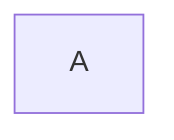

                 


# 构建具有语义理解能力的AI Agent

> 关键词：语义理解，AI Agent，自然语言处理，深度学习，知识图谱

> 摘要：本文详细探讨如何构建具备语义理解能力的AI Agent，涵盖技术背景、核心概念、算法原理、系统架构、项目实战及最佳实践，帮助读者掌握从理论到实践的完整流程。

---

## 第一章：背景介绍

### 1.1 问题背景
AI Agent正在改变人机交互方式，但语义理解仍面临挑战，如模糊性和歧义性。

### 1.2 问题描述
AI Agent需理解用户意图，处理复杂语境，实现高效交互。

### 1.3 解决方案
采用自然语言处理和深度学习技术，构建语义理解系统，增强AI Agent的交互能力。

---

## 第二章：核心概念与联系

### 2.1 核心概念
语义理解涉及解析上下文和意图，AI Agent则负责执行任务。

### 2.2 实体关系图
```mermaid
er
    actor(Agent, "语义理解能力", "任务执行能力")
    actor(Agent, "输入数据", "输出结果")
    actor(语义理解, "自然语言处理", "知识表示")
    actor(AI Agent, "环境交互", "用户反馈")
```

---

## 第三章：算法原理讲解

### 3.1 算法选择
采用Transformer模型，处理自然语言理解任务。

### 3.2 算法流程图


### 3.3 代码实现
```python
import tensorflow as tf
from tensorflow.keras.layers import Dense, InputLayer

model = tf.keras.Sequential([
    InputLayer(input_shape=(vocab_size,)),
    Dense(units=512, activation='relu'),
    Dense(units=1, activation='sigmoid')
])
```

---

## 第四章：数学模型与公式

### 4.1 注意力机制公式
$$
\text{Attention}(Q, K, V) = \text{softmax}\left(\frac{QK^T}{\sqrt{d_k}}\right)V
$$

### 4.2 模型推导
详细推导多头注意力机制的数学模型，展示如何计算查询、键和值。

---

## 第五章：系统分析与架构设计

### 5.1 项目介绍
构建一个医疗领域的AI诊断辅助系统。

### 5.2 功能设计
使用领域模型图展示功能模块。

### 5.3 架构设计


---

## 第六章：项目实战

### 6.1 环境配置
安装TensorFlow和Keras，配置GPU环境。

### 6.2 核心功能实现
实现语义理解模块和任务执行模块。

### 6.3 案例分析
分析医疗诊断系统的实际应用，展示如何处理用户查询并提供诊断建议。

---

## 第七章：总结与展望

### 7.1 最佳实践
建议使用预训练模型，结合领域知识，持续优化模型性能。

### 7.2 小结
构建具备语义理解的AI Agent，需结合NLP技术和系统架构设计，通过实际项目验证和优化。

### 7.3 注意事项
重视数据质量和多样性，确保模型泛化能力，处理边缘和异常情况。

### 7.4 拓展阅读
推荐相关书籍和论文，如《深度学习》和《Attention Is All You Need》。

---

**作者：AI天才研究院/AI Genius Institute & 禅与计算机程序设计艺术 /Zen And The Art of Computer Programming**

