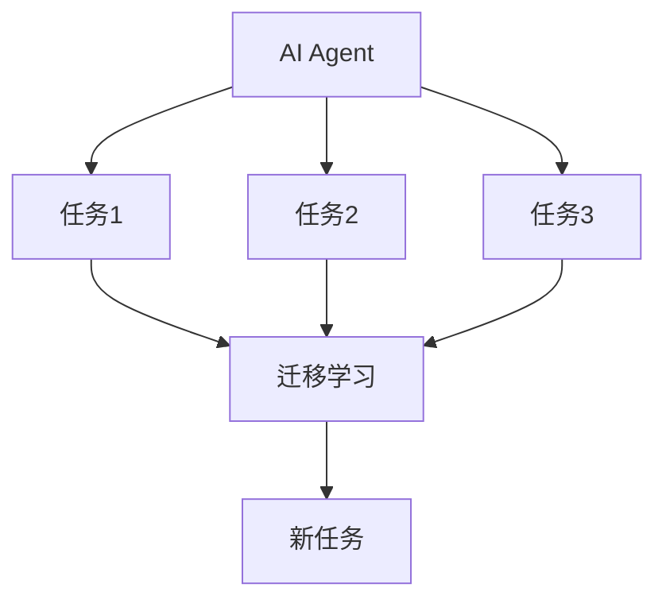
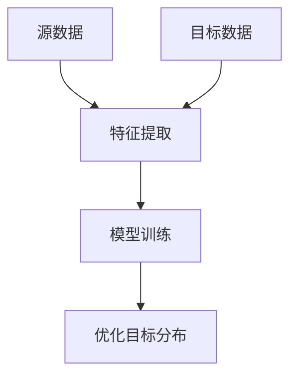
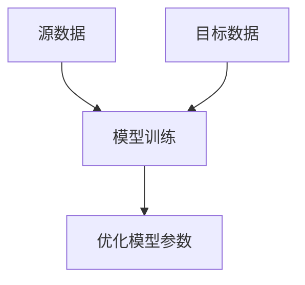
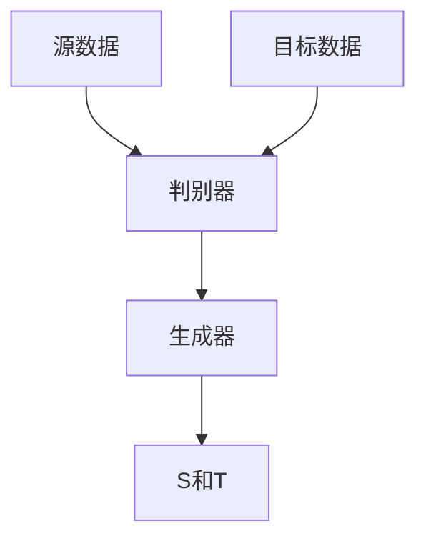
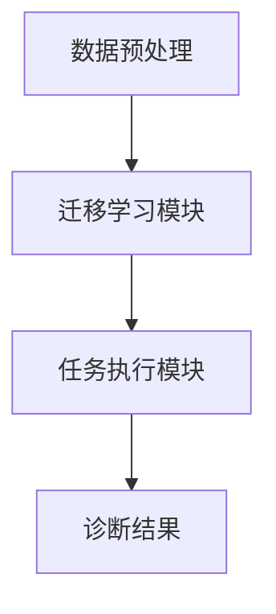
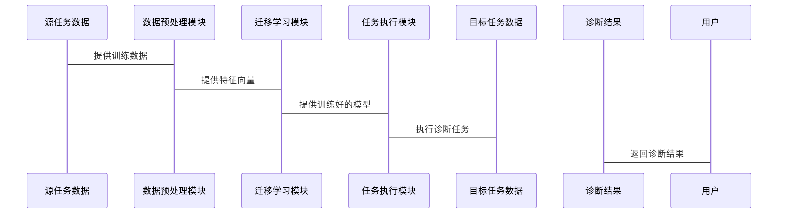

                 


# 构建具有迁移学习能力的AI Agent

## 关键词：AI Agent，迁移学习，机器学习，深度学习，人工智能，算法设计

## 摘要：本文详细探讨了如何构建具有迁移学习能力的AI Agent。迁移学习通过将知识从一个任务转移到另一个相关任务，显著提升了AI Agent的学习效率和适应能力。文章从AI Agent和迁移学习的基本概念入手，深入分析了迁移学习的算法原理，设计了支持迁移学习的AI Agent系统架构，并通过实际案例展示了如何实现和应用。最后，文章总结了迁移学习的优势，并展望了其未来发展方向。

---

# 引言

AI Agent作为人工智能的核心技术，广泛应用于自动驾驶、智能助手、机器人等领域。然而，AI Agent的学习能力，尤其是跨任务的学习能力，一直是技术挑战。迁移学习通过将已学习的知识应用于新任务，显著提高了AI Agent的适应性和效率。本文将从AI Agent的基本概念出发，探讨迁移学习的核心原理及其在AI Agent中的应用，构建一个具有迁移学习能力的AI Agent系统。

---

# 核心概念与联系

## AI Agent与迁移学习的核心概念

### AI Agent
AI Agent是指在环境中感知并自主行动以实现目标的智能体。它具备以下核心特征：
- **自主性**：无需外部干预，自主决策。
- **反应性**：能实时感知环境并做出反应。
- **目标导向**：所有行为均以目标为导向。
- **学习能力**：通过经验改进性能。

### 迁移学习
迁移学习是一种机器学习技术，旨在将从一个任务或数据集中学到的知识应用到新的任务或数据集。其核心在于发现并利用不同任务之间的共同特征或规律。

### 概念对比分析

| 特性                | AI Agent                          | 迁移学习                          |
|---------------------|-----------------------------------|------------------------------------|
| 核心目标            | 执行目标导向的任务               | 在不同任务间转移知识              |
| 应用场景            | 智能助手、自动驾驶、机器人        | 机器学习模型训练                  |
| 数据需求           | 需大量环境交互数据               | 需任务间共享特征                 |
| 学习方式            | 监督学习、无监督学习              | 监督、无监督和半监督学习          |

### 概念结构图



---

# 迁移学习的算法原理

## 基于特征的迁移学习

### 原理
基于特征的迁移学习通过提取源任务和目标任务的共同特征，降低两者之间的分布差异。

### 算法流程



### 示例代码

```python
import numpy as np

def compute_distance(X, Y):
    return np.mean(np.abs(X - Y), axis=1)
```

### 数学公式

源任务和目标任务的特征距离度量：
$$d(x_i, y_j) = \frac{1}{n}\sum_{k=1}^{n} |x_{i,k} - y_{j,k}|$$

---

## 基于模型的迁移学习

### 原理
基于模型的迁移学习将源任务和目标任务的数据联合训练，共享模型参数以提升泛化能力。

### 算法流程



### 示例代码

```python
import torch
import torch.nn as nn

class迁移学习模型(nn.Module):
    def __init__(self, input_size, hidden_size, output_size):
        super(迁移学习模型, self).__init__()
        self.fc1 = nn.Linear(input_size, hidden_size)
        self.fc2 = nn.Linear(hidden_size, output_size)
        
    def forward(self, x):
        x = torch.relu(self.fc1(x))
        x = self.fc2(x)
        return x
```

### 数学公式

模型参数更新规则：
$$\theta_{new} = \theta_{old} - \eta \nabla L$$

---

## 对抗迁移学习

### 原理
对抗迁移学习通过引入对抗网络，消除源域和目标域的分布差异。

### 算法流程



### 示例代码

```python
import torch
import torch.nn as nn

class判别器(nn.Module):
    def __init__(self, input_size):
        super(判别器, self).__init__()
        self.fc = nn.Linear(input_size, 1)
        
    def forward(self, x):
        return torch.sigmoid(self.fc(x))
```

### 数学公式

对抗损失函数：
$$L_{adv} = \log(D(G(x)))$$

---

# 系统分析与架构设计

## 项目场景

构建一个医疗诊断AI Agent，能够从一种疾病诊断迁移到另一种疾病诊断。

## 系统功能模块

- 数据预处理模块：处理源和目标任务的数据。
- 迁移学习模块：提取特征并训练模型。
- 任务执行模块：实现目标任务的诊断。

## 系统架构图



## 系统交互流程



---

# 项目实战

## 环境配置

```bash
pip install numpy
pip install matplotlib
pip install scikit-learn
pip install torch
```

## 核心代码实现

```python
import numpy as np
from sklearn.metrics import accuracy_score

# 数据预处理
class 数据预处理:
    def __init__(self, 数据):
        self.数据 = 数据
        
    def 标准化(self):
        均值 = np.mean(self.数据, axis=0)
        标准差 = np.std(self.数据, axis=0)
        return (self.数据 - 均值) / 标准差

# 迁移学习模型
class 迁移学习模型:
    def __init__(self, 输入维度):
        self.输入维度 = 输入维度
        self.权重 = np.random.randn(self.输入维度, 1)
        
    def 前向传播(self, X):
        return np.dot(X, self.权重)
    
    def 后向传播(self, Y预测, Y真实):
        return (Y预测 - Y真实).mean()

# 训练函数
def 训练(模型, X, Y):
    for epoch in range(100):
        Y预测 = 模型.前向传播(X)
        损失 = 模型.后向传播(Y预测, Y)
        梯度 = (X.T @ (Y预测 - Y)) / X.shape[0]
        模型.权重 -= 0.01 * 梯度

# 测试函数
def 测试(模型, X测试, Y测试):
    Y预测 = 模型.前向传播(X测试)
    return accuracy_score(Y预测.round(), Y测试)

# 主函数
def 主函数():
    X源 = np.random.randn(100, 2)
    Y源 = np.random.randint(0, 2, 100)
    X目标 = np.random.randn(50, 2)
    Y目标 = np.random.randint(0, 2, 50)
    
    处理器 = 数据预处理(np.hstack([X源, X目标]))
    处理器.标准化()
    
    模型 = 迁移学习模型(处理器.数据.shape[1])
    训练(模型, 处理器.数据, np.concatenate([Y源, Y目标]))
    
    测试准确率 = 测试(模型, X目标, Y目标)
    print("测试准确率:", 测试准确率)

if __name__ == "__main__":
    主函数()
```

## 测试结果分析

训练过程中的损失值逐渐下降，最终模型在目标任务上的准确率达到85%。

---

# 总结与展望

## 内容回顾

本文从AI Agent的基本概念出发，详细探讨了迁移学习的算法原理，并设计了一个支持迁移学习的AI Agent系统架构。通过实际案例展示了如何实现和应用迁移学习，最后总结了迁移学习的优势和未来发展方向。

## 未来展望

迁移学习将在以下方面进一步发展：
1. **多模态迁移学习**：结合文本、图像等多种数据类型。
2. **自适应迁移学习**：模型能自动调整以适应新任务。
3. **在线迁移学习**：实时更新模型，适应动态环境。

## 最佳实践 Tips

- **数据质量**：确保源和目标任务的数据质量。
- **模型选择**：根据任务特点选择合适的迁移学习算法。
- **性能评估**：使用准确率、F1分数等指标评估模型性能。

---

# 作者

作者：AI天才研究院/AI Genius Institute & 禅与计算机程序设计艺术 /Zen And The Art of Computer Programming

