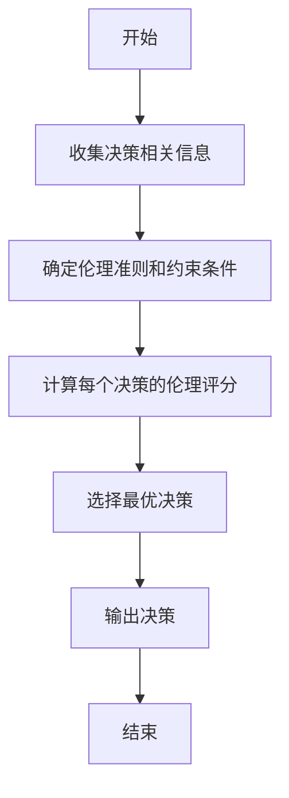
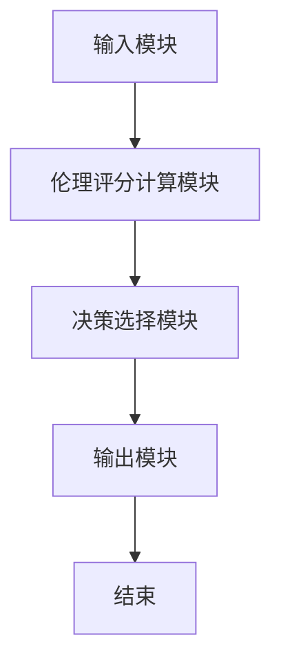
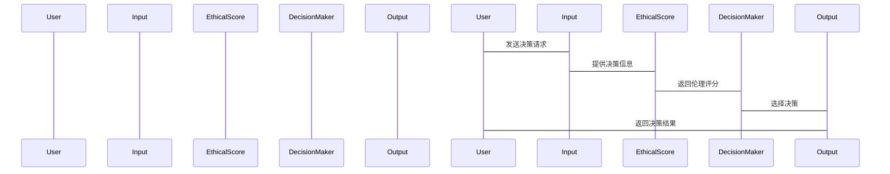

                 


# 第三部分: 算法原理

## 第3章: 基于伦理的决策算法

### 3.1 道德决策算法概述

#### 3.1.1 基于伦理的决策算法的基本原理
基于伦理的决策算法是一种结合伦理学原则和人工智能算法的决策方法，旨在使AI Agent在做出决策时遵循道德规范和伦理准则。该算法的核心在于将伦理约束条件转化为可计算的数学模型，并在决策过程中实时应用这些约束条件，以确保决策的道德性。

#### 3.1.2 伦理评分模型
伦理评分模型是基于伦理的决策算法中的关键部分，它通过量化评估每个可能的决策的伦理得分，从而帮助AI Agent选择最优的决策。伦理评分模型通常基于以下因素：
1. **伦理准则**：包括诚实、公正、尊重等基本伦理原则。
2. **决策影响**：评估决策对不同利益相关者的影响程度。
3. **情境因素**：考虑决策所处的具体情境和背景。

伦理评分模型可以表示为：
$$
\text{伦理评分} = f(\text{伦理准则}, \text{决策影响}, \text{情境因素})
$$

其中，$f$ 是一个根据具体算法定义的函数，通常是一个加权求和或加权平均函数。

### 3.2 基于伦理的决策算法实现

#### 3.2.1 算法实现步骤
基于伦理的决策算法的实现可以分为以下几个步骤：

1. **输入阶段**：
   - 收集与当前决策相关的所有相关信息，包括问题描述、决策选项、利益相关者等。
   - 确定需要考虑的伦理准则和约束条件。

2. **伦理评分计算阶段**：
   - 对每个决策选项进行伦理评分计算，使用伦理评分模型评估每个选项的伦理得分。
   - 可以使用加权求和的方法，权重可以根据具体情况调整。

3. **决策选择阶段**：
   - 根据伦理评分和可能的其他约束条件（如最大化利益、最小化伤害等），选择最优的决策选项。
   - 在多个决策选项中，选择具有最高伦理评分的选项，或者在多个评分相近的选项中，根据具体情况进行选择。

4. **输出阶段**：
   - 输出选择的决策及其伦理评分，供AI Agent执行或供用户参考。

#### 3.2.2 伦理评分模型的具体实现
以下是一个简单的伦理评分模型的实现示例，基于三个主要伦理准则：诚实（Honesty）、公正（Fairness）和尊重（Respect）。

假设我们有三个决策选项：A、B、C。每个决策选项的伦理评分计算如下：

$$
\text{伦理评分}_A = 0.4 \times H_A + 0.3 \times F_A + 0.3 \times R_A
$$

$$
\text{伦理评分}_B = 0.4 \times H_B + 0.3 \times F_B + 0.3 \times R_B
$$

$$
\text{伦理评分}_C = 0.4 \times H_C + 0.3 \times F_C + 0.3 \times R_C
$$

其中，$H_A$、$F_A$、$R_A$ 分别表示决策A在诚实、公正和尊重方面的评分，取值范围为0到1。

### 3.3 基于伦理的决策算法的流程图

以下是一个基于伦理的决策算法的流程图：



### 3.4 算法实现的Python代码示例

以下是一个简单的基于伦理的决策算法的Python代码示例：

```python
def calculate_ethical_score(honesty, fairness, respect):
    return 0.4 * honesty + 0.3 * fairness + 0.3 * respect

def ethical_decision-making(decision_options):
    ethical_scores = []
    for option in decision_options:
        h = option['honesty']
        f = option['fairness']
        r = option['respect']
        score = calculate_ethical_score(h, f, r)
        ethical_scores.append((option['name'], score))
    # 选择伦理评分最高的决策
    ethical_scores.sort(key=lambda x: x[1], reverse=True)
    return ethical_scores[0][0]

# 示例使用
decision_options = [
    {'name': 'A', 'honesty': 0.8, 'fairness': 0.7, 'respect': 0.9},
    {'name': 'B', 'honesty': 0.6, 'fairness': 0.8, 'respect': 0.7},
    {'name': 'C', 'honesty': 0.9, 'fairness': 0.6, 'respect': 0.8}
]

result = ethical_decision-making(decision_options)
print("选择的决策是:", result)
```

### 3.5 本章小结

---

# 第四部分: 系统架构设计

## 第4章: 系统架构设计与实现

### 4.1 系统功能设计

#### 4.1.1 功能模块划分
基于道德决策框架的AI Agent系统可以划分为以下几个功能模块：

1. **输入模块**：接收决策请求和相关信息。
2. **伦理评分计算模块**：根据输入的信息计算每个决策的伦理评分。
3. **决策选择模块**：根据伦理评分和约束条件选择最优的决策。
4. **输出模块**：输出选择的决策及其伦理评分。

#### 4.1.2 系统功能需求
系统需要支持以下功能：
- 多个决策选项的输入和处理。
- 不同伦理准则的权重调整。
- 决策结果的输出和记录。

### 4.2 系统架构设计

#### 4.2.1 系统架构图



#### 4.2.2 系统架构设计说明
- **输入模块**：负责接收用户输入的决策请求和相关信息。
- **伦理评分计算模块**：根据输入的信息和预设的伦理准则计算每个决策的伦理评分。
- **决策选择模块**：根据伦理评分和约束条件选择最优的决策。
- **输出模块**：输出选择的决策及其伦理评分。

### 4.3 系统接口设计

#### 4.3.1 输入接口
输入接口需要接收以下数据：
- 决策请求
- 决策选项
- 伦理准则和权重

#### 4.3.2 输出接口
输出接口需要返回以下内容：
- 选择的决策
- 决策的伦理评分
- 决策的详细信息（如影响分析）

### 4.4 系统交互流程图



### 4.5 本章小结

---

# 第五部分: 项目实战

## 第5章: 项目实战与案例分析

### 5.1 环境安装与配置

#### 5.1.1 安装Python环境
- 安装Python 3.8或更高版本。
- 安装必要的库，如`mermaid`、`graphviz`等。

#### 5.1.2 安装依赖
```bash
pip install mermaid
pip install graphviz
```

### 5.2 核心代码实现

#### 5.2.1 伦理评分计算模块

```python
import math

def calculate_ethical_score(honesty, fairness, respect):
    # 使用加权求和的方法计算伦理评分
    weight_honesty = 0.4
    weight_fairness = 0.3
    weight_respect = 0.3
    return weight_honesty * honesty + weight_fairness * fairness + weight_respect * respect
```

#### 5.2.2 决策选择模块

```python
def ethical_decision_making(decision_options):
    # 计算每个决策的伦理评分
    ethical_scores = []
    for option in decision_options:
        score = calculate_ethical_score(
            option['honesty'], option['fairness'], option['respect']
        )
        ethical_scores.append((option['name'], score))
    # 按伦理评分排序，选择评分最高的决策
    ethical_scores.sort(key=lambda x: x[1], reverse=True)
    return ethical_scores[0][0]
```

#### 5.2.3 系统交互模块

```python
def main():
    decision_options = [
        {
            'name': 'A',
            'honesty': 0.8,
            'fairness': 0.7,
            'respect': 0.9
        },
        {
            'name': 'B',
            'honesty': 0.6,
            'fairness': 0.8,
            'respect': 0.7
        },
        {
            'name': 'C',
            'honesty': 0.9,
            'fairness': 0.6,
            'respect': 0.8
        }
    ]
    result = ethical_decision_making(decision_options)
    print(f"选择的决策是: {result}")
    print(f"伦理评分为: {ethical_decision_making(ethical_scores)}")

if __name__ == "__main__":
    main()
```

### 5.3 案例分析与实现解读

#### 5.3.1 案例背景
假设我们有一个AI Agent需要在三个决策选项中选择一个最优的决策。这三个决策选项分别是：
- A：诚实但可能对某些利益相关者不利。
- B：公正但可能不尊重某些人的选择。
- C：尊重但可能不完全诚实。

#### 5.3.2 实现解读
在上述代码中，我们定义了三个决策选项，并为每个选项赋予了不同的伦理评分。伦理评分计算模块根据诚实、公正和尊重三个伦理准则，使用加权求和的方法计算每个决策的伦理评分。最终，决策选择模块选择伦理评分最高的决策作为最优决策。

### 5.4 本章小结

---

# 第六部分: 总结与展望

## 第6章: 总结与展望

### 6.1 最佳实践与小结

#### 6.1.1 关键点总结
- 明确伦理准则和约束条件。
- 合理设计伦理评分模型。
- 确保决策过程的透明性和可解释性。

#### 6.1.2 注意事项
- 道德决策框架的设计需要结合具体应用场景。
- 需要不断优化和调整伦理准则和权重。

### 6.2 未来展望

#### 6.2.1 技术发展
- 更复杂的伦理评分模型。
- 更智能化的伦理决策算法。
- 更广泛的应用场景。

#### 6.2.2 挑战与机遇
- 挑战：如何处理复杂的伦理问题。
- 机遇：通过不断的研究和实践，推动AI Agent在道德决策方面的应用和发展。

### 6.3 本章小结

---

# 作者：AI天才研究院/AI Genius Institute & 禅与计算机程序设计艺术 /Zen And The Art of Computer Programming

---

**摘要**：本文详细探讨了如何构建具有道德决策框架的AI Agent，涵盖了从理论到实践的各个方面，包括背景介绍、核心概念、算法原理、系统架构设计、项目实战以及总结与展望。通过本文的讲解，读者可以系统地理解和实现基于伦理的AI Agent，为未来的智能系统开发提供参考和指导。

