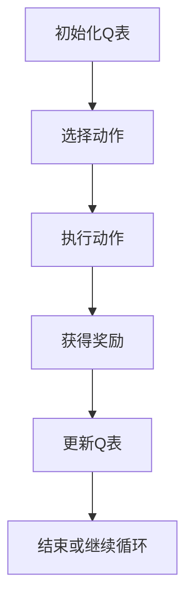
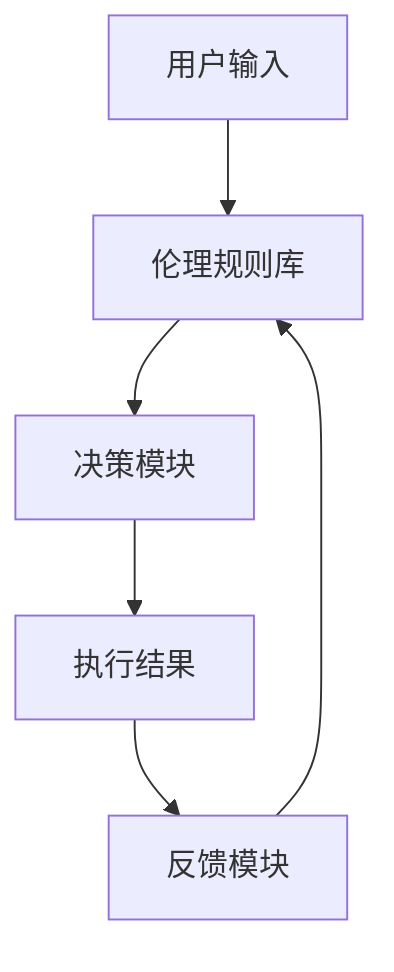
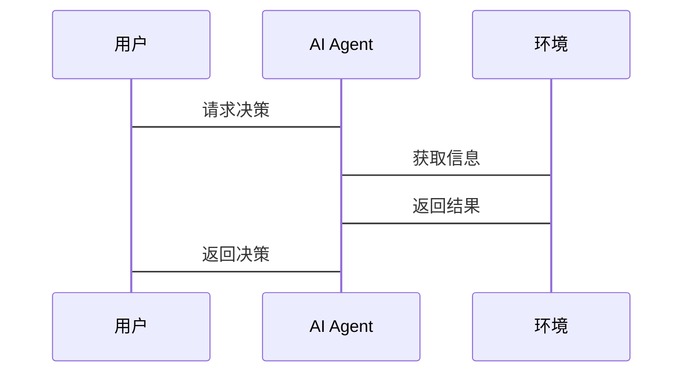

                 


# 构建具有道德决策框架的AI Agent系统

## 关键词：AI Agent、道德决策框架、伦理学、系统架构、算法实现

## 摘要：本文章探讨如何构建一个具有道德决策框架的AI Agent系统，涵盖背景分析、核心概念、算法原理、系统架构设计以及项目实战等内容。通过详细讲解道德决策框架的原理和实现，提供一个全面的技术解决方案。

---

## 第一部分：背景介绍

### 第1章：道德决策框架的背景与问题描述

#### 1.1 问题背景
AI Agent系统在各个领域中的应用越来越广泛，但其决策过程缺乏明确的道德标准，可能导致伦理问题。例如，在自动驾驶系统中，AI在紧急情况下的决策可能影响乘客安全，因此需要一个明确的道德框架来指导决策。

#### 1.2 问题描述
- **问题背景**：AI Agent系统在决策过程中可能面临复杂的伦理问题，如隐私保护、责任归属等。
- **问题解决**：需要构建一个道德决策框架，确保AI在决策时符合伦理规范。
- **核心要素**：包括伦理规则、决策模型、反馈机制等。

#### 1.3 问题解决
- **伦理规则**：制定明确的伦理准则，如自动驾驶中的“最小伤害原则”。
- **决策模型**：设计基于伦理规则的决策模型，确保AI在复杂情况下做出符合伦理的决策。

#### 1.4 边界与外延
- **边界**：道德决策框架仅处理与决策相关的伦理问题，不涉及技术实现细节。
- **外延**：扩展到其他领域，如医疗AI、金融AI等。

#### 1.5 概念结构与核心要素
- **概念结构**：包括伦理规则、决策模型、反馈机制。
- **核心要素**：伦理规则库、决策模型、反馈机制。

---

## 第二部分：核心概念与联系

### 第2章：道德决策框架的原理与应用

#### 2.1 道德决策框架的原理
- **伦理学基础**：基于伦理学理论，构建伦理规则库。
- **决策模型**：设计基于伦理规则的决策模型，确保AI在决策时遵循伦理规范。

#### 2.2 道德决策模型
- **基于伦理规则的模型**：AI根据预定义的伦理规则进行决策。
- **基于案例推理的模型**：AI参考历史案例进行决策。

#### 2.3 道德决策模型的对比分析
| 模型类型         | 优缺点                          | 适用场景           |
|------------------|--------------------------------|--------------------|
| 基于规则的模型   | 明确性高，易于实现               | 简单决策问题       |
| 基于案例推理的模型 | 灵活性高，考虑复杂场景           | 复杂决策问题       |

#### 2.4 概念结构与核心要素
- **ER实体关系图**：展示道德决策框架中的各个实体及其关系。

```mermaid
erd
    title 道德决策框架实体关系图
    章程 <--- 关系 ---> 决策
    决策 <--- 关系 ---> 结果
```

---

## 第三部分：算法原理讲解

### 第3章：道德决策框架的算法实现

#### 3.1 基于Q-learning的道德决策算法
- **算法原理**：通过Q-learning算法，AI学习最优决策策略。
- **数学模型**：定义状态、动作、奖励函数。

$$ Q(s, a) = Q(s, a) + \alpha [r + \gamma \max Q(s', a') - Q(s, a)] $$

#### 3.2 算法实现
- **Python代码示例**：
```python
class QLearningAgent:
    def __init__(self, actions, epsilon=0.1, alpha=0.1, gamma=0.9):
        self.actions = actions
        self.epsilon = epsilon
        self.alpha = alpha
        self.gamma = gamma
        self.q_table = {}

    def get_action(self, state):
        if np.random.random() < self.epsilon:
            return random.choice(self.actions)
        else:
            q_values = [self.q_table.get((state, a), 0) for a in self.actions]
            max_q = max(q_values)
            for a, q in zip(self.actions, q_values):
                if q == max_q:
                    return a

    def update_q_table(self, state, action, reward, next_state):
        q = self.q_table.get((state, action), 0)
        next_q = max(self.q_table.get((next_state, a), 0) for a in self.actions)
        self.q_table[(state, action)] = q + self.alpha * (reward + self.gamma * next_q - q)
```

#### 3.3 算法流程图


---

## 第四部分：系统分析与架构设计

### 第4章：系统架构设计

#### 4.1 问题场景介绍
- **自动驾驶系统**：AI Agent在紧急情况下的决策。

#### 4.2 系统功能设计
- **伦理规则库**：存储伦理规则。
- **决策模块**：基于伦理规则进行决策。
- **反馈模块**：收集反馈，优化决策模型。

#### 4.3 系统架构图


#### 4.4 接口设计
- **输入接口**：接收环境信息。
- **输出接口**：输出决策结果。

#### 4.5 交互流程图


---

## 第五部分：项目实战

### 第5章：基于道德决策框架的AI Agent系统实现

#### 5.1 环境安装
- **Python环境**：安装必要的库，如numpy、random、mermaid等。

#### 5.2 核心代码实现
- **伦理规则库**：
```python
class EthicsRules:
    def __init__(self, rules):
        self.rules = rules

    def get_rule(self, state):
        for rule in self.rules:
            if rule.applies_to(state):
                return rule
        return None
```

- **决策模块**：
```python
class DecisionModule:
    def __init__(self, ethics_rules):
        self.ethics_rules = ethics_rules

    def make_decision(self, state):
        rule = self.ethics_rules.get_rule(state)
        if rule:
            return rule.apply(state)
        else:
            return default_decision(state)
```

#### 5.3 代码解读与分析
- **伦理规则库**：定义各个伦理规则，并根据状态选择适用的规则。
- **决策模块**：根据伦理规则库的输出，做出最终决策。

#### 5.4 案例分析
- **自动驾驶案例**：在紧急情况下，AI Agent选择最小伤害的决策。

#### 5.5 项目小结
- **总结**：通过具体案例，展示了如何在实际项目中应用道德决策框架。

---

## 第六部分：最佳实践

### 第6章：道德决策框架的实践与总结

#### 6.1 最佳实践 tips
- **明确伦理规则**：确保伦理规则清晰明确。
- **持续优化**：根据反馈不断优化决策模型。

#### 6.2 小结
- **总结**：构建道德决策框架是实现伦理AI Agent的关键。

#### 6.3 注意事项
- **边界条件**：确保框架在边界条件下仍能正常工作。
- **用户体验**：确保用户能够理解AI的决策过程。

#### 6.4 拓展阅读
- **推荐书籍**：《伦理学入门》、《人工智能的伦理挑战》。

---

## 作者：AI天才研究院/AI Genius Institute & 禅与计算机程序设计艺术/Zen And The Art of Computer Programming

---

通过以上目录结构，文章详细讲解了构建具有道德决策框架的AI Agent系统的各个方面，从理论到实践，确保内容全面且易于理解。

