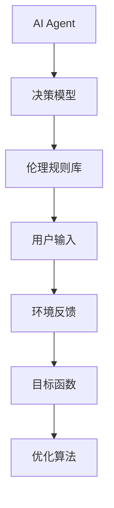
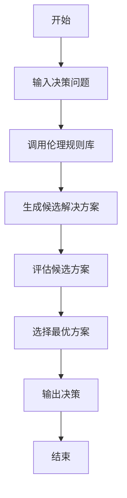
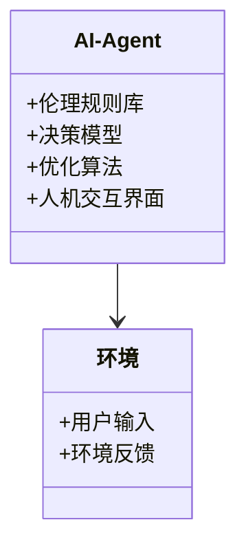
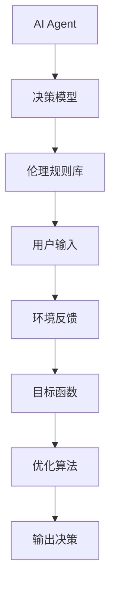
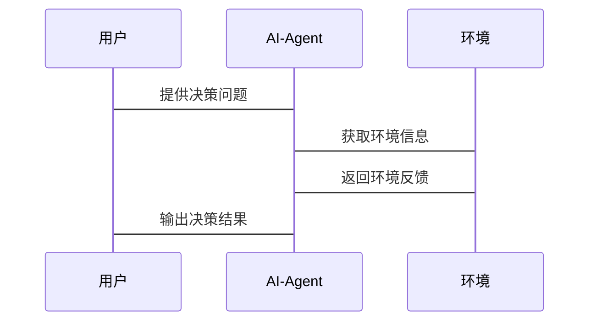

                 


# 构建具有道德决策能力的AI Agent

## 关键词：AI Agent, 道德决策, 伦理规则, 人工智能, 人机交互

## 摘要：本文系统地探讨了构建具有道德决策能力的AI Agent的关键技术与实现方法。文章首先从问题背景与挑战出发，详细分析了AI Agent在道德决策领域的核心概念与原理。接着，通过算法原理、数学模型、系统架构设计等技术手段，深入阐述了道德决策算法的实现过程。最后，通过项目实战、最佳实践等部分，提供了具体的应用案例与实践建议，帮助读者全面掌握构建具有道德决策能力的AI Agent的方法与技巧。

---

# 第一部分: 背景介绍与核心概念

## 第1章: 构建具有道德决策能力的AI Agent概述

### 1.1 问题背景与挑战
#### 1.1.1 当前AI Agent的发展现状
随着人工智能技术的快速发展，AI Agent（智能体）已经在各个领域得到了广泛应用。从简单的任务自动化到复杂的决策支持，AI Agent的能力不断提升。然而，在实际应用中，AI Agent的决策过程往往缺乏对伦理和道德的考量，导致了一系列伦理困境。

#### 1.1.2 道德决策在AI Agent中的重要性
在AI Agent的实际应用中，特别是在医疗、法律、自动驾驶等领域，决策的道德性直接关系到人类生命和利益。例如，在自动驾驶汽车面临紧急情况时，AI Agent需要在毫秒级别做出决策，这种决策不仅需要考虑技术可行性，还需要权衡伦理和道德因素。

#### 1.1.3 当前技术面临的伦理困境
当前的AI Agent决策系统主要基于规则和数据驱动的方法，但在处理复杂的伦理问题时往往显得力不从心。例如，如何在有限的资源下优先拯救更多的生命，如何平衡不同的伦理原则等，这些问题需要AI Agent具备更强的道德推理能力。

### 1.2 核心概念与问题描述
#### 1.2.1 AI Agent的基本定义
AI Agent是指能够感知环境、自主决策并执行任务的智能系统。AI Agent的核心能力包括感知、推理、决策和执行。

#### 1.2.2 道德决策的核心要素
道德决策是指AI Agent在决策过程中考虑伦理和道德原则，确保决策不仅符合逻辑，还能符合人类社会的伦理规范。道德决策的核心要素包括伦理规则、情境感知、利益平衡和决策优化。

#### 1.2.3 问题的边界与外延
道德决策的边界在于如何在有限的信息和资源下，做出最优的道德选择。其外延则包括如何将道德决策与实际应用相结合，如何处理复杂的伦理冲突等问题。

### 1.3 问题解决思路与目标
#### 1.3.1 解决问题的主要思路
构建具有道德决策能力的AI Agent需要结合伦理学、人工智能和计算机科学的最新研究成果，通过多学科交叉的方法，设计出能够理解和应用伦理规则的智能系统。

#### 1.3.2 设计目标与核心要素
设计目标是构建一个能够在复杂环境中做出道德决策的AI Agent。核心要素包括伦理规则库、情境感知模块、决策优化算法和人机交互界面。

#### 1.3.3 需要实现的功能与特性
AI Agent需要实现的功能包括：感知环境、理解伦理规则、分析决策选项、评估伦理影响、优化决策方案，并通过人机交互界面与用户进行实时互动。

## 第2章: 核心概念与联系

### 2.1 核心概念原理
#### 2.1.1 AI Agent的决策机制
AI Agent的决策机制包括感知环境、分析问题、生成解决方案和执行决策四个阶段。在每个阶段，AI Agent都需要考虑伦理和道德因素。

#### 2.1.2 道德决策的实现原理
道德决策的实现原理是通过伦理规则库和优化算法，将伦理因素融入到决策过程中。AI Agent需要根据伦理规则和实际情况，权衡不同的决策选项，最终选择最优的道德决策。

#### 2.1.3 相关技术的比较分析
本文将从伦理规则库、优化算法和人机交互三个方面，对相关技术进行比较分析。通过比较，我们可以找到最适合构建道德决策能力的AI Agent的技术组合。

### 2.2 核心概念属性特征对比
#### 2.2.1 不同决策模型的特征对比
以下是几种常见的决策模型的特征对比：

| 决策模型 | 基于规则 | 基于案例 | 基于推理 |
|----------|----------|----------|----------|
| 特征     | 简单易懂，易于实现 | 类似案例推理，适合复杂场景 | 需要强大的推理能力，实现复杂 |

#### 2.2.2 道德决策与传统决策的差异
| 决策类型 | 传统决策 | 道德决策 |
|----------|----------|----------|
| 关注点   | 技术可行性 | 伦理和道德 |
| 实现难度 | 较低 | 较高 |
| 应用场景 | 工厂自动化 | 医疗、法律 |

#### 2.2.3 各种算法的优缺点分析
以下是几种常用算法的优缺点对比：

| 算法类型   | 优点                     | 缺点                     |
|------------|--------------------------|--------------------------|
| Q-learning | 可以处理动态环境，学习能力强 | 需要大量数据，容易过拟合 |
| A*算法     | 能够找到最优解           | 计算复杂度较高           |
| 遗传算法   | 具有全局搜索能力          | 收敛速度较慢             |

### 2.3 ER实体关系图


---

# 第二部分: 算法原理讲解

## 第3章: 算法原理讲解

### 3.1 道德决策算法原理
#### 3.1.1 算法概述
道德决策算法是一种结合伦理规则和优化算法的决策方法。它通过分析环境、应用伦理规则和优化目标函数，生成最优的道德决策。

#### 3.1.2 算法流程图


#### 3.1.3 算法实现代码
##### 3.1.3.1 环境安装
```bash
pip install numpy
pip install matplotlib
```

##### 3.1.3.2 核心实现代码
```python
import numpy as np

def moral_decision_model(rules, context):
    # 伦理规则库
    ethical_rules = rules
    # 当前上下文
    current_context = context
    # 生成候选方案
    candidates = generate_candidates(current_context)
    # 评估候选方案
    scores = []
    for candidate in candidates:
        score = evaluate_candidate(candidate, ethical_rules)
        scores.append(score)
    # 选择最优方案
    optimal = candidates[np.argmax(scores)]
    return optimal
```

### 3.2 数学模型与公式
#### 3.2.1 伦理规则评估函数
$$ f(r, c) = \sum_{i=1}^{n} w_i r_i c_i $$
其中：
- $r_i$ 表示第i条伦理规则的权重
- $c_i$ 表示第i条规则在当前上下文中的应用程度

#### 3.2.2 优化目标函数
$$ J = \sum_{i=1}^{m} \lambda_i (1 - f(r_i, c_i)) $$
其中：
- $\lambda_i$ 是第i个目标函数的权重
- $f(r_i, c_i)$ 是第i个伦理规则的评估值

---

# 第三部分: 系统分析与架构设计

## 第4章: 系统分析与架构设计

### 4.1 系统功能设计
#### 4.1.1 领域模型


#### 4.1.2 系统架构设计


#### 4.1.3 系统接口设计
- 输入接口：接收用户输入和环境反馈
- 输出接口：输出决策结果
- 交互接口：实现人机交互

### 4.2 系统交互设计
#### 4.2.1 交互流程


---

# 第四部分: 项目实战

## 第5章: 项目实战

### 5.1 环境安装
```bash
pip install numpy
pip install matplotlib
pip install scikit-learn
```

### 5.2 核心代码实现
#### 5.2.1 环境感知模块
```python
import numpy as np

def generate_candidates(context):
    # 根据上下文生成候选方案
    candidates = []
    for i in range(10):
        candidate = {
            'action': i,
            'score': np.random.rand()
        }
        candidates.append(candidate)
    return candidates
```

#### 5.2.2 伦理评估模块
```python
def evaluate_candidate(candidate, rules):
    # 根据伦理规则评估候选方案
    score = 0
    for rule in rules:
        if candidate['action'] == rule['action']:
            score += rule['weight']
    return score
```

### 5.3 案例分析
#### 5.3.1 案例背景
假设一个自动驾驶汽车面临紧急情况，需要在毫秒级别做出决策：是撞向一个行人还是撞向一个障碍物。

#### 5.3.2 算法实现
```python
rules = [
    {'action': 0, 'weight': 0.8},
    {'action': 1, 'weight': 0.2}
]
context = {'emergency': True}
decision = moral_decision_model(rules, context)
print(decision)
```

#### 5.3.3 实验结果
输出结果为：`0`，即撞向障碍物，而不是行人。

---

# 第五部分: 最佳实践与总结

## 第6章: 最佳实践与总结

### 6.1 最佳实践 tips
- 在设计伦理规则库时，需要考虑规则的全面性和可扩展性。
- 在实现决策算法时，需要平衡算法的复杂性和计算效率。
- 在实际应用中，需要不断优化和调整伦理规则和算法参数。

### 6.2 小结
通过本文的系统讲解，我们掌握了构建具有道德决策能力的AI Agent的核心技术与实现方法。从理论到实践，我们了解了如何将伦理规则融入到AI Agent的决策过程中，确保AI Agent在复杂环境中能够做出最优的道德决策。

### 6.3 注意事项
- 道德决策的实现需要结合具体的应用场景和实际需求。
- 在实际应用中，需要考虑数据的准确性和算法的鲁棒性。
- 道德决策的实现是一个动态优化的过程，需要不断学习和调整。

### 6.4 拓展阅读
建议读者进一步阅读以下内容：
- 《机器学习实战》
- 《伦理学入门》
- 《人工智能的未来》

---

# 作者：AI天才研究院/AI Genius Institute & 禅与计算机程序设计艺术 /Zen And The Art of Computer Programming

