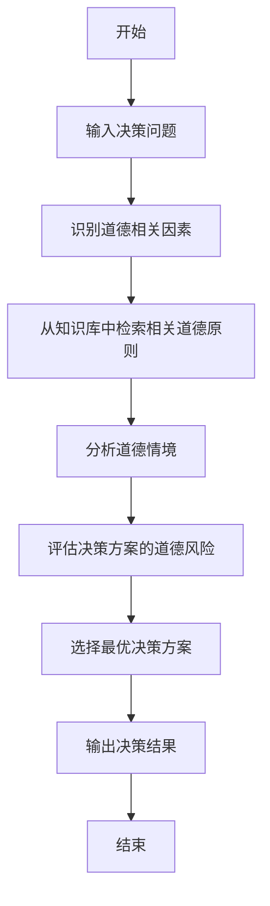
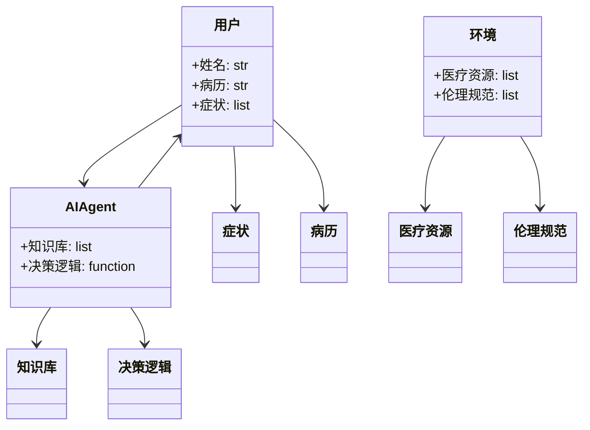
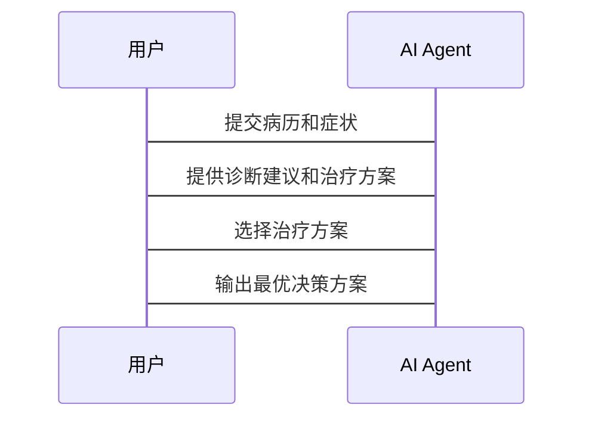

                 


# 构建具有道德推理能力的AI Agent

## 关键词：AI Agent, 道德推理, 伦理决策, 人机交互, 人工智能, 道德框架

## 摘要：  
随着人工智能技术的快速发展，AI Agent在各个领域的应用越来越广泛。然而，AI Agent在进行决策时，往往缺乏对道德和伦理的考虑。本文旨在探讨如何构建一个具有道德推理能力的AI Agent，使其能够理解并遵循伦理规范，在复杂情境中做出合理的决策。本文从道德推理的基本原理、AI Agent的核心架构、算法实现、系统设计到实际案例分析，全面阐述了构建具有道德推理能力的AI Agent的方法和步骤。

---

## 第一部分：背景介绍

### 第1章：道德推理与AI Agent概述

#### 1.1 问题背景  
在人工智能技术快速发展的背景下，AI Agent（智能体）已经被广泛应用于各个领域，如医疗、金融、交通等。然而，随着AI Agent的决策能力越来越复杂，其在实际应用中可能会面临道德和伦理问题。例如，在自动驾驶汽车中，AI Agent需要在紧急情况下做出决策，这可能涉及到对人类生命的权衡。因此，如何让AI Agent具备道德推理能力，使其在决策过程中能够考虑伦理因素，成为一个亟待解决的问题。

#### 1.2 问题描述  
AI Agent的决策过程通常基于数据和算法，缺乏对道德和伦理的考虑。例如，在医疗领域，AI Agent可能会根据病人的病情推荐治疗方案，但如果治疗方案涉及到复杂的伦理问题（如生命与成本的权衡），AI Agent可能无法做出符合伦理的决策。因此，我们需要构建一种能够进行道德推理的AI Agent，使其在决策过程中能够考虑伦理因素，并在复杂情境中做出合理的决策。

#### 1.3 问题解决  
为了构建具有道德推理能力的AI Agent，我们需要从以下几个方面入手：  
1. **道德推理框架**：设计一种能够将道德原则和规范融入AI Agent决策过程的框架。  
2. **伦理数据集**：构建一个包含各种伦理情境的数据集，用于训练AI Agent的道德推理能力。  
3. **多学科融合**：将伦理学、哲学、社会学等多个领域的知识融入AI Agent的设计中，确保其能够理解并遵循伦理规范。

#### 1.4 边界与外延  
道德推理能力的AI Agent并不是万能的，其应用范围和边界需要明确。例如，在某些领域（如司法判决），AI Agent的决策可能需要遵循特定的法律法规，而不仅仅是道德原则。此外，道德推理能力的AI Agent还需要与实际应用场景相结合，确保其在特定领域内的有效性和适用性。

#### 1.5 概念结构与核心要素  
- **道德推理**：指AI Agent在决策过程中，能够理解并应用道德原则和规范，以做出符合伦理的决策。  
- **AI Agent**：指具有感知环境、自主决策和执行任务能力的智能体。  
- **伦理规范**：指社会或组织为指导个体行为而制定的道德准则和规则。  
- **决策过程**：指AI Agent从感知环境到做出决策的整个过程，包括信息收集、分析、推理和选择。

---

## 第二部分：核心概念与联系

### 第2章：道德推理原理

#### 2.1 道德推理的原理  
道德推理是AI Agent进行决策时需要考虑的核心能力之一。它涉及到以下几个关键步骤：  
1. **识别道德问题**：AI Agent需要能够识别出决策过程中涉及到的道德问题。  
2. **分析道德情境**：AI Agent需要对当前情境进行分析，确定哪些因素是道德相关的。  
3. **应用道德原则**：AI Agent需要根据已知的道德原则和规范，对决策进行评估和选择。  
4. **做出道德决策**：AI Agent根据分析结果，做出符合伦理的决策。

#### 2.2 AI Agent的核心原理  
AI Agent的核心原理包括以下几个方面：  
1. **感知环境**：AI Agent需要通过传感器或数据输入，感知外部环境的状态。  
2. **信息处理**：AI Agent需要对感知到的信息进行处理，提取有用的特征和信息。  
3. **决策推理**：AI Agent需要基于处理后的信息，进行推理和计算，以确定最佳的决策方案。  
4. **执行决策**：AI Agent根据决策结果，执行相应的动作或输出决策结果。

#### 2.3 核心概念对比  
为了更好地理解道德推理与AI Agent的关系，我们可以通过表格的形式，对相关概念进行对比和分析。

| 概念 | 定义 | 特性 | 示例 |
|------|------|------|------|
| 道德推理 | AI Agent在决策过程中，基于道德原则和规范进行推理和选择 | 基于伦理准则、涉及价值判断 | 自动驾驶汽车在紧急情况下的决策 |
| AI Agent | 具有感知、决策和执行能力的智能体 | 自主性、反应性、学习能力 | 医疗诊断辅助系统 |
| 逻辑推理 | 基于逻辑规则和事实进行推理 | 确定性、基于事实 | 根据病人的症状诊断疾病 |
| 伦理决策 | 涉及道德和伦理因素的决策过程 | 值判断、权衡利弊 | 医疗资源分配中的优先级决策 |

#### 2.4 实体关系图  
为了更好地理解道德推理与AI Agent之间的关系，我们可以绘制一个实体关系图（ER图）。以下是道德推理过程的ER图：

```mermaid
erDiagram
    actor 用户
    actor 环境
    actor 道德框架
    actor AI Agent
    道德框架 --> 道德原则
    道德框架 --> 伦理规范
    AI Agent --> 知识库
    AI Agent --> 决策逻辑
    用户 --> 输入
    环境 --> 感知数据
    AI Agent --> 决策结果
    用户 --> 输出
    环境 --> 反馈
```

---

## 第三部分：算法原理

### 第3章：道德推理算法

#### 3.1 算法原理  
道德推理算法的核心是将道德原则和规范融入AI Agent的决策过程中。我们可以通过以下步骤来实现这一点：  
1. **构建道德框架**：定义一组道德原则和规范，用于指导AI Agent的决策。  
2. **知识库构建**：收集和整理相关的道德案例和伦理规范，构建一个道德知识库。  
3. **决策逻辑设计**：设计一种基于道德知识库的决策逻辑，用于指导AI Agent在决策过程中考虑道德因素。  
4. **道德评分模型**：设计一种评分模型，用于评估不同决策方案的道德风险和伦理合规性。

#### 3.2 算法流程图  
以下是道德推理算法的mermaid流程图：



#### 3.3 代码实现  
以下是实现道德推理算法的Python代码示例：

```python
def moral_reasoning(problem, knowledge_base):
    # 1. 识别道德相关因素
    moral_factors = identify_moral_factors(problem)
    
    # 2. 检索相关道德原则
    principles = knowledge_base.query_principles(moral_factors)
    
    # 3. 分析道德情境
    context_analysis = analyze_moral_context(problem, principles)
    
    # 4. 评估决策方案的道德风险
    risks = evaluate_risks(context_analysis)
    
    # 5. 选择最优决策方案
    optimal_decision = select_optimal_decision(risks)
    
    return optimal_decision

# 示例用法
problem = "在紧急情况下，自动驾驶汽车应该优先保护乘客还是路人？"
knowledge_base = MoralKnowledgeBase()
decision = moral_reasoning(problem, knowledge_base)
print("最优决策方案：", decision)
```

#### 3.4 数学模型  
道德推理算法的数学模型可以通过贝叶斯网络来实现。以下是贝叶斯网络的数学表达：

$$ P(D|E) = \frac{P(E|D)P(D)}{P(E)} $$

其中，$D$表示决策方案，$E$表示道德情境。贝叶斯网络可以通过计算每个决策方案在不同道德情境下的概率，选择概率最大的决策方案作为最优决策。

---

## 第四部分：系统分析与架构设计

### 第4章：系统分析

#### 4.1 问题场景  
在医疗领域，AI Agent可以用于辅助医生进行诊断和治疗方案的选择。然而，在某些情况下，治疗方案可能涉及到复杂的伦理问题，例如有限的医疗资源分配。AI Agent需要能够在这种情况下，基于道德原则和规范，做出符合伦理的决策。

#### 4.2 领域模型  
以下是医疗辅助AI Agent的领域模型：



### 第5章：系统架构设计

#### 5.1 系统架构  
以下是医疗辅助AI Agent的系统架构图：


#### 5.2 接口设计  
以下是AI Agent与用户之间的接口设计：



---

## 第五部分：项目实战

### 第6章：项目实战

#### 6.1 环境安装  
为了运行医疗辅助AI Agent，您需要安装以下环境：  
1. Python 3.8 或更高版本  
2. Mermaid图生成工具（如PlantUML或Draw.io）  
3. 伦理规范知识库（如医疗伦理规范）  

#### 6.2 核心代码实现  
以下是医疗辅助AI Agent的核心代码：

```python
class MoralKnowledgeBase:
    def __init__(self):
        self.principles = {
            "优先保护患者": 0.8,
            "公平分配资源": 0.7,
            "最小化伤害": 0.9
        }
    
    def query_principles(self, factors):
        return [p for p in self.principles.items() if p[0] in factors]
    
    def evaluate_risks(self, context):
        risks = {}
        for decision in context["possible_decisions"]:
            risk = 0
            for factor in context["moral_factors"]:
                risk += self.principles.get(factor, 0)
            risks[decision] = risk
        return risks
    
    def select_optimal_decision(self, risks):
        min_risk = min(risks.values())
        for decision, risk in risks.items():
            if risk == min_risk:
                return decision

# 示例用法
context = {
    "moral_factors": ["优先保护患者", "公平分配资源"],
    "possible_decisions": ["保护乘客", "保护路人"]
}
knowledge_base = MoralKnowledgeBase()
decision = knowledge_base.select_optimal_decision(knowledge_base.evaluate_risks(context))
print("最优决策方案：", decision)
```

#### 6.3 案例分析  
在医疗资源分配的情境下，AI Agent需要在有限的医疗资源中，优先分配给哪些患者。通过道德推理算法，AI Agent可以根据预先定义的伦理规范（如“公平分配资源”和“优先保护患者”），评估不同决策方案的道德风险，并选择最优的决策方案。

---

## 第六部分：总结与展望

### 第7章：总结与展望

#### 7.1 最佳实践  
1. **明确道德原则**：在构建AI Agent时，需要明确其需要遵循的道德原则和规范。  
2. **数据多样性**：为了确保AI Agent能够应对各种复杂的道德情境，需要提供多样化的伦理数据集。  
3. **持续优化**：AI Agent的道德推理能力需要根据实际应用中的反馈和经验不断优化和改进。

#### 7.2 小结  
本文详细探讨了如何构建具有道德推理能力的AI Agent，并从理论到实践，详细阐述了其设计和实现过程。通过构建道德框架、设计算法、实现系统架构和实际案例分析，我们能够更好地理解道德推理在AI Agent中的重要性及其应用。

#### 7.3 注意事项  
1. **伦理合规性**：在设计和实现AI Agent时，必须确保其符合相关的法律法规和伦理规范。  
2. **用户隐私**：AI Agent在处理用户数据时，必须严格遵守用户隐私保护的相关规定。  
3. **透明性**：AI Agent的决策过程需要具有透明性，确保用户能够理解其决策的依据和逻辑。

#### 7.4 拓展阅读  
1. **《道德机器》**：探讨AI在道德决策中的应用和挑战。  
2. **《人机交互中的伦理问题》**：分析人机交互中的伦理问题及其解决方案。  
3. **《AI与伦理》**：系统介绍AI技术与伦理学的交叉研究。

---

## 作者：AI天才研究院/AI Genius Institute & 禅与计算机程序设计艺术 /Zen And The Art of Computer Programming

