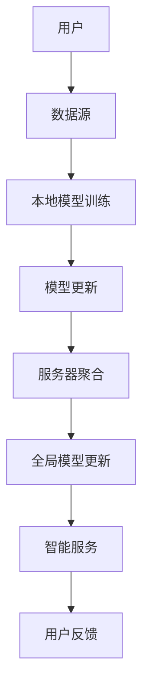

                 


# 《构建具有隐私保护学习能力的AI Agent》

---

## 关键词：
隐私保护、AI Agent、机器学习、数据安全、联邦学习、差分隐私

---

## 摘要：
本文详细探讨了如何构建一个具有隐私保护学习能力的AI Agent。首先，我们从隐私保护和AI Agent的基本概念出发，分析了两者结合的必要性与挑战。接着，我们深入讲解了隐私保护的核心原理和AI Agent的学习机制，探讨了联邦学习和差分隐私等关键技术。然后，我们从系统架构的角度，分析了如何设计一个既能保护隐私又能高效学习的AI Agent。最后，我们通过实际案例，展示了如何在项目中实现这些技术，并总结了最佳实践和注意事项。本文旨在为开发者和研究人员提供一个全面的技术指南，帮助他们在保护隐私的前提下，构建高效且智能的AI Agent。

---

## 正文：

### 第一部分：背景介绍

#### 第1章：隐私保护与AI Agent概述

##### 1.1 问题背景
- **数据隐私的重要性**  
  随着人工智能技术的快速发展，数据成为推动AI模型优化的核心资源。然而，数据的收集和使用也带来了隐私泄露的风险。如何在利用数据的同时保护用户隐私，成为当前技术领域的重要挑战。
  
- **AI Agent的发展现状**  
  AI Agent（智能代理）是一种能够自主感知环境并执行任务的智能体。它广泛应用于推荐系统、自动化决策、智能助手等领域。然而，传统的AI Agent在数据使用过程中往往忽视了隐私保护的问题。

- **隐私保护与AI Agent的结合需求**  
  随着隐私保护法规的不断完善（如GDPR），开发者需要在设计AI Agent时，考虑如何在不泄露用户隐私的前提下，实现模型的优化与功能的增强。

##### 1.2 问题描述
- **AI Agent的核心功能**  
  AI Agent需要具备学习能力、决策能力和交互能力。然而，这些能力的实现往往依赖于对用户数据的处理，这可能导致隐私泄露。

- **隐私泄露的风险**  
  数据在传输、存储和处理过程中，可能被未经授权的第三方获取，导致用户的隐私信息被滥用。

- **用户对隐私保护的需求**  
  用户越来越重视隐私保护，他们希望AI Agent在提供服务的同时，能够确保其数据的安全性和隐私性。

##### 1.3 问题解决思路
- **隐私保护的实现方法**  
  通过数据加密、数据匿名化、访问控制等技术，确保数据在处理过程中不会被未经授权的第三方获取。

- **AI Agent的学习机制**  
  基于联邦学习、差分隐私等技术，设计一种既能保护数据隐私，又能实现模型优化的学习机制。

- **隐私与性能的平衡**  
  在保护隐私的前提下，尽量减少对模型性能的影响，确保AI Agent的功能不受隐私保护措施的限制。

##### 1.4 边界与外延
- **隐私保护的边界**  
  隐私保护的核心在于保护用户的数据不被未经授权的第三方获取，但不涉及对模型本身的学习能力的限制。

- **AI Agent的应用场景**  
  AI Agent广泛应用于推荐系统、智能助手、自动驾驶等领域，这些场景对隐私保护的需求各不相同。

- **相关技术的对比**  
  隐私保护与数据加密、数据匿名化等技术密切相关，但也有区别。例如，数据加密侧重于数据的存储和传输安全，而隐私保护更关注数据在处理过程中的隐私性。

##### 1.5 概念结构与核心要素
- **隐私保护的核心要素**  
  - 数据加密与解密
  - 数据匿名化
  - 数据访问控制

- **AI Agent的功能模块**  
  - 学习模块
  - 决策模块
  - 交互模块

- **两者结合的逻辑关系**  
  隐私保护是AI Agent实现过程中的一项基础技术，通过隐私保护技术，确保AI Agent在学习和决策过程中不泄露用户隐私。

---

### 第二部分：核心概念与联系

#### 第2章：隐私保护的核心原理

##### 2.1 隐私保护的基本原理
- **数据加密与解密**  
  通过加密技术，确保数据在传输和存储过程中的安全性。解密技术用于合法用户对数据的访问。

- **数据匿名化技术**  
  将数据中的敏感信息进行匿名化处理，例如通过替换、加密、泛化等方法，使得数据无法被追溯到具体个人。

- **数据访问控制**  
  通过权限管理，确保只有授权的用户或系统才能访问敏感数据。

##### 2.2 AI Agent的学习机制
- **监督学习**  
  通过标注数据进行模型训练，确保模型能够准确识别输入数据的类别或标签。

- **无监督学习**  
  在没有标注数据的情况下，通过聚类、降维等技术，发现数据中的潜在模式。

- **强化学习**  
  通过与环境的交互，逐步优化模型的决策能力。

##### 2.3 隐私保护与AI Agent的结合
- **数据隐私与模型隐私的区别**  
  数据隐私关注的是数据本身的安全性，而模型隐私关注的是模型参数或中间结果的安全性。

- **隐私保护对AI Agent性能的影响**  
  隐私保护技术可能会增加计算开销，影响模型的训练速度和推理效率。

- **隐私保护与模型可解释性的关系**  
  隐私保护技术可能会影响模型的可解释性，但通过技术创新，可以在保护隐私的前提下，提高模型的可解释性。

##### 2.4 概念属性对比表格
| 概念 | 属性 |
|------|------|
| 隐私保护 | 数据加密、匿名化、访问控制 |
| AI Agent | 学习能力、决策能力、交互能力 |

##### 2.5 ER实体关系图
```mermaid
er
actor: 用户
agent: AI Agent
data: 数据
action: 行为
actor --> agent: 与AI Agent交互
agent --> data: 学习数据
agent --> action: 执行行为
```

---

### 第三部分：算法原理讲解

#### 第3章：隐私保护学习算法

##### 3.1 隐私保护学习的核心算法
- **联邦学习（Federated Learning）**  
  联邦学习是一种分布式机器学习技术，通过在多个设备或服务器之间共享模型参数，而不是共享数据，从而实现模型的联合训练。

- **差分隐私（Differential Privacy）**  
  差分隐私是一种通过在数据中添加噪声，使得单个数据点的贡献无法被识别，从而保护用户隐私的技术。

- **模型压缩与剪枝**  
  通过压缩模型参数或剪枝技术，减少模型的复杂度，降低对数据的依赖。

##### 3.2 算法原理的数学模型
- **差分隐私的数学公式**  
  对于两个相邻的数据集 \( D_1 \) 和 \( D_2 \)，差分隐私要求对于任意可能的输出结果 \( y \)，满足：
  $$
  P(y | D_1) \leq e^{\epsilon} \cdot P(y | D_2)
  $$
  其中，\( \epsilon \) 是隐私预算，控制隐私泄露的程度。

- **联邦学习的流程图**  
  ```mermaid
  graph TD
  A[数据源] --> B[本地模型训练]
  B --> C[模型更新]
  C --> D[服务器聚合模型]
  D --> E[全局模型更新]
  E --> F[返回更新模型]
  ```

- **差分隐私的Python实现示例**  
  ```python
  import numpy as np

  def add_noise(data, epsilon):
      noise = np.random.laplace(0, 1 / epsilon)
      return data + noise

  # 示例数据
  data = [1, 2, 3, 4, 5]
  epsilon = 0.1
  noisy_data = [add_noise(x, epsilon) for x in data]
  print(noisy_data)
  ```

---

### 第四部分：系统分析与架构设计

#### 第4章：系统分析与架构设计

##### 4.1 问题场景介绍
- **数据分布**  
  数据分布在不同的设备或服务器中，无法集中到一个地方进行处理。

- **隐私保护需求**  
  用户希望在不泄露个人数据的前提下，实现模型的联合训练。

##### 4.2 系统功能设计
- **数据采集**  
  从多个数据源采集数据，并进行匿名化处理。

- **模型训练**  
  使用联邦学习或差分隐私等技术，进行模型的分布式训练。

- **模型部署**  
  将训练好的模型部署到实际应用场景中，提供智能服务。

##### 4.3 系统架构设计


##### 4.4 系统接口设计
- **API接口**  
  - `POST /api/train`: 提交模型更新参数
  - `GET /api/model`: 获取全局模型

- **交互流程**  
  ```mermaid
  sequenceDiagram
  participant 用户
  participant 数据源
  participant 本地模型
  participant 服务器
  用户 -> 数据源: 获取数据
  数据源 -> 本地模型: 提供匿名化数据
  本地模型 -> 服务器: 提交模型更新
  服务器 -> 本地模型: 返回聚合模型
  ```

---

### 第五部分：项目实战

#### 第5章：项目实战

##### 5.1 环境安装
- **Python环境**  
  安装Python 3.8及以上版本。

- **依赖库安装**  
  ```bash
  pip install numpy pandas scikit-learn
  ```

##### 5.2 核心实现
- **联邦学习实现**  
  ```python
  import numpy as np

  def aggregate_models(models):
      # 简单的平均
      return np.mean(models, axis=0)

  def train_local_model(data, model):
      # 简单的线性回归
      model.fit(data)
      return model

  # 示例数据
  data = np.random.rand(100, 2)
  labels = np.random.rand(100, 1)

  # 初始化模型
  model = LinearRegression()
  model = train_local_model((data, labels), model)
  print("Local model trained.")

  # 模型聚合
  aggregated_model = aggregate_models([model])
  print("Global model updated.")
  ```

- **差分隐私实现**  
  ```python
  import numpy as np

  def add_noise(data, epsilon):
      noise = np.random.laplace(0, 1 / epsilon)
      return data + noise

  data = np.array([1, 2, 3, 4, 5])
  epsilon = 0.1
  noisy_data = add_noise(data, epsilon)
  print("Noisy data:", noisy_data)
  ```

##### 5.3 案例分析
- **案例背景**  
  假设我们有一个推荐系统，需要在保护用户隐私的前提下，优化推荐算法。

- **实现步骤**  
  1. 数据采集与匿名化
  2. 使用联邦学习进行模型训练
  3. 使用差分隐私保护用户数据
  4. 部署模型并提供推荐服务

##### 5.4 项目小结
- **关键点总结**  
  - 数据匿名化是隐私保护的第一步
  - 联邦学习和差分隐私是实现隐私保护的核心技术
  - 模型压缩与优化是平衡隐私与性能的关键

---

### 第六部分：最佳实践

#### 第6章：最佳实践

##### 6.1 小结
- 隐私保护是构建AI Agent的重要组成部分
- 联邦学习和差分隐私是实现隐私保护的核心技术
- 在实际应用中，需要根据具体场景选择合适的隐私保护技术

##### 6.2 注意事项
- **数据匿名化**  
  在数据采集和处理过程中，确保数据的匿名化，避免泄露用户身份。

- **模型优化**  
  在保护隐私的前提下，优化模型的性能，确保AI Agent的功能不受隐私保护技术的限制。

- **安全审计**  
  定期对系统进行安全审计，确保隐私保护技术的有效性。

##### 6.3 拓展阅读
- **相关书籍**  
  - 《数据隐私与保护》
  - 《人工智能的伦理与法律》

- **技术博客**  
  - [联邦学习官方文档](https://towardsdatascience.com/federated-learning-a-privacy-preserving-machine-learning-approach-630d892b8d4d)
  - [差分隐私技术详解](https://differentialprivacy.org/)

---

## 作者：
AI天才研究院/AI Genius Institute  
禅与计算机程序设计艺术 /Zen And The Art of Computer Programming

