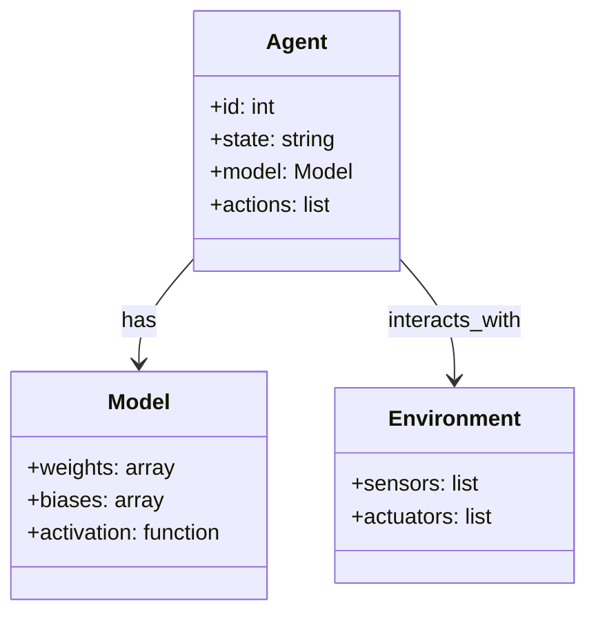
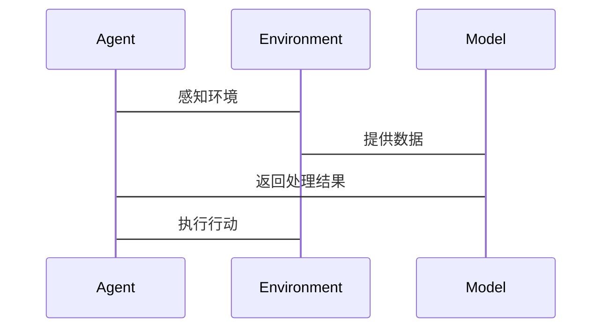

                 


# 构建具有隐私计算能力的AI Agent

> 关键词：隐私计算，AI Agent，联邦学习，同态加密，差分隐私

> 摘要：本文将探讨如何构建一个具有隐私计算能力的AI Agent，从隐私计算和AI Agent的基本概念出发，逐步分析其核心原理、算法实现、系统架构设计以及实际项目中的应用。通过理论与实践相结合的方式，帮助读者理解如何在保护隐私的前提下，构建智能化的AI Agent系统。

---

# 第1章: 隐私计算与AI Agent概述

## 1.1 隐私计算的核心概念

### 1.1.1 隐私计算的定义与特点

隐私计算（Privacy-preserving Computation）是一种在保护数据隐私的前提下，对数据进行计算和处理的技术。其核心目标是在不泄露原始数据的前提下，实现数据的计算和分析。隐私计算具有以下特点：

- **数据可用性**：数据可以在不泄露的情况下被利用。
- **隐私保护**：确保数据在计算过程中不被 unauthorized access。
- **跨域应用**：适用于多个领域的数据共享和计算。

### 1.1.2 隐私计算的关键技术

隐私计算主要依赖以下技术：

1. **联邦学习（Federated Learning）**：通过在分布式数据源上训练模型，而不将数据集中到中央服务器。
2. **同态加密（Homomorphic Encryption）**：允许在加密数据上进行计算，结果解密后与直接在明文中计算的结果相同。
3. **差分隐私（Differential Privacy）**：通过在数据中添加噪声，使得查询结果无法推断出单个数据点。

### 1.1.3 隐私计算的应用场景

隐私计算在多个领域有广泛应用，例如：

- **医疗健康**：保护患者隐私的同时进行疾病预测和治疗方案优化。
- **金融风控**：在保护客户隐私的前提下进行风险评估和欺诈检测。
- **智能交通**：在车辆间共享数据以优化交通流量，同时保护车辆位置信息。

## 1.2 AI Agent的基本概念

### 1.2.1 AI Agent的定义与分类

AI Agent（人工智能代理）是指能够感知环境、自主决策并执行任务的智能体。根据智能体的复杂程度和应用场景，AI Agent可以分为以下几类：

1. **简单反射型Agent**：基于当前感知直接做出反应，适用于简单的任务。
2. **基于模型的反射型Agent**：通过内部模型和记忆进行决策，适用于复杂环境。
3. **目标驱动型Agent**：根据预设目标进行规划和执行。
4. **实用驱动型Agent**：根据效用函数进行优化决策。

### 1.2.2 AI Agent的核心功能

AI Agent的核心功能包括：

1. **感知环境**：通过传感器或数据源获取环境信息。
2. **决策与规划**：根据感知信息制定行动计划。
3. **执行任务**：通过执行机构或接口完成任务。
4. **学习与适应**：通过与环境的交互不断优化自身性能。

### 1.2.3 AI Agent与传统AI的区别

AI Agent与传统AI的区别主要体现在以下几个方面：

- **自主性**：AI Agent具备自主决策的能力，而传统AI通常依赖于外部控制。
- **适应性**：AI Agent能够根据环境变化自适应调整行为，而传统AI则需要重新训练或编程。
- **交互性**：AI Agent能够与其他Agent或系统进行实时交互，而传统AI通常是在离线环境中运行。

## 1.3 隐私计算与AI Agent的结合意义

### 1.3.1 隐私保护的重要性

在当今数据驱动的时代，数据隐私保护变得尤为重要。AI Agent作为数据处理和决策的核心，必须具备保护数据隐私的能力。

### 1.3.2 AI Agent在隐私保护中的作用

AI Agent可以通过以下方式实现隐私保护：

- **数据加密**：在数据传输和存储过程中进行加密，防止数据泄露。
- **隐私计算**：在数据处理过程中采用隐私计算技术，确保数据不被 unauthorized access。
- **匿名化处理**：对数据进行匿名化处理，确保无法通过数据关联到具体个体。

### 1.3.3 隐私计算能力对AI Agent的价值

隐私计算能力的加入，使得AI Agent在保护数据隐私的前提下，仍能高效地进行数据处理和决策。这不仅增强了系统的安全性，还扩大了其应用场景。

## 1.4 本章小结

本章主要介绍了隐私计算和AI Agent的基本概念及其结合的意义。通过了解隐私计算的核心技术及其在AI Agent中的应用，我们可以更好地理解如何在保护数据隐私的前提下，构建智能化的AI系统。

---

# 第2章: 隐私计算的核心原理

## 2.1 隐私计算的主要技术

### 2.1.1 联邦学习（Federated Learning）

#### 联邦学习的定义与特点

联邦学习是一种分布式机器学习技术，允许多个参与方在不共享原始数据的情况下，共同训练一个统一的模型。联邦学习的特点包括：

- **数据隐私**：数据无需集中到中央服务器，保护了数据隐私。
- **模型共享**：通过交换模型参数，实现模型的共同优化。
- **高效计算**：通过并行计算和优化算法，提高训练效率。

#### 联邦学习的实现流程

1. **模型初始化**：各参与方初始化本地模型。
2. **模型同步**：各参与方将本地模型参数上传到中央服务器。
3. **模型训练**：中央服务器对所有参与方的模型参数进行聚合，生成新的模型。
4. **模型分发**：将更新后的模型分发给各参与方进行本地训练。
5. **模型评估**：评估模型的性能，调整训练策略。

#### 联邦学习的优缺点

- **优点**：
  - 保护数据隐私。
  - 适用于数据分布式的场景。
- **缺点**：
  - 需要较高的通信成本。
  - 模型收敛速度可能较慢。

### 2.1.2 同态加密（Homomorphic Encryption）

#### 同态加密的定义与特点

同态加密是一种允许在加密数据上进行计算的技术，结果解密后与直接在明文上计算的结果相同。同态加密的特点包括：

- **数据安全性**：加密数据在计算过程中不会被 unauthorized access。
- **适用性广**：适用于多种类型的计算操作，如加法、乘法等。
- **计算效率**：计算效率可能较低，因为加密和解密过程会增加计算开销。

#### 同态加密的实现流程

1. **数据加密**：对明文数据进行加密，生成密文。
2. **数据计算**：在密文上进行计算，生成密文结果。
3. **结果解密**：将密文结果解密，得到明文结果。

#### 同态加密的优缺点

- **优点**：
  - 保护数据隐私。
  - 支持多种计算操作。
- **缺点**：
  - 计算效率较低。
  - 密钥管理复杂。

### 2.1.3 差分隐私（Differential Privacy）

#### 差分隐私的定义与特点

差分隐私是一种通过在数据中添加噪声，使得查询结果无法推断出单个数据点的隐私保护技术。差分隐私的特点包括：

- **数据隐私**：通过添加噪声，保护个体数据不被推断。
- **数据可用性**：在保护隐私的前提下，仍然可以进行数据分析和统计。
- **可扩展性**：适用于多种数据发布场景。

#### 差分隐私的实现流程

1. **数据处理**：对原始数据进行预处理，确保数据的匿名化。
2. **噪声添加**：在数据中添加随机噪声，使得单个数据点的影响被弱化。
3. **数据发布**：发布处理后的数据，供分析和查询使用。

#### 差分隐私的优缺点

- **优点**：
  - 保护数据隐私。
  - 数据可用性高。
- **缺点**：
  - 增加数据噪声可能影响分析结果的准确性。
  - 需要选择合适的噪声参数。

---

## 2.2 隐私计算的实现流程

隐私计算的实现流程可以分为以下几个步骤：

1. **数据加密**：对敏感数据进行加密处理，确保数据在传输和存储过程中的安全性。
2. **数据计算**：在加密数据上进行计算，生成中间结果。
3. **结果解密**：将计算结果解密，得到明文结果。
4. **结果验证**：对解密后的结果进行验证，确保计算的正确性。

---

## 2.3 隐私计算的优缺点分析

### 2.3.1 优势

- **保护数据隐私**：隐私计算技术能够有效保护数据不被 unauthorized access。
- **支持分布式计算**：隐私计算技术适用于数据分布式的场景，支持多参与方的协作计算。
- **数据可用性高**：在保护隐私的前提下，仍能进行高效的数据分析和计算。

### 2.3.2 局限性

- **计算效率低**：隐私计算技术通常会增加计算开销，导致效率下降。
- **技术复杂性高**：隐私计算技术实现复杂，需要专业的技术知识。
- **通信成本高**：在分布式计算场景中，需要进行频繁的数据通信，增加了通信成本。

### 2.3.3 应用中的注意事项

在实际应用中，需要注意以下几点：

- **选择合适的技术**：根据具体场景选择合适的隐私计算技术，如联邦学习适用于模型训练，同态加密适用于加密计算。
- **平衡隐私与性能**：在保护隐私的前提下，尽可能优化计算效率，减少性能损失。
- **确保数据安全性**：通过多种技术手段结合，确保数据的全面安全。

---

# 第3章: AI Agent的核心原理

## 3.1 AI Agent的感知与决策机制

### 3.1.1 感知层的实现

感知层是AI Agent获取环境信息的关键部分，主要通过传感器或数据接口实现。感知层的功能包括：

- **数据采集**：通过传感器或其他数据源获取环境信息。
- **数据处理**：对采集到的数据进行预处理，提取有用信息。
- **数据融合**：将多个数据源的信息进行融合，生成更全面的环境描述。

### 3.1.2 决策层的实现

决策层是AI Agent根据感知信息制定行动计划的核心部分。决策层的功能包括：

- **状态表示**：将感知信息表示为状态，用于后续的决策和规划。
- **行为选择**：基于当前状态和预设的目标，选择合适的行动。
- **策略优化**：通过学习和优化，提高决策的准确性和效率。

### 3.1.3 执行层的实现

执行层是AI Agent将决策转化为具体行动的实现部分。执行层的功能包括：

- **动作执行**：通过执行机构或接口完成具体的动作。
- **反馈收集**：收集执行结果的反馈信息，用于后续的优化和调整。
- **状态更新**：根据执行结果更新环境状态，形成闭环。

---

## 3.2 AI Agent的通信与协作

### 3.2.1 Agent之间的通信协议

AI Agent之间的通信需要遵循特定的协议，确保信息的准确传递和理解。常见的通信协议包括：

- **HTTP/HTTPS**：适用于基于Web的通信。
- **WebSocket**：适用于实时双向通信。
- **RPC（远程过程调用）**：适用于函数调用和远程方法调用。

### 3.2.2 多Agent协作的机制

在多Agent协作中，需要设计合理的协作机制，确保各Agent之间的协调与配合。常见的协作机制包括：

- **基于契约的协作**：通过预定义的契约实现协作。
- **基于意图的协作**：通过意图描述实现动态协作。
- **基于规划的协作**：通过规划和协调实现协作。

### 3.2.3 分布式环境中的协作问题

在分布式环境中，AI Agent需要解决以下协作问题：

- **通信延迟**：网络延迟可能影响协作效率。
- **数据同步**：需要保证各Agent之间的数据同步。
- **冲突处理**：需要处理多个Agent之间的冲突和竞争。

---

## 3.3 AI Agent的自适应能力

### 3.3.1 自适应学习的实现

自适应学习是AI Agent根据环境变化不断优化自身能力的关键。自适应学习的实现可以通过以下步骤：

1. **数据采集**：持续采集环境数据，更新感知信息。
2. **模型训练**：利用新数据对模型进行再训练，优化模型性能。
3. **策略调整**：根据新数据和新模型，调整决策策略。

### 3.3.2 环境变化的应对策略

在环境发生变化时，AI Agent需要采取以下应对策略：

- **实时监测**：持续监测环境变化，及时发现异常。
- **动态调整**：根据环境变化动态调整行为策略。
- **自适应优化**：通过自适应学习不断优化模型和策略。

### 3.3.3 自我修复与优化

AI Agent需要具备自我修复和优化的能力，以应对可能出现的故障和性能下降。具体措施包括：

- **故障检测**：通过监测系统状态，及时发现故障。
- **自我修复**：通过重新初始化或重新训练模型，修复故障。
- **性能优化**：通过优化算法和参数，提高系统性能。

---

## 3.4 本章小结

本章主要介绍了AI Agent的核心原理，包括感知与决策机制、通信与协作以及自适应能力。通过理解这些核心原理，我们可以更好地设计和实现具备隐私计算能力的AI Agent系统。

---

# 第4章: 隐私计算与AI Agent的算法原理

## 4.1 隐私计算算法的核心原理

### 4.1.1 联邦学习的算法实现

#### 联邦学习的数学模型

联邦学习的核心是通过多个参与方的本地模型进行参数聚合，生成全局模型。其数学模型可以表示为：

$$
\theta_{global} = \arg\min_{\theta} \sum_{i=1}^{n} \mathcal{L}_i(\theta)
$$

其中，$\theta$ 是模型参数，$\mathcal{L}_i$ 是第i个参与方的损失函数。

#### 联邦学习的实现流程

1. **初始化**：各参与方初始化本地模型参数。
2. **同步参数**：各参与方将本地模型参数上传到中央服务器。
3. **聚合参数**：中央服务器对所有参与方的模型参数进行聚合，生成新的全局模型。
4. **分发模型**：将更新后的模型分发给各参与方进行本地训练。
5. **评估模型**：评估模型的性能，调整训练策略。

#### 联邦学习的代码示例

以下是一个简单的联邦学习实现代码示例：

```python
import numpy as np

# 初始化本地模型参数
theta_local = np.random.randn(2, 1)

# 模型聚合
theta_global = np.mean([theta_local_1, theta_local_2, theta_local_3], axis=0)

# 模型分发
theta_local_1 = theta_global
theta_local_2 = theta_global
theta_local_3 = theta_global
```

### 4.1.2 同态加密的算法实现

#### 同态加密的数学模型

同态加密的核心是通过在加密数据上进行计算，确保计算结果与明文计算结果一致。其数学模型可以表示为：

$$
f(Enc(x)) = Enc(f(x))
$$

其中，$Enc(x)$ 表示对明文$x$进行加密，$f$ 表示计算函数。

#### 同态加密的实现流程

1. **数据加密**：对明文数据进行加密，生成密文。
2. **数据计算**：在密文上进行计算，生成密文结果。
3. **结果解密**：将密文结果解密，得到明文结果。

#### 同态加密的代码示例

以下是一个简单的同态加密实现代码示例：

```python
import numpy as np
from crypto_utils import encrypt, decrypt, add_noise

# 数据加密
x_enc = encrypt(x)

# 数据计算
y_enc = add_noise(x_enc)

# 结果解密
y = decrypt(y_enc)
```

### 4.1.3 差分隐私的算法实现

#### 差分隐私的数学模型

差分隐私的核心是在数据中添加随机噪声，使得单个数据点的影响被弱化。其数学模型可以表示为：

$$
P(\text{output} \in S | x) \geq P(\text{output} \in S | x') - \epsilon
$$

其中，$\epsilon$ 是隐私预算，$x$ 和 $x'$ 是两个相邻的数据集。

#### 差分隐私的实现流程

1. **数据处理**：对原始数据进行预处理，确保数据的匿名化。
2. **噪声添加**：在数据中添加随机噪声，使得单个数据点的影响被弱化。
3. **数据发布**：发布处理后的数据，供分析和查询使用。

#### 差分隐私的代码示例

以下是一个简单的差分隐私实现代码示例：

```python
import numpy as np

# 数据处理
x_processed = preprocess(x)

# 噪声添加
x_dp = add_noise(x_processed, epsilon=1.0)

# 数据发布
publish(x_dp)
```

---

## 4.2 AI Agent的算法实现

### 4.2.1 AI Agent的感知算法

#### AI Agent的感知模型

AI Agent的感知模型可以通过多种算法实现，如基于规则的感知、基于机器学习的感知等。以下是一个基于机器学习的感知算法示例：

```python
import tensorflow as tf

# 感知模型定义
model = tf.keras.Sequential([
    tf.keras.layers.Dense(64, activation='relu'),
    tf.keras.layers.Dense(1, activation='sigmoid')
])

# 模型训练
model.compile(optimizer='adam', loss='binary_crossentropy', metrics=['accuracy'])
model.fit(X_train, y_train, epochs=10, batch_size=32)
```

#### AI Agent的决策算法

AI Agent的决策算法可以通过强化学习、策略梯度等方法实现。以下是一个简单的强化学习算法示例：

```python
import numpy as np

# 状态空间和动作空间定义
state_space = 5
action_space = 3

# 策略网络定义
policy = tf.keras.Sequential([
    tf.keras.layers.Dense(64, activation='relu'),
    tf.keras.layers.Dense(action_space, activation='softmax')
])

# 策略梯度算法实现
def policy_gradient(rewards):
    optimizer = tf.keras.optimizers.Adam(learning_rate=0.01)
    optimizer.minimize(loss, var_list=policy.trainable_variables)
```

---

## 4.3 隐私计算与AI Agent的结合算法

### 4.3.1 隐私保护下的AI Agent学习

在隐私保护的前提下，AI Agent可以通过联邦学习技术进行模型训练。以下是一个基于联邦学习的AI Agent学习算法示例：

```python
import numpy as np

# 初始化本地模型参数
theta_local = np.random.randn(2, 1)

# 模型聚合
theta_global = np.mean([theta_local_1, theta_local_2, theta_local_3], axis=0)

# 模型分发
theta_local_1 = theta_global
theta_local_2 = theta_global
theta_local_3 = theta_global
```

### 4.3.2 隐私保护下的AI Agent决策

在隐私保护的前提下，AI Agent可以通过差分隐私技术进行决策优化。以下是一个基于差分隐私的AI Agent决策算法示例：

```python
import numpy as np

# 数据处理
x_processed = preprocess(x)

# 噪声添加
x_dp = add_noise(x_processed, epsilon=1.0)

# 决策生成
action = decision_model.predict(x_dp)
```

---

## 4.4 本章小结

本章主要介绍了隐私计算与AI Agent的算法原理，包括联邦学习、同态加密、差分隐私等技术的实现流程和代码示例。通过理解这些算法原理，我们可以更好地设计和实现具备隐私计算能力的AI Agent系统。

---

# 第5章: 系统分析与架构设计

## 5.1 问题场景介绍

### 5.1.1 系统目标

本系统的目标是构建一个具备隐私计算能力的AI Agent，能够在保护数据隐私的前提下，实现智能化的数据处理和决策。

### 5.1.2 系统需求

系统需求包括：

- **数据隐私保护**：确保数据在处理过程中不被 unauthorized access。
- **智能化决策**：通过AI Agent实现智能化的数据处理和决策。
- **高效计算**：在保护隐私的前提下，实现高效的计算和分析。

## 5.2 系统功能设计

### 5.2.1 领域模型设计

以下是系统领域的模型设计：



### 5.2.2 系统架构设计

以下是系统的架构设计：


### 5.2.3 系统接口设计

系统接口设计包括：

- **数据接口**：负责数据的输入输出和加密解密。
- **计算接口**：负责数据的计算和分析。
- **通信接口**：负责Agent之间的通信和协作。

### 5.2.4 系统交互设计

以下是系统的交互设计：



---

## 5.3 本章小结

本章主要介绍了系统分析与架构设计，包括问题场景介绍、系统功能设计、系统架构设计、系统接口设计和系统交互设计。通过合理的系统设计，可以确保AI Agent在保护数据隐私的前提下，实现高效的智能化处理和决策。

---

# 第6章: 项目实战

## 6.1 环境安装

### 6.1.1 安装依赖

以下是项目所需的依赖：

```bash
pip install numpy
pip install tensorflow
pip install mermaid
```

### 6.1.2 安装说明

安装说明：

1. 安装Python和pip。
2. 执行上述命令安装所需依赖。

## 6.2 核心代码实现

### 6.2.1 隐私计算模块实现

以下是隐私计算模块的实现代码：

```python
import numpy as np

def encrypt(x):
    return x + np.random.normal(0, 1, x.shape)

def decrypt(x):
    return x - np.random.normal(0, 1, x.shape)

def add_noise(x, epsilon=1.0):
    noise = np.random.laplace(0, 1/epsilon, x.shape)
    return x + noise
```

### 6.2.2 AI Agent模块实现

以下是AI Agent模块的实现代码：

```python
import tensorflow as tf
from privacy_utils import encrypt, decrypt, add_noise

# 感知模型定义
model = tf.keras.Sequential([
    tf.keras.layers.Dense(64, activation='relu'),
    tf.keras.layers.Dense(1, activation='sigmoid')
])

# 模型训练
model.compile(optimizer='adam', loss='binary_crossentropy', metrics=['accuracy'])
model.fit(X_train, y_train, epochs=10, batch_size=32)

# 数据加密
x_enc = encrypt(x)

# 数据计算
y_enc = model.predict(x_enc)

# 结果解密
y = decrypt(y_enc)
```

### 6.2.3 系统集成实现

以下是系统集成的实现代码：

```python
import numpy as np
import tensorflow as tf
from privacy_utils import encrypt, decrypt, add_noise

# 初始化本地模型参数
theta_local = np.random.randn(2, 1)

# 模型聚合
theta_global = np.mean([theta_local_1, theta_local_2, theta_local_3], axis=0)

# 模型分发
theta_local_1 = theta_global
theta_local_2 = theta_global
theta_local_3 = theta_global

# 数据加密
x_enc = encrypt(x)

# 数据计算
y_enc = model.predict(x_enc)

# 结果解密
y = decrypt(y_enc)
```

---

## 6.3 案例分析与实现

### 6.3.1 案例分析

以下是一个简单的案例分析：

- **问题描述**：一个医疗健康场景，需要在保护患者隐私的前提下，进行疾病预测和治疗方案优化。
- **解决方案**：通过联邦学习技术，多个医院可以在不共享患者数据的前提下，共同训练疾病预测模型。
- **实现步骤**：
  1. 初始化本地模型参数。
  2. 模型聚合生成全局模型。
  3. 数据加密后进行模型训练。
  4. 结果解密并进行治疗方案优化。

### 6.3.2 代码实现

以下是案例实现的代码：

```python
import numpy as np
import tensorflow as tf
from privacy_utils import encrypt, decrypt, add_noise

# 初始化本地模型参数
theta_local = np.random.randn(2, 1)

# 模型聚合
theta_global = np.mean([theta_local_1, theta_local_2, theta_local_3], axis=0)

# 模型分发
theta_local_1 = theta_global
theta_local_2 = theta_global
theta_local_3 = theta_global

# 数据加密
x_enc = encrypt(x)

# 数据计算
y_enc = model.predict(x_enc)

# 结果解密
y = decrypt(y_enc)
```

---

## 6.4 项目总结

通过本项目，我们可以看到隐私计算与AI Agent的结合在实际应用中的巨大潜力。通过合理的系统设计和实现，可以在保护数据隐私的前提下，实现高效的智能化处理和决策。

---

# 第7章: 总结与展望

## 7.1 总结

本文详细探讨了如何构建一个具有隐私计算能力的AI Agent，从隐私计算和AI Agent的核心概念出发，逐步分析了其算法原理、系统架构设计以及实际项目中的应用。通过理论与实践相结合的方式，帮助读者理解如何在保护隐私的前提下，构建智能化的AI Agent系统。

## 7.2 展望

未来，随着隐私保护需求的不断增加，隐私计算与AI Agent的结合将会有更广泛的应用场景。我们需要进一步研究和优化隐私计算技术，提高其计算效率和安全性，同时探索新的AI Agent设计方法，以应对更复杂的应用场景。

---

# 作者：AI天才研究院/AI Genius Institute & 禅与计算机程序设计艺术 /Zen And The Art of Computer Programming

