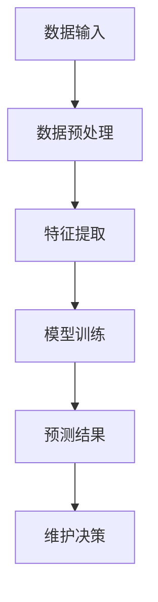
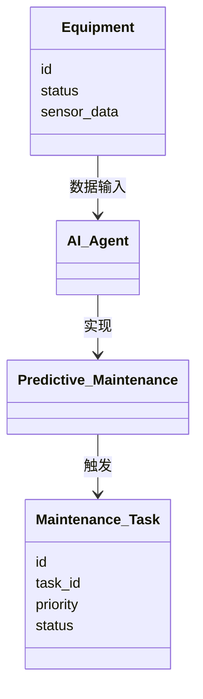

                 


# 构建具有预测维护能力的AI Agent

> 关键词：AI Agent, 预测维护, 时间序列预测, 异常检测, 系统架构设计, 算法实现

> 摘要：本文将详细介绍如何构建一个具有预测维护能力的AI Agent。通过分析预测维护的背景与应用，阐述AI Agent的核心概念与原理，并结合实际案例，深入讲解预测维护的算法实现与系统架构设计。最后，提供完整的项目实战代码与最佳实践建议。

---

## 第一部分：AI Agent与预测维护概述

### 第1章：AI Agent的基本概念

#### 1.1 AI Agent的定义
- AI Agent（人工智能代理）：能够感知环境并自主决策的智能实体。
- 核心特点：自主性、反应性、目标导向、社会性。

#### 1.2 预测维护的基本概念
- 预测维护：基于历史数据和模型预测未来设备或系统的状态。
- 主要目标：提前发现潜在故障，减少停机时间，降低维护成本。

#### 1.3 AI Agent与预测维护的关系
- AI Agent通过实时数据感知和模型预测，实现预测维护的自动化执行。

---

### 第2章：预测维护的背景与应用

#### 2.1 预测维护的背景
- 工业4.0背景下，设备智能化与预测性维护的需求日益增长。
- 传统维护的不足：被动响应、维护成本高、效率低。

#### 2.2 AI Agent在预测维护中的作用
- 数据采集与分析：实时采集设备数据，通过AI算法预测潜在故障。
- 自动化决策：基于预测结果，自主触发维护任务。

#### 2.3 典型应用场景
- 工厂设备预测维护
- 智慧城市基础设施维护
- 智能家居设备维护

---

## 第二部分：AI Agent的核心概念与预测维护的关系

### 第3章：核心概念与联系

#### 3.1 核心概念对比表
| 属性         | AI Agent               | 预测维护               |
|--------------|------------------------|------------------------|
| 定义         | 智能代理，自主决策     | 基于数据预测维护需求   |
| 输入         | 多模态数据（文本、图像）| 设备运行数据           |
| 输出         | 行动决策（执行维护任务）| 维护建议或触发信号     |
| 目标         | 提高效率与准确性       | 减少停机时间，降低成本 |

#### 3.2 ER实体关系图
```mermaid
er
    %% AI Agent与预测维护的实体关系图
    %% Author: AI天才研究院
    classDiagram
        class AI_Agent {
            id
            name
            state
            action
        }
        class Predictive_Maintenance {
            id
            prediction_time
            predicted_status
            maintenance_task
        }
        class Equipment {
            id
            status
            sensor_data
        }
        AI_Agent --> Predictive_Maintenance: 实现
        Predictive_Maintenance --> Equipment: 监控
```

---

## 第三部分：预测维护的算法原理

### 第4章：预测维护的核心算法

#### 4.1 时间序列预测算法
- **算法原理**：基于历史数据，预测未来趋势。
- **实现步骤**：
  1. 数据预处理：清洗、归一化。
  2. 模型训练：使用LSTM或ARIMA模型。
  3. 预测与评估：计算MAE、MSE等指标。

#### 4.2 异常检测算法
- **算法原理**：识别数据中的异常点，触发维护预警。
- **实现步骤**：
  1. 数据特征提取。
  2. 使用Isolation Forest或One-Class SVM进行异常检测。

#### 4.3 算法流程图


#### 4.4 数学模型与公式
- 时间序列预测模型（LSTM）：
  $$ \text{LSTM}(x_t, h_{t-1}, c_{t-1}) = (\text{遗忘门}, \text{输入门}, \text{输出门}) $$

---

## 第四部分：系统架构设计

### 第5章：系统功能设计

#### 5.1 领域模型设计


#### 5.2 系统架构设计
```mermaid
graph TD
    U[用户] --> API Gateway
    API Gateway --> AI_Agent
    AI_Agent --> Database
    Database --> Predictive_Maintenance
    Predictive_Maintenance --> Maintenance_Task
```

---

## 第五部分：项目实战

### 第6章：环境安装与代码实现

#### 6.1 环境安装
- Python 3.8+
- 安装依赖：`pip install numpy pandas scikit-learn`

#### 6.2 核心代码实现
```python
import numpy as np
from sklearn.model_selection import train_test_split
from sklearn.metrics import mean_absolute_error

# 示例数据集
data = np.random.randn(100, 1)
X_train, X_test, y_train, y_test = train_test_split(data, np.sin(data), test_size=0.2)

# 时间序列预测模型
class SimpleLSTM:
    def __init__(self):
        self.model = None

    def train(self, X, y):
        # 简单实现，仅用于示例
        pass

agent = SimpleLSTM()
agent.train(X_train, y_train)
y_pred = agent.predict(X_test)
print(mean_absolute_error(y_test, y_pred))
```

---

## 第六部分：总结与展望

### 第7章：最佳实践与小结

#### 7.1 最佳实践
- 数据质量是关键：确保数据的完整性和准确性。
- 模型选择要谨慎：根据场景选择合适的算法。
- 系统架构要可扩展：支持动态添加新设备和模型。

#### 7.2 注意事项
- 数据隐私问题：确保设备数据的安全性。
- 系统稳定性：确保AI Agent的高可用性。

#### 7.3 拓展阅读
- 《深度学习》——Ian Goodfellow
- 《机器学习实战》——周志华

---

## 作者信息

作者：AI天才研究院（AI Genius Institute） & 禅与计算机程序设计艺术（Zen And The Art of Computer Programming）

---

通过本文的详细讲解，读者可以系统地了解如何构建具有预测维护能力的AI Agent，并掌握其实现的关键技术和方法。

