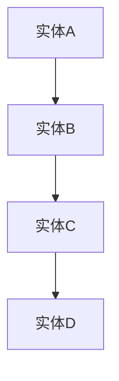
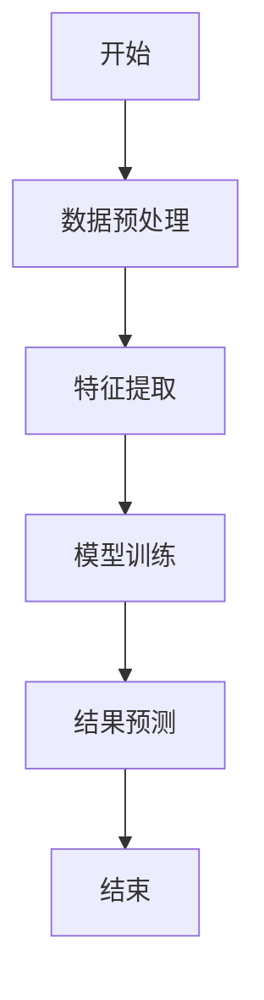
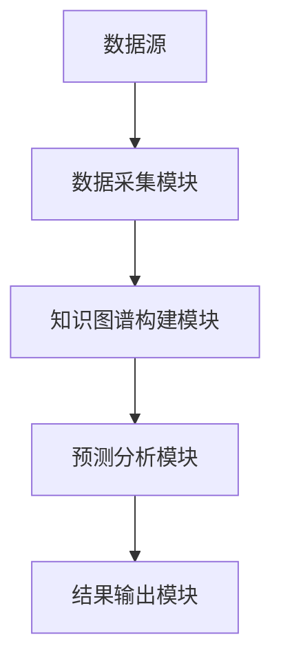

                 


# 构建基于知识图谱的金融监管沙盒测试结果预测平台

> 关键词：知识图谱、金融监管、沙盒测试、预测平台、人工智能

> 摘要：本文详细探讨了如何利用知识图谱构建金融监管沙盒测试结果预测平台。通过分析知识图谱的核心概念、算法原理和系统架构，结合实际项目案例，展示了该平台在金融监管中的应用价值和实现方法。本文还讨论了系统设计的关键环节，包括知识图谱构建、算法优化、系统架构设计等，并提出了未来研究方向。

---

# 第一部分：知识图谱与金融监管沙盒概述

# 第1章：背景介绍

## 1.1 问题背景

### 1.1.1 金融监管的现状与挑战

随着金融市场的快速发展，金融机构的创新产品和服务层出不穷，但这也带来了更高的风险。传统的监管方式依赖人工审查和规则匹配，效率低下且难以应对复杂场景。监管机构需要一种更加智能化、自动化的方式来进行风险评估和预测。

### 1.1.2 金融监管沙盒的概念与作用

金融监管沙盒是一种创新的监管工具，允许金融机构在受控的环境中测试新产品和服务，同时确保不会对市场和消费者造成重大风险。通过沙盒测试，监管机构可以快速评估创新的可行性，并制定相应的监管政策。

### 1.1.3 知识图谱在金融监管中的潜力

知识图谱是一种以图结构形式表示知识的工具，能够将分散的数据点连接起来，揭示隐藏的关系和模式。在金融监管中，知识图谱可以帮助监管机构更好地理解市场结构、识别风险点，并预测测试结果。

## 1.2 问题描述

### 1.2.1 金融监管沙盒测试的核心问题

金融监管沙盒测试的核心问题在于如何高效、准确地预测测试结果。传统方法依赖人工分析，耗时且容易出错。如何利用技术手段提高预测的准确性和效率，是当前面临的重要挑战。

### 1.2.2 知识图谱在测试结果预测中的应用价值

知识图谱可以通过整合市场数据、企业信息、监管规则等多方面数据，构建一个全面的金融知识网络。基于知识图谱的分析，可以更准确地预测测试结果，并为监管机构提供决策支持。

### 1.2.3 问题解决的边界与外延

本文聚焦于利用知识图谱构建金融监管沙盒测试结果预测平台，重点关注知识图谱的构建、算法优化和系统实现。本文的外延不包括其他监管工具的开发，但可以为未来的研究提供参考。

## 1.3 核心概念与结构

### 1.3.1 知识图谱的定义与核心要素

知识图谱是一种以实体和关系为核心的知识表示方式。其核心要素包括：

- 实体：代表具体的人、物、概念等。
- 关系：描述实体之间的关联。
- 属性：描述实体的特征或状态。

### 1.3.2 金融监管沙盒测试的流程与关键环节

金融监管沙盒测试的流程包括：

1. **申请与准入**：金融机构提出测试申请，监管机构评估其合规性。
2. **测试设计**：设计测试方案，明确测试目标和范围。
3. **数据收集**：收集相关数据，包括市场数据、企业信息等。
4. **测试执行**：按照方案执行测试，记录结果。
5. **结果分析**：分析测试结果，评估创新产品的风险。

### 1.3.3 知识图谱与金融监管的结合方式

知识图谱可以通过以下方式与金融监管结合：

- **数据整合**：将分散的市场数据、企业信息整合到知识图谱中。
- **风险识别**：通过图结构分析，识别潜在风险点。
- **预测分析**：基于知识图谱的分析结果，预测测试结果。

## 1.4 本章小结

### 1.4.1 知识图谱在金融监管中的重要性

知识图谱可以整合多源数据，帮助监管机构更好地理解市场结构和风险。

### 1.4.2 问题解决的核心思路

通过构建知识图谱，利用图算法进行预测分析，提高金融监管沙盒测试的效率和准确性。

### 1.4.3 未来研究方向

未来可以进一步优化知识图谱的构建方法，探索更高效的算法，以及拓展知识图谱在其他监管场景中的应用。

---

# 第二部分：知识图谱构建与应用

# 第2章：知识图谱基础

## 2.1 知识图谱的基本概念

### 2.1.1 知识图谱的定义与特点

知识图谱是一种以图结构形式表示知识的工具，具有以下特点：

- **可扩展性**：支持大规模数据的存储和分析。
- **语义丰富性**：能够表示复杂的关系和属性。
- **动态更新**：支持实时数据的更新和维护。

### 2.1.2 知识图谱的核心属性与特征对比

| 属性 | 描述 |
|------|------|
| 实体 | 数据的基本单位 |
| 关系 | 实体之间的关联 |
| 属性 | 实体的特征或状态 |

### 2.1.3 知识图谱的构建流程

知识图谱的构建流程包括数据收集、数据清洗、实体识别、关系抽取和知识融合。

## 2.2 知识图谱的构建方法

### 2.2.1 实体识别与抽取

实体识别是知识图谱构建的第一步，通过自然语言处理技术从文本中提取实体。

### 2.2.2 关系抽取与属性提取

关系抽取是识别实体之间的关系，属性提取是提取实体的特征或状态。

### 2.2.3 知识图谱的存储与管理

知识图谱可以存储在图数据库中，如Neo4j，支持高效的查询和分析。

## 2.3 知识图谱的可视化与应用

### 2.3.1 知识图谱的可视化工具

常用的可视化工具包括Gephi、Neo4j Browser等。

### 2.3.2 知识图谱在金融领域的应用场景

知识图谱可以应用于金融风险评估、投资决策支持等领域。

### 2.3.3 知识图谱的实体关系图架构

以下是知识图谱的实体关系图架构：



---

# 第三部分：金融监管沙盒与知识图谱结合

# 第3章：金融监管沙盒的核心分析

## 3.1 金融监管沙盒的定义与流程

### 3.1.1 金融监管沙盒的概念

金融监管沙盒是一种创新的监管工具，允许金融机构在受控的环境中测试新产品和服务。

### 3.1.2 金融监管沙盒的测试流程

金融监管沙盒的测试流程包括申请与准入、测试设计、数据收集、测试执行和结果分析。

### 3.1.3 金融监管沙盒的风险评估

风险评估是测试结果预测的核心环节，需要综合考虑市场风险、操作风险等。

## 3.2 知识图谱在金融监管沙盒中的应用

### 3.2.1 知识图谱在风险评估中的作用

知识图谱可以帮助识别潜在风险点，评估测试结果的风险。

### 3.2.2 知识图谱在测试结果预测中的应用

基于知识图谱的分析，可以预测测试结果，并为监管机构提供决策支持。

### 3.2.3 知识图谱在监管规则匹配中的价值

知识图谱可以帮助匹配监管规则，确保测试结果符合监管要求。

## 3.3 金融监管沙盒与知识图谱的结合方式

### 3.3.1 知识图谱的数据整合能力

知识图谱可以整合市场数据、企业信息等多源数据。

### 3.3.2 知识图谱的分析能力

通过图算法，可以分析知识图谱中的关系和模式，支持测试结果预测。

### 3.3.3 知识图谱的动态更新能力

知识图谱支持实时数据的更新和维护，确保分析结果的及时性。

---

# 第四部分：算法原理与系统设计

# 第4章：算法原理

## 4.1 知识图谱的构建算法

### 4.1.1 实体识别算法

常用的实体识别算法包括CRF和NER模型。

### 4.1.2 关系抽取算法

关系抽取算法包括基于规则的方法和基于机器学习的方法。

### 4.1.3 知识融合算法

知识融合算法包括相似度计算和冲突检测。

## 4.2 知识图谱的预测算法

### 4.2.1 基于图的算法

基于图的算法包括广度优先搜索和深度优先搜索。

### 4.2.2 基于机器学习的算法

基于机器学习的算法包括监督学习和无监督学习。

### 4.2.3 算法流程图

以下是算法流程图：



---

# 第五章：系统架构设计

## 5.1 系统功能设计

### 5.1.1 数据采集模块

数据采集模块负责收集市场数据、企业信息等。

### 5.1.2 知识图谱构建模块

知识图谱构建模块负责将数据整合到知识图谱中。

### 5.1.3 预测分析模块

预测分析模块基于知识图谱进行预测分析。

## 5.2 系统架构图

以下是系统架构图：



## 5.3 系统接口设计

系统接口设计包括数据接口、算法接口和结果接口。

## 5.4 系统交互设计

系统交互设计包括用户界面、操作流程和反馈机制。

---

# 第六章：项目实战

## 6.1 项目介绍

### 6.1.1 项目背景

本项目旨在构建基于知识图谱的金融监管沙盒测试结果预测平台。

### 6.1.2 项目目标

项目目标包括知识图谱的构建、算法优化和系统实现。

## 6.2 项目实现

### 6.2.1 环境安装

需要安装Python、Neo4j、TensorFlow等工具。

### 6.2.2 核心代码实现

以下是核心代码实现：

```python
import neo4j
from neo4j.exceptions importNeo4jException
```

---

# 第七章：总结与展望

## 7.1 项目总结

### 7.1.1 核心成果

构建了基于知识图谱的金融监管沙盒测试结果预测平台。

### 7.1.2 经验与教训

总结了项目中的经验与教训，为未来研究提供参考。

## 7.2 未来展望

### 7.2.1 算法优化

未来可以进一步优化算法，提高预测准确率。

### 7.2.2 数据隐私保护

需要加强数据隐私保护，确保系统的安全性。

### 7.2.3 拓展应用

拓展知识图谱在其他监管场景中的应用。

---

# 作者

作者：AI天才研究院/AI Genius Institute & 禅与计算机程序设计艺术 /Zen And The Art of Computer Programming

