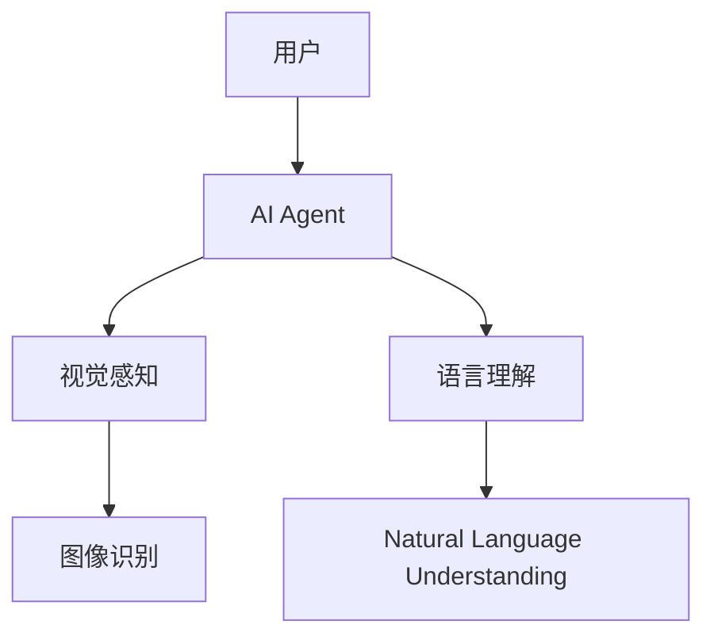
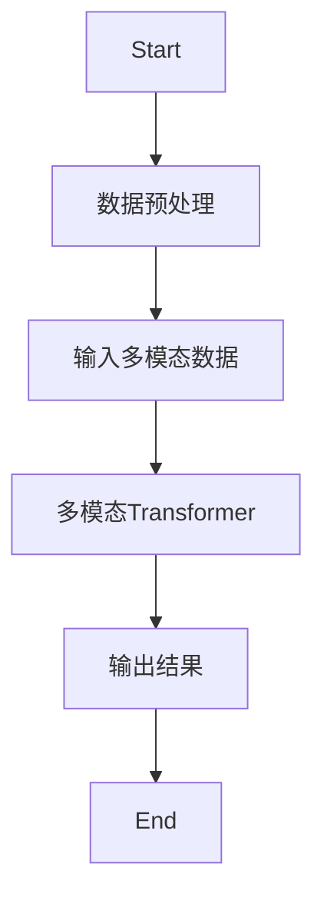
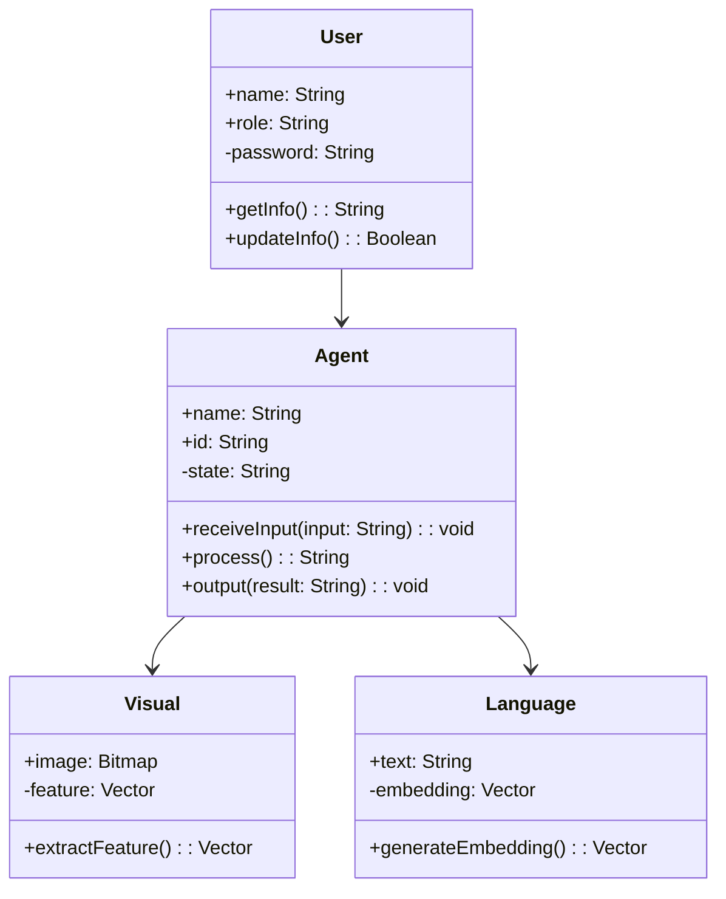
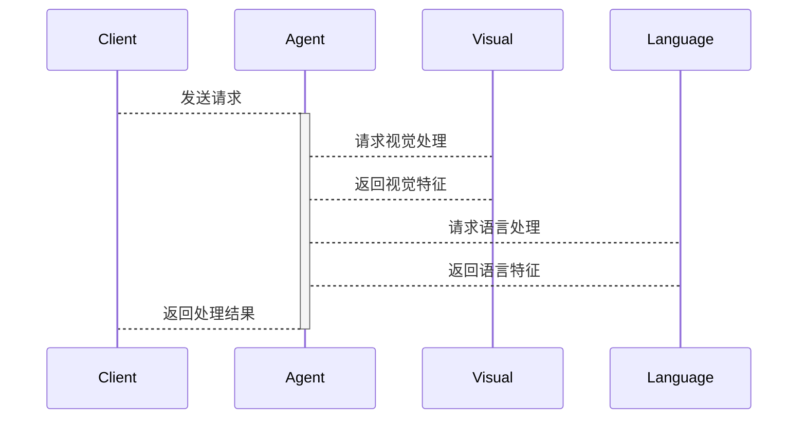

                 


# 构建多模态AI Agent：整合视觉和语言能力

> 关键词：多模态AI Agent, 视觉语言整合, 多模态数据, AI Agent架构, 多模态模型

> 摘要：本文深入探讨了如何构建一个多模态AI Agent，整合视觉和语言能力。通过详细分析多模态数据的特性和处理方法，结合多模态Transformer模型的原理，展示如何设计和实现一个多模态AI Agent系统。文章从背景介绍到系统实战，层层递进，为读者提供全面的技术指导。

---

# 第1章: 多模态AI Agent的背景与概念

## 1.1 多模态AI Agent的背景与发展

### 1.1.1 多模态AI的演进
- 从单模态到多模态的演变：从单一数据源到多源整合的必要性。
- 多模态数据的优势：结合视觉和语言信息，提升AI系统的理解和决策能力。
- 当前发展趋势：多模态AI在自然语言处理和计算机视觉领域的融合应用。

### 1.1.2 多模态AI的定义与特点
- 定义：多模态AI是指能够处理和理解多种数据形式（如文本、图像、语音等）的人工智能系统。
- 特点：信息互补性、任务多样性、系统复杂性。

### 1.1.3 应用场景与优势
- 场景：智能助手、自动驾驶、机器人控制等。
- 优势：提升用户体验，增强系统感知能力，提高任务准确性。

## 1.2 AI Agent的基本概念

### 1.2.1 AI Agent的定义
- AI Agent：能够感知环境并采取行动以实现目标的智能实体。
- 分类：简单反射型、基于模型的反应型、目标驱动型、实用驱动型。

### 1.2.2 核心功能与能力
- 感知能力：通过多种模态数据理解环境。
- 决策能力：基于感知信息做出最优决策。
- 交互能力：与用户或环境进行有效沟通。

### 1.2.3 应用作用
- 提供智能服务：如智能助手、虚拟客服。
- 优化效率：如工业自动化中的AI Agent。

## 1.3 多模态AI Agent的整合与挑战

### 1.3.1 视觉与语言模态的整合
- 视觉数据：图像识别、目标检测。
- 语言数据：自然语言处理、文本分析。

### 1.3.2 多模态数据的处理与融合
- 数据融合：特征提取、注意力机制、联合学习。
- 挑战：数据异构性、信息冗余、计算复杂度。

### 1.3.3 实现难点与解决方案
- 数据对齐：解决不同模态数据的时间、空间对齐问题。
- 跨模态理解：通过跨模态对比学习提升理解能力。

# 第2章: 多模态数据与模型的核心概念

## 2.1 多模态数据的属性与特征

### 2.1.1 视觉数据的特征
- 图像数据：RGB值、空间结构。
- 视频数据：帧率、运动信息。

### 2.1.2 语言数据的特征
- 文本数据：词向量、句法结构。
- 语音数据：频率、声学特征。

### 2.1.3 对比分析
- 表格对比：视觉数据与语言数据在特征维度、数据格式上的差异。

## 2.2 多模态模型的原理与结构

### 2.2.1 多模态模型的原理
- 联合表示：将不同模态的数据映射到同一语义空间。
- 融合策略：交叉注意力机制、门控网络。

### 2.2.2 模型结构
- 统一编码器：将视觉和语言特征统一编码。
- 分支结构：独立处理不同模态后再融合。

### 2.2.3 与单模态模型的对比
- 表格对比：在准确性、泛化能力上的优劣。

## 2.3 实体关系图



---

# 第3章: 多模态数据的处理与融合算法

## 3.1 数据预处理

### 3.1.1 视觉数据的预处理
- 图像增强：旋转、缩放、裁剪。
- 特征提取：使用CNN提取图像特征。

### 3.1.2 语言数据的预处理
- 分词处理：文本分词、停用词过滤。
- 词向量化：Word2Vec、BERT。

### 3.1.3 数据融合策略
- 对齐方式：时间对齐、空间对齐。
- 融合方式：特征级融合、决策级融合。

## 3.2 多模态模型的实现

### 3.2.1 多模态Transformer模型
- 模型结构：编码器-解码器架构。
- 跨模态注意力机制：视觉和语言特征的交互。

### 3.2.2 实现细节
- 输入处理：将视觉和语言特征输入编码器。
- 注意力计算：多模态交叉注意力矩阵。
- 输出生成：基于多模态上下文生成响应。

## 3.3 算法流程图



---

# 第4章: AI Agent的系统分析与架构设计

## 4.1 系统功能设计

### 4.1.1 领域模型类图



### 4.1.2 系统架构设计


## 4.2 接口设计与交互流程

### 4.2.1 接口设计
- 输入接口：接收用户指令。
- 输出接口：返回处理结果。

### 4.2.2 交互流程图



---

# 第5章: 项目实战与实现

## 5.1 项目环境安装

### 5.1.1 安装Python环境
- 使用Anaconda安装虚拟环境。
- 安装依赖库：TensorFlow、Keras、OpenCV、Numpy。

### 5.1.2 安装多模态模型库
- 使用Hugging Face库加载多模态模型。
- 配置GPU支持。

## 5.2 核心代码实现

### 5.2.1 数据预处理代码

```python
import cv2
import numpy as np

def preprocess_image(image_path):
    image = cv2.imread(image_path)
    # 进行图像增强
    image = cv2.resize(image, (224, 224))
    image = image.astype(np.float32) / 255.0
    return image

def preprocess_text(text):
    # 分词处理
    tokens = text.split()
    return tokens
```

### 5.2.2 多模态模型实现

```python
import tensorflow as tf
from tensorflow import keras

def multi_modal_model():
    # 视觉分支
    visual_input = keras.Input(shape=(224, 224, 3))
    x = keras.layers.Conv2D(32, (3,3), activation='relu')(visual_input)
    x = keras.layers.MaxPooling2D((2,2))(x)
    visual_features = keras.layers.Flatten()(x)

    # 语言分支
    text_input = keras.Input(shape=(100,))  # 假设是100维的词向量
    text_features = keras.layers.Dense(32, activation='relu')(text_input)

    # 融合层
    merged = keras.layers.concatenate([visual_features, text_features])
    dense = keras.layers.Dense(64, activation='relu')(merged)
    output = keras.layers.Dense(2, activation='softmax')(dense)

    model = keras.Model(inputs=[visual_input, text_input], outputs=output)
    return model
```

### 5.2.3 训练与推理

```python
model = multi_modal_model()
model.compile(optimizer='adam', loss='sparse_categorical_crossentropy', metrics=['accuracy'])
model.fit([image_data, text_data], labels, epochs=10, batch_size=32)
```

## 5.3 案例分析与应用

### 5.3.1 应用场景
- 智能客服：结合图像识别和自然语言理解，提供更智能的服务。

### 5.3.2 案例实现
- 图像识别与文本匹配的联合任务。

## 5.4 代码解读与分析
- 数据预处理：确保不同模态的数据格式统一。
- 模型设计：视觉和语言分支的协同工作。
- 训练过程：多模态数据的联合优化。

---

# 第6章: 最佳实践与小结

## 6.1 最佳实践

### 6.1.1 数据处理
- 确保数据对齐，避免信息丢失。
- 处理异构数据时，选择合适的融合策略。

### 6.1.2 模型选择
- 根据任务需求选择适合的多模态模型。
- 调参时，注意不同模态特征的权重分配。

### 6.1.3 系统设计
- 明确系统功能模块，避免功能冗余。
- 设计高效的接口和交互流程，提升用户体验。

## 6.2 小结

### 6.2.1 知识总结
- 多模态AI Agent的构建需要整合视觉和语言能力。
- 多模态数据的处理与融合是核心难点。
- 系统设计与实现需要模块化和高效性。

### 6.2.2 实践总结
- 项目实战中，数据预处理和模型调参尤为重要。
- 通过实际案例分析，能够更好地理解理论知识。

## 6.3 注意事项

### 6.3.1 开发注意事项
- 数据隐私保护：确保用户数据的安全性。
- 系统性能优化：避免资源消耗过大。

### 6.3.2 部署注意事项
- 环境依赖管理：确保部署环境与开发环境一致。
- 系统维护：定期更新模型和修复bug。

## 6.4 拓展阅读

### 6.4.1 推荐书籍
- 《Deep Learning》
- 《Multi-modal Machine Learning》

### 6.4.2 推荐论文
- "A Transformer-Based Framework for Multi-Modal Understanding"

---

# 作者信息

作者：AI天才研究院/AI Genius Institute & 禅与计算机程序设计艺术 /Zen And The Art of Computer Programming

---

通过以上目录结构和详细内容，您可以逐步实现一个多模态AI Agent的构建，从理论到实践，全面掌握相关技术和方法。

