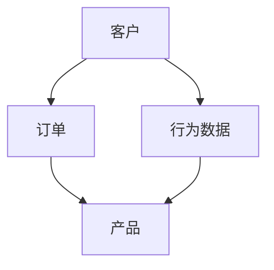
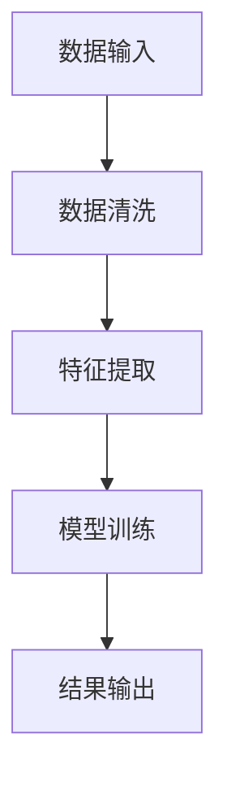
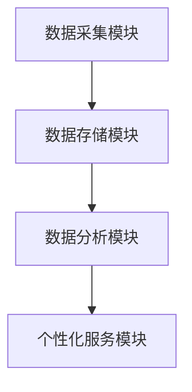

                 


# 构建客户洞察AI：深度分析与个性化服务实现

## 关键词：客户洞察，AI，个性化服务，深度分析，系统架构

## 摘要：  
本文详细探讨了构建客户洞察AI系统的各个方面，从背景介绍到算法实现，再到系统架构设计和项目实战。文章首先定义了客户洞察AI的核心概念，然后分析了其重要性和应用场景。接着，深入讲解了AI技术在客户洞察中的应用，包括数据采集、分析模型和个性化服务策略。随后，通过Mermaid图展示了系统的架构设计和数据流程，详细阐述了系统实现的关键步骤。最后，通过一个具体案例展示了项目的实战过程，从环境搭建到代码实现，再到结果分析，为读者提供了全面的指导。本文适合技术人员和企业决策者阅读，帮助他们理解和应用客户洞察AI技术。

---

## 第一部分: 客户洞察AI的背景与应用

### 第1章: 客户洞察AI的背景与概念

#### 1.1 客户洞察AI的定义与重要性

客户洞察AI是一种利用人工智能技术，通过对海量数据的分析和挖掘，深入理解客户行为、偏好和需求，从而为企业提供个性化服务的技术。其重要性体现在帮助企业提升客户满意度、提高销售转化率以及优化运营效率。

- **客户洞察的定义**：客户洞察是指通过分析客户数据，了解客户的深层需求、行为模式和偏好，为企业制定精准的营销策略提供支持。
- **AI在客户洞察中的作用**：AI技术能够处理海量数据，发现数据中的模式和关联，帮助企业在复杂的市场环境中做出更明智的决策。
- **客户洞察AI的核心价值**：通过深度分析客户数据，企业可以实现精准营销、客户分层管理和风险预测，从而提升客户忠诚度和企业竞争力。

#### 1.2 客户洞察AI的背景与问题背景

随着市场竞争的加剧，企业需要更高效的方法来理解和满足客户需求。传统的基于经验的客户管理方式已难以应对数据爆炸的时代，AI技术的引入为企业提供了新的解决方案。

- **当前企业客户管理的挑战**：
  - 数据量大，难以高效处理。
  - 客户需求多样化，难以精准满足。
  - 市场变化快，需要实时响应。
- **数据驱动决策的必要性**：通过数据驱动的方法，企业可以更准确地预测客户需求，优化资源配置。
- **AI技术在客户洞察中的应用前景**：AI技术能够帮助企业实现客户行为预测、需求挖掘和个性化推荐，提升客户体验和企业效益。

#### 1.3 客户洞察AI的核心要素

- **数据来源与类型**：
  - 结构化数据：如客户的基本信息、交易记录等。
  - 非结构化数据：如文本评论、社交媒体数据等。
- **深度分析方法**：
  - 数据挖掘：通过聚类、分类等方法发现数据中的模式。
  - 自然语言处理：分析文本数据，提取情感和意图。
  - 机器学习：构建预测模型，进行客户分层和预测。
- **个性化服务策略**：
  - 推荐系统：根据客户行为推荐个性化产品。
  - 定制化营销：基于客户特征制定精准营销策略。
  - 服务优化：根据客户反馈优化产品和服务流程。

#### 1.4 本章小结

本章介绍了客户洞察AI的定义、重要性和核心要素，强调了AI技术在客户管理中的关键作用，为后续章节的深入分析奠定了基础。

---

### 第2章: 客户洞察AI的核心概念与联系

#### 2.1 客户洞察AI的核心概念

- **数据采集与处理**：
  - 数据采集：通过各种渠道收集客户数据，包括网站点击流数据、社交媒体数据等。
  - 数据清洗：去除噪声数据，确保数据质量。
  - 数据增强：通过数据增强技术补充数据，提高模型的泛化能力。
- **深度分析模型**：
  - 分类模型：用于客户分层，如 churn prediction。
  - 聚类模型：用于发现客户群体的自然分组。
  - 序列模型：用于分析客户的行为序列，预测下一步行为。
- **个性化服务策略**：
  - 推荐系统：基于客户的兴趣和行为推荐相关产品。
  - 定制化沟通：根据客户特征制定个性化的沟通策略。
  - 服务优化：根据客户反馈优化产品和服务流程。

#### 2.2 核心概念的属性特征对比

| 概念              | 数据采集与处理 | 深度分析模型 | 个性化服务策略 |
|-------------------|----------------|--------------|-----------------|
| 输入              | 原始数据        | 数据特征      | 模型输出         |
| 输出              | 清洗后的数据    | 预测结果      | 个性化服务方案   |
| 用途              | 为模型提供数据  | 支持决策      | 提升客户体验     |

#### 2.3 实体关系图（ER图）



#### 2.4 本章小结

本章通过对比核心概念的属性特征，详细讲解了客户洞察AI中的数据采集、分析模型和个性化服务策略，为后续章节的系统设计提供了理论基础。

---

### 第3章: 客户洞察AI的算法原理与实现

#### 3.1 算法原理概述

- **数据预处理**：
  - 数据清洗：处理缺失值、异常值和重复数据。
  - 数据转换：将数据转换为适合模型输入的形式，如归一化、标准化。
  - 数据增强：通过数据增强技术增加数据的多样性，提高模型的泛化能力。
- **特征提取**：
  - 文本特征提取：使用TF-IDF、Word2Vec等方法提取文本特征。
  - 图像特征提取：使用CNN等深度学习模型提取图像特征。
  - 时间序列特征提取：通过滑动窗口、差分等方法提取时间序列特征。
- **模型训练**：
  - 分类模型：如逻辑回归、随机森林、神经网络等。
  - 聚类模型：如K-means、DBSCAN等。
  - 序列模型：如LSTM、Transformer等。

#### 3.2 算法流程图



#### 3.3 算法实现代码

```python
# 数据预处理
import pandas as pd
data = pd.read_csv('customer_data.csv')
data.dropna(inplace=True)
data = pd.get_dummies(data)

# 特征提取
from sklearn.feature_extraction.text import TfidfVectorizer
vectorizer = TfidfVectorizer()
X = vectorizer.fit_transform(data['text'])

# 模型训练
from sklearn.ensemble import RandomForestClassifier
model = RandomForestClassifier()
model.fit(X, data['label'])
```

#### 3.4 本章小结

本章详细讲解了客户洞察AI中的算法原理和实现过程，包括数据预处理、特征提取和模型训练，并通过代码示例展示了具体实现方法。

---

### 第4章: 客户洞察AI的系统架构设计与实现

#### 4.1 系统架构设计

- **系统功能模块**：
  - 数据采集模块：负责数据的收集和处理。
  - 数据分析模块：负责特征提取和模型训练。
  - 个性化服务模块：根据模型输出结果提供个性化服务。
- **系统架构图**



- **系统接口设计**：
  - 数据接口：用于数据的输入和输出。
  - 模型接口：用于模型的训练和预测。
  - 服务接口：用于个性化服务的实现和调用。

#### 4.2 项目实战：客户洞察AI系统的实现

##### 4.2.1 环境搭建

- 安装必要的库：
  ```bash
  pip install pandas scikit-learn tensorflow transformers
  ```

##### 4.2.2 核心代码实现

```python
# 数据预处理
import pandas as pd
data = pd.read_csv('customer_data.csv')
data.dropna(inplace=True)
data = pd.get_dummies(data)

# 特征提取
from sklearn.feature_extraction.text import TfidfVectorizer
vectorizer = TfidfVectorizer()
X = vectorizer.fit_transform(data['text'])

# 模型训练
from sklearn.ensemble import RandomForestClassifier
model = RandomForestClassifier()
model.fit(X, data['label'])

# 接口设计
from flask import Flask, request, jsonify
app = Flask(__name__)

@app.route('/predict', methods=['POST'])
def predict():
    data = request.json
    X_new = vectorizer.transform([data['text']])
    prediction = model.predict(X_new)
    return jsonify({'prediction': int(prediction[0])})

if __name__ == '__main__':
    app.run(debug=True)
```

##### 4.2.3 案例分析与结果解读

通过上述代码实现的客户洞察AI系统，可以对企业客户的文本数据进行分类，预测客户的行为和需求，从而提供个性化的服务。例如，可以预测客户是否会 churn，从而提前采取措施减少客户流失。

---

### 第5章: 总结与展望

#### 5.1 总结

本文详细探讨了构建客户洞察AI系统的各个方面，从背景介绍到算法实现，再到系统架构设计和项目实战。通过系统的分析和实践，展示了如何利用AI技术实现客户洞察和个性化服务。

#### 5.2 展望

未来，随着AI技术的不断发展，客户洞察AI将更加智能化和个性化。通过引入更先进的算法和技术，如深度学习和强化学习，可以进一步提升客户洞察的精度和效率，为企业创造更大的价值。

#### 5.3 最佳实践 tips

- 数据是客户洞察的核心，确保数据质量和多样性。
- 结合业务需求选择合适的算法和模型。
- 定期更新模型，保持模型的准确性和适应性。

---

## 作者：AI天才研究院/AI Genius Institute & 禅与计算机程序设计艺术 /Zen And The Art of Computer Programming

---

以上是《构建客户洞察AI：深度分析与个性化服务实现》的技术博客文章，内容涵盖了从理论到实践的各个方面，通过详细的分析和代码示例，帮助读者理解和实现客户洞察AI系统。

