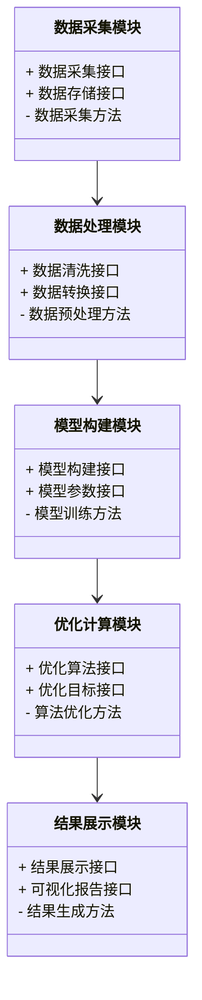
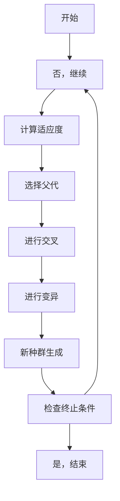
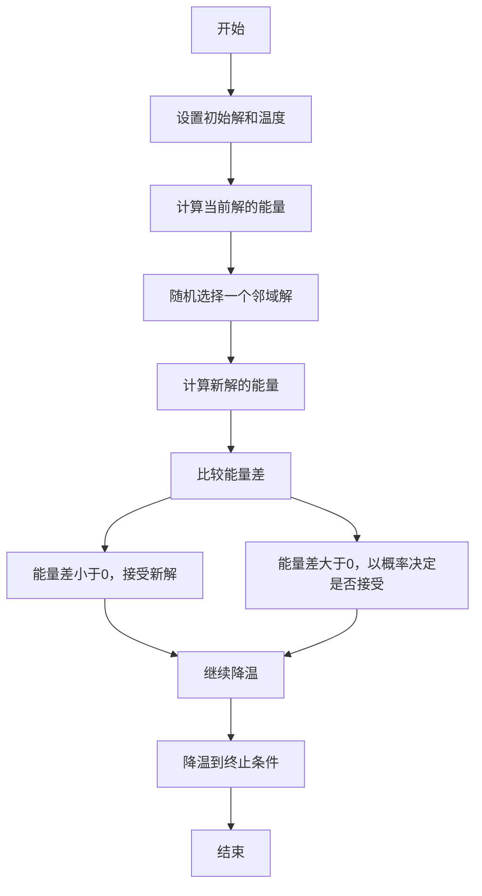

                 

# 第一部分: 智能企业决策支持系统概述

## 第1章: 智能企业决策支持系统概述

### 1.1 企业决策支持系统的背景与意义
#### 1.1.1 传统企业决策方式的局限性
- **传统决策方式的低效性**：依赖人工经验，缺乏数据支持，决策周期长，难以应对复杂多变的市场环境。
- **信息孤岛问题**：各部门之间的数据分散，难以整合，导致决策信息不全面。
- **决策风险高**：缺乏科学的数据分析和模拟，可能导致决策失误，带来巨大的经济损失。

#### 1.1.2 智能决策支持系统的概念与特点
- **概念**：通过人工智能、大数据分析和优化算法等技术，提供数据驱动的决策支持，帮助企业在复杂环境中做出最优决策。
- **特点**：数据驱动、实时分析、智能优化、高准确性、灵活性强。

#### 1.1.3 智能决策支持系统在企业中的作用
- **提升决策效率**：通过自动化分析和模拟，缩短决策周期。
- **优化资源配置**：合理分配企业资源，提高资源利用率。
- **降低决策风险**：通过模拟和预测，减少决策失误的可能性。
- **增强竞争力**：通过科学决策，提升企业在市场中的竞争力。

### 1.2 多维场景模拟与优化的核心概念
#### 1.2.1 多维场景模拟的定义与特点
- **定义**：在多个维度上进行场景构建和模拟，考虑各种可能的变量和参数，以全面分析不同情况下的结果。
- **特点**：多维性、动态性、可定制性。

#### 1.2.2 优化算法的基本原理
- **优化算法**：通过数学方法寻找问题的最优解，常见的优化算法包括遗传算法、模拟退火、粒子群优化等。
- **基本原理**：定义目标函数，设置约束条件，通过迭代优化找到最优解。

#### 1.2.3 智能决策支持系统的架构与功能
- **架构**：包括数据采集、数据处理、模型构建、优化计算、结果展示等模块。
- **功能**：数据可视化、场景模拟、优化建议、实时监控、决策报告生成。

## 第2章: 多维场景模拟与优化的背景与应用

### 2.1 企业决策支持系统的演变
#### 2.1.1 从传统决策到智能决策的转变
- **传统决策**：依赖经验和直觉，决策过程复杂且耗时。
- **智能决策**：借助技术手段，实现数据驱动的科学决策，提升效率和准确性。

#### 2.1.2 多维场景模拟在企业决策中的应用
- **市场预测**：通过模拟不同市场情况，预测销售、成本等关键指标。
- **资源分配**：优化企业资源分配，如人力资源、资金、库存等。
- **风险管理**：通过模拟潜在风险，制定应对策略，降低损失。

### 2.2 优化算法的发展与挑战
#### 2.2.1 传统优化算法的局限性
- **线性规划**：仅适用于线性问题，难以处理复杂的非线性问题。
- **动态规划**：对问题的分解和阶段依赖性要求较高，难以处理大规模问题。

#### 2.2.2 智能优化算法的崛起
- **遗传算法**：模拟生物进化过程，适用于复杂问题的全局优化。
- **模拟退火**：通过模拟金属退火过程，寻找全局最优解。
- **粒子群优化**：通过模拟鸟群觅食行为，寻找最优解。

#### 2.2.3 多维场景模拟与优化的结合
- **结合方式**：通过多维场景模拟生成多种可能的方案，再利用优化算法选择最优方案。
- **优势**：提高决策的全面性和准确性，增强企业的竞争力。

# 第二部分: 多维场景模拟与优化的核心概念

## 第3章: 多维场景模拟与优化的核心概念

### 3.1 多维场景模拟的数学模型
#### 3.1.1 场景模拟的基本模型
- **线性模型**：适用于简单的问题，如需求预测。
- **非线性模型**：适用于复杂问题，如供应链优化。

#### 3.1.2 多维场景模拟的数学表达
- **多维模型**：考虑多个变量和参数，构建复杂的数学模型。
- **模型的维度**：包括时间、空间、资源等多个维度。

#### 3.1.3 场景模拟与优化的关系
- **相互依存**：优化算法需要基于场景模拟的结果进行，而场景模拟的结果需要优化算法来选择最优方案。

### 3.2 优化算法的基本原理
#### 3.2.1 优化算法的分类与特点
- **分类**：包括确定性算法和随机算法，局部优化和全局优化。
- **特点**：不同算法适用于不同问题，各有优缺点。

#### 3.2.2 常见优化算法的比较
- **遗传算法**：全局优化能力强，但计算量大。
- **模拟退火**：能够跳出局部最优，但收敛速度较慢。
- **粒子群优化**：收敛速度快，但容易陷入局部最优。

#### 3.2.3 优化算法的核心要素
- **目标函数**：需要明确优化的目标。
- **约束条件**：需要考虑问题的限制条件。
- **搜索空间**：算法在解空间中寻找最优解。

### 3.3 多维场景模拟与优化的系统架构
#### 3.3.1 系统架构的设计原则
- **模块化**：系统分为多个模块，每个模块负责不同的功能。
- **可扩展性**：系统能够根据需求进行扩展和升级。
- **高效性**：系统运行速度快，能够处理大规模数据。

#### 3.3.2 多维场景模拟与优化的模块划分
- **数据采集模块**：负责收集企业内外部数据。
- **数据处理模块**：对数据进行清洗、转换和预处理。
- **模型构建模块**：根据数据构建多维场景模拟模型。
- **优化计算模块**：利用优化算法对模型进行优化计算。
- **结果展示模块**：将优化结果以可视化的方式展示给用户。

#### 3.3.3 系统架构的优缺点分析
- **优点**：模块化设计便于维护和升级，高效性确保了系统的运行效率。
- **缺点**：系统架构复杂，开发和维护成本较高。

## 第4章: 多维场景模拟与优化的核心要素

### 4.1 数据采集与处理
#### 4.1.1 数据采集的基本方法
- **数据来源**：包括企业内部数据、外部市场数据、行业数据等。
- **数据采集工具**：如数据库、API接口、爬虫等。

#### 4.1.2 数据预处理的步骤与技巧
- **数据清洗**：去除无效数据、处理缺失值、异常值。
- **数据转换**：如数据标准化、归一化、特征提取等。

#### 4.1.3 数据质量对优化结果的影响
- **数据准确性**：数据错误可能导致优化结果偏差。
- **数据完整性**：数据不完整可能导致模型无法准确模拟场景。
- **数据及时性**：数据滞后可能影响优化结果的实时性。

### 4.2 优化目标的设定
#### 4.2.1 优化目标的定义与选择
- **目标函数**：明确优化的目标，如利润最大化、成本最小化等。
- **权重设置**：根据目标的重要程度，设置不同的权重。

#### 4.2.2 目标函数的设计与实现
- **线性目标函数**：适用于线性问题。
- **非线性目标函数**：适用于复杂问题，如二次规划。

#### 4.2.3 约束条件的处理与优化
- **硬约束**：必须满足的条件，如预算限制、时间限制等。
- **软约束**：可以通过调整目标函数权重来处理的条件。

### 4.3 优化算法的选择与实现
#### 4.3.1 算法选择的依据
- **问题类型**：线性问题选择线性规划，非线性问题选择遗传算法或模拟退火。
- **数据规模**：大规模数据选择高效的优化算法。

#### 4.3.2 算法实现的步骤
- **初始化**：设置初始参数，如种群大小、迭代次数等。
- **迭代优化**：根据算法步骤，逐步优化解。
- **终止条件**：达到迭代次数或达到收敛条件。

#### 4.3.3 算法性能的评估
- **收敛速度**：算法在多少次迭代内收敛到最优解。
- **解的质量**：算法找到的解是否接近全局最优解。

## 第5章: 多维场景模拟与优化的系统架构设计

### 5.1 系统功能设计
#### 5.1.1 功能模块划分
- **数据采集模块**：负责数据的采集和存储。
- **数据处理模块**：对数据进行清洗和预处理。
- **模型构建模块**：根据数据构建多维场景模拟模型。
- **优化计算模块**：利用优化算法对模型进行优化计算。
- **结果展示模块**：将优化结果以可视化的方式展示。

#### 5.1.2 功能模块的交互流程
- **数据采集模块**：采集数据后传递给数据处理模块。
- **数据处理模块**：处理完成后传递给模型构建模块。
- **模型构建模块**：构建完成后传递给优化计算模块。
- **优化计算模块**：计算完成后传递给结果展示模块。
- **结果展示模块**：展示结果后，用户可以反馈修改需求，重新进行优化计算。

### 5.2 系统架构设计
#### 5.2.1 系统架构图
- **分层架构**：包括数据层、业务逻辑层和表现层。
- **模块化设计**：每个模块独立开发和维护，便于系统的扩展和升级。

#### 5.2.2 系统接口设计
- **数据接口**：与其他系统或数据库进行数据交互。
- **用户接口**：提供友好的用户界面，方便用户操作。
- **API接口**：提供程序matic接口，方便与其他系统集成。

### 5.3 系统交互设计
#### 5.3.1 系统交互流程
- **用户登录**：用户登录系统后进入主界面。
- **数据输入**：用户输入数据或选择数据源。
- **模型构建**：用户选择模型类型，输入参数。
- **优化计算**：系统根据参数进行优化计算。
- **结果展示**：系统展示优化结果，用户可以查看详细报告。

#### 5.3.2 系统交互流程图
- 使用mermaid绘制系统交互流程图，展示用户与系统之间的交互过程。

## 第6章: 多维场景模拟与优化的项目实战

### 6.1 项目背景与目标
#### 6.1.1 项目背景
- **行业背景**：例如制造业、金融行业等。
- **企业需求**：企业希望通过智能决策支持系统优化资源配置、降低成本、提高效率。

#### 6.1.2 项目目标
- **目标1**：构建一个多维场景模拟与优化的决策支持系统。
- **目标2**：实现对企业的关键业务流程进行优化，提高决策效率和准确性。

### 6.2 项目实施步骤
#### 6.2.1 环境搭建
- **开发环境**：安装必要的软件和工具，如Python、Jupyter Notebook、数据库等。
- **数据源**：获取企业相关的数据，如销售数据、库存数据、生产数据等。

#### 6.2.2 系统核心实现
- **数据采集与处理**：编写代码采集数据，并进行预处理。
- **模型构建**：根据数据构建多维场景模拟模型。
- **优化计算**：选择合适的优化算法，进行模型优化。
- **结果展示**：将优化结果以可视化的方式展示给用户。

#### 6.2.3 代码实现
- **数据采集模块**：编写代码采集数据并存储到数据库中。
- **数据处理模块**：编写代码对数据进行清洗和预处理。
- **模型构建模块**：编写代码构建多维场景模拟模型。
- **优化计算模块**：编写代码实现优化算法。
- **结果展示模块**：编写代码生成可视化报告。

### 6.3 项目案例分析
#### 6.3.1 案例背景
- **案例行业**：例如制造业。
- **案例问题**：企业希望优化供应链管理，降低库存成本。

#### 6.3.2 数据分析与处理
- **数据来源**：销售数据、库存数据、供应商数据等。
- **数据处理**：清洗数据，处理缺失值，标准化数据。

#### 6.3.3 模型构建与优化
- **模型构建**：构建供应链管理的多维场景模拟模型。
- **优化算法**：选择遗传算法进行优化，找到最优的库存管理和供应商选择方案。

#### 6.3.4 优化结果分析
- **优化结果**：降低库存成本10%，提高供应链效率20%。
- **结果展示**：生成可视化报告，展示优化前后的对比。

### 6.4 项目小结
- **项目成果**：成功构建了多维场景模拟与优化的决策支持系统。
- **经验总结**：在项目实施过程中，数据质量对优化结果影响很大，需要重视数据处理和清洗工作。
- **未来改进方向**：进一步优化算法，增加更多的维度和场景模拟，提升系统的智能化水平。

# 第三部分: 多维场景模拟与优化的最佳实践

## 第7章: 多维场景模拟与优化的最佳实践

### 7.1 最佳实践
#### 7.1.1 数据处理的关键点
- **数据清洗**：去除无效数据，处理异常值。
- **数据预处理**：标准化、归一化、特征提取等。
- **数据存储**：选择合适的数据库，确保数据的安全性和可访问性。

#### 7.1.2 优化算法的选择与调优
- **算法选择**：根据问题类型选择合适的算法。
- **参数调优**：通过实验调整算法参数，提高优化效果。
- **算法评估**：评估算法的收敛速度和解的质量。

#### 7.1.3 系统架构的优化
- **模块化设计**：便于维护和升级。
- **高效性优化**：选择高效的算法和数据结构，提升系统运行效率。
- **可扩展性设计**：确保系统能够根据需求进行扩展。

### 7.2 系统运行与维护
#### 7.2.1 系统运行监控
- **运行状态监控**：实时监控系统运行状态，及时发现和解决问题。
- **日志管理**：记录系统运行日志，便于故障排查。

#### 7.2.2 系统维护与升级
- **定期维护**：定期检查系统运行状态，进行必要的维护和升级。
- **版本控制**：采用版本控制工具，确保系统的可追溯性和安全性。

### 7.3 注意事项
#### 7.3.1 数据安全
- **数据加密**：对敏感数据进行加密处理，防止数据泄露。
- **访问控制**：设置严格的访问权限，确保数据的安全性。

#### 7.3.2 系统稳定性
- **容错设计**：设计容错机制，确保系统在出现故障时能够快速恢复。
- **备份与恢复**：定期备份系统数据，制定完善的灾难恢复计划。

#### 7.3.3 用户培训
- **用户培训**：对系统用户进行培训，确保他们能够正确使用系统。
- **用户支持**：提供技术支持，解决用户在使用过程中遇到的问题。

### 7.4 未来发展趋势
#### 7.4.1 人工智能技术的进一步发展
- **深度学习**：在多维场景模拟与优化中应用深度学习技术，提高模型的准确性和智能化水平。
- **自然语言处理**：利用自然语言处理技术，实现与用户的自然交互。

#### 7.4.2 大数据技术的融合
- **大数据分析**：结合大数据技术，进一步提升数据处理和分析能力。
- **实时计算**：实现实时数据处理和实时优化，提升系统的响应速度。

#### 7.4.3 区块链技术的应用
- **区块链技术**：在数据安全和信任机制方面发挥重要作用，确保数据的真实性和不可篡改性。

## 第8章: 总结与展望

### 8.1 总结
- **核心内容总结**：通过多维场景模拟与优化，构建智能企业决策支持系统，提升企业的决策效率和准确性。
- **主要收获**：掌握了多维场景模拟与优化的核心概念、算法原理、系统架构设计和项目实施方法。

### 8.2 未来展望
- **技术发展**：随着人工智能和大数据技术的进一步发展，智能决策支持系统将更加智能化和自动化。
- **应用场景扩展**：多维场景模拟与优化技术将应用于更多领域，如智慧城市、医疗健康、金融投资等。
- **挑战与机遇**：在技术进步的同时，也将面临新的挑战，如数据安全、算法优化、系统集成等，这些都为技术的发展带来了机遇。

## 参考文献

### 8.3 参考文献
- **书籍**：
  - 《智能优化算法及其应用》
  - 《数据挖掘与机器学习》
  - 《系统架构设计：复杂系统的构建与管理》
- **论文**：
  - "Multi-dimensional scenario simulation and optimization for enterprise decision support system"
  - "An improved genetic algorithm for optimization problems in enterprise decision making"
- **网站**：
  - [人工智能技术博客](https://example.com)
  - [数据科学社区](https://example.com)

---

### 附录

#### A. 附录A: 优化算法的数学公式

##### 遗传算法
- **适应度函数**：定义个体适应度，用于评估个体的优劣。
  $$适应度 = \sum_{i=1}^{n} (目标函数 - 约束条件)$$
  
- **选择操作**：根据适应度值选择个体进行交配。
  $$选择概率 = \frac{适应度}{总适应度}$$

- **交叉操作**：将两个父代的基因进行交叉，生成子代。
  $$子代基因 = 父代1基因 + 父代2基因$$

- **变异操作**：对子代基因进行随机变异，增加种群的多样性。
  $$变异概率 = 1/\text{基因长度}$$

##### 模拟退火算法
- **初始状态**：随机选择一个初始解。
  $$x_0 = \text{随机初始解}$$

- **邻域搜索**：随机选择一个邻域解，计算能量差。
  $$\Delta E = E(x_{\text{新}}) - E(x_{\text{旧}})$$

- **状态转移**：根据能量差决定是否接受新解。
  $$概率 = e^{-\Delta E / T}$$

- **降温操作**：逐步降低温度，直到达到终止条件。
  $$T = T \times \text{冷却速率}$$

#### B. 附录B: 系统架构的类图

##### 系统架构类图

#### C. 附录C: 优化算法的mermaid流程图

##### 遗传算法流程图

##### 模拟退火算法流程图

---

### 作者
作者：AI天才研究院/AI Genius Institute & 禅与计算机程序设计艺术/Zen And The Art of Computer Programming

