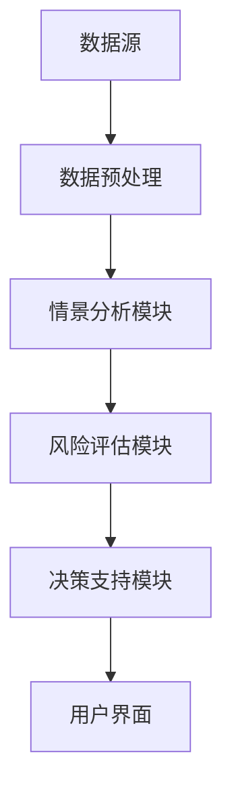
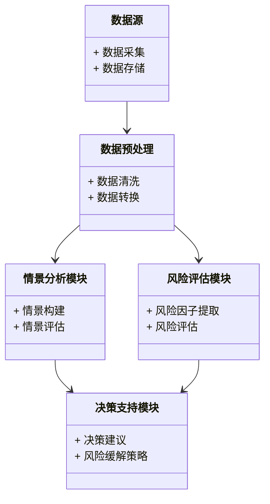
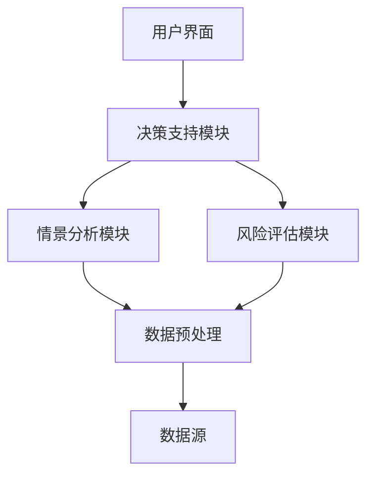
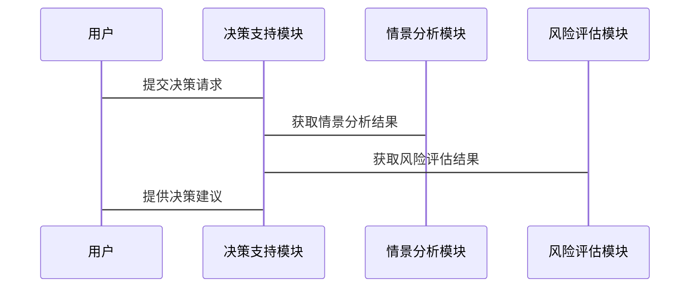

                 


---

# 构建智能企业决策模拟系统：多维度情景分析与风险评估

---

## 关键词：
- 智能决策系统
- 多维度情景分析
- 风险评估
- 企业决策模拟
- AI驱动决策

---

## 摘要：
本文将详细探讨如何构建一个基于人工智能的智能企业决策模拟系统，通过多维度情景分析与风险评估来优化企业决策过程。文章从系统概述、核心算法原理、系统架构设计、项目实战案例等方面展开，结合理论与实践，为企业提供一套完整的解决方案。通过本文，读者将掌握从数据采集到模型构建，再到系统实现的全过程，最终能够独立设计并实现一个智能企业决策模拟系统。

---

# 第1章: 智能企业决策模拟系统概述

## 1.1 企业决策模拟系统背景

### 1.1.1 传统企业决策模式的局限性
传统的企业决策模式主要依赖于人工经验和数据分析，存在以下问题：
- 数据处理效率低
- 决策过程缺乏实时性
- 风险评估不全面
- 多维度情景分析能力不足

### 1.1.2 智能化决策模拟的必要性
随着AI技术的快速发展，企业需要更加智能化的决策支持系统：
- 提高决策效率和准确性
- 实现多维度情景分析
- 建立全面的风险评估机制

### 1.1.3 多维度情景分析与风险评估的意义
通过多维度情景分析与风险评估，企业能够：
- 优化决策过程
- 提高风险防控能力
- 实现更精准的决策支持

## 1.2 智能企业决策模拟系统的定义与目标

### 1.2.1 系统定义
智能企业决策模拟系统是一种基于AI技术的企业决策支持系统，能够通过多维度情景分析和风险评估为企业提供智能化的决策支持。

### 1.2.2 系统主要目标
- 提供实时数据支持
- 实现多维度情景分析
- 建立全面的风险评估机制
- 优化企业决策过程

## 1.3 系统架构与核心组件

### 1.3.1 系统整体架构


### 1.3.2 核心组件介绍
- 数据源：包括企业内部数据和外部数据。
- 数据预处理：对数据进行清洗、转换和标准化处理。
- 情景分析模块：基于多维度数据进行情景构建和评估。
- 风险评估模块：对各种情景进行风险评分和排序。
- 决策支持模块：根据评估结果提供决策建议。

## 1.4 系统的核心要素与组成

### 1.4.1 数据源
- 内部数据：企业运营数据、财务数据等。
- 外部数据：市场数据、行业趋势等。

### 1.4.2 情景分析模型
- 基于机器学习的情景分析模型，能够处理多维度数据。

### 1.4.3 风险评估机制
- 综合考虑多种风险因素，提供风险评分和排序。

### 1.4.4 决策支持模块
- 基于评估结果提供最优决策建议。

## 1.5 本章小结
本章主要介绍了智能企业决策模拟系统的背景、定义、目标、架构和核心组件，为后续章节的深入分析奠定了基础。

---

# 第2章: 多维度情景分析的核心原理

## 2.1 多维度情景分析的定义与特点

### 2.1.1 定义
多维度情景分析是一种基于多维度数据进行情景构建和评估的方法。

### 2.1.2 核心特点
- 多维度数据支持
- 情景构建灵活
- 评估结果准确

## 2.2 多维度情景分析的数学模型

### 2.2.1 情景分析的数学表达
$$ 情景评分 = \sum_{i=1}^{n} w_i \cdot f_i $$

其中，$w_i$ 是第i个维度的权重，$f_i$ 是第i个维度的特征值。

### 2.2.2 多维度权重分配模型
$$ 权重分配 = \frac{w_i}{\sum_{j=1}^{m} w_j} $$

### 2.2.3 情景评分公式
$$ 情景评分 = \sum_{i=1}^{n} (权重_i \cdot 评估值_i) $$

## 2.3 多维度情景分析的实现步骤

### 2.3.1 数据准备
- 数据清洗
- 数据转换
- 数据标准化

### 2.3.2 情景构建
- 确定情景维度
- 设定情景参数
- 构建情景树

### 2.3.3 情景评估
- 计算情景评分
- 排序情景
- 输出评估结果

## 2.4 本章小结
本章详细介绍了多维度情景分析的定义、特点、数学模型和实现步骤，为后续章节的系统实现提供了理论基础。

---

# 第3章: 风险评估的核心原理

## 3.1 风险评估的定义与特点

### 3.1.1 定义
风险评估是通过对各种风险因素的分析，评估可能对企业造成的影响。

### 3.1.2 核心特点
- 全面性
- 及时性
- 准确性

## 3.2 风险评估的数学模型

### 3.2.1 风险概率计算公式
$$ 风险概率 = \sum_{i=1}^{n} p_i \cdot r_i $$

其中，$p_i$ 是风险i发生的概率，$r_i$ 是风险i的影响范围。

### 3.2.2 风险影响评估模型
$$ 风险影响 = \sum_{i=1}^{m} w_i \cdot f_i $$

其中，$w_i$ 是风险影响的权重，$f_i$ 是风险影响的特征值。

### 3.2.3 综合风险评分公式
$$ 综合风险评分 = \sum_{i=1}^{k} (权重_i \cdot 评估值_i) $$

## 3.3 风险评估的实现步骤

### 3.3.1 数据准备
- 数据清洗
- 数据转换
- 数据标准化

### 3.3.2 风险因子提取
- 确定风险因子
- 提取风险特征
- 建立风险指标体系

### 3.3.3 风险评估模型训练
- 训练风险评估模型
- 验证模型准确性
- 调整模型参数

### 3.3.4 结果分析
- 输出风险评分
- 排序风险因素
- 提供风险缓解建议

## 3.4 本章小结
本章详细介绍了风险评估的定义、特点、数学模型和实现步骤，为后续章节的系统实现提供了理论基础。

---

# 第4章: 系统分析与架构设计方案

## 4.1 问题场景介绍

### 4.1.1 企业决策中的常见问题
- 数据分散
- 决策过程复杂
- 风险评估不全面

### 4.1.2 项目目标
- 实现多维度情景分析
- 建立全面的风险评估机制
- 提供智能化的决策支持

## 4.2 系统功能设计

### 4.2.1 功能模块划分


## 4.3 系统架构设计

### 4.3.1 系统架构图


### 4.3.2 系统接口设计
- 用户界面接口
- 数据预处理接口
- 情景分析模块接口
- 风险评估模块接口

## 4.4 系统交互设计

### 4.4.1 系统交互序列图


## 4.5 本章小结
本章通过系统分析和架构设计，详细介绍了智能企业决策模拟系统的功能模块、系统架构和交互流程，为后续章节的系统实现提供了指导。

---

# 第5章: 项目实战——智能企业决策模拟系统实现

## 5.1 环境安装与配置

### 5.1.1 安装Python
- 安装Python 3.x
- 安装必要的Python包（如numpy、pandas、scikit-learn等）

### 5.1.2 安装Jupyter Notebook
- 使用pip安装Jupyter Notebook

## 5.2 系统核心实现

### 5.2.1 数据预处理
```python
import pandas as pd
import numpy as np

# 数据加载
data = pd.read_csv('data.csv')

# 数据清洗
data.dropna(inplace=True)

# 数据转换
data['date'] = pd.to_datetime(data['date'])
```

### 5.2.2 情景分析模块实现
```python
from sklearn.linear_model import LinearRegression

# 情景构建
X = data[['feature1', 'feature2']]
y = data['target']

# 训练模型
model = LinearRegression()
model.fit(X, y)

# 情景评估
def scenario_analysis(new_data):
    prediction = model.predict(new_data)
    return prediction
```

### 5.2.3 风险评估模块实现
```python
from sklearn.ensemble import RandomForestClassifier

# 风险因子提取
X = data[['risk_feature1', 'risk_feature2']]
y = data['risk_label']

# 训练模型
risk_model = RandomForestClassifier()
risk_model.fit(X, y)

# 风险评估
def risk_assessment(new_data):
    prediction = risk_model.predict(new_data)
    return prediction
```

## 5.3 代码应用与解读

### 5.3.1 数据预处理代码解读
- 数据加载：使用pandas读取CSV文件。
- 数据清洗：删除缺失值。
- 数据转换：将日期格式转换为datetime类型。

### 5.3.2 情景分析模块代码解读
- 数据特征选择：选择相关特征。
- 模型训练：使用线性回归模型。
- 情景评估：基于训练好的模型进行预测。

### 5.3.3 风险评估模块代码解读
- 数据特征选择：选择风险相关特征。
- 模型训练：使用随机森林分类器。
- 风险评估：基于训练好的模型进行预测。

## 5.4 实际案例分析

### 5.4.1 案例背景
假设我们有一家制造企业，需要预测未来三个月的销售情况，并评估可能的风险。

### 5.4.2 数据准备
```python
import pandas as pd
import numpy as np

# 数据加载
data = pd.read_csv('manufacturing_data.csv')

# 数据清洗
data.dropna(inplace=True)

# 数据转换
data['date'] = pd.to_datetime(data['date'])
```

### 5.4.3 情景分析
```python
X = data[['revenue', 'cost', 'profit']]
y = data['sales']

model = LinearRegression()
model.fit(X, y)

new_data = pd.DataFrame({
    'revenue': [1000000],
    'cost': [500000],
    'profit': [200000]
})

prediction = model.predict(new_data)
print(f"预测销售额：{prediction[0]}")
```

### 5.4.4 风险评估
```python
X = data[['market_share', 'competition', 'economic_indicator']]
y = data['risk_label']

risk_model = RandomForestClassifier()
risk_model.fit(X, y)

new_data = pd.DataFrame({
    'market_share': [20],
    'competition': [high],
    'economic_indicator': [downturn]
})

prediction = risk_model.predict(new_data)
print(f"风险评估结果：{prediction[0]}")
```

## 5.5 项目小结
通过本章的项目实战，读者可以掌握智能企业决策模拟系统的实现过程，包括数据预处理、情景分析和风险评估模块的实现，以及实际案例的应用。

---

# 第6章: 总结与展望

## 6.1 本章总结
本文详细介绍了智能企业决策模拟系统的构建过程，包括系统概述、多维度情景分析、风险评估、系统架构设计和项目实战等内容。

## 6.2 未来展望
未来，智能企业决策模拟系统可以在以下方面进行优化和扩展：
- 结合实时数据，提高决策的实时性。
- 引入更多AI技术，如深度学习和强化学习，提升系统的智能性。
- 扩展系统功能，如引入博弈论模型，提高决策的对抗性。

## 6.3 最佳实践Tips

### 6.3.1 数据处理
- 确保数据的准确性和完整性。
- 对数据进行合理的特征工程。

### 6.3.2 模型选择
- 根据实际需求选择合适的模型。
- 对模型进行充分的调参和优化。

### 6.3.3 系统设计
- 系统架构要清晰，模块划分要合理。
- 确保系统的可扩展性和可维护性。

## 6.4 本章小结
本文通过总结和展望，为读者提供了未来的发展方向和最佳实践建议，帮助读者更好地理解和应用智能企业决策模拟系统。

---

# 作者：AI天才研究院/AI Genius Institute & 禅与计算机程序设计艺术/Zen And The Art of Computer Programming

