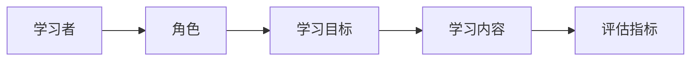
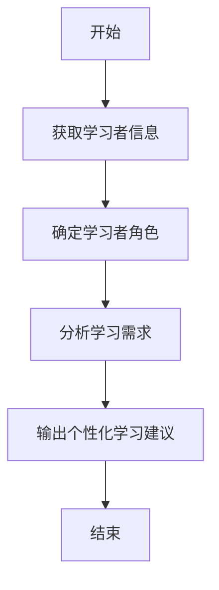
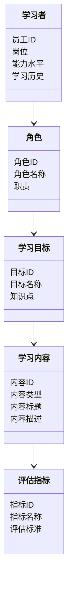
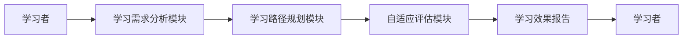

                 


# 构建智能企业合规培训系统：基于角色的个性化学习与评估

## 关键词：企业合规培训、个性化学习、基于角色的学习、自适应评估、人工智能、系统架构设计

## 摘要：  
随着企业对合规性要求的不断提高，传统的合规培训方式已难以满足多样化的需求。本文提出了一种基于角色的个性化学习与评估系统，通过人工智能技术实现学习内容的精准推荐和评估结果的动态调整，为企业员工提供高效、个性化的合规培训解决方案。本文详细探讨了系统的设计思路、核心算法、架构实现以及实际应用场景，为构建智能企业合规培训系统提供了理论和实践的双重指导。

---

# 第一部分：企业合规培训系统背景与概述

## 第1章：企业合规培训系统背景

### 1.1 问题背景

#### 1.1.1 传统企业合规培训的痛点
传统的企业合规培训通常采用“一刀切”的方式，忽视了员工在岗位、职责和能力上的差异性。这种统一化的培训模式存在以下问题：
- **学习内容不匹配**：不同岗位的员工需要掌握的合规知识不同，统一的培训内容可能导致部分员工学习兴趣不高，学习效果差。
- **学习效率低下**：传统培训方式缺乏个性化的学习路径，员工可能需要学习大量冗余的内容，浪费时间和精力。
- **评估方式单一**：传统的考试评估方式难以全面反映员工的实际合规能力，且无法根据员工的学习情况动态调整评估标准。

#### 1.1.2 合规培训的重要性与挑战
合规培训是企业合规管理的核心环节，直接关系到企业的法律风险和经营合规性。然而，随着企业规模的扩大和业务的复杂化，合规培训面临着以下挑战：
- **合规内容的多样性**：企业可能涉及多个领域的合规要求，如反腐败、数据隐私、劳动法等，员工需要掌握的知识点繁多且分散。
- **学习者的多样性**：员工的岗位、职责、背景和能力各不相同，统一的培训方式难以满足个性化需求。
- **评估的复杂性**：如何根据员工的学习行为、知识掌握程度和实际应用能力进行综合评估，是合规培训系统设计中的难点。

#### 1.1.3 智能化培训系统的必要性
随着人工智能技术的发展，智能化合规培训系统可以通过个性化推荐和自适应评估，解决传统培训的痛点。智能化培训系统的优势包括：
- **精准匹配学习需求**：基于员工的角色和能力，推荐最适合的学习内容。
- **动态调整学习路径**：根据学习效果和员工反馈，动态优化学习计划。
- **实时评估与反馈**：通过数据分析，实时评估员工的学习效果，并提供针对性的反馈和建议。

### 1.2 问题描述

#### 1.2.1 员工学习需求的多样性
员工的学习需求受到以下因素的影响：
- **岗位职责**：不同岗位的员工需要掌握不同的合规知识，例如财务人员需要了解财务合规，销售人员需要了解反腐败合规。
- **知识水平**：部分员工可能具备一定的合规知识基础，而另一些员工可能完全不了解相关合规要求。
- **学习风格**：部分员工适合通过阅读学习，而另一些员工可能更适合通过视频或互动课程学习。

#### 1.2.2 培训效果评估的复杂性
合规培训的评估需要考虑以下因素：
- **知识掌握程度**：员工是否真正掌握了相关的合规知识。
- **行为合规性**：员工在实际工作中是否能够遵守合规要求。
- **学习参与度**：员工是否积极参与学习过程，是否认真完成学习任务。

#### 1.2.3 系统化管理的缺失
传统的合规培训缺乏系统化管理，主要体现在：
- **数据孤岛**：各个部门的培训数据分散，难以形成统一的合规培训体系。
- **缺乏反馈机制**：培训结束后缺乏有效的反馈机制，无法及时优化培训内容和方式。

### 1.3 问题解决

#### 1.3.1 基于角色的学习需求分析
基于角色的学习需求分析是智能化合规培训系统的核心，其目的是确定每个员工需要学习的具体内容。具体方法包括：
- **角色分类**：根据员工的岗位、职责和权限，将员工分为不同的角色类别。
- **学习目标设定**：为每个角色类别设定具体的学习目标，例如“了解数据隐私保护的基本原则”。
- **学习内容推荐**：根据学习目标推荐相关的学习资源，例如视频、文档、在线课程等。

#### 1.3.2 个性化学习路径的设计
个性化学习路径的设计需要考虑员工的当前知识水平、学习风格和时间安排。具体步骤包括：
- **知识水平评估**：通过测试或问卷调查，评估员工的初始知识水平。
- **学习路径规划**：根据评估结果，为员工设计个性化的学习路径，例如先学习基础知识，再学习高级内容。
- **学习进度跟踪**：实时跟踪员工的学习进度，并根据学习效果动态调整学习路径。

#### 1.3.3 自适应评估机制的构建
自适应评估机制可以根据员工的学习行为和评估结果动态调整评估策略。具体方法包括：
- **实时评估**：在学习过程中实时评估员工的知识掌握程度。
- **动态调整评估标准**：根据员工的学习进步情况，动态调整评估标准，例如从“掌握基础知识”到“掌握高级知识”。
- **反馈与建议**：根据评估结果，为员工提供针对性的反馈和建议，例如“需要加强某方面的知识学习”。

### 1.4 系统边界与外延

#### 1.4.1 系统的功能边界
智能化合规培训系统的核心功能包括：
- **学习需求分析**：基于员工角色和能力，推荐个性化学习内容。
- **学习路径规划**：根据学习需求，设计个性化学习路径。
- **自适应评估**：实时评估员工的学习效果，并动态调整评估策略。

#### 1.4.2 系统的外部接口
系统需要与以下外部系统进行交互：
- **企业组织架构系统**：获取员工的岗位信息和角色分类。
- **学习资源管理系统**：管理各种学习资源，如文档、视频、在线课程等。
- **评估管理系统**：记录和分析员工的评估结果。

#### 1.4.3 系统的扩展性与兼容性
系统设计应具备良好的扩展性和兼容性：
- **扩展性**：支持未来新增的学习内容和评估标准。
- **兼容性**：能够与不同企业现有的IT系统无缝对接。

### 1.5 核心概念与联系

#### 1.5.1 核心概念的定义与属性
- **学习者**：系统的目标用户，包括企业员工。
- **角色**：基于岗位和职责确定的学习者类别。
- **学习目标**：每个角色需要掌握的知识点。
- **学习内容**：与学习目标相关的课程资源。
- **评估指标**：衡量学习效果的标准。

#### 1.5.2 核心概念的对比分析
以下是核心概念的对比分析表格：

| **核心概念** | **定义** | **属性** | **示例** |
|--------------|----------|----------|----------|
| 学习者       | 系统的目标用户 | 岗位、能力、学习风格 | 企业员工 |
| 角色         | 基于岗位和职责确定的类别 | 职责、权限、知识需求 | 销售人员、财务人员 |
| 学习目标     | 需要掌握的知识点 | 具体性、可衡量性 | 数据隐私保护原则 |
| 学习内容     | 学习资源 | 类型（文档、视频）、难度 | 数据隐私保护基础知识 |

#### 1.5.3 ER实体关系图



---

## 第2章：基于角色的个性化学习与评估

### 2.1 基于角色的学习需求分析

#### 2.1.1 角色的定义与分类
- **定义**：角色是基于员工的岗位和职责确定的类别。
- **分类**：例如，企业可以将员工分为“销售人员”、“财务人员”、“技术开发人员”等。

#### 2.1.2 不同角色的学习需求
不同角色的员工需要掌握的合规知识不同。例如：
- **销售人员**：需要了解反腐败合规、客户关系管理合规。
- **财务人员**：需要了解财务合规、税务合规。

#### 2.1.3 角色与学习目标的对应关系
以下是角色与学习目标的对应关系表：

| **角色**       | **学习目标**                          |
|----------------|--------------------------------------|
| 销售人员       | 反腐败合规、客户关系管理合规          |
| 财务人员       | 财务合规、税务合规                    |
| 技术开发人员   | 数据隐私保护合规、知识产权合规        |

### 2.2 个性化学习路径设计

#### 2.2.1 学习路径的构建方法
个性化学习路径的构建需要考虑以下因素：
- **学习者的知识水平**：通过测试评估学习者的初始知识水平。
- **学习者的兴趣和风格**：根据学习者的兴趣和学习风格推荐合适的学习资源。
- **学习目标**：根据学习目标设计学习路径。

#### 2.2.2 学习路径的动态调整
学习路径可以根据以下因素动态调整：
- **学习效果**：如果学习者在某个知识点上掌握不牢固，系统会延长该知识点的学习时间。
- **学习者反馈**：如果学习者对某个学习资源感到困难，系统可以推荐更适合的学习资源。

#### 2.2.3 学习路径的评估与优化
学习路径的评估与优化需要考虑以下因素：
- **学习效果**：通过测试评估学习者的知识掌握程度。
- **学习时间**：确保学习路径能够在规定时间内完成。
- **学习资源**：根据学习效果动态调整学习资源。

### 2.3 自适应评估机制

#### 2.3.1 评估指标的设计
评估指标的设计需要考虑以下因素：
- **知识掌握程度**：通过测试评估学习者的知识掌握程度。
- **行为合规性**：通过观察学习者在实际工作中的行为，评估其是否遵守合规要求。
- **学习参与度**：通过记录学习者的学习行为，评估其学习参与度。

#### 2.3.2 评估模型的构建
评估模型可以采用以下步骤：
1. **数据收集**：收集学习者的学习行为数据和测试数据。
2. **数据分析**：分析数据，确定学习者的知识掌握程度和行为合规性。
3. **评估结果**：根据分析结果，生成评估报告。

#### 2.3.3 评估结果的应用
评估结果可以应用于以下方面：
- **学习路径优化**：根据评估结果，动态调整学习路径。
- **学习资源推荐**：根据评估结果，推荐适合的学习资源。
- **反馈与建议**：为学习者提供针对性的反馈和建议。

---

## 第三部分：算法原理与数学模型

### 第3章：基于角色的学习需求分析算法

#### 3.1 算法原理
基于角色的学习需求分析算法通过以下步骤实现：
1. **角色分类**：根据员工的岗位和职责，将员工分为不同的角色类别。
2. **学习目标设定**：为每个角色类别设定具体的学习目标。
3. **学习内容推荐**：根据学习目标推荐相关的学习资源。

#### 3.2 算法流程图



---

## 第四部分：系统分析与架构设计

### 第4章：系统架构设计

#### 4.1 问题场景介绍
本系统旨在解决企业合规培训中的以下问题：
- **学习内容不匹配**：员工需要学习与其岗位和职责相关的知识。
- **学习效率低下**：通过个性化学习路径提高学习效率。
- **评估方式单一**：通过自适应评估机制提高评估的全面性和准确性。

#### 4.2 系统功能设计

##### 4.2.1 领域模型（类图）



#### 4.3 系统架构设计

##### 4.3.1 系统架构图


#### 4.4 接口设计

##### 4.4.1 API接口

| **接口名称** | **功能描述** | **输入参数** | **输出参数** |
|--------------|--------------|---------------|---------------|
| 获取学习者信息 | 获取学习者的基本信息 | 学习者ID | 学习者信息 |
| 确定学习者角色 | 根据岗位和职责确定学习者角色 | 学习者ID | 角色信息 |
| 分析学习需求 | 分析学习者的学习需求 | 角色信息 | 学习需求分析报告 |
| 输出个性化学习建议 | 根据学习需求分析结果输出个性化学习建议 | 学习需求分析报告 | 个性化学习建议 |

#### 4.5 交互设计

##### 4.5.1 交互流程图



---

## 第五部分：项目实战

### 第5章：项目实战

#### 5.1 环境安装

##### 5.1.1 安装Python
```bash
# 安装Python
sudo apt-get update
sudo apt-get install python3 python3-pip
```

##### 5.1.2 安装依赖库
```bash
# 安装依赖库
pip install numpy
pip install matplotlib
```

#### 5.2 核心代码实现

##### 5.2.1 学习需求分析模块
```python
import numpy as np

def analyze_learning_demand(role, knowledge_level):
    # 根据角色和知识水平分析学习需求
    if role == '销售人员':
        return '反腐败合规、客户关系管理合规'
    elif role == '财务人员':
        return '财务合规、税务合规'
    else:
        return '数据隐私保护合规、知识产权合规'

# 示例
role = '销售人员'
knowledge_level = '初级'
learning_demand = analyze_learning_demand(role, knowledge_level)
print(learning_demand)
```

##### 5.2.2 学习路径规划模块
```python
import numpy as np

def plan_learning_path(learning_demand):
    # 根据学习需求规划学习路径
    path = []
    for demand in learning_demand.split(','):
        path.append({'知识点': demand.strip(), '学习资源': '视频课程'})
    return path

# 示例
learning_demand = '反腐败合规、客户关系管理合规'
learning_path = plan_learning_path(learning_demand)
print(learning_path)
```

##### 5.2.3 自适应评估模块
```python
import numpy as np

def adaptive_assessment(learning_progress):
    # 根据学习进度动态调整评估标准
    if learning_progress >= 0.8:
        return '优秀'
    elif learning_progress >= 0.6:
        return '良好'
    else:
        return '需要加强'

# 示例
learning_progress = 0.75
assessment_result = adaptive_assessment(learning_progress)
print(assessment_result)
```

#### 5.3 案例分析

##### 5.3.1 案例背景
某企业需要对销售人员进行反腐败合规培训。以下是具体步骤：
1. **学习需求分析**：确定销售人员需要学习反腐败合规和客户关系管理合规。
2. **学习路径规划**：为销售人员设计个性化学习路径，例如先学习反腐败合规的基础知识，再学习客户关系管理合规。
3. **自适应评估**：根据销售人员的学习进度动态调整评估标准，例如从“掌握基础知识”到“掌握高级知识”。

##### 5.3.2 实际操作
```python
# 示例代码
role = '销售人员'
knowledge_level = '初级'

# 分析学习需求
learning_demand = analyze_learning_demand(role, knowledge_level)
print(learning_demand)

# 规划学习路径
learning_path = plan_learning_path(learning_demand)
print(learning_path)

# 自适应评估
learning_progress = 0.75
assessment_result = adaptive_assessment(learning_progress)
print(assessment_result)
```

#### 5.4 项目小结
通过以上步骤，我们可以看到智能化合规培训系统在实际应用中的优势：
- **个性化学习**：根据学习者的需求推荐学习内容。
- **动态调整**：根据学习进度和效果动态调整学习路径和评估标准。
- **高效性**：通过智能化手段提高学习效率和评估准确性。

---

## 第六部分：最佳实践与总结

### 第6章：最佳实践与总结

#### 6.1 最佳实践

##### 6.1.1 数据驱动
在设计智能化合规培训系统时，数据是核心。建议企业收集和分析以下数据：
- **学习者信息**：岗位、职责、能力水平。
- **学习行为数据**：学习时间、学习资源使用情况。
- **评估数据**：测试成绩、行为合规性。

##### 6.1.2 人工智能技术的应用
人工智能技术（如机器学习、自然语言处理）可以提高系统的智能化水平：
- **机器学习**：用于学习需求分析和学习路径规划。
- **自然语言处理**：用于学习内容推荐和评估反馈生成。

##### 6.1.3 反馈与优化
系统需要根据学习者反馈和评估结果不断优化：
- **反馈机制**：收集学习者对学习内容和评估结果的反馈。
- **持续优化**：根据反馈优化学习路径和评估标准。

#### 6.2 小结
智能化合规培训系统通过基于角色的个性化学习与自适应评估，解决了传统合规培训的痛点。该系统不仅可以提高学习效率，还可以确保员工真正掌握所需的合规知识和技能，从而降低企业的法律风险。

#### 6.3 注意事项

##### 6.3.1 数据隐私
在设计和实施系统时，必须注意数据隐私问题。企业需要确保学习者数据的安全性和隐私性。

##### 6.3.2 系统兼容性
系统设计需要考虑与企业现有IT系统的兼容性，避免数据孤岛和集成问题。

#### 6.4 拓展阅读
以下是一些推荐阅读资料：
- **《企业合规管理：理论与实践》**：深入探讨企业合规管理的理论和实践。
- **《人工智能在教育中的应用》**：介绍人工智能在教育领域的应用案例和技术实现。
- **《系统架构设计：复杂系统的构建与管理》**：讲解复杂系统的架构设计方法和最佳实践。

---

## 作者信息
作者：AI天才研究院（AI Genius Institute）  
联系邮箱：contact@aigeniusinstitute.com  
GitHub：https://github.com/AI-Genius-Institute  

---

通过以上内容，我们详细探讨了构建智能企业合规培训系统的各个方面，包括背景分析、核心算法、系统架构设计、项目实战以及最佳实践。希望本文能够为企业在智能化合规培训系统的设计和实施提供有价值的参考和指导。

