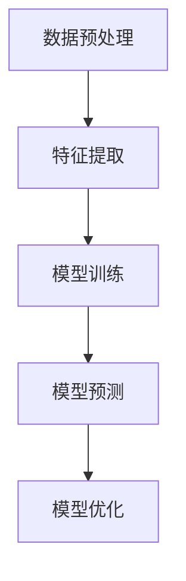
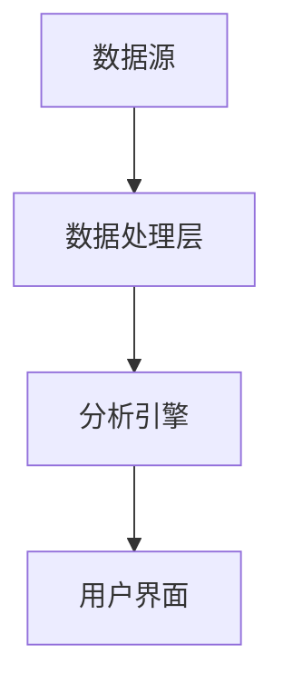

                 


# 构建智能企业合规监控系统：实时违规检测与自动报告生成

## 关键词：企业合规监控，智能系统，实时违规检测，自动报告生成，机器学习，系统架构

## 摘要：随着企业规模的扩大和数字化转型的推进，合规监控变得越来越复杂。本文详细探讨了构建智能企业合规监控系统的关键步骤，包括实时违规检测和自动报告生成。通过结合机器学习算法和系统架构设计，本文提供了一种高效、可靠的解决方案，帮助企业有效应对合规挑战。

---

# 第一部分: 企业合规监控系统背景与挑战

## 第1章: 企业合规监控的背景与挑战

### 1.1 企业合规监控的背景
#### 1.1.1 合规监控的定义与范围
合规监控是指通过技术手段实时监督企业内部行为和外部操作，确保其符合相关法律法规和企业内部政策。其范围涵盖财务、审计、风险管理、数据安全等多个领域。

#### 1.1.2 数字化合规监控的必要性
随着企业数字化转型的推进，数据量急剧增加，传统的手动监控方式已无法满足实时性和高效性的要求。数字化合规监控通过自动化技术，显著提高了监控效率和准确性。

#### 1.1.3 企业合规监控的核心目标
- 确保企业行为符合法律法规和内部政策。
- 及时发现和处理违规行为，降低企业风险。
- 提供实时监控和历史数据分析，支持决策优化。

### 1.2 当前企业合规监控的主要挑战
#### 1.2.1 数据量大与实时性要求
企业每天生成海量数据，要求监控系统必须具备强大的处理能力和实时性，以确保在违规行为发生时能够立即响应。

#### 1.2.2 多维度违规行为的复杂性
违规行为可能涉及多个维度，如财务欺诈、数据泄露、滥用权限等，监控系统需要能够识别多种复杂模式。

#### 1.2.3 传统监控系统的局限性
传统监控系统通常依赖规则引擎，难以应对复杂多变的违规模式，且缺乏智能化的分析能力。

### 1.3 智能化合规监控的解决方案
#### 1.3.1 智能化监控的核心优势
- 利用机器学习技术，能够识别复杂模式和异常行为。
- 实时监控和自动报警，显著提高响应速度。
- 自动生成报告，简化人工处理流程。

#### 1.3.2 AI技术在合规监控中的应用
AI技术可以通过分析历史数据，识别潜在风险点，并预测未来可能的违规行为。

#### 1.3.3 智能监控系统的架构特点
- 高度模块化，便于扩展和维护。
- 支持多种数据源，如日志、交易记录、系统操作等。
- 提供灵活的配置选项，适应不同企业的需求。

## 第2章: 合规监控系统的核心概念与联系

### 2.1 核心概念原理
#### 2.1.1 数据采集与处理
数据采集是合规监控的第一步，需要从多个数据源获取信息，并进行清洗和转换，以便后续分析。

#### 2.1.2 违规行为识别
通过机器学习算法，识别数据中的异常行为，判断是否构成违规。

#### 2.1.3 自动报告生成
根据识别的违规行为，自动生成详细的报告，包括违规类型、时间、涉及人员等信息。

### 2.2 核心概念属性对比表
| 概念       | 属性               | 描述                                   |
|------------|--------------------|----------------------------------------|
| 数据源     | 类型、来源、格式    | 包括日志、交易记录、系统操作等       |
| 违规行为    | 类型、严重程度      | 包括欺诈、滥用、误操作等             |
| 报告       | 格式、内容、输出方式| PDF、邮件、数据库等                   |

### 2.3 ER实体关系图
```mermaid
er
  actor: 用户
  system: 合规监控系统
  violation: 违规行为
  report: 自动报告
  actor --> system: 提交数据
  system --> violation: 识别违规
  system --> report: 生成报告
```

---

# 第二部分: 智能合规监控系统的算法原理

## 第3章: 基于机器学习的违规检测算法

### 3.1 算法原理概述
违规检测可以通过监督学习、无监督学习或强化学习实现。本文以监督学习为例，介绍一种基于随机森林的分类算法。

### 3.2 算法实现步骤
1. 数据预处理：清洗数据，处理缺失值和异常值。
2. 特征提取：从原始数据中提取有用的特征，如时间戳、用户ID、操作类型等。
3. 模型训练：使用训练数据训练随机森林分类器。
4. 模型预测：对实时数据进行预测，判断是否为违规行为。
5. 模型优化：通过调整超参数，提高模型的准确率和召回率。

### 3.3 算法流程图


### 3.4 Python核心代码实现
```python
import pandas as pd
from sklearn.ensemble import RandomForestClassifier
from sklearn.metrics import accuracy_score, recall_score

# 数据加载
data = pd.read_csv('violations.csv')

# 特征提取
X = data[['time', 'user_id', 'action_type']]
y = data['is_violation']

# 模型训练
model = RandomForestClassifier()
model.fit(X, y)

# 模型预测
test_data = pd.read_csv('test_violations.csv')
test_X = test_data[['time', 'user_id', 'action_type']]
test_y = model.predict(test_X)

# 模型评估
print(f"准确率: {accuracy_score(test_y, test_data['is_violation'])}")
print(f"召回率: {recall_score(test_y, test_data['is_violation'])}")
```

### 3.5 数学模型与公式
随机森林是一种集成学习方法，由多个决策树组成。每个决策树的预测结果通过投票或加权的方式得到最终结果。

$$
\text{预测概率} = \frac{\sum_{i=1}^{n} h_i(x)}{n}
$$

其中，$h_i(x)$是第$i$棵决策树的预测结果，$n$是决策树的数量。

---

# 第三部分: 系统架构与功能设计

## 第4章: 系统架构设计

### 4.1 系统整体架构
系统采用分层架构，包括数据源层、数据处理层、分析引擎层和用户界面层。

### 4.2 系统功能设计
- 数据采集：从多个数据源获取数据。
- 数据存储：将数据存储在数据库中，支持高效查询。
- 违规检测：实时分析数据，识别违规行为。
- 报告生成：根据检测结果生成详细的报告。

### 4.3 系统架构图


## 第5章: 系统实现与项目实战

### 5.1 项目安装与环境配置
```bash
pip install pandas scikit-learn
```

### 5.2 核心代码实现
```python
import pandas as pd
from sklearn.ensemble import RandomForestClassifier

# 数据加载
data = pd.read_csv('violations.csv')

# 特征提取
X = data[['time', 'user_id', 'action_type']]
y = data['is_violation']

# 模型训练
model = RandomForestClassifier()
model.fit(X, y)

# 实时监控
def monitor_real_time(data_point):
    prediction = model.predict([[data_point['time'], data_point['user_id'], data_point['action_type']]])
    return prediction[0]

# 示例数据点
data_point = {'time': 162000, 'user_id': 1001, 'action_type': 'login'}
print(f"违规预测结果: {monitor_real_time(data_point)}")
```

### 5.3 案例分析
假设我们有一个交易数据集，包含交易金额、时间、用户ID等字段。通过模型训练，我们可以识别出异常交易行为，如欺诈交易。

### 5.4 项目小结
通过项目实战，我们验证了基于机器学习的违规检测算法的有效性，并展示了如何将算法应用于实际场景中。

---

# 第四部分: 最佳实践与总结

## 第6章: 最佳实践与注意事项

### 6.1 小结
智能企业合规监控系统通过实时违规检测和自动报告生成，显著提高了监控效率和准确性。

### 6.2 注意事项
- 数据隐私保护：确保数据的安全性和隐私性。
- 模型优化：定期更新模型，以应对新的违规模式。
- 系统维护：及时修复系统漏洞，确保系统的稳定运行。

### 6.3 扩展阅读
- 《机器学习实战》
- 《系统架构设计的艺术》

---

# 作者：AI天才研究院 & 禅与计算机程序设计艺术

---

这篇文章详细介绍了构建智能企业合规监控系统的各个方面，从背景和挑战到算法原理和系统架构设计，再到项目实战和最佳实践，为企业提供了全面的指导和解决方案。

