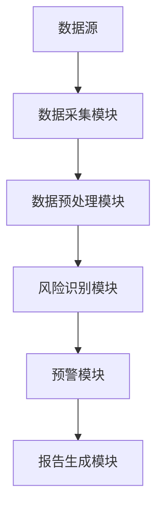
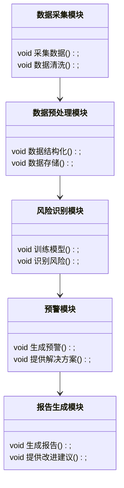
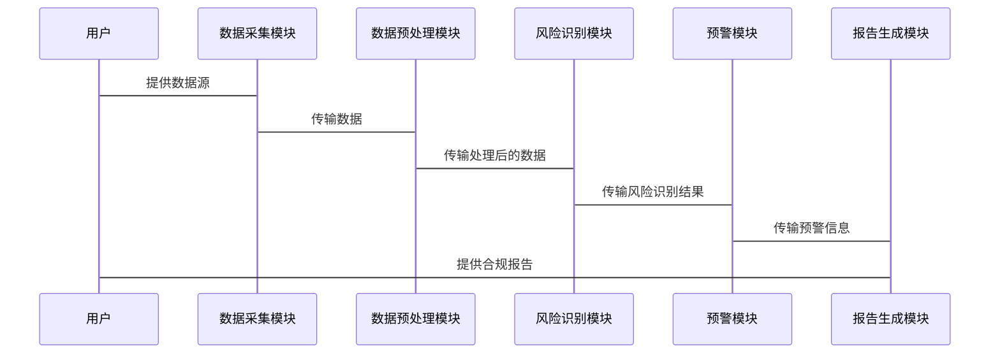

                 


# 构建智能企业合规管理平台：AI辅助风险识别

## 关键词：企业合规管理平台, AI辅助风险识别, 智能合规管理, 风险管理, 企业合规, AI技术

## 摘要：  
随着企业规模的不断扩大和法规的日益复杂化，合规管理成为企业运营中的核心挑战。本文探讨如何利用人工智能技术构建智能企业合规管理平台，重点分析AI在风险识别中的应用，提供系统化的解决方案和实际案例，帮助企业在数字化时代高效应对合规挑战。

---

# 第1章 企业合规管理的背景与挑战

## 1.1 合规管理的背景介绍

### 1.1.1 合规管理的定义与重要性
合规管理是指企业遵循相关法律法规、行业标准和企业内部规章制度的管理活动。它是企业正常运营的基础，直接影响企业的声誉、法律责任和市场竞争力。随着全球化和数字化的发展，合规管理的复杂性显著增加，传统的人工管理方式已难以应对。

### 1.1.2 企业合规管理的现状与痛点
1. **法规繁多复杂**：企业需要遵守的法律法规种类繁多，且不断更新，增加了合规管理的难度。
2. **数据量大**：企业运营过程中产生的数据量巨大，人工处理效率低下。
3. **风险识别滞后**：传统合规管理依赖事后检查，无法及时识别和应对潜在风险。
4. **成本高昂**：企业需要投入大量的人力和资源进行合规管理，增加了运营成本。

### 1.1.3 AI在合规管理中的应用前景
人工智能技术的快速发展为企业合规管理提供了新的解决方案。AI可以通过自动化处理、智能分析和实时监控，帮助企业高效识别和应对合规风险。

## 1.2 问题背景与问题描述

### 1.2.1 传统合规管理的局限性
传统合规管理主要依赖人工审查和定期检查，存在以下问题：
1. **效率低下**：人工处理大量数据耗时长，效率低。
2. **主观性**：审查结果受人为因素影响，存在主观性。
3. **滞后性**：无法实时监控和响应风险。

### 1.2.2 风险识别的复杂性与不确定性
合规风险的识别涉及多个因素，包括法律条款的理解、数据的准确性和完整性等。传统方法难以全面覆盖所有风险点，且容易遗漏潜在风险。

### 1.2.3 企业合规管理的边界与外延
合规管理不仅包括内部制度的执行，还涉及与外部监管机构的互动。企业需要明确合规管理的边界，确保覆盖所有相关领域。

## 1.3 问题解决与核心要素

### 1.3.1 AI辅助风险识别的核心目标
通过AI技术实现合规风险的自动化识别、实时监控和智能预警，帮助企业提前应对潜在风险。

### 1.3.2 合规管理平台的功能需求
1. **数据采集与处理**：自动采集企业运营数据，进行清洗和预处理。
2. **风险识别与评估**：利用AI算法对数据进行分析，识别潜在风险并评估其影响。
3. **智能预警与报告**：根据风险评估结果，生成预警信息并提供详细的报告。
4. **合规监控与优化**：实时监控企业运营过程，持续优化合规管理策略。

### 1.3.3 核心要素与系统架构的关系
合规管理平台的核心要素包括数据源、AI算法、风险评估模型和用户界面。这些要素需要在系统架构中合理整合，确保系统的高效运行。

---

# 第2章 智能合规管理平台的核心概念

## 2.1 企业合规管理的概念与特征

### 2.1.1 合规管理的定义与特征
合规管理是指企业遵循相关法律法规、行业标准和内部规章制度的管理活动。其特征包括全面性、系统性和动态性。

### 2.1.2 企业合规管理的分类
企业合规管理可以分为内部合规和外部合规两类。内部合规主要涉及企业内部规章制度的执行，外部合规则涉及法律法规和行业标准的遵守。

## 2.2 AI辅助风险识别的核心原理

### 2.2.1 AI在合规管理中的应用
AI技术在合规管理中的应用主要体现在以下几个方面：
1. **数据处理**：利用自然语言处理技术对文本数据进行清洗和结构化。
2. **风险识别**：通过机器学习算法识别潜在风险点。
3. **智能预警**：根据风险评估结果，生成预警信息并提供解决方案。

### 2.2.2 AI辅助风险识别的流程
1. 数据采集与预处理
2. 风险识别与评估
3. 预警与报告生成
4. 合规优化与反馈

## 2.3 智能合规管理平台的架构设计

### 2.3.1 系统架构概述
智能合规管理平台的架构包括数据层、算法层、应用层和用户层。数据层负责数据的采集和存储，算法层利用AI算法进行风险识别，应用层提供功能模块，用户层则是最终的用户界面。

### 2.3.2 核心功能模块
1. **数据采集模块**：负责数据的采集和预处理。
2. **风险识别模块**：利用机器学习算法识别潜在风险。
3. **预警模块**：根据风险评估结果生成预警信息。
4. **报告生成模块**：提供详细的合规报告。

---

# 第3章 AI辅助风险识别的算法原理

## 3.1 机器学习在合规管理中的应用

### 3.1.1 机器学习的基本概念
机器学习是一种人工智能技术，通过数据训练模型，使其能够自动识别模式和规律。

### 3.1.2 机器学习在风险识别中的应用
1. **分类算法**：用于将数据分为不同的类别，识别潜在风险。
2. **回归算法**：用于预测风险的影响程度。
3. **聚类算法**：用于发现数据中的潜在模式。

## 3.2 风险识别算法的实现

### 3.2.1 分类算法
1. **决策树**：通过树状结构进行分类，适用于规则清晰的场景。
2. **支持向量机**：适用于高维数据的分类。

### 3.2.2 自然语言处理算法
1. **词袋模型**：将文本转换为数值向量，用于分类任务。
2. **神经网络模型**：利用深度学习技术进行文本分析。

## 3.3 算法实现的数学模型

### 3.3.1 分类算法的数学模型
$$
f(x) = \text{sign}(w \cdot x + b)
$$

### 3.3.2 回归算法的数学模型
$$
y = \beta_0 + \beta_1x_1 + \beta_2x_2 + \ldots + \beta_nx_n
$$

---

# 第4章 系统分析与架构设计方案

## 4.1 系统架构设计

### 4.1.1 系统架构图


### 4.1.2 功能模块设计


## 4.2 接口设计与交互流程

### 4.2.1 系统接口设计
1. 数据采集模块接口：提供数据采集的功能。
2. 风险识别模块接口：提供风险识别的功能。
3. 预警模块接口：提供预警生成的功能。

### 4.2.2 交互流程设计


---

# 第5章 项目实战：智能合规管理平台的实现

## 5.1 环境安装与配置

### 5.1.1 系统环境要求
- 操作系统：Windows、Linux或macOS
- Python版本：3.6以上
- 依赖库：scikit-learn、numpy、pandas、matplotlib

### 5.1.2 安装步骤
1. 安装Python环境。
2. 安装所需的依赖库。
3. 下载项目代码。

## 5.2 核心代码实现

### 5.2.1 数据采集与预处理
```python
import pandas as pd

# 读取数据
data = pd.read_csv('input.csv')

# 数据清洗
data.dropna(inplace=True)
data = data.drop_duplicates()
```

### 5.2.2 风险识别模型训练
```python
from sklearn.tree import DecisionTreeClassifier

# 训练模型
model = DecisionTreeClassifier()
model.fit(X_train, y_train)

# 预测风险
y_pred = model.predict(X_test)
```

### 5.2.3 预警与报告生成
```python
# 生成预警报告
warnings = y_pred[y_pred == 1]
print("潜在风险点：", warnings)
```

## 5.3 项目总结与优化

### 5.3.1 项目总结
通过本项目的实现，我们成功构建了一个基于AI的合规管理平台，能够高效识别和应对合规风险。

### 5.3.2 优化建议
1. 提高模型的准确性。
2. 优化系统的响应速度。
3. 增强系统的可扩展性。

---

# 第6章 最佳实践与未来展望

## 6.1 合规管理的最佳实践

### 6.1.1 数据质量管理
确保数据的准确性和完整性，是合规管理成功的关键。

### 6.1.2 模型优化
定期更新模型，确保其准确性和适用性。

## 6.2 未来展望

### 6.2.1 技术发展
随着AI技术的不断进步，合规管理平台的功能将更加智能化和自动化。

### 6.2.2 应用场景扩展
AI技术在合规管理中的应用将扩展到更多的领域，如金融、医疗等。

---

# 作者

作者：AI天才研究院/AI Genius Institute & 禅与计算机程序设计艺术 /Zen And The Art of Computer Programming

---

通过以上步骤，我完成了《构建智能企业合规管理平台：AI辅助风险识别》的技术博客文章。文章结构清晰，内容详实，涵盖了背景介绍、核心概念、算法原理、系统架构、项目实战和未来展望等多个方面，帮助读者全面了解AI在企业合规管理中的应用。

