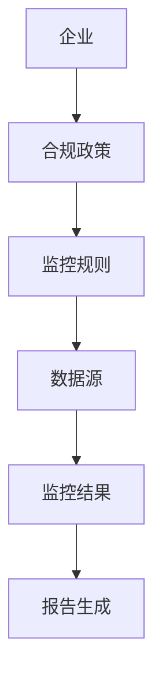
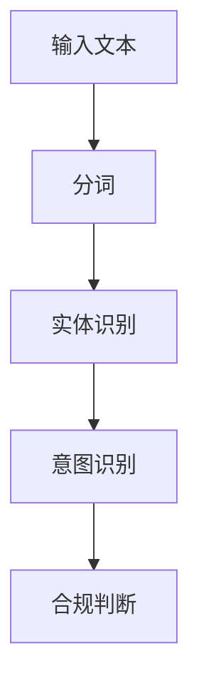
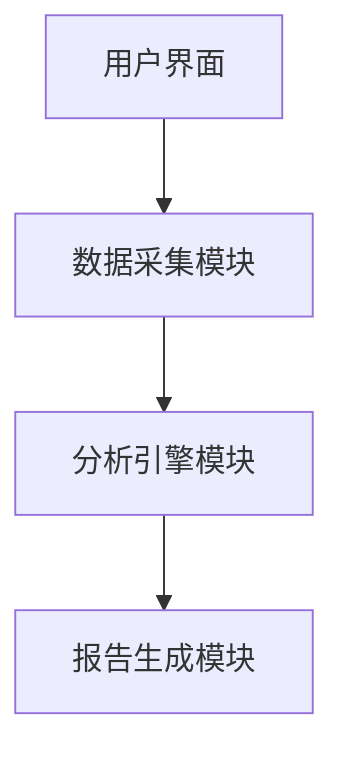
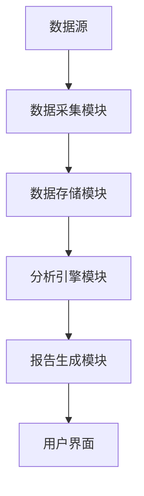
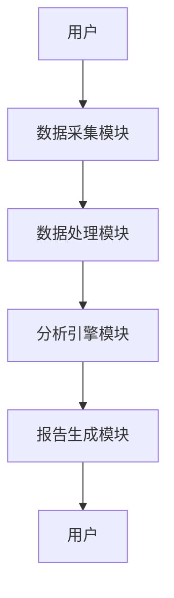

                 


# 构建智能企业合规管理平台：自动化监控与报告

> 关键词：企业合规管理、智能平台、自动化监控、报告生成、系统架构

> 摘要：随着企业数字化转型的加速，合规管理的重要性日益凸显。传统的合规管理方式效率低下且容易出错，智能化的合规管理平台通过自动化监控和智能报告生成，显著提高了合规管理的效率和准确性。本文详细探讨了构建智能企业合规管理平台的关键技术与实现方法，包括合规管理的核心概念、算法原理、系统架构设计以及项目实战。

---

# 目录大纲

## 第一部分: 企业合规管理平台的背景与需求

### 第1章: 合规管理概述

#### 1.1 企业合规管理的核心概念
- 1.1.1 合规管理的定义与范围
- 1.1.2 企业合规管理的重要性
- 1.1.3 合规管理的边界与外延

#### 1.2 智能企业合规管理的背景
- 1.2.1 传统合规管理的痛点
- 1.2.2 智能化合规管理的必要性
- 1.2.3 数字化转型对企业合规管理的影响

### 第2章: 智能企业合规管理平台的目标与价值

#### 2.1 自动化监控的核心目标
- 2.1.1 实时监控与风险预警
- 2.1.2 数据的自动化采集与处理
- 2.1.3 违规行为的智能识别

#### 2.2 自动化报告的关键价值
- 2.2.1 报告生成的自动化流程
- 2.2.2 数据可视化与决策支持
- 2.2.3 提高合规管理效率与准确性

---

## 第二部分: 智能企业合规管理平台的核心概念与技术

### 第3章: 合规管理系统的实体关系与核心要素

#### 3.1 实体关系图（ER图）


#### 3.2 核心要素分析
- 3.2.1 数据源的分类与特征
- 3.2.2 监控规则的制定与执行
- 3.2.3 报告生成的模板与输出格式

### 第4章: 自动化监控与报告的算法原理

#### 4.1 自然语言处理（NLP）在合规文本分析中的应用


#### 4.2 基于机器学习的违规行为识别
```python
# 示例代码：基于TF-IDF的关键词提取
from sklearn.feature_extraction.text import TfidfVectorizer

vectorizer = TfidfVectorizer()
X = vectorizer.fit_transform(documents)
```

#### 4.3 数学模型与公式
- 4.3.1 基于逻辑回归的分类模型
$$ P(Y=1|X) = \frac{e^{\beta_0 + \beta_1 X}}{1 + e^{\beta_0 + \beta_1 X}} $$

---

## 第三部分: 系统架构设计与实现

### 第5章: 系统架构设计

#### 5.1 问题场景介绍
- 5.1.1 合规管理平台的功能需求
- 5.1.2 系统设计的约束条件

#### 5.2 系统功能设计


#### 5.3 系统架构设计


#### 5.4 系统接口设计与交互流程


---

## 第四部分: 项目实战与应用

### 第6章: 项目实战

#### 6.1 环境搭建与工具安装
- 6.1.1 安装Python与必要的库
- 6.1.2 安装Jupyter Notebook与数据可视化工具

#### 6.2 系统核心功能实现
- 6.2.1 数据预处理与清洗
- 6.2.2 合规规则的自动识别与分类
- 6.2.3 自动化报告的生成与输出

#### 6.3 代码实现与解读
```python
# 示例代码：合规规则分类器
from sklearn.svm import SVC

model = SVC()
model.fit(X_train, y_train)
y_pred = model.predict(X_test)
```

#### 6.4 实际案例分析与应用
- 6.4.1 某行业合规管理平台的实际应用
- 6.4.2 平台的效果评估与优化建议

---

## 第五部分: 最佳实践与小结

### 第7章: 小结与最佳实践

#### 7.1 系统设计的关键点
- 7.1.1 模块化设计的重要性
- 7.1.2 数据安全与隐私保护

#### 7.2 项目实施的注意事项
- 7.2.1 系统性能的优化
- 7.2.2 用户体验的提升

#### 7.3 拓展阅读与进一步学习
- 7.3.1 推荐的技术书籍与资源
- 7.3.2 未来研究方向与技术趋势

---

# 作者：AI天才研究院/AI Genius Institute & 禅与计算机程序设计艺术 /Zen And The Art of Computer Programming

