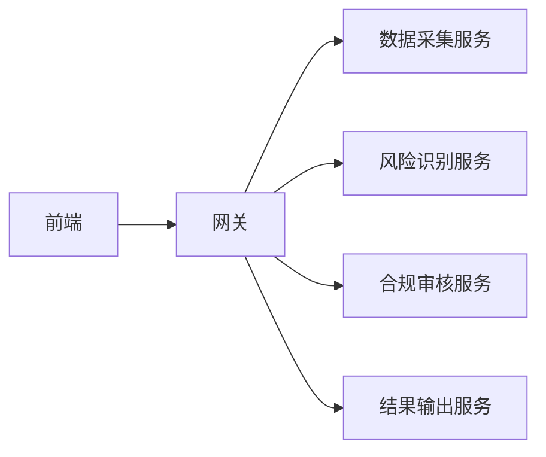
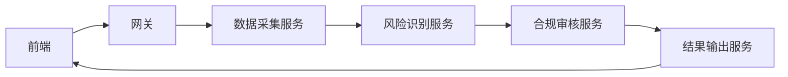

                 


# 构建智能企业合规管理系统：AI辅助风险识别与控制

> 关键词：企业合规管理, AI技术, 风险识别, 机器学习, 数据挖掘

> 摘要：本文将探讨如何利用人工智能技术构建智能企业合规管理系统，重点分析AI在风险识别与控制中的应用，结合实际案例和算法原理，详细阐述系统构建的全过程。

---

## 第一部分: 企业合规管理的背景与挑战

### 第1章: 企业合规管理的定义与重要性

#### 1.1 企业合规管理的核心概念
企业合规管理是指企业在经营过程中，遵循相关法律法规、行业标准和企业内部规章制度，确保企业行为合法、合规的管理活动。合规管理不仅能够降低企业的法律风险，还能提升企业的信誉和市场竞争力。

#### 1.2 合规管理的重要性
在数字化和全球化背景下，企业面临复杂的法律环境和监管要求。合规管理不仅是企业合法经营的基础，也是企业风险管理的重要组成部分。传统的合规管理依赖人工审核和经验判断，效率低且容易出错。

#### 1.3 AI技术在合规管理中的应用前景
人工智能技术的快速发展为合规管理带来了新的可能性。通过自然语言处理、机器学习和数据挖掘等技术，AI能够帮助企业在海量数据中快速识别风险点，提高合规审核的效率和准确性。

---

### 第2章: 传统企业合规管理的痛点

#### 2.1 传统合规管理的局限性
传统的合规管理主要依赖人工审核，存在以下问题：
- **效率低**：人工审核需要逐一检查文档，耗时且效率低下。
- **准确性差**：人为判断容易出错，尤其是在处理复杂问题时。
- **覆盖范围有限**：人工审核难以全面覆盖所有风险点。

#### 2.2 人工审核的低效问题
人工审核需要处理大量的文档和数据，容易受到主观因素和疲劳的影响，导致审核结果不一致和错误率较高。

#### 2.3 风险识别的不全面性
传统合规管理主要依赖经验和规则，难以发现隐藏在数据中的潜在风险。尤其是在复杂业务场景下，人工审核难以覆盖所有可能的风险点。

---

### 第3章: AI技术在合规管理中的应用前景

#### 3.1 AI技术如何提升合规管理效率
通过自然语言处理（NLP）技术，AI可以自动识别文档中的关键词和风险点，快速完成合规审核。机器学习算法能够从历史数据中学习，预测潜在的合规风险。

#### 3.2 数据驱动的合规管理新范式
AI技术能够从海量数据中提取有价值的信息，帮助企业在合规管理中实现数据驱动的决策。通过实时监控和数据分析，企业可以快速响应潜在的合规风险。

#### 3.3 AI在风险识别与控制中的潜在价值
AI技术能够通过异常检测和预测模型，帮助企业发现潜在的合规风险，提前采取控制措施，降低企业的法律风险和经济损失。

---

## 第二部分: AI辅助企业合规管理的核心概念

### 第4章: 合规管理的系统架构

#### 4.1 合规管理系统的组成要素
合规管理系统主要包括以下几个部分：
- **数据采集模块**：负责采集企业相关的文档、数据和日志。
- **风险识别模块**：通过AI算法识别潜在的合规风险。
- **合规审核模块**：对识别出的合规风险进行审核和评估。
- **结果输出模块**：输出合规报告和改进建议。

#### 4.2 数据流与业务流的交互关系
数据流是指数据在系统中的流动过程，包括数据采集、处理和分析。业务流是指企业业务流程中的合规管理活动。两者相互关联，共同实现合规管理的目标。

#### 4.3 系统的核心功能模块
- **数据采集模块**：支持多种数据源的接入，如文档、数据库和日志。
- **风险识别模块**：基于机器学习算法，识别潜在的合规风险。
- **合规审核模块**：对风险点进行人工或自动审核。
- **结果输出模块**：生成合规报告和改进建议。

---

### 第5章: AI辅助合规管理的实现方式

#### 5.1 自然语言处理在文档审核中的应用
通过NLP技术，AI可以自动识别文档中的关键词和风险点，快速完成合规审核。例如，使用文本分类算法对合同进行分类，识别潜在的法律风险。

#### 5.2 机器学习在风险预测中的作用
机器学习算法能够从历史数据中学习，预测潜在的合规风险。例如，使用逻辑回归算法预测合同违约风险。

#### 5.3 数据挖掘在异常行为检测中的应用
数据挖掘技术可以帮助企业在海量数据中发现异常行为，如欺诈行为和违规操作。例如，使用聚类算法检测异常交易。

---

### 第6章: 合规管理与AI技术的结合模型

#### 6.1 数据-模型-业务的三元关系
数据是模型的输入，模型是业务的工具，业务是数据的来源。三者相互关联，共同实现合规管理的目标。

#### 6.2 AI模型的训练数据来源与处理方式
AI模型的训练数据来源于企业的历史数据和外部法律法规。数据预处理包括数据清洗、特征提取和数据增强。

#### 6.3 系统输出的合规建议与决策支持
系统通过分析模型输出结果，提供合规建议和决策支持。例如，系统可以自动识别合同中的风险点，并提供修改建议。

---

## 第三部分: AI辅助合规管理的算法原理

### 第7章: 文本分类算法在合规文档审核中的应用

#### 7.1 文本分类的基本原理
文本分类是通过机器学习算法对文本进行分类的过程。常用的文本分类算法包括朴素贝叶斯、支持向量机（SVM）和深度学习模型（如CNN和RNN）。

#### 7.2 基于深度学习的文本分类模型
深度学习模型（如BERT）在文本分类任务中表现出色。通过预训练和微调，模型可以自动提取文本特征，实现高精度的文本分类。

#### 7.3 文本分类算法实现的步骤与代码示例
以下是一个基于朴素贝叶斯的文本分类算法的Python代码示例：

```python
from sklearn.feature_extraction.text import TfidfVectorizer
from sklearn.naive_bayes import MultinomialNB
from sklearn.pipeline import Pipeline

# 数据预处理
text_clf = Pipeline([
    ('tfidf', TfidfVectorizer()),
    ('clf', MultinomialNB())
])

# 模型训练
text_clf.fit(X_train, y_train)

# 模型预测
y_pred = text_clf.predict(X_test)
```

---

### 第8章: 风险预测模型的构建与优化

#### 8.1 风险预测模型的数学公式
风险预测模型可以通过逻辑回归算法实现。其数学公式为：

$$ P(y=1) = \frac{e^{\beta_0 + \beta_1 x_1 + \cdots + \beta_n x_n}}{1 + e^{\beta_0 + \beta_1 x_1 + \cdots + \beta_n x_n}} $$

其中，$\beta$ 是模型参数，$x$ 是输入特征。

#### 8.2 基于机器学习的模型训练流程
模型训练流程包括数据预处理、特征提取、模型训练和模型评估。以下是一个逻辑回归模型的训练代码示例：

```python
from sklearn.linear_model import LogisticRegression
from sklearn.model_selection import train_test_split

# 数据预处理
X_train, X_test, y_train, y_test = train_test_split(X, y, test_size=0.2)

# 模型训练
lr = LogisticRegression()
lr.fit(X_train, y_train)

# 模型评估
print("准确率：", lr.score(X_test, y_test))
```

---

### 第9章: 异常检测算法在合规监控中的应用

#### 9.1 基于聚类分析的异常检测
聚类分析是一种无监督学习技术，可以通过聚类中心检测异常点。以下是一个基于K-means算法的异常检测代码示例：

```python
from sklearn.cluster import KMeans

# 数据预处理
X = ...  # 输入数据

# 模型训练
kmeans = KMeans(n_clusters=2)
kmeans.fit(X)

# 异常点检测
# 假设簇0是正常点，簇1是异常点
outliers = kmeans.labels_[kmeans.labels_ == 1]
```

#### 9.2 基于时间序列分析的异常识别
时间序列分析可以通过ARIMA模型预测未来趋势，并识别异常点。以下是一个ARIMA模型的实现代码示例：

```python
from statsmodels.tsa.arima_model import ARIMA

# 数据预处理
model = ARIMA(train, order=(5,1,0))
model_fit = model.fit(disp=-1)

# 预测未来值
forecast = model_fit.forecast(steps=5)
```

---

## 第四部分: 系统架构与接口设计

### 第10章: 系统功能模块划分

#### 10.1 数据采集模块
数据采集模块负责从多种数据源（如数据库、文件和API）采集数据，并进行初步清洗和处理。

#### 10.2 风险识别模块
风险识别模块通过机器学习算法识别潜在的合规风险，并生成风险报告。

#### 10.3 合规审核模块
合规审核模块对风险报告进行人工或自动审核，并输出审核结果。

#### 10.4 结果输出模块
结果输出模块生成合规报告和改进建议，并将其输出到企业管理系统中。

---

### 第11章: 系统架构设计

#### 11.1 基于微服务架构的系统设计
微服务架构将系统划分为多个独立的服务，每个服务负责特定的功能模块。以下是系统的微服务架构图：



#### 11.2 数据流与服务调用的流程图
以下是数据流与服务调用的流程图：



#### 11.3 系统的高可用性与扩展性设计
系统采用分布式架构，支持负载均衡和容灾备份。通过容器化部署和自动化扩展，确保系统的高可用性和扩展性。

---

### 第12章: 系统接口设计与交互流程

#### 12.1 API接口定义
系统通过RESTful API提供接口服务。以下是API接口定义：

- **GET /api/v1/data**：获取数据
- **POST /api/v1/risk**：提交风险识别任务
- **GET /api/v1/results**：获取结果报告

#### 12.2 接口调用的流程图
以下是接口调用的流程图：


---

## 第五部分: 项目实战与案例分析

### 第13章: 项目环境搭建

#### 13.1 开发环境的安装与配置
开发环境需要安装Python、Jupyter Notebook和相关机器学习库（如scikit-learn和tensorflow）。

#### 13.2 数据集的准备与预处理
数据集需要包括企业的历史数据和外部法律法规。数据预处理包括数据清洗、特征提取和数据增强。

#### 13.3 开发工具的使用
常用的开发工具包括Jupyter Notebook、PyCharm和Visual Studio Code。

---

### 第14章: 核心功能实现

#### 14.1 文本分类模块的代码实现
以下是一个基于朴素贝叶斯的文本分类算法的代码示例：

```python
from sklearn.feature_extraction.text import TfidfVectorizer
from sklearn.naive_bayes import MultinomialNB
from sklearn.pipeline import Pipeline

# 数据预处理
text_clf = Pipeline([
    ('tfidf', TfidfVectorizer()),
    ('clf', MultinomialNB())
])

# 模型训练
text_clf.fit(X_train, y_train)

# 模型预测
y_pred = text_clf.predict(X_test)
```

#### 14.2 风险预测模型的训练与部署
以下是一个基于逻辑回归算法的风险预测模型的代码示例：

```python
from sklearn.linear_model import LogisticRegression
from sklearn.model_selection import train_test_split

# 数据预处理
X_train, X_test, y_train, y_test = train_test_split(X, y, test_size=0.2)

# 模型训练
lr = LogisticRegression()
lr.fit(X_train, y_train)

# 模型部署
import joblib

joblib.dump(lr, 'risk_prediction_model.pkl')
```

---

### 第15章: 案例分析与经验总结

#### 15.1 典型案例的分析与解读
通过实际案例分析，展示AI技术在合规管理中的应用效果。例如，某企业通过AI技术实现了合同风险的自动识别和预警，显著提高了合规管理的效率。

#### 15.2 项目实施中的常见问题与解决方案
- **数据质量问题**：数据清洗和特征工程是关键。
- **模型性能问题**：通过调参和优化模型结构可以提升性能。
- **模型解释性问题**：使用可解释性模型（如线性回归）可以提高模型的可解释性。

#### 15.3 项目优化与改进建议
- **数据多样性**：增加多样化的数据来源，提高模型的泛化能力。
- **模型更新**：定期更新模型，确保模型的性能和准确性。
- **用户反馈**：收集用户的反馈，不断优化系统的功能和性能。

---

## 第六部分: 最佳实践与未来发展

### 第16章: 合规管理中的AI技术应用建议

#### 16.1 数据质量与模型性能的关系
数据质量直接影响模型的性能。高质量的数据可以提高模型的准确性和可靠性。

#### 16.2 模型的可解释性与合规要求
在合规管理中，模型的可解释性非常重要。通过可解释性模型，企业可以更好地理解和信任AI系统的决策。

#### 16.3 数据隐私与合规管理的平衡
在使用AI技术进行合规管理时，需要充分考虑数据隐私和合规性要求。通过数据脱敏和加密技术，确保数据的安全性和合规性。

---

### 第17章: 小结与注意事项

#### 17.1 小结
本文详细探讨了AI技术在企业合规管理中的应用，分析了AI辅助风险识别与控制的核心概念和算法原理，提出了系统的架构设计和项目实施的最佳实践。

#### 17.2 注意事项
- 在实施AI辅助合规管理系统时，需要充分考虑数据隐私和合规性要求。
- 模型的可解释性和准确性是确保系统可靠性的关键。
- 定期更新模型和优化系统是保持系统性能和准确性的必要条件。

---

## 作者：AI天才研究院/AI Genius Institute & 禅与计算机程序设计艺术 /Zen And The Art of Computer Programming

