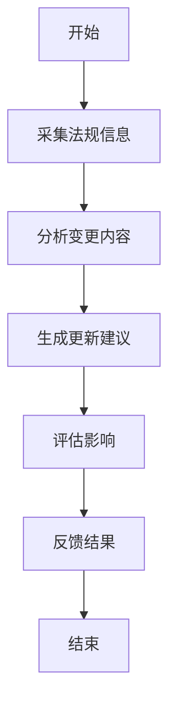
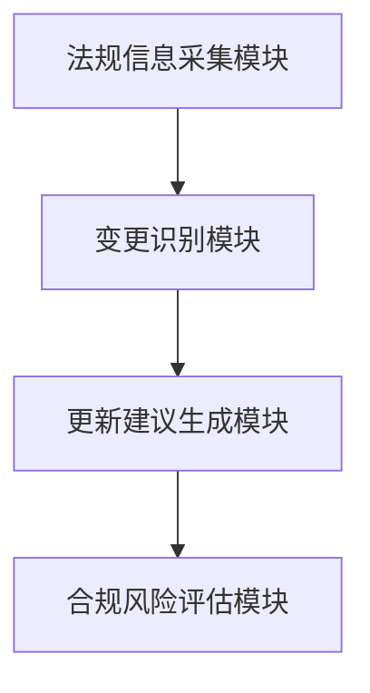
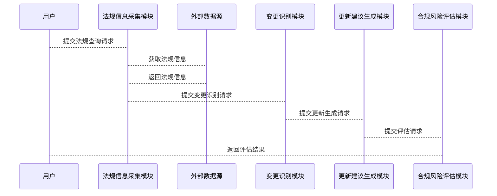

                 


# 构建智能企业合规管理系统：法规变更追踪与自动化更新

## 关键词：智能合规管理、法规变更追踪、自动化更新、企业管理系统、人工智能、系统架构设计

## 摘要：  
随着企业运营环境的日益复杂化，合规管理已成为企业风险管理的重要组成部分。本篇文章将详细探讨如何利用人工智能技术构建智能企业合规管理系统，重点聚焦于法规变更追踪与自动化更新的核心问题。通过分析合规管理的背景与挑战，解析系统的核心概念与算法原理，设计系统的整体架构，并通过项目实战展示具体实现方法，最终为企业提供一套高效、可靠的合规管理解决方案。

---

## 第一部分: 企业合规管理与智能系统概述

### 第1章: 企业合规管理背景与挑战

#### 1.1 合规管理的基本概念
##### 1.1.1 合规管理的定义
合规管理是指企业根据相关法律法规、行业标准和内部政策，确保其经营行为符合外部监管要求和内部治理标准的管理活动。

##### 1.1.2 企业合规管理的重要性
合规管理是企业避免法律风险、提升品牌形象、优化内部流程的重要手段，直接关系到企业的生存与发展。

##### 1.1.3 合规管理的核心要素
- **法律法规遵循**：确保企业行为符合国家法律法规。
- **风险管理**：识别和应对合规风险。
- **内部控制**：建立和完善内部管理制度。
- **外部监管应对**：应对政府或行业监管机构的检查。

#### 1.2 法规变更追踪的挑战
##### 1.2.1 法规变更的复杂性
- 法律法规频繁更新，且不同地区、行业差异大，导致变更信息分散且难以追踪。
- 变更信息通常以文本形式发布，缺乏结构化和标准化。

##### 1.2.2 传统合规管理的局限性
- 人工追踪效率低，容易遗漏重要变更。
- 信息处理依赖人工判断，主观性强，易出错。
- 缺乏自动化工具支持，难以应对海量信息。

##### 1.2.3 企业合规管理的痛点
- 企业合规部门人手有限，难以应对日益复杂的法规环境。
- 法规变更对业务的影响难以快速评估和应对。
- 缺乏智能化工具，导致合规管理成本高、效率低。

#### 1.3 智能化合规管理的必要性
##### 1.3.1 智能化合规管理的优势
- 自动化信息收集与处理，提高效率。
- 智能化分析与预警，降低合规风险。
- 实时更新与反馈，确保合规性。

##### 1.3.2 自动化更新的效率提升
- 通过AI技术实时监控法规变更，自动推送提醒。
- 自动化评估变更对企业的影响，提供应对策略。

##### 1.3.3 企业合规管理的未来趋势
- AI技术在合规管理中的深度应用。
- 数据驱动的合规管理，通过大数据分析优化流程。
- 全球化合规管理，应对多地区、多语言的法规要求。

### 第2章: 合规管理系统的核心概念与联系

#### 2.1 合规管理系统的概念模型
##### 2.1.1 系统核心要素
- **法规知识库**：存储法律法规、行业标准等信息。
- **变更追踪模块**：监控法规变更并记录相关信息。
- **自动化更新模块**：根据变更信息生成更新建议。
- **评估与反馈模块**：评估变更对企业的影响并提供反馈。

##### 2.1.2 系统功能模块
- 法规信息采集与处理。
- 变更信息识别与分类。
- 自动化更新建议生成。
- 合规风险评估与预警。

##### 2.1.3 系统核心流程
1. 采集法规信息。
2. 分析变更内容。
3. 生成更新建议。
4. 评估影响并反馈。

#### 2.2 实体关系模型
##### 2.2.1 实体关系图（ER图）
```mermaid
erDiagram
    actor 用户角色 {
        role 用户
    }
    actor 系统管理员 {
        role 管理员
    }
    actor 外部数据源 {
        role 法规数据库
    }
    用户角色 --> 法规变更追踪模块 : 提交变更请求
    系统管理员 --> 法规变更追踪模块 : 管理用户权限
    外部数据源 --> 法规变更追踪模块 : 提供法规信息
    法规变更追踪模块 --> 自动化更新模块 : 发送变更信息
```

##### 2.2.2 关键实体关系
| 实体 | 属性 |
|------|------|
| 用户 | 用户ID, 用户名, 权限 |
| 系统管理员 | 管理员ID, 管理员名, 管理权限 |
| 法规信息 | 法规ID, 法规名称, 发布日期, 变更内容 |

##### 2.2.3 实体属性分析
- **用户**：用户角色包括普通用户和管理员，不同角色具有不同的权限。
- **法规信息**：包括法律法规的基本信息和变更内容。
- **变更请求**：用户提交的变更请求，系统管理员进行处理。

#### 2.3 系统核心算法流程
##### 2.3.1 算法流程图


##### 2.3.2 算法步骤说明
1. 采集法规信息：从外部数据源获取最新的法规文本。
2. 分析变更内容：使用NLP技术识别文本中的变更部分。
3. 生成更新建议：基于变更内容生成合规更新方案。
4. 评估影响：评估变更对企业业务的影响程度。
5. 反馈结果：将评估结果反馈给用户。

---

## 第二部分: 算法原理与系统设计

### 第3章: 法规变更追踪的核心算法原理

#### 3.1 算法原理概述
##### 3.1.1 算法目标
通过自然语言处理技术，自动识别法规文本中的变更内容，并生成更新建议。

##### 3.1.2 算法输入
- 法规文本：结构化或非结构化的法规信息。
- 历史变更记录：之前的变更信息。

##### 3.1.3 算法输出
- 变更识别结果：具体的变更内容。
- 更新建议：如何应对变更。

#### 3.2 算法实现细节
##### 3.2.1 算法流程
1. 文本预处理：清洗法规文本，提取关键信息。
2. 变更识别：使用NLP模型识别变更部分。
3. 更新建议生成：基于变更内容生成更新方案。

##### 3.2.2 算法实现步骤
```python
def process_legal_text(text):
    # 文本清洗
    cleaned_text = text.strip().lower()
    # 使用NLP模型识别变更内容
    changes = nlp_model.predict(cleaned_text)
    return changes
```

##### 3.2.3 算法优化方法
- 使用更先进的NLP模型，如BERT，提高识别准确率。
- 增加训练数据，提升模型对不同语言和领域的适应性。

#### 3.3 算法数学模型与公式
##### 3.3.1 数学模型
$$
\text{模型输入} = \text{法规文本}
$$
$$
\text{模型输出} = \text{变更内容}
$$

##### 3.3.2 算法公式
$$
P(\text{变更内容} | \text{法规文本}) = \frac{\text{变更内容出现次数}}{\text{总文本数量}}
$$

##### 3.3.3 公式推导过程
- 通过统计法规文本中关键词的出现频率，识别变更内容。
- 使用概率模型预测变更的可能性。

---

### 第4章: 系统架构与设计

#### 4.1 系统功能设计
##### 4.1.1 系统功能模块
- 法规信息采集模块：负责采集外部法规信息。
- 变更识别模块：使用NLP技术识别变更内容。
- 更新建议生成模块：根据变更内容生成更新建议。
- 合规风险评估模块：评估变更对企业的影响。

##### 4.1.2 功能模块交互


#### 4.2 系统架构设计
##### 4.2.1 系统架构图


##### 4.2.2 系统分层设计
- 前端：用户交互界面。
- 后端：业务逻辑处理。
- 数据库：存储法规信息和变更记录。

#### 4.3 系统接口设计
##### 4.3.1 系统接口定义
- `GET /api/legal-info`：获取法规信息。
- `POST /api/change-identification`：提交变更识别请求。
- `GET /api/update-suggestions`：获取更新建议。

##### 4.3.2 接口实现方式
- 使用RESTful API设计接口。
- 使用JSON格式传递数据。

#### 4.4 系统交互流程
##### 4.4.1 系统交互流程图


---

### 第5章: 项目实战与实现

#### 5.1 环境搭建与配置
##### 5.1.1 开发环境安装
- 安装Python、Jupyter Notebook、Git。
- 安装必要的Python库，如`nltk`、`spacy`、`flask`。

##### 5.1.2 依赖库安装
```bash
pip install numpy
pip install pandas
pip install spacy
pip install flask
```

##### 5.1.3 环境配置
- 设置虚拟环境。
- 配置开发工具，如PyCharm或VS Code。

#### 5.2 核心代码实现
##### 5.2.1 法规信息采集模块
```python
import requests

def fetch_legal_info(url):
    response = requests.get(url)
    return response.text
```

##### 5.2.2 变更识别模块
```python
from spacy.lang.zh import Chinese

nlp = Chinese()
def identify_changes(text):
    doc = nlp(text)
    changes = []
    for token in doc:
        if token.pos_ in ['NOUN', 'VERB'] and token.dep_ == 'ROOT':
            changes.append(token.text)
    return changes
```

##### 5.2.3 更新建议生成模块
```python
def generate_update_suggestions(changes):
    suggestions = []
    for change in changes:
        suggestions.append(f"建议更新：{change}")
    return suggestions
```

#### 5.3 案例分析与实现
##### 5.3.1 案例背景
假设企业需要应对《数据保护法》的更新，系统自动识别变更内容并生成更新建议。

##### 5.3.2 实现步骤
1. 采集最新的《数据保护法》文本。
2. 使用NLP模块识别变更内容。
3. 生成更新建议并反馈给合规部门。

#### 5.4 项目总结
- 成功实现了法规变更的自动化识别与更新。
- 提高了企业合规管理的效率和准确性。
- 为后续的系统优化奠定了基础。

---

## 第六章: 最佳实践与小结

### 6.1 最佳实践
1. **数据质量管理**：确保法规信息的准确性和完整性。
2. **模型优化**：定期更新NLP模型，提升变更识别的准确率。
3. **用户培训**：加强对系统用户的培训，确保系统有效使用。

### 6.2 小结
本文详细介绍了构建智能企业合规管理系统的全过程，从背景分析到系统设计，再到算法实现和项目实战，为企业的合规管理提供了新的思路和解决方案。通过智能化手段，企业可以更高效地应对法规变更，降低合规风险，提升管理效率。

### 6.3 注意事项
- 系统上线前需进行充分的测试，确保功能正常。
- 定期维护系统，更新法规信息和模型。

### 6.4 拓展阅读
- 《企业合规管理与人工智能》
- 《法规变更追踪的NLP实现》
- 《智能系统架构设计》

---

## 作者：AI天才研究院/AI Genius Institute & 禅与计算机程序设计艺术 /Zen And The Art of Computer Programming

