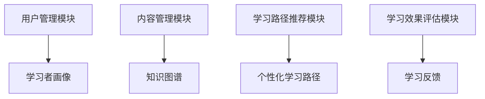
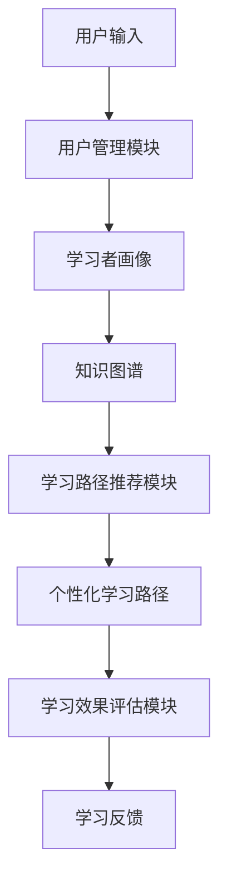

                 


# 构建智能企业培训系统：AI个性化学习路径

> **关键词**：智能企业培训系统、AI个性化学习路径、知识图谱、自然语言处理、机器学习、企业培训系统

> **摘要**：随着企业对员工培训需求的不断增加，传统的培训模式逐渐暴露出效率低下、资源浪费等问题。AI技术的引入为企业培训带来了新的可能性，特别是在个性化学习路径的构建方面。通过分析学习者的需求，结合知识图谱和自然语言处理技术，企业可以实现智能化、个性化的培训方案。本文将详细探讨如何利用AI技术构建智能企业培训系统，分析其核心概念、技术实现和系统架构，并通过实际案例展示其应用价值。

---

# 第1章 引言

## 1.1 企业培训的现状与挑战

企业培训是提升员工技能和企业竞争力的重要手段。然而，传统的培训模式存在以下问题：

- **培训资源浪费**：由于员工需求多样，统一的培训方案难以满足所有人的需求，导致资源浪费。
- **学习效果不佳**：员工对培训内容缺乏兴趣，导致学习效果差。
- **个性化不足**：传统培训模式缺乏个性化，难以针对不同员工的需求提供定制化方案。

## 1.2 AI技术如何赋能企业培训

AI技术的应用为企业培训带来了新的可能性，特别是在个性化学习路径的构建方面。通过分析员工的学习需求、行为数据和绩效表现，AI可以帮助企业制定个性化的培训方案。

## 1.3 个性化学习路径的核心价值

个性化学习路径能够根据员工的实际情况，推荐适合的学习内容和路径，从而提高学习效率和效果，降低培训成本。

---

# 第2章 AI个性化学习路径的核心概念

## 2.1 学习者画像与需求分析

### 2.1.1 学习者画像的构建方法

学习者画像是一种基于数据的用户画像，用于描述学习者的特征、需求和行为模式。构建学习者画像需要收集以下数据：

- **基本信息**：员工的职位、部门、学历等。
- **学习行为**：员工的学习习惯、学习时间、学习偏好等。
- **绩效表现**：员工的工作表现、技能水平等。

### 2.1.2 基于AI的需求分析模型

通过自然语言处理和机器学习技术，可以对员工的学习需求进行分析。例如，通过分析员工的绩效报告和工作总结，提取出员工需要提升的技能点。

### 2.1.3 画像与需求的关联性分析

学习者画像和需求分析模型可以帮助企业识别员工的技能差距，并制定针对性的培训计划。

## 2.2 学习内容模型与知识图谱

### 2.2.1 知识图谱的构建过程

知识图谱是一种结构化的知识表示形式，能够描述知识之间的关系。构建知识图谱需要以下步骤：

1. **数据采集**：收集相关的培训内容和资料。
2. **数据清洗**：去除重复和错误的数据。
3. **知识抽取**：从文本中提取关键知识点。
4. **知识建模**：将知识点组织成图结构。

### 2.2.2 学习内容模型的构建方法

学习内容模型是基于知识图谱构建的，用于描述学习内容之间的关系。例如，可以将知识点分为不同的层次，构建层次化的内容模型。

### 2.2.3 知识图谱在学习路径中的应用

知识图谱可以帮助企业识别知识点之间的依赖关系，从而制定更合理的学习路径。例如，如果员工需要学习“数据分析”，可以先学习“数据可视化”，再学习“数据挖掘”。

## 2.3 学习路径的动态调整机制

### 2.3.1 动态调整的触发条件

学习路径需要根据员工的学习进度和绩效表现进行动态调整。触发条件包括：

- **学习进度滞后**：员工未能按时完成学习任务。
- **绩效表现不佳**：员工的工作表现未达到预期。
- **需求变化**：员工的职业发展方向发生变化。

### 2.3.2 路径调整的算法模型

动态调整学习路径需要使用推荐算法。常见的推荐算法包括：

1. **协同过滤**：基于员工的相似性推荐学习内容。
2. **基于内容的推荐**：基于学习内容的特征推荐相关知识点。
3. **混合推荐**：结合协同过滤和基于内容的推荐方法。

### 2.3.3 调整后的路径优化策略

调整后的学习路径需要进行优化，以提高学习效率。优化策略包括：

- **知识点精简**：去除不必要的知识点。
- **顺序优化**：调整知识点的学习顺序，使其更符合认知规律。
- **个性化推荐**：根据员工的偏好推荐学习内容。

## 2.4 本章小结

本章介绍了学习者画像、知识图谱和学习路径的动态调整机制。通过构建学习者画像和知识图谱，企业可以制定个性化的学习路径，并根据实际情况动态调整学习内容和顺序。

---

# 第3章 AI技术在企业培训中的实现原理

## 3.1 自然语言处理在学习内容分析中的应用

### 3.1.1 基于NLP的内容分析流程

自然语言处理技术可以帮助企业对学习内容进行分析。例如，可以使用分词、句法分析和主题提取等技术对文本进行处理。

### 3.1.2 基于NLP的知识抽取

知识抽取是通过NLP技术从文本中提取知识点的过程。例如，可以使用命名实体识别（NER）技术提取专业术语。

### 3.1.3 基于NLP的内容相似度计算

内容相似度计算可以帮助企业识别重复的内容。例如，可以使用余弦相似度计算两篇文本之间的相似性。

## 3.2 基于机器学习的推荐算法

### 3.2.1 协同过滤算法

协同过滤是一种基于用户行为的推荐算法。例如，可以基于员工的学习历史推荐相关课程。

### 3.2.2 基于内容的推荐算法

基于内容的推荐算法基于学习内容的特征进行推荐。例如，可以基于课程的主题标签推荐相关课程。

### 3.2.3 混合推荐算法

混合推荐算法结合了协同过滤和基于内容的推荐方法，能够提高推荐的准确性和多样性。

## 3.3 知识图谱的构建与应用

### 3.3.1 知识图谱的构建流程

知识图谱的构建需要经过数据采集、数据清洗、知识抽取和知识建模等步骤。

### 3.3.2 知识图谱在学习路径中的应用

知识图谱可以帮助企业识别知识点之间的关系，从而制定更合理的学习路径。例如，可以将“数据分析”课程与“数据可视化”课程关联起来，推荐顺序。

## 3.4 本章小结

本章介绍了自然语言处理和机器学习在企业培训中的应用。通过NLP技术，企业可以对学习内容进行分析和处理；通过推荐算法，企业可以制定个性化的学习路径。

---

# 第4章 智能企业培训系统的架构设计

## 4.1 系统功能模块设计

### 4.1.1 用户管理模块

用户管理模块负责管理员工的信息，包括员工的基本信息、学习记录和绩效表现。

### 4.1.2 内容管理模块

内容管理模块负责管理学习内容，包括课程、文档和视频等。支持内容的上传、编辑和删除。

### 4.1.3 学习路径推荐模块

学习路径推荐模块基于学习者画像和知识图谱，推荐适合的学习内容和路径。

### 4.1.4 学习效果评估模块

学习效果评估模块用于评估员工的学习效果，包括学习进度、考试成绩和绩效表现。

## 4.2 系统功能实现流程

### 4.2.1 用户信息采集与处理

用户信息采集包括员工的基本信息、学习记录和绩效表现。通过数据分析，构建学习者画像。

### 4.2.2 内容分析与知识建模

通过NLP技术对学习内容进行分析，构建知识图谱。

### 4.2.3 学习路径生成与推荐

基于学习者画像和知识图谱，生成个性化学习路径并推荐给员工。

### 4.2.4 学习效果评估与反馈

通过学习效果评估模块，评估员工的学习效果，并根据反馈调整学习路径。

## 4.3 系统架构设计

### 4.3.1 系统架构图



### 4.3.2 系统功能流程图



## 4.4 本章小结

本章介绍了智能企业培训系统的架构设计，包括功能模块设计、实现流程和系统架构图。通过系统化的设计，企业可以实现智能化、个性化的培训管理。

---

# 第5章 项目实战

## 5.1 环境安装与配置

### 5.1.1 安装Python和相关库

```bash
pip install numpy pandas scikit-learn spacy
```

### 5.1.2 安装spaCy中文分词库

```bash
python -m spacy download zh
```

## 5.2 核心代码实现

### 5.2.1 学习者画像构建

```python
import pandas as pd

# 假设有一个员工数据表
employees = pd.DataFrame({
    '员工ID': [1, 2, 3],
    '部门': ['技术部', '市场部', '财务部'],
    '学历': ['本科', '硕士', '博士']
})

# 构建学习者画像
def build_profile(employee_id):
    profile = {}
    for employee in employees[employees['员工ID'] == employee_id]:
        profile['部门'] = employee['部门']
        profile['学历'] = employee['学历']
    return profile

# 示例：构建员工ID为1的学习者画像
print(build_profile(1))
```

### 5.2.2 基于NLP的内容分析

```python
import spacy

nlp = spacy.load("zh")

text = "数据分析是通过分析数据来提取有用信息的过程"
doc = nlp(text)

# 提取关键词
keywords = [token.text for token in doc]
print(keywords)
```

### 5.2.3 学习路径推荐

```python
from sklearn.neighbors import NearestNeighbors

# 假设有一个课程数据集
courses = {
    '课程ID': [1, 2, 3],
    '课程名称': ['数据分析', '数据可视化', '数据挖掘'],
    '课程标签': ['数据分析', '数据可视化', '数据挖掘']
}

# 基于内容的推荐
model = NearestNeighbors(n_neighbors=2)
model.fit(courses['课程标签'].reshape(-1, 1))

# 示例：推荐与“数据分析”相关的课程
recommendations = model.kneighbors(['数据分析'], n_neighbors=2)
print(recommendations)
```

## 5.3 实际案例分析

### 5.3.1 案例背景

某公司希望提升技术部员工的数据分析能力，希望通过AI系统制定个性化的学习路径。

### 5.3.2 系统实现

1. **构建学习者画像**：分析员工的学习需求和绩效表现。
2. **知识图谱构建**：对数据分析相关课程进行知识建模。
3. **学习路径推荐**：根据学习者画像和知识图谱推荐学习内容。

## 5.4 本章小结

本章通过实际案例展示了智能企业培训系统的应用价值。通过代码实现，读者可以了解系统的核心功能和技术实现。

---

# 第6章 最佳实践与未来展望

## 6.1 最佳实践 tips

1. **数据收集与隐私保护**：在构建学习者画像时，需要保护员工的隐私。
2. **持续优化**：根据员工的学习反馈，不断优化学习路径。
3. **多模态数据融合**：结合文本、语音和视频等多种数据，提升学习效果。

## 6.2 小结

通过AI技术，企业可以实现智能化、个性化的培训管理，提升员工的学习效率和效果。

## 6.3 未来展望

随着AI技术的不断发展，企业培训系统将更加智能化和个性化。未来的培训系统将更加注重员工的主动性和创造力，帮助员工实现职业目标。

---

# 作者

作者：AI天才研究院/AI Genius Institute & 禅与计算机程序设计艺术/Zen And The Art of Computer Programming

