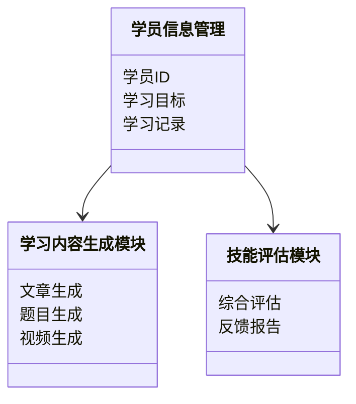
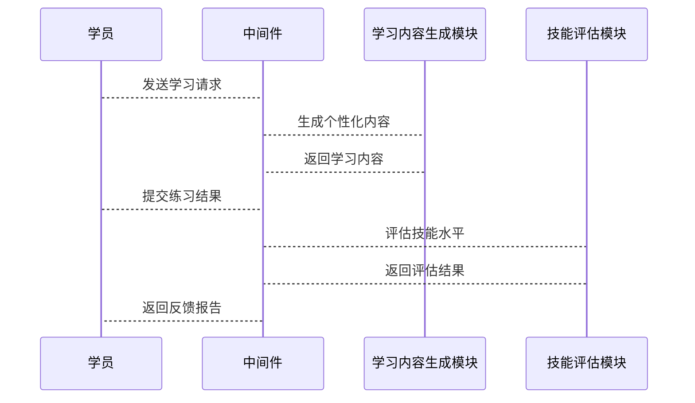

                 


# 《构建智能企业培训系统：自适应学习内容生成与技能评估》

---

## 关键词：
- 智能企业培训系统
- 自适应学习
- 技能评估
- AI算法
- 系统架构
- 项目实战

---

## 摘要：
本文将详细介绍如何构建一个基于人工智能的智能企业培训系统，重点探讨自适应学习内容生成与技能评估的核心技术。通过分析企业培训的痛点，结合AI算法、系统架构设计和项目实战，深入阐述如何利用生成模型和评估模型实现智能化培训。文章内容包括背景介绍、算法原理、系统设计、项目实战及总结，旨在为技术人员和企业决策者提供理论与实践相结合的指导。

---

# 第一部分: 智能企业培训系统的背景与核心概念

## 第1章: 企业培训系统的现状与挑战

### 1.1 传统企业培训的痛点
#### 1.1.1 传统培训模式的局限性
传统的企业培训模式通常采用固定的教学内容和统一的培训方案，难以满足不同学员的学习需求。这种模式忽视了个体差异，导致学习效果参差不齐。

#### 1.1.2 企业培训资源的浪费问题
企业投入大量资源用于培训，但由于内容固定、缺乏个性化，部分员工难以有效吸收，导致资源浪费。

#### 1.1.3 学员学习效果的评估难题
传统的评估方法往往依赖主观评分，缺乏客观性和科学性，难以准确反映学员的真实水平。

### 1.2 智能化培训的需求与趋势
#### 1.2.1 AI技术在企业培训中的应用前景
随着AI技术的发展，企业培训逐渐向智能化方向转型，利用AI算法实现个性化学习和精准评估成为趋势。

#### 1.2.2 自适应学习的市场需求
企业对个性化学习的需求日益增长，自适应学习技术能够根据学员特点动态调整学习内容，满足不同人的需求。

#### 1.2.3 技能评估的智能化发展
智能化的技能评估系统能够实时监测学员的学习进度，提供客观、精准的评估结果，帮助企业和学员更好地优化学习策略。

## 第2章: 智能企业培训系统的概念与框架

### 2.1 自适应学习内容生成
#### 2.1.1 自适应学习的基本原理
自适应学习通过分析学员的学习行为和知识掌握程度，动态生成适合的学习内容。

#### 2.1.2 基于AI的自适应学习内容生成方法
利用自然语言处理（NLP）和生成对抗网络（GAN）等技术，生成符合学员需求的学习材料。

#### 2.1.3 自适应学习的实现流程
1. 收集学员数据（如学习偏好、知识水平）。
2. 分析数据，生成个性化学习计划。
3. 动态调整学习内容，实时反馈学习效果。

### 2.2 技能评估与反馈机制
#### 2.2.1 技能评估的核心要素
技能评估需要考虑知识掌握程度、学习速度、学习兴趣等多个维度。

#### 2.2.2 AI驱动的技能评估方法
通过机器学习模型分析学员的行为数据，评估其技能水平，并提供针对性的反馈建议。

#### 2.2.3 反馈机制在学习中的作用
及时反馈帮助学员了解自己的学习效果，调整学习策略，提高学习效率。

### 2.3 系统整体架构
#### 2.3.1 系统功能模块划分
- 学员信息管理模块
- 学习内容生成模块
- 技能评估模块
- 反馈与优化模块

#### 2.3.2 系统架构的逻辑关系
学员信息 -> 分析 -> 生成个性化学习内容 -> 学习 -> 评估 -> 反馈 -> 优化学习计划

#### 2.3.3 系统的边界与外延
系统的输入是学员数据和培训目标，输出是个性化学习内容和评估结果，与其他系统（如企业HR系统）对接。

---

# 第二部分: 自适应学习内容生成的算法与实现

## 第3章: 自适应学习内容生成的算法原理

### 3.1 基于生成模型的内容生成
#### 3.1.1 生成模型的数学基础
生成模型的核心是通过概率分布生成新的数据。常用的生成模型包括生成对抗网络（GAN）和变体自编码器（VAE）。

#### 3.1.2 GAN（生成对抗网络）的原理
GAN由生成器和判别器组成，通过对抗训练生成逼真的数据。生成器的目标是欺骗判别器，使其认为生成的数据是真实的。

#### 3.1.3 Transformer模型在内容生成中的应用
Transformer模型通过自注意力机制，能够捕捉到文本中的长距离依赖关系，适合用于生成复杂的内容。

### 3.2 内容生成的优化算法
#### 3.2.1 增量式优化方法
通过逐步优化生成内容，确保每次生成的结果都比前一次更优。

#### 3.2.2 基于强化学习的内容生成
利用强化学习算法，通过奖励机制优化生成内容的质量。

#### 3.2.3 贪心算法在内容生成中的应用
贪心算法在每一步选择当前最优的生成策略，逐步构建完整的生成内容。

### 3.3 算法实现的数学模型
#### 3.3.1 GAN模型的损失函数
生成器的损失函数：
$$ \mathcal{L}_{\text{G}} = \mathbb{E}_{z \sim p_z}[\log D(G(z))] $$
判别器的损失函数：
$$ \mathcal{L}_{\text{D}} = \mathbb{E}_{x \sim p_{\text{data}}}[\log D(x)] + \mathbb{E}_{z \sim p_z}[\log (1 - D(G(z)))] $$

#### 3.3.2 Transformer模型的注意力机制
$$ \text{Attention}(Q, K, V) = \text{softmax}\left(\frac{QK^T}{\sqrt{d_k}}\right)V $$

---

## 第4章: 技能评估算法的实现与优化

### 4.1 技能评估的核心算法
#### 4.1.1 基于机器学习的评估模型
利用回归模型或分类模型，根据学员的行为数据预测其技能水平。

#### 4.1.2 基于深度学习的评估模型
使用LSTM或Transformer模型，捕捉学员学习过程中的时序特征。

#### 4.1.3 评估模型的优化策略
通过数据增强、超参数调整等方法优化模型性能。

### 4.2 技能评估的实现流程
1. 收集学员的学习数据（如学习时间、练习结果）。
2. 对数据进行预处理，提取特征。
3. 建立评估模型，训练模型。
4. 使用模型预测学员的技能水平，并生成反馈报告。

### 4.3 模型评估与优化
#### 4.3.1 模型评估指标
- 准确率（Accuracy）
- F1分数（F1-score）
- 挑战指标（AUC）

#### 4.3.2 模型优化方法
- 调整模型结构（如增加隐藏层）
- 使用更复杂的模型（如双向LSTM）
- 增加数据量或进行数据增强

---

## 第5章: 系统分析与架构设计

### 5.1 问题场景介绍
企业培训系统需要支持大规模学员同时在线学习，对系统性能要求高。

### 5.2 项目介绍
本项目旨在开发一个智能企业培训系统，实现自适应学习内容生成与技能评估。

### 5.3 系统功能设计
#### 5.3.1 领域模型（Mermaid类图）


### 5.4 系统架构设计（Mermaid架构图）


### 5.5 系统接口设计
- API接口：学员信息接口、学习内容接口、评估结果接口
- 接口协议：RESTful API，使用JSON格式传输数据

### 5.6 系统交互流程（Mermaid序列图）


---

## 第6章: 项目实战

### 6.1 环境安装
- 安装Python 3.8及以上版本
- 安装必要的库：TensorFlow、Keras、Numpy、Pandas、Scikit-learn

### 6.2 系统核心实现源代码
#### 6.2.1 自适应学习内容生成代码（基于GAN）
```python
import numpy as np
from tensorflow.keras import layers

# 定义生成器
def generator():
    model = tf.keras.Sequential()
    model.add(layers.Dense(256, activation='relu', input_dim=100))
    model.add(layers.Dense(512, activation='relu'))
    model.add(layers.Dense(1024, activation='sigmoid'))
    return model

# 定义判别器
def discriminator():
    model = tf.keras.Sequential()
    model.add(layers.Dense(512, activation='relu', input_dim=1024))
    model.add(layers.Dense(256, activation='relu'))
    model.add(layers.Dense(1, activation='sigmoid'))
    return model
```

#### 6.2.2 技能评估模型代码（基于LSTM）
```python
import tensorflow as tf
from tensorflow.keras.layers import LSTM, Dense

model = tf.keras.Sequential()
model.add(LSTM(128, input_shape=(None, 100)))
model.add(Dense(64, activation='relu'))
model.add(Dense(1, activation='sigmoid'))
model.compile(loss='binary_crossentropy', optimizer='adam')
```

### 6.3 代码应用解读与分析
- 生成器和判别器通过对抗训练生成高质量的学习内容。
- LSTM模型用于分析学员的学习行为序列，评估其技能水平。

### 6.4 实际案例分析
- 案例1：某企业的销售培训系统的改造
- 案例2：IT技能培训平台的自适应学习模块开发

### 6.5 项目小结
通过实际项目，验证了自适应学习内容生成与技能评估技术的有效性，为企业培训系统提供了可行的解决方案。

---

## 第7章: 总结与展望

### 7.1 最佳实践 tips
- 数据质量是关键，确保学员数据的完整性和准确性。
- 定期更新模型，保持系统的先进性。

### 7.2 小结
本文详细介绍了智能企业培训系统的构建过程，从理论到实践，为技术人员提供了全面的指导。

### 7.3 注意事项
- 在实际应用中，要注意系统的可扩展性和安全性。
- 保护学员数据隐私，确保合规性。

### 7.4 拓展阅读
- 《Deep Learning》—— Ian Goodfellow
- 《机器学习实战》—— 周志华

---

## 作者：AI天才研究院 & 禅与计算机程序设计艺术

--- 

注：以上内容为书籍的目录大纲，具体内容需要根据实际需求进一步扩展和补充。

