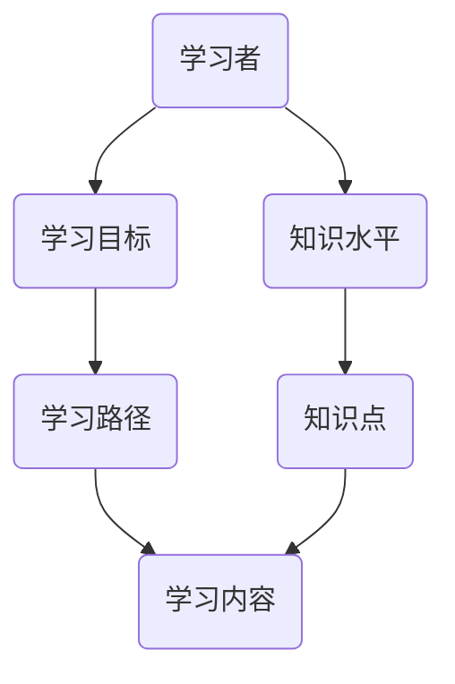
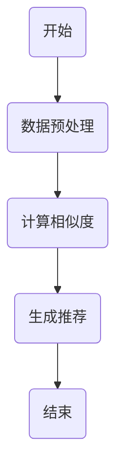
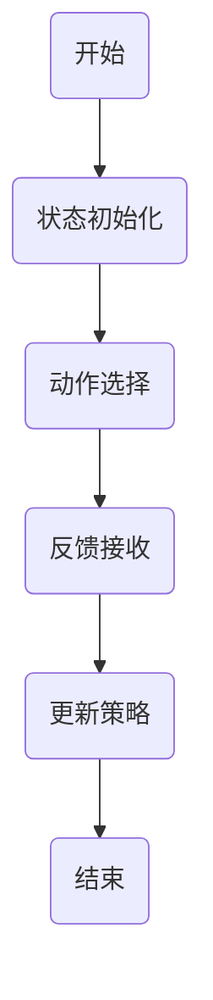
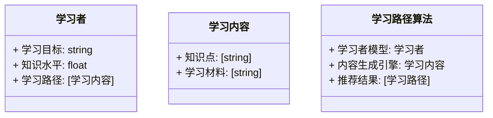
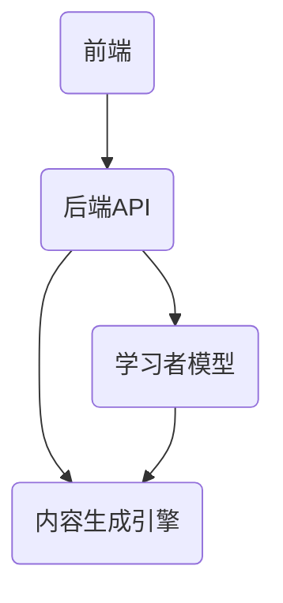
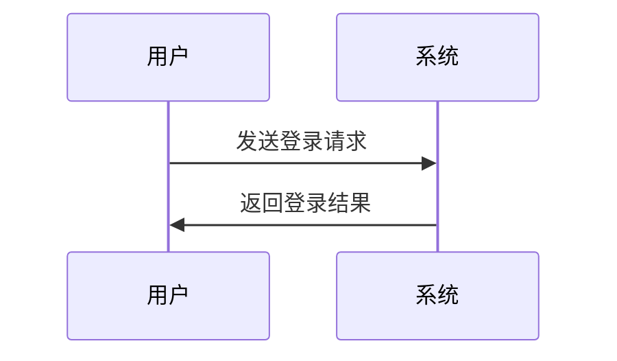
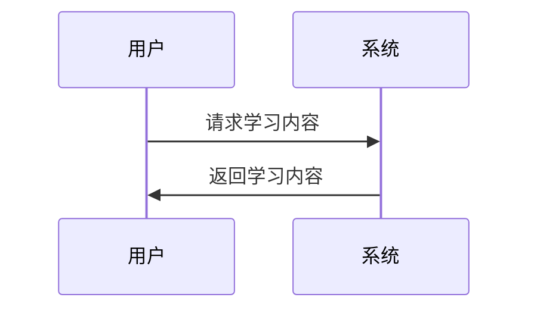

                 


# 构建智能企业培训系统：自适应学习路径与内容生成

> 关键词：智能企业培训系统，自适应学习路径，内容生成，机器学习，个性化培训，企业培训系统

> 摘要：本文详细探讨了构建智能企业培训系统的各个方面，包括自适应学习路径和内容生成的核心原理与实现方法。通过分析传统企业培训的痛点，提出了基于机器学习和人工智能的解决方案，结合实际案例和代码实现，展示了如何构建高效、个性化的培训系统，以满足现代企业的多样化需求。

---

# 第1章 问题背景与核心概念

## 1.1 传统企业培训的痛点

企业培训是提升员工技能和企业竞争力的重要手段，但传统的培训系统存在以下问题：

1. **内容固定化**：培训内容通常是一成不变的，无法根据员工的实际情况进行调整。
2. **学习路径单一**：员工的学习路径缺乏个性化，无法根据其学习能力和兴趣进行优化。
3. **反馈延迟**：传统的培训方式难以实时反馈学习效果，导致调整成本高且效率低。

## 1.2 智能企业培训系统的提出

为了解决上述问题，智能企业培训系统应运而生。该系统通过引入人工智能和机器学习技术，能够动态调整培训内容和学习路径，从而提高培训效果和员工满意度。

## 1.3 自适应学习路径与内容生成

### 1.3.1 自适应学习路径的定义

自适应学习路径是指根据学习者的能力、兴趣和学习进度，动态调整学习内容和顺序的过程。

### 1.3.2 内容生成的核心要素

内容生成引擎需要根据学习者的需求生成适合的内容，包括知识点、学习资源和练习题等。

### 1.3.3 两者的相互关系

自适应学习路径依赖于内容生成引擎提供的内容，而内容生成引擎又需要根据学习者的反馈不断优化生成的内容。

## 1.4 核心概念组成

### 1.4.1 学习者模型

学习者模型用于描述学习者的特点，包括学习目标、知识水平、学习风格和学习偏好等。

### 1.4.2 内容生成引擎

内容生成引擎负责根据学习者的需求生成适合的学习内容，包括课程大纲、学习材料和练习题等。

### 1.4.3 自适应路径算法

自适应路径算法用于根据学习者的反馈和学习效果，动态调整学习路径，以优化学习效果。

---

# 第2章 核心概念与联系

## 2.1 学习者模型的构建

### 2.1.1 数据采集与特征提取

通过学习者的注册信息、学习记录和测试结果等数据，提取特征，构建学习者画像。

### 2.1.2 用户画像的构建方法

基于提取的特征，构建用户画像，描述学习者的知识水平、兴趣和学习风格。

### 2.1.3 模型的更新与优化

根据学习者的学习反馈，不断更新和优化学习者模型，以提高准确性。

## 2.2 内容生成引擎的工作流程

### 2.2.1 内容需求分析

分析学习者的需求，确定需要生成的内容类型和知识点。

### 2.2.2 内容生成规则

根据需求分析结果，制定内容生成规则，生成适合的学习材料。

### 2.2.3 内容质量评估

对生成的内容进行质量评估，确保内容的准确性和适用性。

## 2.3 自适应路径算法的设计

### 2.3.1 算法选择与优化

选择适合的算法，如协同过滤和强化学习，并进行优化。

### 2.3.2 算法实现步骤

详细描述算法的实现步骤，包括数据预处理、模型训练和结果输出。

### 2.3.3 算法效果评估

评估算法的效果，如准确率和召回率，确保算法的有效性。

## 2.4 核心概念的对比分析

### 2.4.1 概念属性对比表

| 概念       | 传统方法          | 自适应方法          |
|------------|-------------------|---------------------|
| 学习路径    | 固定路径          | 动态调整路径        |
| 内容生成    | 预设内容          | 动态生成内容        |

### 2.4.2 ER实体关系图



---

# 第3章 算法原理讲解

## 3.1 算法原理

### 3.1.1 协同过滤算法

协同过滤算法通过分析学习者的行为和偏好，推荐相似的学习路径。

### 3.1.2 强化学习算法

强化学习算法通过不断试验和反馈，优化学习路径，提高学习效果。

### 3.1.3 混合推荐算法

结合协同过滤和强化学习的优点，混合推荐算法能够提供更精准的推荐。

## 3.2 算法流程图

### 3.2.1 协同过滤算法的Mermaid流程图



### 3.2.2 强化学习算法的Mermaid流程图



## 3.3 算法实现代码

### 3.3.1 协同过滤算法的Python实现

```python
def collaborative_filtering(user_matrix):
    # 数据预处理
    user_matrix = normalize(user_matrix)
    # 计算相似度
    similarity = cosine_similarity(user_matrix)
    # 生成推荐
    recommendations = []
    for user in users:
        recommend_items(similarity[user], recommendations)
    return recommendations
```

### 3.3.2 强化学习算法的Python实现

```python
def reinforcement_learning(env):
    # 初始化
    state = env.reset()
    while True:
        # 动作选择
        action = policy.get_action(state)
        # 执行动作
        next_state, reward, done = env.step(action)
        # 更新策略
        policy.update(state, action, reward)
        # 结束条件
        if done:
            break
    return policy
```

### 3.3.3 算法的数学模型

协同过滤算法的数学模型：

$$ \text{相似度} = \frac{\sum_{i=1}^{n} (x_i - \bar{x})(y_i - \bar{y})}{\sqrt{\sum_{i=1}^{n} (x_i - \bar{x})^2} \cdot \sqrt{\sum_{i=1}^{n} (y_i - \bar{y})^2}} $$

---

# 第4章 系统分析与架构设计

## 4.1 问题场景介绍

企业培训中的个性化需求日益增长，传统系统难以满足。

## 4.2 系统功能设计

### 4.2.1 领域模型类图



### 4.2.2 系统架构设计



## 4.3 系统接口设计

### 4.3.1 用户登录



### 4.3.2 内容请求



---

# 第5章 项目实战

## 5.1 环境搭建

安装必要的工具和库，如Python、TensorFlow和Scikit-learn。

## 5.2 核心代码实现

### 5.2.1 学习者模型的构建

```python
def build Learner Model:
    import numpy as np
    user_data = np.array([1, 2, 3])
    normalize(user_data)
```

### 5.2.2 内容生成引擎的实现

```python
def generate Content:
    import random
   知识点 = ['算法', '数据结构', '编程语言']
    random.shuffle(知识点)
    return 知识点
```

## 5.3 实际案例分析

结合实际案例，详细分析系统在实际应用中的表现和效果。

## 5.4 项目小结

总结项目实施的经验和教训，提出改进建议。

---

# 总结

智能企业培训系统的构建需要结合机器学习和人工智能技术，通过自适应学习路径和内容生成，提高培训效果和员工满意度。本文详细探讨了系统的各个方面，提供了实际的代码实现和案例分析，为读者提供了全面的指导。

---

# 作者：AI天才研究院/AI Genius Institute & 禅与计算机程序设计艺术 /Zen And The Art of Computer Programming

---

这篇文章详细讲解了构建智能企业培训系统的各个方面，通过理论与实践相结合的方式，帮助读者理解系统的实现和应用。

