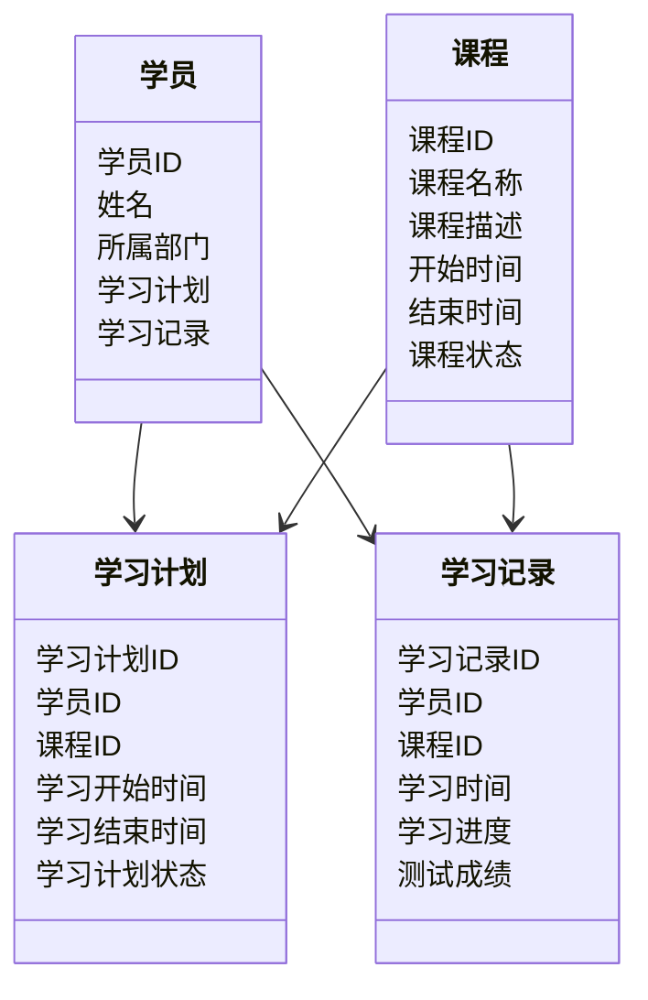
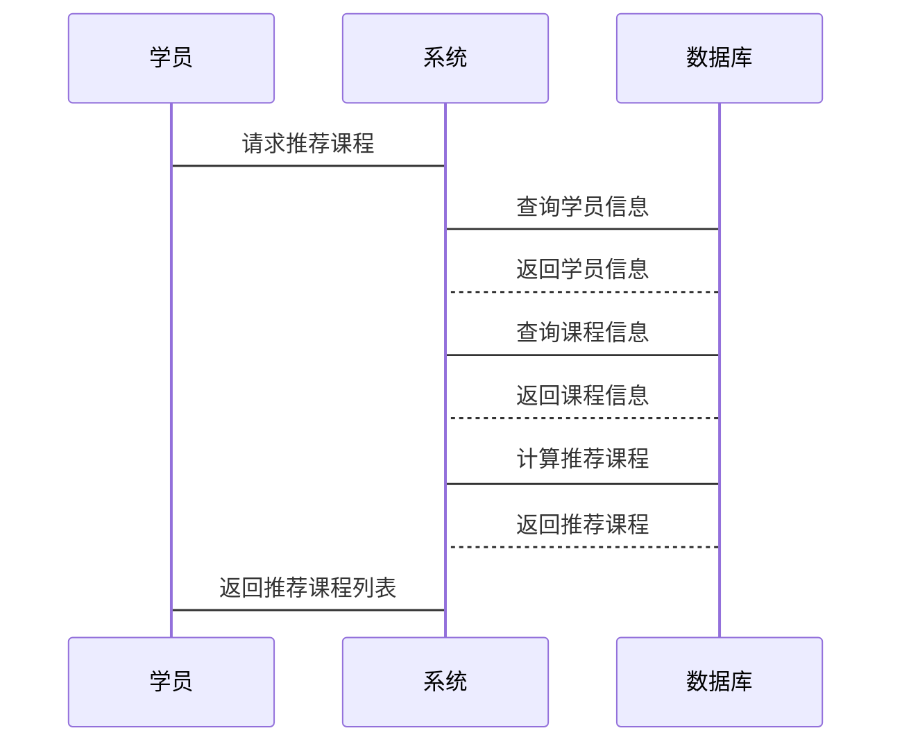

                 


# 构建智能企业学习管理系统：个性化技能发展

> 关键词：智能企业学习管理系统，个性化技能发展，推荐算法，系统架构设计，项目实战

> 摘要：本文将详细探讨如何构建一个智能企业学习管理系统，重点在于实现个性化技能发展。通过分析问题背景、核心概念、算法原理、系统架构设计、项目实战等多方面内容，本文旨在为读者提供一个系统化的方法论，帮助他们理解和实现一个高效的智能企业学习管理系统。

---

# 第1章: 背景与核心概念

## 1.1 问题背景

### 1.1.1 企业学习管理的现状与挑战

在企业培训领域，传统的学习管理系统（LMS）主要依赖人工管理，存在以下问题：

- **学习内容单一化**：传统系统通常提供固定的课程，无法根据员工的技能水平和职业发展需求进行个性化推荐。
- **学习路径不清晰**：员工无法根据自身技能水平和职业目标找到适合的学习路径。
- **学习效果难以评估**：缺乏智能化的评估机制，难以量化学习效果并提供反馈。

### 1.1.2 个性化技能发展的需求

随着企业对员工技能要求的不断提高，个性化技能发展成为必然趋势：

- **员工职业发展规划**：员工需要根据自身职业目标选择适合的学习路径。
- **企业人才梯队建设**：企业需要根据岗位需求为员工提供针对性的培训。
- **快速响应市场需求**：企业需要快速适应市场变化，培养复合型人才。

### 1.1.3 智能化学习管理系统的解决方案

智能化学习管理系统通过以下方式解决传统系统的问题：

- **智能化推荐算法**：根据员工的学习历史、技能水平和职业目标，推荐个性化学习内容。
- **动态学习路径规划**：根据员工的学习进度和反馈，动态调整学习路径。
- **多维度学习效果评估**：通过学习数据的分析，提供多维度的学习效果评估。

---

## 1.2 核心概念与联系

### 1.2.1 核心概念的定义

- **智能学习管理系统（Intelligent Learning Management System, iLMS）**：基于人工智能技术，能够根据用户行为数据和学习目标，提供个性化学习内容和学习路径的系统。
- **个性化技能发展（Personalized Skill Development）**：根据员工的技能水平、职业目标和企业需求，制定个性化的学习计划，实现技能提升。

### 1.2.2 核心概念的属性特征对比

以下从功能、技术实现和用户交互三个方面对智能学习管理系统和传统学习管理系统的属性特征进行对比：

| 特性                | 传统LMS                          | 智能iLMS                           |
|---------------------|-----------------------------------|-------------------------------------|
| **学习内容管理**    | 静态课程库，固定学习路径          | 动态课程库，个性化学习路径          |
| **学习推荐机制**    | 无或简单规则推荐                | 基于机器学习的智能化推荐              |
| **学习效果评估**    | 单一考试成绩评估                  | 多维度数据评估（如知识掌握度、学习行为数据） |
| **用户交互方式**    | 单向内容推送，被动学习            | 互动式推荐，主动学习                 |
| **数据利用程度**    | 无或简单统计分析                | 深度挖掘学习数据，优化推荐策略        |

### 1.2.3 实体关系图

以下是一个简单的ER实体关系图，展示了智能学习管理系统的主要实体及其关系：

```mermaid
erDiagram
    actor 学员 {
        string 学员ID
        string 姓名
        string 邮箱
        string 所属部门
    }
    actor 教师 {
        string 教师ID
        string 姓名
        string 邮箱
        string 所属部门
    }
    actor 管理员 {
        string 管理员ID
        string 姓名
        string 邮箱
        string 所属部门
    }
    entity 课程 {
        string 课程ID
        string 课程名称
        string 课程描述
        date 开始时间
        date 结束时间
        string 课程状态
    }
    entity 学习计划 {
        string 学习计划ID
        string 学员ID
        string 课程ID
        date 学习开始时间
        date 学习结束时间
        string 学习计划状态
    }
    entity 学习记录 {
        string 学习记录ID
        string 学员ID
        string 课程ID
        datetime 学习时间
        integer 学习进度
        integer 测试成绩
    }
    relation 学员-课程 {
        学员 --> 学习计划
        学员 --> 学习记录
        教师 --> 课程
        管理员 --> 管理课程
        管理员 --> 管理学习计划
        管理员 --> 管理学习记录
    }
```

---

# 第2章: 算法原理与实现

## 2.1 个性化推荐算法

### 2.1.1 协同过滤推荐算法

#### 2.1.1.1 基于用户的协同过滤

- **核心思想**：通过寻找与当前用户行为相似的其他用户，推荐这些用户喜欢的内容。

- **实现步骤**：
  1. 收集用户的行为数据（如评分、点击、购买等）。
  2. 计算用户之间的相似度（常用余弦相似度）。
  3. 根据相似用户的偏好，推荐当前用户可能感兴趣的内容。

- **优点**：
  - 实现简单，易于理解。
  - 能够捕捉用户群体的行为特征。

- **缺点**：
  - 数据稀疏性问题（用户数量较多时，相似度计算困难）。
  - 对冷启动问题（新用户或新内容）处理能力较弱。

#### 2.1.1.2 基于项目的协同过滤

- **核心思想**：通过寻找与当前内容相似的其他内容，推荐给用户。

- **实现步骤**：
  1. 收集用户对内容的评分数据。
  2. 计算内容之间的相似度（如余弦相似度）。
  3. 根据用户已评分的内容，推荐相似的内容。

- **优点**：
  - 能够解决冷启动问题（新内容推荐）。
  - 更适合内容类型多样化的场景。

- **缺点**：
  - 实现复杂度较高。
  - 计算资源消耗较大。

#### 2.1.1.3 混合推荐模型

- **核心思想**：结合基于用户的协同过滤和基于项目的协同过滤，通过加权的方式生成推荐结果。

- **实现步骤**：
  1. 分别计算基于用户的协同过滤得分和基于项目的协同过滤得分。
  2. 根据权重（如0.5和0.5）对得分进行加权。
  3. 根据加权后的得分生成推荐列表。

- **优点**：
  - 充分利用了用户和内容的特征，推荐结果更加准确。
  - 具有较高的鲁棒性。

- **缺点**：
  - 实现复杂，计算资源消耗较大。

### 2.1.2 基于内容的推荐算法

#### 2.1.2.1 基于内容特征的推荐

- **核心思想**：根据内容本身的特征（如文本、标签、关键词等）进行推荐。

- **实现步骤**：
  1. 对内容进行特征提取（如TF-IDF、Word2Vec等）。
  2. 计算当前用户感兴趣的内容的特征向量。
  3. 根据特征向量的相似度推荐相关内容。

- **优点**：
  - 对冷启动问题处理较好。
  - 推荐结果具有较高的可解释性。

- **缺点**：
  - 需要大量的特征提取和处理，计算资源消耗较大。

### 2.1.3 混合推荐模型的实现

- **核心思想**：结合基于用户的协同过滤和基于内容的推荐算法，通过加权的方式生成推荐结果。

- **实现步骤**：
  1. 分别计算基于用户的协同过滤得分和基于内容的推荐得分。
  2. 根据权重（如0.6和0.4）对得分进行加权。
  3. 根据加权后的得分生成推荐列表。

- **优点**：
  - 充分利用了用户和内容的特征，推荐结果更加准确。
  - 具有较高的鲁棒性。

- **缺点**：
  - 实现复杂，计算资源消耗较大。

---

## 2.2 算法实现的代码示例

### 2.2.1 协同过滤推荐算法的Python实现

```python
import numpy as np

def collaborative_filtering(user_matrix, user_id, n_recs=5):
    # 计算用户相似度
    user_vector = user_matrix[user_id]
    similarities = []
    for u_id, u_vector in enumerate(user_matrix):
        if u_id != user_id:
            similarity = np.dot(user_vector, u_vector) / (np.linalg.norm(user_vector) * np.linalg.norm(u_vector))
            similarities.append((u_id, similarity))
    # 根据相似度排序
    similarities.sort(key=lambda x: -x[1])
    # 推荐内容
    recommendations = []
    for u_id, sim in similarities[:n_recs]:
        recommendations.append((u_id, sim))
    return recommendations

# 示例数据
user_matrix = np.array([[4,3,2,5],
                        [3,5,4,3],
                        [2,4,5,2],
                        [5,2,3,4]])
user_id = 0
print(collaborative_filtering(user_matrix, user_id, n_recs=3))
```

---

## 2.3 算法原理的数学模型

### 2.3.1 协同过滤推荐算法的数学模型

- **基于用户的协同过滤**：
  - 用户相似度计算公式：
    $$ sim(u_i, u_j) = \frac{\sum_{k=1}^n (r_{u_i,k} - \mu_{u_i}) \cdot (r_{u_j,k} - \mu_{u_j})}{\sqrt{\sum_{k=1}^n (r_{u_i,k} - \mu_{u_i})^2} \cdot \sqrt{\sum_{k=1}^n (r_{u_j,k} - \mu_{u_j})^2}}} $$
    其中，$r_{u_i,k}$ 表示用户 $u_i$ 对内容 $k$ 的评分，$\mu_{u_i}$ 表示用户 $u_i$ 的平均评分。

  - 推荐得分公式：
    $$ score_{u_j,k} = \frac{\sum_{u_i} sim(u_i, u_j) \cdot r_{u_i,k}}{\sum_{u_i} sim(u_i, u_j)} $$

- **基于项目的协同过滤**：
  - 内容相似度计算公式：
    $$ sim(c_i, c_j) = \frac{\sum_{u=1}^n (r_{u,c_i} - \mu_{c_i}) \cdot (r_{u,c_j} - \mu_{c_j})}{\sqrt{\sum_{u=1}^n (r_{u,c_i} - \mu_{c_i})^2} \cdot \sqrt{\sum_{u=1}^n (r_{u,c_j} - \mu_{c_j})^2}} $$
    其中，$r_{u,c_i}$ 表示用户 $u$ 对内容 $c_i$ 的评分，$\mu_{c_i}$ 表示内容 $c_i$ 的平均评分。

  - 推荐得分公式：
    $$ score_{u_j,c_j} = \frac{\sum_{c_i} sim(c_i, c_j) \cdot r_{u_j,c_i}}{\sum_{c_i} sim(c_i, c_j)} $$

---

## 2.4 算法实现的步骤

### 2.4.1 协同过滤推荐算法的实现步骤

1. **数据预处理**：
   - 收集用户行为数据（如评分、点击、购买等）。
   - 对数据进行清洗和归一化处理。

2. **相似度计算**：
   - 使用余弦相似度或皮尔逊相关系数计算用户或内容的相似度。

3. **推荐生成**：
   - 根据相似度排序，生成推荐列表。

4. **结果评估**：
   - 使用准确率、召回率、F1值等指标评估推荐效果。

---

## 2.5 推荐算法的优缺点对比

以下是一个简单的推荐算法优缺点对比表：

| 算法类型             | 优点                                | 缺点                                  |
|----------------------|-------------------------------------|---------------------------------------|
| 协同过滤推荐         | 实现简单，易于理解                  | 数据稀疏性问题，计算资源消耗较大      |
| 基于内容的推荐       | 对冷启动问题处理较好，可解释性高      | 需要大量的特征提取和处理，计算资源消耗较大 |
| 混合推荐模型          | 结合用户和内容特征，推荐结果准确      | 实现复杂，计算资源消耗较大             |

---

# 第3章: 系统架构设计

## 3.1 系统功能设计

### 3.1.1 领域模型类图

以下是一个简单的领域模型类图：



---

## 3.2 系统架构设计

### 3.2.1 分层架构设计

- **表现层**：
  - 提供用户交互界面（如Web或移动端）。
  - 接收用户请求并返回响应。

- **业务逻辑层**：
  - 处理用户的业务请求（如推荐课程、提交学习计划等）。
  - 调用数据访问层接口。

- **数据访问层**：
  - 提供数据的增删改查功能。
  - 与数据存储层进行交互。

- **数据存储层**：
  - 存储系统数据（如学员信息、课程信息、学习计划等）。

---

## 3.3 系统接口设计

### 3.3.1 RESTful API设计

以下是一个简单的RESTful API设计示例：

- **获取学员信息**：
  - URL: `/api/students/{student_id}`
  - 方法: GET
  - 返回: 学员详细信息

- **推荐课程**：
  - URL: `/api/recommend_courses`
  - 方法: POST
  - 参数: 学员ID
  - 返回: 推荐课程列表

- **提交学习计划**：
  - URL: `/api/submit_learning_plan`
  - 方法: POST
  - 参数: 学习计划ID, 学员ID, 课程ID
  - 返回: 学习计划状态

---

## 3.4 系统交互流程图

以下是一个简单的系统交互流程图：



---

# 第4章: 项目实战

## 4.1 环境安装

### 4.1.1 Python环境安装

- 安装Python：可以从官方网站（https://www.python.org/）下载并安装Python。
- 安装依赖库：使用以下命令安装所需的依赖库：
  ```bash
  pip install numpy scikit-learn Flask
  ```

### 4.1.2 数据库安装

- 使用MySQL或PostgreSQL数据库。
- 安装数据库：可以从官方网站下载并安装MySQL或PostgreSQL。

---

## 4.2 核心代码实现

### 4.2.1 协同过滤推荐算法的实现

```python
from sklearn.metrics.pairwise import cosine_similarity
from sklearn.feature_extraction.text import TfidfVectorizer

# 示例数据
courses = [
    "数据分析基础",
    "Python编程入门",
    "机器学习实战",
    "深度学习进阶",
    "数据可视化"
]

# 特征提取
vectorizer = TfidfVectorizer()
tfidf_matrix = vectorizer.fit_transform(courses)

# 计算余弦相似度
similarity_matrix = cosine_similarity(tfidf_matrix)

# 根据相似度推荐课程
def recommend_courses(course_index, similarity_matrix, courses):
    similar_indices = [i for i, sim in enumerate(similarity_matrix[course_index]) if sim > 0.8]
    recommended_courses = [courses[i] for i in similar_indices]
    return recommended_courses

# 示例调用
print(recommend_courses(0, similarity_matrix, courses))
```

---

## 4.3 项目实战小结

通过以上步骤，我们可以实现一个简单的协同过滤推荐算法，并将其应用到企业学习管理系统中。实际项目中，还需要考虑以下几点：

- **数据预处理**：对用户行为数据和课程数据进行清洗和归一化处理。
- **模型优化**：根据实际需求，优化推荐算法的参数和模型结构。
- **系统集成**：将推荐算法集成到企业学习管理系统中，并实现与其他模块的交互。

---

# 第5章: 总结与展望

## 5.1 小结

本文详细探讨了如何构建一个智能企业学习管理系统，重点在于实现个性化技能发展。通过分析问题背景、核心概念、算法原理、系统架构设计、项目实战等多方面内容，本文为读者提供了一个系统化的方法论，帮助他们理解和实现一个高效的智能企业学习管理系统。

---

## 5.2 注意事项

- **数据隐私保护**：在实际应用中，需要注意用户数据的隐私保护，避免数据泄露。
- **算法优化**：根据实际需求，不断优化推荐算法的性能和准确率。
- **系统维护**：定期更新课程内容和用户行为数据，保持系统的高效运行。

---

## 5.3 拓展阅读

- **推荐算法优化**：阅读相关文献，了解最新的推荐算法（如深度学习推荐模型、图嵌入方法等）。
- **系统架构优化**：学习微服务架构、分布式系统等技术，进一步优化系统架构。
- **数据挖掘技术**：深入学习数据挖掘技术，提高数据分析和处理能力。

---

# 作者

作者：AI天才研究院/AI Genius Institute & 禅与计算机程序设计艺术/Zen And The Art of Computer Programming

