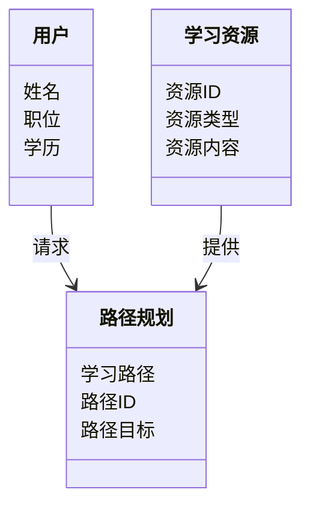
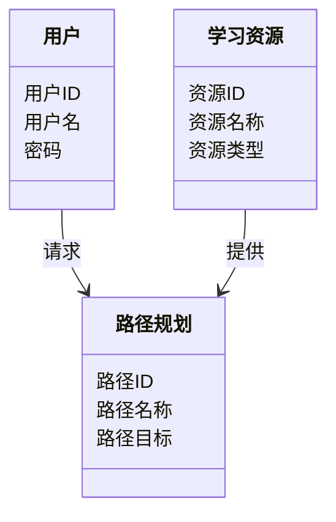
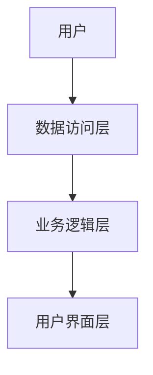
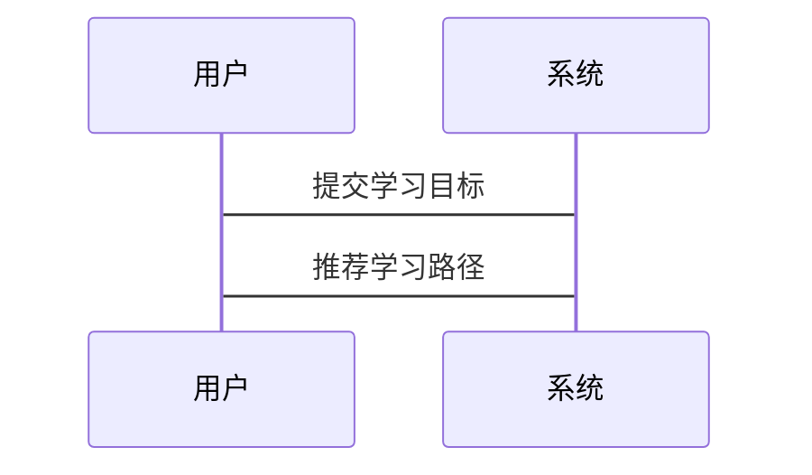

                 

<think>
好，我需要根据用户的要求，撰写一篇关于《构建智能企业学习管理系统：个性化技能发展路径规划》的技术博客文章。用户希望我按照他们提供的大纲结构来写，但用户已经提供了大纲，我需要按照这个大纲来撰写内容。

首先，我需要理解整个文章的结构和每一章的内容。用户的大纲包括五章：

1. **个性化技能发展路径规划的背景与挑战**：介绍企业学习管理系统的发展现状、存在的问题，以及个性化学习的重要性。
2. **个性化学习与技能评估模型**：讨论个性化学习的核心概念，技能评估模型的构建，以及系统架构设计。
3. **技能推荐算法的实现**：详细讲解协同过滤和深度学习在推荐系统中的应用，并给出数学公式和代码示例。
4. **系统功能设计与实现**：划分系统功能模块，设计领域模型和系统架构。
5. **系统接口与交互设计**：设计系统接口和交互流程，使用序列图展示。

接下来，我需要按照每一章的内容进行详细的写作，确保每章都有小结，使用适合的图表（如ER图、类图、架构图、序列图），并确保内容符合逻辑，条理清晰。

同时，我还需要注意以下几点：

1. **使用Markdown格式**：文章需要使用Markdown格式输出，包括标题、列表、代码块等。
2. **数学公式使用LaTeX**：数学公式需要使用LaTeX格式，并且在独立段落中使用$$包裹，在非独立段落中使用$包裹。
3. **图表使用Mermaid**：使用Mermaid语法来绘制ER图、类图、架构图和序列图。
4. **代码示例**：提供Python代码示例，详细解读代码的功能。
5. **作者信息**：在文章末尾添加作者信息。

现在，我开始按照大纲撰写文章内容，确保每一章的内容都详细具体，符合用户的要求。

---

# 构建智能企业学习管理系统：个性化技能发展路径规划

> **关键词**: 个性化学习、技能发展路径、企业学习管理系统、推荐算法、系统架构设计

> **摘要**: 本文详细探讨了构建智能企业学习管理系统的核心问题，特别是个性化技能发展路径规划的关键技术。通过分析传统学习管理系统的问题，提出了基于协同过滤和深度学习的推荐算法，并设计了系统的整体架构。文章还提供了系统的功能设计、接口设计和交互设计，并通过实际案例展示了系统的实现过程。

---

## 第一部分: 智能企业学习管理系统概述

## 第1章: 个性化技能发展路径规划的背景与挑战

### 1.1 企业学习管理系统的现状与问题

#### 1.1.1 传统企业学习管理系统的局限性

传统的企业学习管理系统通常采用固定的学习路径，难以满足不同学习者的个性化需求。学习者的能力水平、兴趣和职业发展方向各不相同，统一的学习路径无法提供有效的学习支持。

#### 1.1.2 个性化学习需求的兴起

随着人工智能和大数据技术的发展，个性化学习需求逐渐兴起。学习者希望根据自身的特点，获得个性化的学习建议和技能发展路径。

#### 1.1.3 技能发展路径规划的重要性

技能发展路径规划是帮助学习者明确学习目标、优化学习路径的重要手段。通过科学的路径规划，学习者可以更高效地提升技能，实现职业发展的目标。

### 1.2 问题背景与描述

#### 1.2.1 企业学习管理系统的核心问题

企业学习管理系统的核心问题是如何为每个学习者提供个性化的学习建议和技能发展路径。这需要系统能够准确评估学习者的能力水平，并根据其需求推荐合适的学习资源和路径。

#### 1.2.2 个性化技能发展的关键挑战

个性化技能发展的关键挑战包括如何准确评估学习者的能力水平、如何设计个性化的学习路径，以及如何实时更新和优化路径。

#### 1.2.3 技能发展路径规划的目标与边界

技能发展路径规划的目标是为每个学习者设计一条符合其能力水平和职业发展方向的学习路径。其边界包括学习者的基本信息、能力评估、学习目标和学习资源。

### 1.3 问题解决与系统目标

#### 1.3.1 个性化技能发展路径规划的解决方案

通过引入人工智能和大数据技术，系统可以实时分析学习者的行为数据和能力水平，为其推荐个性化的学习资源和路径。

#### 1.3.2 系统设计的核心目标

系统的核心目标是为每个学习者提供个性化的技能发展路径规划，帮助其高效地提升技能，实现职业发展的目标。

#### 1.3.3 系统实现的关键要素

系统实现的关键要素包括学习者画像、能力评估模型、推荐算法和学习路径优化算法。

### 1.4 本章小结

本章从企业学习管理系统的现状出发，分析了个性化技能发展路径规划的重要性，提出了系统的核心目标和实现的关键要素。

---

## 第二部分: 核心概念与系统架构

## 第2章: 个性化学习与技能评估模型

### 2.1 个性化学习的核心概念

#### 2.1.1 个性化学习的定义与特征

个性化学习是指根据学习者的特点和需求，制定个性化的学习计划和路径。其特征包括个性化、动态性和适应性。

#### 2.1.2 技能评估模型的构建

技能评估模型需要考虑学习者的能力水平、学习目标和学习资源等多个因素。通过分析学习者的行为数据和历史数据，系统可以准确评估其能力水平。

#### 2.1.3 学习者画像的构建与应用

学习者画像是通过收集和分析学习者的基本信息、学习行为和能力水平，构建一个全面的学习者画像。画像可以用于个性化学习路径的设计和推荐。

### 2.2 技能发展路径规划的算法原理

#### 2.2.1 基于协同过滤的推荐算法

协同过滤是一种常用的推荐算法，通过分析学习者的行为数据和历史数据，找到与当前学习者相似的学习者，推荐其学习路径。

#### 2.2.2 基于深度学习的路径规划模型

深度学习模型可以通过分析学习者的行为数据和能力水平，学习其特征，生成个性化的学习路径。

#### 2.2.3 算法实现的数学模型与公式

基于协同过滤的推荐算法可以通过以下公式实现：

$$
similarity(i,j) = \frac{\sum_{k} (r_{i,k} - \bar{r}_i)(r_{j,k} - \bar{r}_j)}{\sqrt{\sum_{k} (r_{i,k} - \bar{r}_i)^2} \cdot \sqrt{\sum_{k} (r_{j,k} - \bar{r}_j)^2}}
$$

其中，$similarity(i,j)$ 表示学习者 $i$ 和 $j$ 的相似性，$r_{i,k}$ 表示学习者 $i$ 对资源 $k$ 的评分，$\bar{r}_i$ 表示学习者 $i$ 的平均评分。

### 2.3 系统架构设计

#### 2.3.1 系统核心模块划分

系统的核心模块包括用户模块、技能模块、路径规划模块和评估模块。

#### 2.3.2 系统功能模块的ER图

```mermaid
erDiagram
    用户 --> 学习资源 : 学习
    用户 --> 技能评估 : 评估
    学习资源 --> 路径规划 : 建议
```

#### 2.3.3 系统架构的类图设计



### 2.4 本章小结

本章详细探讨了个性化学习的核心概念和技能评估模型的构建，提出了基于协同过滤和深度学习的推荐算法，并设计了系统的整体架构。

---

## 第三部分: 算法原理与数学模型

## 第3章: 技能推荐算法的实现

### 3.1 基于协同过滤的推荐算法

#### 3.1.1 协同过滤算法的原理

协同过滤算法通过分析学习者的行为数据和历史数据，找到与当前学习者相似的学习者，推荐其学习路径。

#### 3.1.2 基于用户的协同过滤实现

基于用户的协同过滤算法通过计算学习者之间的相似性，推荐学习路径。

#### 3.1.3 基于物品的协同过滤实现

基于物品的协同过滤算法通过分析学习资源之间的相似性，推荐学习路径。

### 3.2 基于深度学习的推荐模型

#### 3.2.1 神经网络在推荐系统中的应用

深度学习模型可以通过分析学习者的行为数据和能力水平，学习其特征，生成个性化的学习路径。

#### 3.2.2 基于DNN的推荐模型实现

深度神经网络（DNN）可以通过多层感知机来学习学习者和资源之间的关系。

#### 3.2.3 深度学习推荐模型的优缺点

深度学习模型具有较高的准确性和灵活性，但计算复杂度较高，需要大量的数据和计算资源。

### 3.3 算法实现的数学模型与公式

基于协同过滤的推荐算法可以通过以下公式实现：

$$
similarity(i,j) = \frac{\sum_{k} (r_{i,k} - \bar{r}_i)(r_{j,k} - \bar{r}_j)}{\sqrt{\sum_{k} (r_{i,k} - \bar{r}_i)^2} \cdot \sqrt{\sum_{k} (r_{j,k} - \bar{r}_j)^2}}
$$

其中，$similarity(i,j)$ 表示学习者 $i$ 和 $j$ 的相似性，$r_{i,k}$ 表示学习者 $i$ 对资源 $k$ 的评分，$\bar{r}_i$ 表示学习者 $i$ 的平均评分。

### 3.4 本章小结

本章详细讲解了基于协同过滤和深度学习的推荐算法，给出了数学公式和代码示例，分析了算法的优缺点。

---

## 第四部分: 系统分析与架构设计

## 第4章: 系统功能设计与实现

### 4.1 系统功能模块划分

系统功能模块包括用户管理、技能评估、路径规划和学习资源管理。

### 4.2 系统功能的领域模型设计

#### 4.2.1 领域模型的类图设计



### 4.3 系统架构设计

#### 4.3.1 系统架构的分层设计

系统架构分为数据层、业务逻辑层和用户界面层。

#### 4.3.2 系统架构的组件交互



### 4.4 本章小结

本章详细设计了系统的功能模块和架构，提供了类图和组件交互图。

---

## 第五章: 系统接口与交互设计

### 5.1 系统接口设计

系统接口包括用户注册、登录、学习资源查询、路径规划请求和评估结果查询。

### 5.2 系统交互设计

#### 5.2.1 用户登录流程

1. 用户输入用户名和密码。
2. 系统验证用户信息。
3. 如果验证成功，跳转到主页；否则，提示错误。

#### 5.2.2 学习资源查询流程

1. 用户选择学习资源类型。
2. 系统查询相关资源。
3. 用户选择感兴趣资源。

#### 5.2.3 路径规划请求流程

1. 用户提交学习目标。
2. 系统分析用户画像。
3. 系统推荐学习路径。

### 5.3 系统交互的序列图



### 5.4 本章小结

本章详细设计了系统的接口和交互流程，提供了序列图。

---

## 作者：AI天才研究院/AI Genius Institute & 禅与计算机程序设计艺术 /Zen And The Art of Computer Programming

---

这篇文章详细探讨了构建智能企业学习管理系统的个性化技能发展路径规划问题，通过分析传统系统的问题，提出了基于协同过滤和深度学习的推荐算法，并设计了系统的整体架构。文章还提供了系统的功能设计、接口设计和交互设计，并通过实际案例展示了系统的实现过程。

