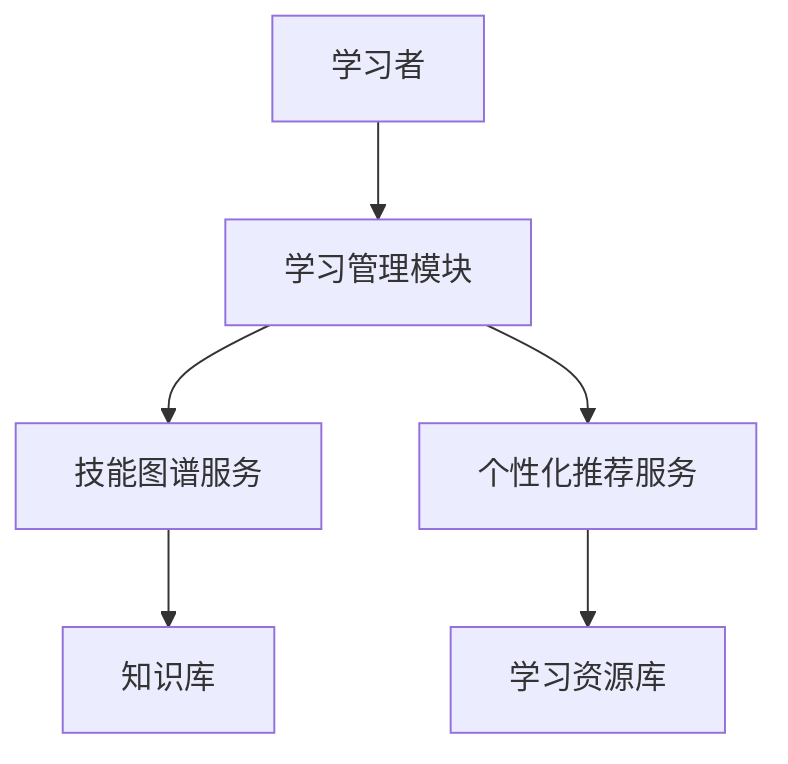
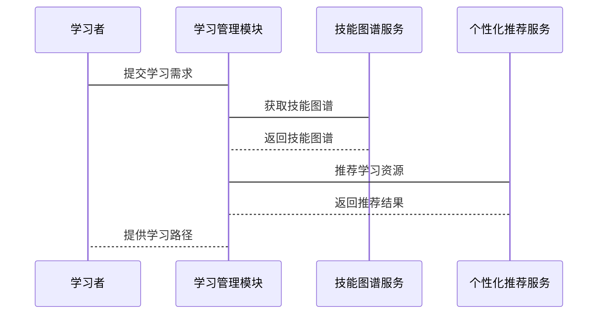

                 


# 构建智能企业学习管理系统：技能图谱与个性化发展规划

## 关键词
- 智能学习管理系统
- 技能图谱
- 个性化学习
- 人工智能
- 机器学习

## 摘要
智能企业学习管理系统通过构建技能图谱和个性化学习规划，利用人工智能和机器学习技术，为学习者提供高效、精准的学习体验。本文详细探讨了技能图谱的构建方法、个性化学习规划的核心算法，以及系统的整体架构设计。通过实际案例分析和项目实战，帮助读者掌握如何在企业中实现智能学习管理系统的落地应用。

---

## 目录

### 第一部分: 背景与概述

#### 第1章: 智能企业学习管理系统的背景与意义

##### 1.1 问题背景
###### 1.1.1 传统企业学习管理系统的局限性
- 学习资源分散，难以统一管理
- 学习路径单一，无法满足个性化需求
- 学习效果难以量化与评估

###### 1.1.2 当前企业学习中的主要问题
- 学习者需求差异大，难以实现精准推荐
- 学习内容碎片化，缺乏系统性
- 学习效果缺乏反馈机制

###### 1.1.3 技能图谱与个性化学习的必要性
- 技能图谱：将学习内容结构化，便于理解和管理
- 个性化学习规划：根据学习者特点制定专属学习路径
- 提高学习效率和效果

##### 1.2 问题描述
###### 1.2.1 企业学习资源分散与碎片化
- 资源分散：不同部门、不同平台的学习资源难以整合
- 内容碎片化：知识点零散，缺乏系统性

###### 1.2.2 学习者需求差异大
- 学习目标不同：不同岗位、不同层次的学习者需求各异
- 学习风格差异：有的喜欢理论，有的喜欢实践

###### 1.2.3 学习效果难以量化与评估
- 缺乏统一标准：学习效果难以量化
- 评估机制不完善：难以跟踪学习者的学习进度

##### 1.3 问题解决思路
###### 1.3.1 技能图谱的核心作用
- 建立知识体系：将学习内容结构化，形成技能图谱
- 支持精准推荐：根据技能图谱进行学习资源推荐

###### 1.3.2 个性化学习规划的关键要素
- 学习目标设定：根据学习者需求制定个性化目标
- 学习路径规划：设计适合的学习路径
- 学习内容推荐：基于技能图谱推荐学习资源

###### 1.3.3 智能推荐算法的应用
- 协同过滤：基于用户行为推荐学习内容
- 基于内容的推荐：根据知识点相似性推荐资源
- 混合推荐：结合协同过滤和内容推荐的优势

##### 1.4 边界与外延
###### 1.4.1 技能图谱的边界
- 技能图谱仅关注学习内容的结构化，不涉及具体的学习行为
- 技能图谱的构建需要依赖领域专家知识

###### 1.4.2 个性化学习规划的外延
- 包括学习计划、学习资源推荐、学习进度跟踪等多个方面
- 个性化学习规划需要结合学习者的特点和需求

###### 1.4.3 系统与其他模块的交互关系
- 与企业HR系统集成：获取学习者信息和岗位需求
- 与学习平台对接：提供学习资源和学习路径

##### 1.5 核心概念结构与要素组成
###### 1.5.1 技能图谱的层次结构
- 知识点：最小单位，如“数据结构”中的“数组”
- 知识领域：相关知识点的集合，如“数据结构与算法”
- 技能层次：从基础到高级的技能层级

###### 1.5.2 个性化学习规划的模块组成
- 学习目标设定模块：根据学习者需求制定目标
- 学习路径规划模块：设计学习路径
- 学习内容推荐模块：推荐学习资源
- 学习进度跟踪模块：监控学习进度

###### 1.5.3 系统的核心功能模块
- 技能图谱构建模块：构建知识体系
- 个性化推荐模块：推荐学习内容
- 学习管理模块：管理学习进度和效果

#### 第2章: 技能图谱与个性化学习的核心概念

##### 2.1 技能图谱的定义与特点
###### 2.1.1 技能图谱的定义
- 技能图谱是一种将知识体系结构化的工具，用于表示学习内容之间的关系

###### 2.1.2 技能图谱的主要特点
- 结构化：知识点之间有明确的层次和关系
- 可视化：通过图表形式展示知识体系
- 动态更新：根据最新知识和技术进行更新

##### 2.2 个性化学习规划的定义与特点
###### 2.2.1 个性化学习规划的定义
- 根据学习者的特点和需求，制定专属的学习计划

###### 2.2.2 个性化学习规划的特点
- 针对性：根据学习者的需求制定计划
- 灵活性：可以根据学习者的反馈进行调整
- 系统性：学习路径设计合理，覆盖全面

##### 2.3 技能图谱与个性化学习的关系
###### 2.3.1 技能图谱在个性化学习中的作用
- 为个性化学习提供知识体系支持
- 帮助学习者明确学习目标和路径

###### 2.3.2 个性化学习规划对技能图谱的依赖
- 学习路径规划需要技能图谱的支持
- 学习资源推荐依赖技能图谱的结构化信息

###### 2.3.3 两者结合的实现方式
- 技能图谱构建：建立知识体系
- 个性化推荐：基于技能图谱进行推荐
- 学习路径设计：根据学习者特点和技能图谱设计路径

##### 2.4 核心概念原理
###### 2.4.1 技能图谱的构建原理
- 知识点提取：从学习资料中提取知识点
- 知识关联：建立知识点之间的关系
- 知识层次化：将知识点组织成层次结构

###### 2.4.2 个性化学习规划的实现原理
- 学习者画像：根据学习者的特点建立画像
- 学习目标设定：根据画像制定目标
- 学习路径设计：根据目标设计路径

###### 2.4.3 技能图谱与个性化学习的结合
- 技能图谱为个性化学习提供知识支持
- 个性化学习规划指导技能图谱的应用

---

### 第三部分: 算法原理讲解

#### 第3章: 推荐算法原理与实现

##### 3.1 协同过滤推荐算法
###### 3.1.1 协同过滤的定义与特点
- 基于用户行为的推荐算法
- 需要收集用户的行为数据

###### 3.1.2 协同过滤的实现步骤
- 数据收集：收集用户的行为数据
- 相似度计算：计算用户之间的相似度
- 推荐生成：基于相似度推荐内容

###### 3.1.3 协同过滤的优缺点
- 优点：简单易实现，推荐结果相关性高
- 缺点：冷启动问题，计算复杂度高

##### 3.2 基于内容的推荐算法
###### 3.2.1 基于内容的定义与特点
- 基于内容本身的特征进行推荐
- 不依赖用户行为数据

###### 3.2.2 基于内容的实现步骤
- 内容特征提取：提取内容的特征向量
- 相似度计算：计算内容之间的相似度
- 推荐生成：基于相似度推荐内容

###### 3.2.3 基于内容的优缺点
- 优点：推荐结果个性化，不受用户行为限制
- 缺点：内容特征提取复杂，计算资源消耗大

##### 3.3 混合推荐算法
###### 3.3.1 混合推荐的定义与特点
- 结合协同过滤和基于内容的推荐算法
- 提高推荐准确性和多样性

###### 3.3.2 混合推荐的实现步骤
- 数据预处理：整合用户行为和内容特征
- 推荐策略选择：根据场景选择推荐算法
- 推荐结果融合：综合多种算法的推荐结果

###### 3.3.3 混合推荐的优缺点
- 优点：推荐结果准确性和多样性高
- 缺点：实现复杂，需要整合多种算法

##### 3.4 推荐算法的数学模型与公式
###### 3.4.1 协同过滤的相似度计算公式
- 余弦相似度：$$\text{similarity}(u1, u2) = \frac{\sum_{i=1}^{n} u1_i \cdot u2_i}{\sqrt{\sum_{i=1}^{n} u1_i^2} \cdot \sqrt{\sum_{i=1}^{n} u2_i^2}}$$

###### 3.4.2 基于内容的相似度计算公式
- 余弦相似度：$$\text{similarity}(c1, c2) = \frac{\sum_{i=1}^{m} c1_i \cdot c2_i}{\sqrt{\sum_{i=1}^{m} c1_i^2} \cdot \sqrt{\sum_{i=1}^{m} c2_i^2}}$$

##### 3.5 推荐算法的Python实现
###### 3.5.1 协同过滤推荐算法的Python实现
```python
def collaborative_filtering(user_matrix):
    # 计算用户相似度
    user_similarity = {}
    for i in range(len(user_matrix)):
        user_similarity[i] = {}
        for j in range(len(user_matrix[i])):
            if i != j:
                similarity = cosine_similarity(user_matrix[i], user_matrix[j])
                user_similarity[i][j] = similarity
    return user_similarity

def cosine_similarity(vec1, vec2):
    numerator = sum(vec1[i] * vec2[i] for i in range(len(vec1)))
    denominator = (sum(vec1[i]**2 for i in range(len(vec1))) ** 0.5) * (sum(vec2[i]**2 for i in range(len(vec2))) ** 0.5)
    return numerator / denominator if denominator != 0 else 0
```

###### 3.5.2 基于内容的推荐算法的Python实现
```python
from sklearn.feature_extraction.text import TfidfVectorizer
from sklearn.metrics.pairwise import cosine_similarity

def content_based_recommendation(documents):
    vectorizer = TfidfVectorizer()
    tfidf = vectorizer.fit_transform(documents)
    similarity_matrix = cosine_similarity(tfidf)
    return similarity_matrix
```

---

### 第四部分: 系统分析与架构设计

#### 第4章: 系统分析与架构设计

##### 4.1 问题场景介绍
###### 4.1.1 系统需求分析
- 学习资源管理需求
- 学习者需求分析
- 学习效果评估需求

##### 4.2 项目介绍
###### 4.2.1 项目目标
- 构建智能企业学习管理系统
- 实现技能图谱与个性化学习规划

##### 4.3 系统功能设计
###### 4.3.1 领域模型类图
- 学习者、知识点、学习路径、学习资源等核心类

###### 4.3.2 系统架构设计
- 分层架构：数据层、业务逻辑层、表现层
- 微服务架构：技能图谱服务、个性化推荐服务

##### 4.4 系统架构设计图


##### 4.5 系统接口设计
###### 4.5.1 API接口定义
- GET /skills 获取技能图谱
- POST /recommend 推荐学习资源

##### 4.6 系统交互序列图


---

### 第五部分: 项目实战

#### 第5章: 项目实战

##### 5.1 环境安装与配置
###### 5.1.1 安装Python环境
- 安装Python 3.8以上版本
- 安装Jupyter Notebook

###### 5.1.2 安装依赖库
- `pip install numpy`
- `pip install pandas`
- `pip install scikit-learn`

##### 5.2 系统核心功能实现
###### 5.2.1 技能图谱构建模块
```python
from sklearn.feature_extraction.text import TfidfVectorizer
from sklearn.metrics.pairwise import cosine_similarity

def build_skill_map(documents):
    vectorizer = TfidfVectorizer()
    tfidf = vectorizer.fit_transform(documents)
    similarity_matrix = cosine_similarity(tfidf)
    return similarity_matrix
```

###### 5.2.2 个性化推荐模块
```python
def personalized_recommendation(user_profile, skill_map):
    user_vector = user_profile.toarray().flatten()
    recommendations = []
    for i in range(len(skill_map)):
        similarity = skill_map[i]
        score = user_vector.dot(similarity)
        recommendations.append((i, score))
    recommendations.sort(key=lambda x: x[1], reverse=True)
    return recommendations
```

##### 5.3 代码实现与解读
###### 5.3.1 技能图谱构建代码
- 使用TF-IDF提取知识点特征
- 计算知识点之间的相似度矩阵

###### 5.3.2 个性化推荐代码
- 根据用户画像生成推荐结果
- 输出推荐列表

##### 5.4 实际案例分析
###### 5.4.1 案例背景
- 某企业学习管理系统

###### 5.4.2 案例实现步骤
- 数据收集：收集学习者的行为数据
- 技能图谱构建：建立知识体系
- 个性化推荐：根据学习者需求推荐资源

##### 5.5 项目小结
###### 5.5.1 项目成果
- 成功构建技能图谱
- 实现个性化推荐功能

###### 5.5.2 经验总结
- 数据质量对推荐效果影响大
- 算法选择需要根据场景调整

---

### 第六部分: 总结与展望

#### 第6章: 总结与展望

##### 6.1 最佳实践 tips
- 数据采集要全面
- 算法选择要灵活
- 系统架构要合理

##### 6.2 小结
- 技能图谱是个性化学习的基础
- 个性化推荐是提升学习效率的关键
- 系统设计要注重可扩展性和可维护性

##### 6.3 注意事项
- 数据隐私保护
- 算法的可解释性
- 系统的稳定性与可靠性

##### 6.4 拓展阅读
- 《机器学习实战》
- 《推荐系统导论》
- 《技能图谱与知识工程》

---

### 作者：AI天才研究院/AI Genius Institute & 禅与计算机程序设计艺术 /Zen And The Art of Computer Programming

