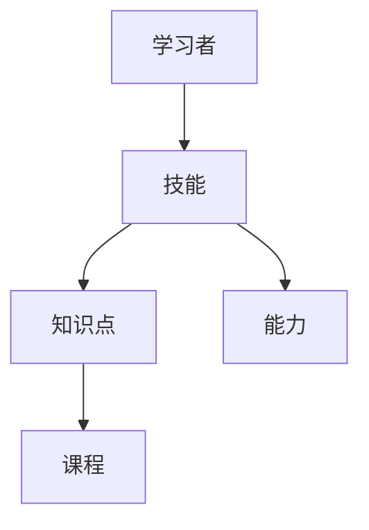

                 

# 《构建智能企业学习管理系统：技能图谱与个性化发展规划的融合》

---

## 关键词：  
企业学习管理、技能图谱、个性化学习、人工智能、知识管理、系统架构、推荐算法

---

## 摘要：  
随着人工智能技术的快速发展，企业学习管理系统正在经历从传统模式向智能化模式的转变。本篇文章将深入探讨如何通过技能图谱与个性化发展规划的融合，构建一个高效、智能的企业学习管理系统。文章从背景、核心概念、算法原理、系统架构、项目实战到最佳实践，逐步分析，旨在为企业学习管理系统的设计与实现提供理论支持和实践指导。

---

## 目录大纲

### 第一部分：智能企业学习管理系统的背景与挑战

#### 第1章：企业学习管理的现状与挑战

##### 1.1 企业学习管理的定义与目标
- 什么是企业学习管理？
- 企业学习管理的主要目标
- 传统学习管理系统的局限性

##### 1.2 智能化学习管理的必要性
- 人工智能在企业学习管理中的应用
- 技能图谱与个性化学习的需求
- 企业学习管理的未来发展趋势

##### 1.3 本章小结
- 企业学习管理的核心问题
- 智能化学习管理的关键技术
- 技能图谱与个性化发展的融合方向

---

### 第二部分：技能图谱与个性化发展规划的核心概念

#### 第2章：技能图谱的构建与分析

##### 2.1 技能图谱的定义与特点
- 技能图谱的核心概念
- 技能图谱的主要特点（可视化、动态性、关联性）
- 技能图谱的构建方法

##### 2.2 技能图谱的构建流程
- 数据采集与清洗
- 技能节点的提取与关联
- 技能图谱的可视化表示

##### 2.3 技能图谱的属性对比表
| 属性 | 描述 |
|------|------|
| 节点类型 | 技能、知识点、能力 |
| 关系类型 | 包含、依赖、推荐 |
| 权重 | 技能的重要性评分 |

##### 2.4 技能图谱的ER实体关系图

##### 2.5 技能图谱的构建工具与方法
- 数据挖掘技术在技能图谱构建中的应用
- 可视化工具的选择与使用
- 技能图谱的动态更新机制

---

#### 第3章：个性化发展规划的核心概念

##### 3.1 个性化发展规划的定义与特点
- 个性化发展规划的核心概念
- 个性化学习的特点（定制化、动态性、数据驱动）

##### 3.2 个性化发展规划的模型与算法
- 基于用户特征的推荐算法
- 基于内容的推荐算法
- 混合推荐算法的应用

##### 3.3 个性化发展规划与技能图谱的关联
- 技能图谱在个性化发展规划中的作用
- 数据驱动的个性化学习路径设计
- 技能图谱与学习者能力评估的结合

---

### 第三部分：技能图谱与个性化发展规划的融合

#### 第4章：技能图谱与个性化发展规划的融合方法

##### 4.1 技能图谱与个性化发展规划的融合模型
- 技能图谱与个性化发展规划的融合方法
- 基于图的推荐算法
- 技能图谱与学习者画像的结合

##### 4.2 技能图谱与个性化发展规划的融合流程
- 数据采集与预处理
- 技能图谱的构建与更新
- 个性化发展规划的生成与优化

##### 4.3 技能图谱与个性化发展规划的融合工具
- 技能图谱构建工具
- 个性化发展规划工具
- 数据可视化工具

---

### 第四部分：智能企业学习管理系统的实现

#### 第5章：系统架构设计与实现

##### 5.1 系统架构设计
- 系统功能模块划分
- 系统架构设计（分层架构、微服务架构）
- 系统接口设计

##### 5.2 系统功能实现
- 用户管理模块
- 技能图谱管理模块
- 个性化发展规划模块

##### 5.3 系统实现的代码示例
- 系统核心代码实现
- 代码功能解读与分析
- 系统实现的注意事项

---

#### 第6章：项目实战与案例分析

##### 6.1 项目实战
- 项目背景与目标
- 项目环境的安装与配置
- 系统核心代码的实现
- 代码功能的解读与分析

##### 6.2 案例分析
- 典型案例的分析与解读
- 案例实现的步骤与方法
- 案例的总结与反思

##### 6.3 项目总结
- 项目实现的关键点
- 项目实现的经验与教训
- 项目的未来优化方向

---

### 第五部分：技能图谱与个性化发展规划的未来展望

#### 第7章：技能图谱与个性化发展规划的未来发展

##### 7.1 未来趋势
- 技能图谱的进一步发展
- 个性化发展规划的优化方向
- 人工智能技术的进一步应用

##### 7.2 注意事项
- 技能图谱构建中的数据质量问题
- 个性化发展规划中的隐私保护问题
- 系统实现中的性能优化问题

##### 7.3 拓展阅读
- 相关技术文献推荐
- 优秀实践案例分享
- 未来研究方向展望

---

## 总结

构建智能企业学习管理系统是一个复杂而富有挑战性的任务，但通过技能图谱与个性化发展规划的融合，我们可以实现更高效、更精准的学习管理。本文从理论到实践，详细分析了技能图谱的构建、个性化发展规划的设计以及两者的融合方法，并通过项目实战和案例分析，为读者提供了全面的指导。未来，随着人工智能技术的不断发展，技能图谱与个性化发展规划的融合将为企业学习管理系统带来更多的创新和突破。

---

## 作者：  
AI天才研究院/AI Genius Institute & 禅与计算机程序设计艺术 /Zen And The Art of Computer Programming

