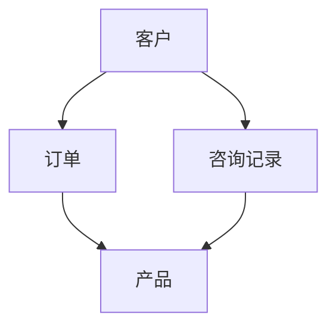
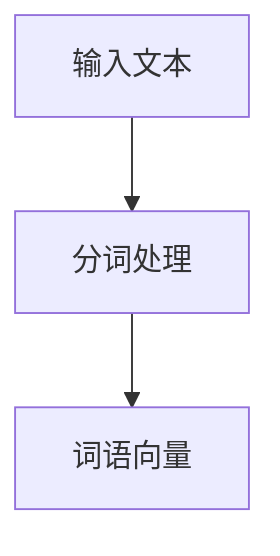
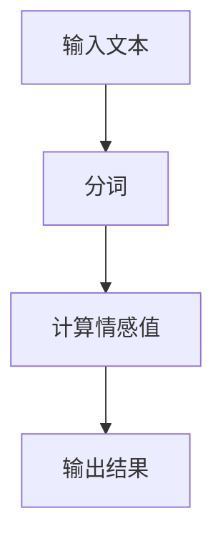
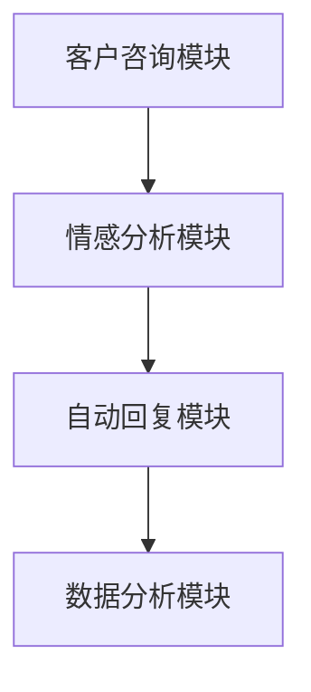
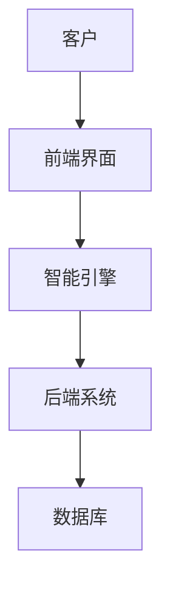
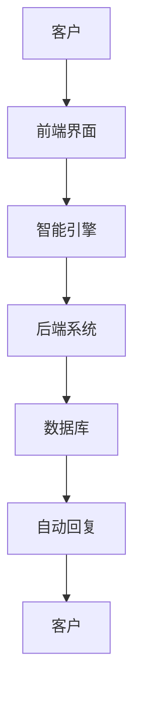

                 


# 构建智能企业客户服务系统：AI全渠道支持

## 关键词：智能客户服务系统，AI，全渠道支持，自然语言处理，机器学习，系统架构

## 摘要：随着企业对客户服务要求的不断提高，传统的客户服务模式已经难以满足现代企业的需求。本文详细介绍了如何利用AI技术构建一个全渠道支持的智能企业客户服务系统，涵盖了从系统设计到算法实现的各个方面，包括系统架构设计、核心算法原理、项目实战案例以及最佳实践等。

---

# 第一部分: 智能企业客户服务系统概述

# 第1章: 背景与问题分析

## 1.1 企业客户服务的现状与挑战
### 1.1.1 传统客户服务模式的局限性
- 传统客户服务模式依赖人工处理，效率低下，无法满足大规模客户需求。
- 单一的渠道支持方式（如电话或邮件）难以覆盖多渠道客户需求。
- 人工客服的响应速度和准确性受限，客户体验较差。

### 1.1.2 全渠道客户服务的需求
- 客户希望可以通过多种渠道（如电话、邮件、在线聊天、社交媒体等）获得一致的服务体验。
- 企业需要通过多渠道整合，提升客户满意度和忠诚度。
- 全渠道支持可以降低企业的运营成本，提升服务效率。

### 1.1.3 AI技术对企业客户服务的推动作用
- AI技术（如自然语言处理、机器学习）可以提升客户服务的智能化水平。
- AI可以实现自动化处理客户咨询，提高响应速度和准确性。
- AI还可以通过数据分析，帮助企业更好地理解客户需求，优化服务策略。

## 1.2 智能客户服务系统的概念与目标
### 1.2.1 智能客户服务系统的定义
- 智能客户服务系统是一种基于AI技术的自动化客户服务系统，能够通过多种渠道（全渠道）为客户提供智能化的咨询、支持和反馈服务。

### 1.2.2 系统的核心目标
- 提供全渠道的客户服务支持。
- 实现客户咨询的自动化处理，提升响应速度和准确性。
- 通过数据分析和挖掘，优化客户服务策略，提升客户满意度。

### 1.2.3 系统的边界与外延
- 系统边界：仅限于客户服务相关的功能，不包括企业的其他业务系统。
- 系统外延：可以与其他系统（如CRM、ERP）集成，实现数据共享和业务协同。

## 1.3 问题背景与解决思路
### 1.3.1 问题背景分析
- 客户需求日益多样化，传统的单一渠道支持方式难以满足客户需求。
- 人工客服效率低下，无法应对大规模的客户需求。
- 客户体验差，影响企业品牌形象和客户忠诚度。

### 1.3.2 问题解决的思路
- 引入AI技术，构建全渠道的智能客户服务系统。
- 通过自然语言处理技术实现客户咨询的自动化处理。
- 利用机器学习算法，优化客户服务策略。

### 1.3.3 解决方案的可行性分析
- 技术可行性：AI技术（如NLP、机器学习）已经成熟，可以应用于客户服务领域。
- 经济可行性：构建智能客户服务系统可以降低企业的人力成本，提高服务效率。
- 用户可行性：客户可以通过多种渠道获得服务，提升用户体验。

## 1.4 本章小结
- 本章分析了传统客户服务模式的局限性，提出了构建智能客户服务系统的必要性。
- 明确了智能客户服务系统的概念、目标和边界。
- 提出了解决问题的思路和可行性分析。

---

# 第二部分: 核心概念与技术原理

# 第2章: AI与全渠道支持的核心概念

## 2.1 AI在客户服务中的应用原理
### 2.1.1 自然语言处理（NLP）的基本原理
- NLP的目标是让计算机能够理解人类语言。
- 常见的NLP任务包括分词、句法分析、情感分析、意图识别等。
- 在客户服务中，NLP主要用于客户咨询的意图识别和情感分析。

### 2.1.2 机器学习在客户意图识别中的应用
- 机器学习是一种通过数据训练模型，实现预测或分类的技术。
- 在客户服务中，可以通过机器学习模型对客户的咨询内容进行分类，识别客户意图。
- 例如，客户咨询可以分为“产品咨询”、“技术支持”、“投诉建议”等类别。

### 2.1.3 深度学习在情感分析中的作用
- 深度学习是一种基于人工神经网络的机器学习技术，具有强大的特征提取能力。
- 在情感分析中，深度学习模型（如LSTM、BERT）可以准确识别客户的情感倾向（如正面、负面、中性）。
- 情感分析可以帮助企业更好地理解客户情绪，优化客户服务策略。

## 2.2 全渠道支持的实现机制
### 2.2.1 多渠道整合的技术特点
- 多渠道整合是指将多种通信渠道（如电话、邮件、在线聊天、社交媒体等）整合到一个统一的系统中。
- 需要实现不同渠道之间的数据同步和业务协同。
- 例如，客户可以通过邮件提交问题，系统可以通过短信通知客户处理进展。

### 2.2.2 通道间数据同步的实现方式
- 需要建立统一的数据模型，确保不同渠道的数据格式一致。
- 通过API接口实现不同渠道之间的数据同步。
- 数据同步需要考虑数据的实时性和一致性。

### 2.2.3 通道间协调的逻辑流程
- 客户通过某一渠道提交咨询，系统将咨询内容转发到统一的处理平台。
- 系统根据咨询内容自动分类，分配给相应的处理人员或自动回复。
- 处理结果需要通过原渠道反馈给客户，确保客户体验的一致性。

## 2.3 核心概念对比分析
### 2.3.1 不同AI技术的对比分析
| 技术         | 描述                                                                 |
|--------------|----------------------------------------------------------------------|
| NLP          | 用于理解人类语言，实现文本的分词、情感分析等功能。                   |
| 机器学习     | 通过数据训练模型，实现分类、预测等功能。                             |
| 深度学习     | 基于人工神经网络的机器学习技术，具有强大的特征提取能力。             |

### 2.3.2 全渠道支持与单一渠道支持的对比
| 特性         | 全渠道支持                                | 单一渠道支持                     |
|--------------|------------------------------------------|----------------------------------|
| 支持渠道     | 多种渠道（电话、邮件、在线聊天等）        | 单一渠道（如电话或邮件）         |
| 数据同步     | 需要实现不同渠道的数据同步                | 数据格式单一，无需同步            |
| 客户体验     | 提供一致的服务体验                        | 体验受限，渠道单一               |

### 2.3.3 系统性能与用户体验的对比
| 特性         | 系统性能                               | 用户体验                     |
|--------------|----------------------------------------|-----------------------------|
| 响应速度     | 高效处理，提升系统性能                   | 快速响应，提升用户体验         |
| 准确性       | 精准分类，减少错误率                     | 准确理解客户需求，提升满意度   |
| 可扩展性     | 支持多种渠道，系统可扩展性较强            | 体验一致，客户满意度较高        |

## 2.4 实体关系图（ER图）


---

# 第三部分: 算法原理与数学模型

# 第3章: 基于NLP的客户意图识别

## 3.1 基于NLP的分词算法
### 3.1.1 分词算法的原理
- 分词是NLP中的基础任务，目的是将连续的文本分割成有意义的词语或短语。
- 常见的分词算法包括基于规则的分词和基于统计的分词（如TF-IDF）。

### 3.1.2 分词算法的实现代码
```python
def tokenize(text):
    import jieba
    return jieba.lcut(text)
```

### 3.1.3 分词算法的流程图


## 3.2 情感分析模型
### 3.2.1 情感分析的数学模型
- 情感分析的目标是判断文本的情感倾向（如正面、负面、中性）。
- 常见的情感分析模型包括朴素贝叶斯、支持向量机（SVM）和深度学习模型（如LSTM、BERT）。

### 3.2.2 情感分析的数学公式
$$ P(positive|text) = \frac{\sum_{i=1}^{n} w_i x_i}{\sum_{i=1}^{n} w_i} $$

### 3.2.3 情感分析流程图


## 3.3 基于机器学习的客户意图识别
### 3.3.1 客户意图识别的数学模型
- 客户意图识别的目标是根据客户的咨询内容，分类其意图（如产品咨询、技术支持等）。
- 常见的分类算法包括朴素贝叶斯、决策树、随机森林和深度学习模型（如CNN、RNN）。

### 3.3.2 客户意图识别的数学公式
$$ y = \arg\max_{i} P(y_i|x) $$

### 3.3.3 客户意图识别的代码实现
```python
from sklearn.feature_extraction.text import TfidfVectorizer
from sklearn.naive_bayes import MultinomialNB

vectorizer = TfidfVectorizer()
model = MultinomialNB()
model.fit(vectorizer.fit_transform(X_train), y_train)
```

## 3.4 算法实现的注意事项
- 数据预处理：需要对文本数据进行清洗、分词和向量化处理。
- 模型训练：需要选择合适的特征提取方法和分类算法。
- 模型评估：需要通过交叉验证等方法评估模型的准确率、召回率和F1值。

---

# 第四部分: 系统架构与设计

# 第4章: 智能企业客户服务系统的架构设计

## 4.1 系统功能设计
### 4.1.1 系统功能模块
- 客户咨询模块：实现客户咨询的接收、分类和处理。
- 情感分析模块：对客户的咨询内容进行情感分析，识别客户情绪。
- 自动回复模块：根据分类结果，生成自动回复内容。
- 数据分析模块：对客户咨询数据进行统计分析，优化客户服务策略。

### 4.1.2 系统功能模块的关系


## 4.2 系统架构设计
### 4.2.1 系统架构图


### 4.2.2 系统交互流程
1. 客户通过前端界面提交咨询请求。
2. 前端界面将咨询内容发送到智能引擎。
3. 智能引擎对咨询内容进行分类和情感分析。
4. 根据分类结果，智能引擎生成自动回复内容。
5. 自动回复内容通过前端界面反馈给客户。

## 4.3 系统接口设计
### 4.3.1 API接口定义
- API名称：`/api/v1/customer/enquiry`
- 请求方法：POST
- 请求参数：`{ "text": "客户咨询内容" }`
- 响应参数：`{ "intent": "客户意图分类", "response": "自动回复内容" }`

### 4.3.2 接口实现代码
```python
from flask import Flask, request, jsonify

app = Flask(__name__)

@app.route('/api/v1/customer/enquiry', methods=['POST'])
def process_enquiry():
    data = request.json
    text = data['text']
    # 调用NLP模型进行分类
    intent = classify_intent(text)
    response = generate_response(intent)
    return jsonify({"intent": intent, "response": response})

if __name__ == '__main__':
    app.run()
```

## 4.4 系统交互流程图


---

# 第五部分: 项目实战与实现

# 第5章: 项目实战：构建智能客户服务系统

## 5.1 环境搭建
### 5.1.1 开发环境
- Python 3.8+
- Flask框架
- Jieba分词库
- Scikit-learn机器学习库

### 5.1.2 数据集准备
- 数据来源：可以从公开的数据集（如Kaggle）获取客户咨询数据。
- 数据清洗：去除重复数据、填充缺失值、分词处理。

## 5.2 核心代码实现
### 5.2.1 NLP模型实现
```python
import jieba
from sklearn.feature_extraction.text import TfidfVectorizer
from sklearn.naive_bayes import MultinomialNB

def tokenize(text):
    return jieba.lcut(text)

def train_model(X_train, y_train):
    vectorizer = TfidfVectorizer(tokenizer=tokenize)
    model = MultinomialNB()
    model.fit(vectorizer.fit_transform(X_train), y_train)
    return model, vectorizer

def predict_model(model, vectorizer, text):
    text_vec = vectorizer.transform([text])
    prediction = model.predict(text_vec)[0]
    return prediction
```

### 5.2.2 系统交互实现
```python
from flask import Flask, request, jsonify

app = Flask(__name__)

model, vectorizer = train_model(X_train, y_train)

@app.route('/api/v1/customer/enquiry', methods=['POST'])
def process_enquiry():
    data = request.json
    text = data['text']
    intent = predict_model(model, vectorizer, text)
    response = generate_response(intent)
    return jsonify({"intent": intent, "response": response})

def generate_response(intent):
    # 根据intent生成相应的回复
    response_map = {
        'product': '您咨询的产品信息如下：...',
        'support': '我们为您提供以下技术支持：...',
        'complaint': '针对您的投诉，我们会尽快处理：...'
    }
    return response_map.get(intent, '抱歉，我们无法理解您的需求。')
```

## 5.3 项目实战小结
- 通过Flask框架搭建了一个简单的智能客户服务系统。
- 使用了NLP技术和机器学习模型实现了客户意图分类和自动回复功能。
- 系统可以处理多种渠道的客户咨询，提供一致的服务体验。

---

# 第六部分: 最佳实践与总结

# 第6章: 最佳实践与系统优化

## 6.1 系统优化建议
### 6.1.1 系统性能优化
- 使用缓存技术（如Redis）优化API响应速度。
- 优化NLP模型的训练效率，减少计算资源消耗。

### 6.1.2 数据隐私保护
- 确保客户数据的安全性和隐私性，避免数据泄露。
- 使用加密技术保护敏感数据。

## 6.2 最佳实践
### 6.2.1 系统设计
- 系统设计要模块化，便于后续扩展和维护。
- 确保系统具有良好的可扩展性和可维护性。

### 6.2.2 代码实现
- 代码要简洁易懂，遵循编程规范。
- 注重代码的可测试性和可复用性。

## 6.3 系统总结
- 本文详细介绍了如何利用AI技术构建一个全渠道支持的智能企业客户服务系统。
- 通过NLP技术和机器学习模型实现了客户意图分类和情感分析功能。
- 系统设计合理，功能完善，可以满足企业的实际需求。

## 6.4 未来展望
- 随着AI技术的不断发展，智能客户服务系统将更加智能化和自动化。
- 未来可以引入更多先进的技术（如大语言模型、知识图谱）进一步提升系统的智能性。

---

# 结语

通过本文的介绍，读者可以了解到如何利用AI技术构建一个智能企业客户服务系统。系统的核心在于利用NLP技术和机器学习模型实现客户意图分类和情感分析，从而提供高效、准确的客户服务。同时，系统设计要模块化，便于后续扩展和维护。未来，随着AI技术的不断进步，智能客户服务系统将更加智能化和自动化，为企业提供更优质的服务体验。

---

# 作者：AI天才研究院/AI Genius Institute & 禅与计算机程序设计艺术 /Zen And The Art of Computer Programming

