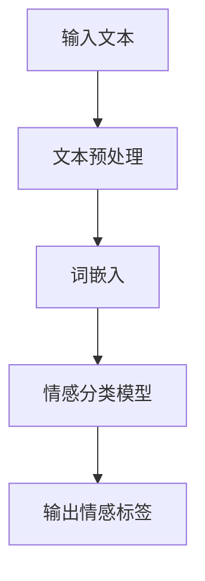

                 


```markdown
# 构建智能企业市场调研系统：社交媒体情感分析与趋势预测

## 关键词：智能企业调研系统、社交媒体情感分析、趋势预测、深度学习、NLP、时间序列分析

## 摘要：  
本文详细探讨如何利用社交媒体数据构建智能企业市场调研系统。通过分析社交媒体上的用户评论和反馈，利用自然语言处理（NLP）技术进行情感分析，并结合时间序列分析预测市场趋势。文章从背景、原理、算法、系统架构到项目实战，全面解析系统构建的每个环节，为企业提供高效、智能的市场调研解决方案。

---

# 第一部分: 市场调研与社交媒体分析概述

## 第1章: 企业市场调研的背景与意义

### 1.1 传统市场调研的局限性  
- 数据收集成本高、效率低  
- 样本量小，代表性不足  
- 数据更新慢，难以捕捉实时市场变化  

### 1.2 社交媒体在市场调研中的作用  
- 数据来源广泛，覆盖海量用户  
- 反馈实时性强，捕捉市场动态  
- 提供用户真实情感与态度，辅助决策  

### 1.3 情感分析与趋势预测的核心价值  
- 帮助企业识别用户情绪，优化产品和服务  
- 预测市场趋势，提前制定应对策略  
- 提高市场调研的效率和准确性  

---

## 第2章: 社交媒体数据的特点与挑战

### 2.1 数据特点  
- 数据量大：每天产生的社交媒体数据呈指数级增长  
- 数据多样性：包括文本、图片、视频等多种形式  
- 实时性要求高：需要快速处理和分析  

### 2.2 数据处理的挑战  
- 数据清洗：去除噪声、处理缺失值  
- 数据标注：人工标注情感极性耗时耗力  
- 数据隐私：用户隐私保护与数据合规性  

### 2.3 情感分析与趋势预测的关联性  
- 情感分析提供用户情感数据  
- 趋势预测基于情感数据挖掘潜在规律  

---

## 第3章: 情感分析与趋势预测的核心概念

### 3.1 情感分析  
- 定义：通过分析文本判断作者的情感倾向（正面、中性、负面）  
- 分类：基于规则、统计学习、深度学习三种方法  
- 应用：产品评论分析、品牌声誉管理  

### 3.2 趋势预测  
- 定义：基于历史数据预测未来市场走向  
- 方法：时间序列分析、回归分析、机器学习模型  
- 应用：销售预测、市场热点预测  

### 3.3 情感分析与趋势预测的结合  
- 情感分析为趋势预测提供情感维度数据  
- 趋势预测帮助理解情感数据背后的市场规律  

---

# 第二部分: 情感分析与趋势预测的核心原理

## 第4章: 情感分析的原理与算法

### 4.1 文本预处理  
- 分词：将文本分割成词语或短语  
- 去停用词：去除无意义的词汇（如“的”、“是”）  
- 词干提取：将词语还原为基本形式  

### 4.2 词嵌入技术  
- Word2Vec：通过上下文预测词语，生成词向量  
- GloVe：基于全局词向量的潜在语义表示  
- FastText：快速训练文本表示模型  

### 4.3 情感分类模型  
- 基于传统机器学习：SVM、随机森林  
- 基于深度学习：LSTM、Transformer、BERT  

### 4.4 情感分析的流程图  


---

## 第5章: 趋势预测的算法与模型

### 5.1 时间序列分析  
- ARIMA模型：自回归积分滑动平均模型  
- GARCH模型：广义自回归条件异方差模型  
- LST

