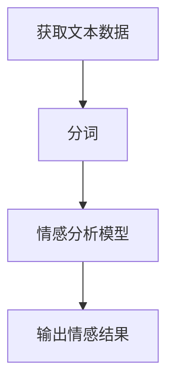
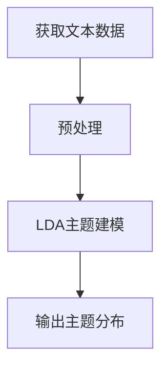
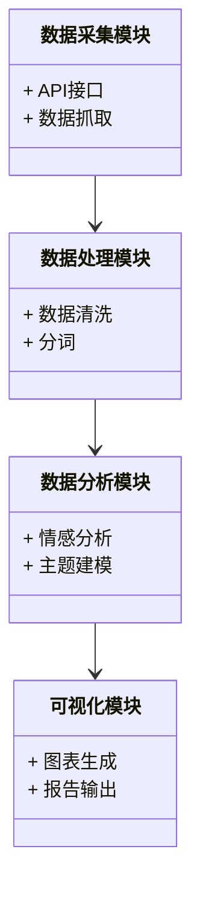
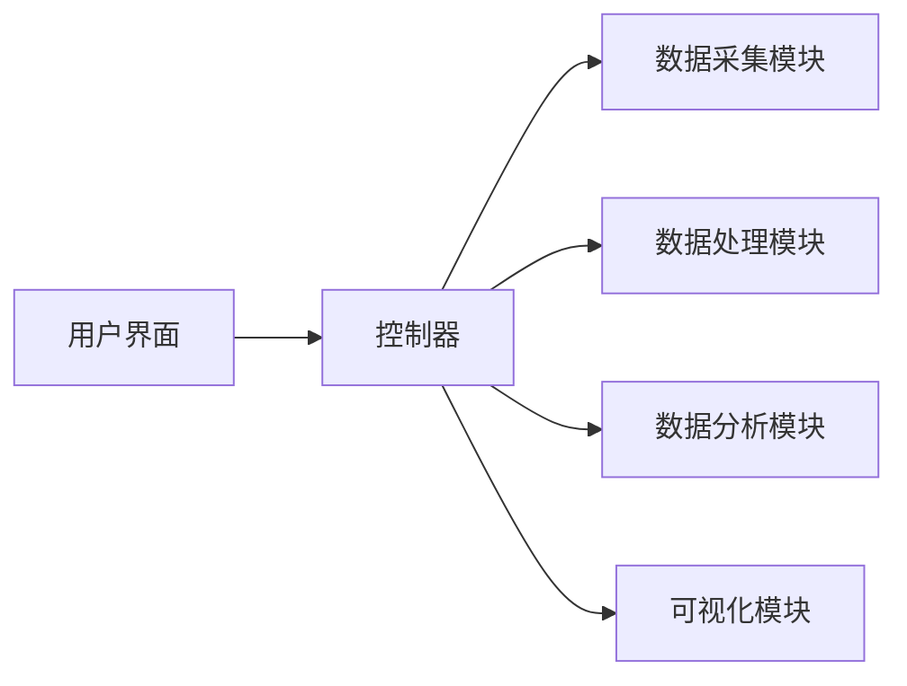

                 


# 构建智能企业市场调研系统：社交媒体聆听与趋势分析

---

## 关键词：
智能企业，市场调研，社交媒体聆听，趋势分析，数据挖掘，机器学习

---

## 摘要：
随着社交媒体的普及，企业可以通过分析社交媒体数据来获取市场趋势和消费者反馈，从而优化市场策略。本文将从背景、核心概念、算法原理、系统架构到项目实战，详细阐述如何构建一个高效的智能企业市场调研系统。通过社交媒体聆听与趋势分析，企业可以实时捕捉市场动态，洞察消费者需求，从而在竞争激烈的市场中占据先机。

---

## 第一部分: 智能企业市场调研系统概述

### 第1章: 问题背景与需求分析

#### 1.1 问题背景
社交媒体的普及使得企业能够通过分析海量数据来洞察市场动态。然而，传统市场调研方法依赖于问卷调查和焦点小组，存在耗时长、成本高且难以捕捉实时反馈的缺点。社交媒体数据的实时性、多样性和海量性为企业提供了新的机遇，但也带来了数据分析的挑战。

#### 1.2 问题描述
- **数据复杂性**：社交媒体数据包括文本、图像、视频等多种形式，数据清洗和预处理难度大。
- **信息噪声**：社交媒体数据中存在大量无关信息和噪声，如何提取有价值的信息是关键。
- **实时性要求**：企业需要快速响应市场变化，对数据处理和分析的实时性要求高。

#### 1.3 解决方案与系统目标
构建一个基于社交媒体数据的市场调研系统，利用机器学习和自然语言处理技术，实现数据的实时采集、清洗、分析和可视化，帮助企业在竞争中占据优势。

#### 1.4 系统核心要素与组成
- **数据采集模块**：实时抓取社交媒体数据。
- **数据处理模块**：清洗、分词和去噪。
- **数据分析模块**：情感分析、主题建模和趋势预测。
- **可视化模块**：生成图表和报告。
- **报告生成模块**：自动生成市场分析报告。

---

### 第2章: 核心概念与联系

#### 2.1 核心概念原理
- **社交媒体聆听**：通过抓取社交媒体数据，获取消费者对品牌、产品的评论和反馈。
- **趋势分析**：利用数据挖掘和机器学习技术，发现市场趋势和消费者需求的变化。

#### 2.2 核心概念对比表
| 概念 | 定义 | 特点 | 示例 |
|------|------|------|------|
| 数据采集 | 获取社交媒体数据 | 实时性、多样性 | Twitter API |
| 数据处理 | 清洗与预处理 | 去噪、标准化 | 正则表达式、分词 |
| 数据分析 | 情感分析、主题建模 | 智能化、自动化 | Word2Vec、LDA |

#### 2.3 系统ER实体关系图
```mermaid
er
  actor 用户
  database 系统数据库
  entity 数据采集模块
  entity 数据处理模块
  entity 数据分析模块
  entity 可视化模块
  entity 报告生成模块
  用户 --> 数据采集模块: 提供API接口
  数据采集模块 --> 系统数据库: 存储原始数据
  数据处理模块 --> 系统数据库: 存储处理后数据
  数据分析模块 --> 系统数据库: 获取分析数据
  可视化模块 --> 系统数据库: 获取展示数据
  报告生成模块 --> 系统数据库: 获取报告数据
```

---

## 第二部分: 算法原理与数学模型

### 第3章: 算法原理讲解

#### 3.1 情感分析算法
- **定义**：判断文本的情感倾向（正面、负面、中性）。
- **流程图**：

- **Python代码示例**：
```python
from textblob import TextBlob
text = "I love this product!"
blob = TextBlob(text)
print(blob.sentiment.polarity)  # 输出情感值
```

#### 3.2 主题建模
- **定义**：发现文本数据中的主题分布。
- **流程图**：

- **Python代码示例**：
```python
from sklearn.feature_extraction.text import TfidfVectorizer
from sklearn.decomposition import LatentDirichletAllocation

vectorizer = TfidfVectorizer()
lda = LatentDirichletAllocation(n_components=5)
X = vectorizer.fit_transform(corpus)
 lda.fit(X)
```

#### 3.3 数学模型与公式
- **TF-IDF公式**：
  $$TF-IDF = \frac{TF}{\log_{10}(N) + 1}$$
  其中，TF是词频，N是文档总数。

- **LDA模型**：
  $$P(\text{topic}|text) = \frac{\prod_{i=1}^{n} \theta_{t_i}}{\sum_{j=1}^{K} \prod_{i=1}^{n} \theta_{t_i}}$$
  其中，$K$是主题数，$t_i$是第i个词的主题。

---

### 第4章: 数学模型与公式

#### 4.1 TF-IDF模型
- **公式**：
  $$TF-IDF = \frac{TF_{t,d}}{IDF_t}$$
  其中，$TF_{t,d}$是词$t$在文档$d$中的词频，$IDF_t$是逆文档频率。

#### 4.2 LDA主题模型
- **公式**：
  $$P(\text{topic}|text) = \frac{\prod_{i=1}^{n} \theta_{t_i}}{\sum_{j=1}^{K} \prod_{i=1}^{n} \theta_{t_i}}$$
  其中，$\theta_{t_i}$是主题$t$在文档中的概率。

---

## 第三部分: 系统分析与架构设计

### 第5章: 系统分析与架构设计

#### 5.1 系统功能设计
- **领域模型**：


#### 5.2 系统架构设计
- **架构图**：


#### 5.3 系统接口设计
- **REST API**：
  - 数据采集接口：`GET /api/social_data`
  - 数据处理接口：`POST /api/process_data`
  - 数据分析接口：`POST /api/analyze_data`
  - 可视化接口：`GET /api/charts`

---

### 第6章: 项目实战

#### 6.1 环境安装
- **Python**：安装`numpy`、`pandas`、`scikit-learn`、`textblob`等库。
- **代码实现**：
```python
from textblob import TextBlob
import pandas as pd
from sklearn.feature_extraction.text import TfidfVectorizer

# 数据采集
def fetch_social_data(api_key):
    # 实现API数据抓取
    pass

# 数据处理
def preprocess_data(data):
    data['text'] = data['text'].apply(clean_text)
    return data

def clean_text(text):
    return ' '.join(re.findall(r'\w+', text))

# 数据分析
def analyze_trend(data):
    vectorizer = TfidfVectorizer()
    X = vectorizer.fit_transform(data['text'])
    lda = LatentDirichletAllocation(n_components=5)
    lda.fit(X)
    return lda

# 可视化
def visualize_topics(lda, vectorizer):
    # 实现主题可视化
    pass
```

#### 6.2 实际案例分析
- **案例**：分析某品牌在社交媒体上的用户反馈。
- **步骤**：
  1. 数据采集：获取用户评论数据。
  2. 数据处理：清洗和分词。
  3. 数据分析：情感分析和主题建模。
  4. 可视化：生成主题分布图和情感分析图表。

---

## 第四部分: 最佳实践与小结

### 第7章: 最佳实践

#### 7.1 小结
通过构建智能企业市场调研系统，企业可以实时获取社交媒体数据，分析市场趋势和消费者需求，从而优化市场策略。

#### 7.2 注意事项
- 数据隐私和合规性：确保数据采集和处理符合相关法律法规。
- 系统性能优化：优化数据处理和分析的效率。
- 模型调优：根据实际需求调整机器学习模型的参数。

#### 7.3 拓展阅读
- 《Python机器学习实战》
- 《自然语言处理入门》
- 《数据挖掘导论》

---

## 作者：AI天才研究院 & 禅与计算机程序设计艺术

---

以上是关于《构建智能企业市场调研系统：社交媒体聆听与趋势分析》的技术博客文章的大纲和内容。希望对您有所帮助！

