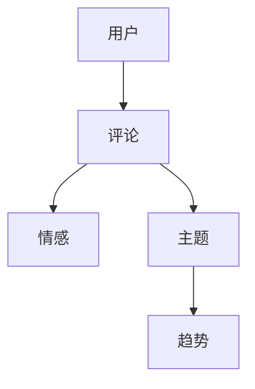
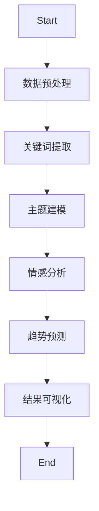
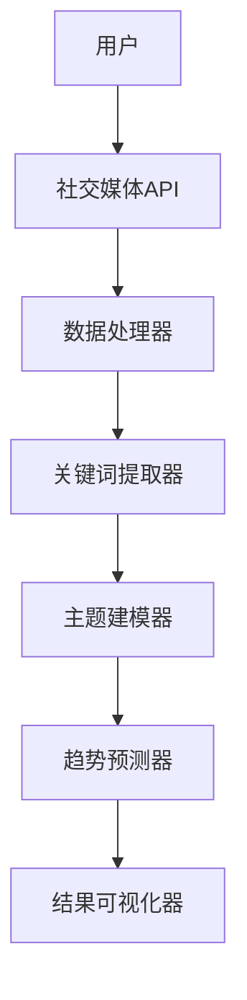
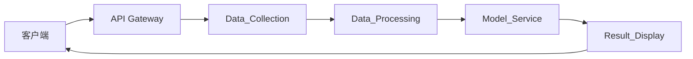

                 


# 构建智能企业市场调研系统：社交媒体聆听与趋势预测的AI驱动

---

## 关键词

- 智能企业市场调研系统
- 社交媒体聆听
- AI驱动
- 趋势预测
- 数据分析
- 机器学习

---

## 摘要

在当今快速变化的商业环境中，企业需要实时、动态的市场洞察来做出明智的决策。社交媒体作为信息的主要来源之一，提供了海量的数据，但如何高效地处理这些数据并提取有价值的信息是一个挑战。本篇文章探讨了如何利用人工智能技术构建一个智能企业市场调研系统，重点分析了社交媒体聆听和趋势预测的关键技术与实现方法。通过结合自然语言处理、机器学习和大数据分析，该系统能够从社交媒体数据中提取关键词、识别主题，并预测市场趋势，为企业提供精准的市场洞察。文章详细介绍了系统的背景、核心概念、算法原理、架构设计、项目实战以及最佳实践，为读者提供了从理论到实践的全面指导。

---

## 第一部分：背景介绍

### 第1章：问题背景与描述

#### 1.1 问题背景

随着数字化转型的加速，企业面临的市场环境日益复杂。消费者通过社交媒体表达了大量关于产品、服务和品牌的看法，这些数据蕴含着巨大的市场洞察价值。然而，传统的市场调研方法依赖于问卷调查、访谈和数据分析，耗时且成本高昂，难以应对实时动态变化的市场需求。此外，社交媒体数据的多样性和海量特性使得人工分析变得几乎不可能。

#### 1.2 问题描述

企业需要一种高效、智能的方法来处理社交媒体数据，提取关键信息，并预测市场趋势。具体问题包括：

- **数据量大**：社交媒体数据呈现指数级增长，传统的数据处理方法难以应对。
- **信息分散**：数据分布在不同的平台，格式多样，难以统一处理。
- **实时性要求高**：企业需要快速响应市场变化，传统调研方法无法满足实时需求。
- **情感分析复杂**：用户的评论可能包含正面、负面或中性情感，准确识别这些情感并分析其影响是关键。

#### 1.3 问题解决

AI技术的应用为这些问题提供了解决方案。通过自然语言处理（NLP）和机器学习（ML），企业可以自动化处理社交媒体数据，提取关键词、主题，并预测市场趋势。具体方法包括：

- **数据收集**：从多个社交媒体平台抓取数据。
- **数据清洗**：去除无效数据，提取有用信息。
- **情感分析**：分析用户评论的情感倾向。
- **主题建模**：识别数据中的主要主题。
- **趋势预测**：基于历史数据和当前趋势，预测未来的市场动态。

#### 1.4 边界与外延

智能企业市场调研系统的边界包括社交媒体数据的收集、处理和分析，但不包括企业内部数据或第三方数据源的整合。外延部分涉及其他数据源（如网站流量、销售数据）的集成，以及与其他系统的接口设计。

#### 1.5 概念结构与核心要素

核心要素包括：

- **社交媒体数据**：用户评论、点赞、分享等行为数据。
- **自然语言处理**：用于文本分析和关键词提取。
- **机器学习模型**：用于情感分析和趋势预测。
- **数据可视化**：用于展示分析结果。

---

## 第二部分：核心概念与联系

### 第2章：AI驱动的市场调研系统

#### 2.1 核心概念原理

AI驱动的市场调研系统基于以下核心概念：

- **自然语言处理（NLP）**：用于分析社交媒体文本，提取关键词和主题。
- **机器学习（ML）**：用于情感分析和趋势预测。
- **数据可视化**：用于直观展示分析结果。

#### 2.2 概念属性对比表

| 对比项 | 传统调研方法 | AI驱动方法 |
|--------|---------------|------------|
| 数据来源 | 问卷调查、访谈 | 社交媒体、在线评论 |
| 数据量 | 较小 | 海量 |
| 处理时间 | 较长 | 实时或近实时 |
| 成本 | 较高 | 较低 |
| 精度 | 有限 | 高 |

#### 2.3 ER实体关系图



---

## 第三部分：算法原理讲解

### 第3章：算法原理与实现

#### 3.1 算法流程

社交媒体数据经过预处理后，首先进行关键词提取，然后通过主题建模识别主要主题，最后利用机器学习模型预测市场趋势。



#### 3.2 Python代码实现

以下是关键词提取和情感分析的Python代码示例：

```python
import pandas as pd
from sklearn.feature_extraction.text import TfidfVectorizer
from sklearn.svm import SVC
from sklearn.pipeline import Pipeline
import joblib

# 数据预处理
def preprocess(text):
    return text.lower().strip()

# 关键词提取
vectorizer = TfidfVectorizer(max_features=100)
X = vectorizer.fit_transform(df['comment'].apply(preprocess))

# 情感分析
pipeline = Pipeline([
    ('tfidf', TfidfVectorizer()),
    ('svm', SVC())
])
pipeline.fit(df['comment'].apply(preprocess), df['label'])

# 保存模型
joblib.dump(pipeline, 'sentiment_model.pkl')
joblib.dump(vectorizer, 'tfidf.pkl')
```

#### 3.3 数学模型与公式

情感分析的分类模型可以使用支持向量机（SVM）实现，其目标函数为：

$$
\text{minimize } \frac{1}{2}||w||^2 + C \sum_{i=1}^{n} \xi_i
$$

其中，$w$ 是法向量，$C$ 是惩罚系数，$\xi_i$ 是松弛变量。

---

## 第四部分：系统分析与架构设计

### 第4章：系统架构设计

#### 4.1 系统功能设计

系统功能包括数据收集、数据处理、情感分析、主题建模和趋势预测。



#### 4.2 系统架构设计

系统架构采用微服务架构，包含数据收集、数据处理、模型服务和结果展示四个模块。

```mermaid
graph LR
    API Gateway[API Gateway] --> Data_Collection[数据收集]
    Data_Collection --> Data_Processing[数据处理]
    Data_Processing --> Model_Service[模型服务]
    Model_Service --> Result_Display[结果展示]
```

#### 4.3 接口设计与交互

系统提供RESTful API接口，供其他系统调用。



---

## 第五部分：项目实战

### 第5章：项目实战

#### 5.1 环境安装

安装必要的Python库：

```bash
pip install numpy pandas scikit-learn joblib
```

#### 5.2 核心功能实现

实现数据处理、关键词提取和情感分析的核心功能。

#### 5.3 案例分析

以某品牌的产品评论为例，展示如何通过系统提取关键词、识别主题并预测市场趋势。

---

## 第六部分：最佳实践

### 第6章：最佳实践

#### 6.1 小结

本文详细介绍了如何利用AI技术构建智能企业市场调研系统，重点分析了社交媒体聆听和趋势预测的关键技术与实现方法。

#### 6.2 注意事项

- 数据隐私和合规性必须严格遵守。
- 模型需要定期更新以保持准确性。
- 系统设计应考虑可扩展性和可维护性。

#### 6.3 拓展阅读

推荐阅读以下书籍和论文：

- 《自然语言处理实战：基于Python的深度学习方法》
- "Trend Prediction Using Social Media Data: A Machine Learning Approach"

---

## 作者

作者：AI天才研究院/AI Genius Institute & 禅与计算机程序设计艺术 /Zen And The Art of Computer Programming

