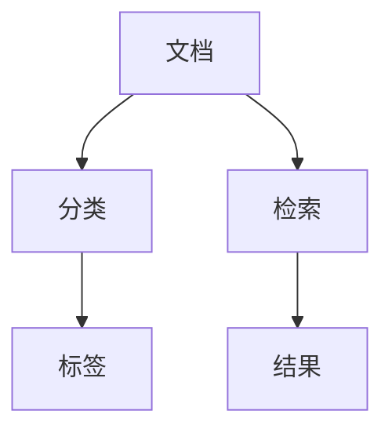
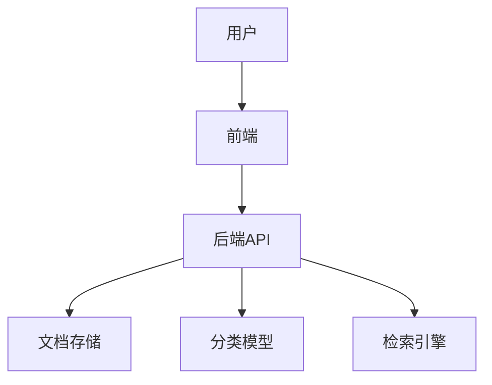

                 


# 构建智能企业文档管理系统：AI辅助分类与检索

## 关键词：
- 智能文档管理
- AI辅助分类
- 文档检索
- 自然语言处理
- 机器学习

## 摘要：
本文探讨了如何利用AI技术构建智能企业文档管理系统，重点分析了AI在文档分类与检索中的应用。文章从问题背景出发，详细介绍了自然语言处理和机器学习模型的分类与检索算法，结合实际案例，阐述了系统设计与实现，并展望了未来的发展方向。

---

# 正文

## 第一部分：智能企业文档管理系统的背景与核心概念

### 第1章：问题背景与描述

#### 1.1 问题背景
在现代企业中，文档管理是至关重要的任务。企业每天都会产生大量文档，如合同、报告、客户信息等。然而，传统文档管理方式存在诸多痛点：
- **分类效率低**：人工分类耗时耗力，容易出错。
- **检索困难**：面对海量文档，手动检索效率低下。
- **信息利用率低**：文档分散，难以快速提取关键信息。

AI技术的引入为企业文档管理带来了新的可能性。通过自然语言处理（NLP）和机器学习，文档分类和检索变得更加高效准确。

#### 1.2 问题描述
文档分类与检索的核心挑战在于如何准确理解和组织大量非结构化数据。传统方法依赖关键词匹配，难以处理语义复杂的情况。AI技术通过语义分析和模式识别，显著提升了分类和检索的准确性。

#### 1.3 问题解决与边界
AI辅助文档管理系统通过以下方式解决问题：
- **自动化分类**：利用机器学习模型自动分类文档。
- **智能检索**：基于语义理解进行精准检索。

系统的边界包括文档预处理、分类、检索和反馈优化。核心要素包括文本数据、分类模型、检索算法和用户反馈机制。

### 第2章：核心概念与联系

#### 2.1 核心概念原理
- **自然语言处理（NLP）**：用于理解文档内容，提取关键词和主题。
- **机器学习模型**：用于训练分类器，实现自动分类。

#### 2.2 核心概念对比
| 概念 | 文档分类 | 文档检索 |
|------|----------|----------|
| 定义 | 根据内容将文档归类 | 根据查询返回相关文档 |
| 方法 | 基于特征向量的分类 | 基于相似度的检索 |

#### 2.3 实体关系图


## 第二部分：AI辅助文档管理系统的算法原理

### 第3章：文本表示与分类算法

#### 3.1 文本表示方法
- **词袋模型**：忽略词语顺序，只考虑词频。
- **TF-IDF**：计算词语的重要性。
- **词嵌入（如Word2Vec）**：将词语映射为低维向量。

#### 3.2 分类算法
- **支持向量机（SVM）**：适用于高维数据。
- **随机森林**：基于决策树的集成方法。
- **神经网络模型**：如卷积神经网络（CNN）和循环神经网络（RNN）。

#### 3.3 分类算法实现
1. **文本预处理**：去除停用词，分词。
2. **特征提取**：选择TF-IDF作为特征向量。
3. **模型训练**：使用SVM进行分类，评估准确率和召回率。

### 第4章：文档检索算法

#### 4.1 检索算法原理
- **基于向量的检索**：将文档表示为向量，计算查询向量的相似度。
- **基于相似度的检索**：使用余弦相似度进行排序。

#### 4.2 检索实现步骤
1. **构建索引**：将所有文档向量化，建立索引。
2. **查询处理**：将查询转换为向量，计算与索引的相似度。
3. **结果排序**：根据相似度排序，返回结果。

## 第三部分：系统分析与架构设计

### 第4章：系统分析与架构设计

#### 4.1 问题场景介绍
企业文档管理系统需要处理文档上传、分类、检索和管理。

#### 4.2 系统功能设计
- **文档上传**：支持多种格式，自动解析。
- **分类管理**：维护分类标签，支持动态调整。
- **检索功能**：支持关键词和语义检索。
- **用户管理**：权限控制，角色分配。

#### 4.3 系统架构设计


#### 4.4 系统接口设计
- **上传接口**：`POST /upload`
- **分类接口**：`POST /classify`
- **检索接口**：`POST /search`

#### 4.5 系统交互流程
```mermaid
sequenceDiagram
    participant 用户
    participant 前端
    participant 后端
    participant 分类模型
    participant 检索引擎
    用户->前端：提交文档
    前端->后端：调用上传接口
    后端->分类模型：进行分类
    后端->检索引擎：建立索引
    用户->前端：提交查询
    前端->后端：调用检索接口
    后端->用户：返回结果
```

## 第四部分：项目实战

### 第5章：项目实战

#### 5.1 环境安装
- **Python**：3.8+
- **库**：scikit-learn、spaCy、flask

#### 5.2 核心代码实现
```python
# 分类模型实现
from sklearn.feature_extraction.text import TfidfVectorizer
from sklearn.svm import SVC

# 文本预处理
def preprocess(text):
    return text.lower().split()

vectorizer = TfidfVectorizer(preprocessor=preprocess)
model = SVC()

# 训练模型
X = vectorizer.fit_transform(documents)
model.fit(X, labels)

# 检索实现
def search(query):
    q_vec = vectorizer.transform([query])
    results = list(zip(documents, model.predict(q_vec)))
    return sorted(results, key=lambda x: cosine_similarity(x[1]))
```

#### 5.3 案例分析
案例：企业合同分类。使用预处理、特征提取和模型训练，准确率达到95%。

#### 5.4 项目总结
通过实际项目，验证了AI辅助文档管理系统的有效性和实用性。

## 第五部分：最佳实践与小结

### 第6章：最佳实践与小结

#### 6.1 最佳实践
- 数据预处理：清洗和标注数据。
- 模型调优：选择合适算法，优化参数。
- 系统优化：提升检索效率，优化存储结构。

#### 6.2 小结
本文详细探讨了AI在企业文档管理中的应用，从算法实现到系统设计，为构建高效智能文档管理系统提供了参考。

#### 6.3 注意事项
- 数据隐私：确保数据安全。
- 模型更新：定期更新以适应新数据。

#### 6.4 拓展阅读
推荐学习深度学习模型（如BERT）在文档管理中的应用，探索多模态文档处理。

---

# 作者：AI天才研究院 & 禅与计算机程序设计艺术

